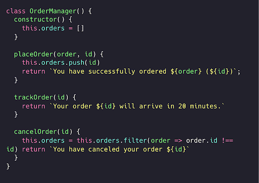
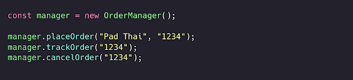
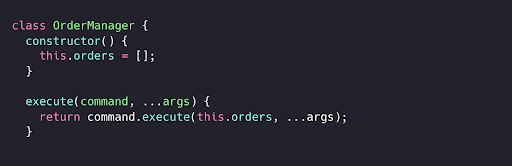
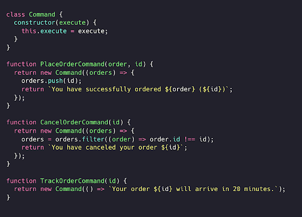
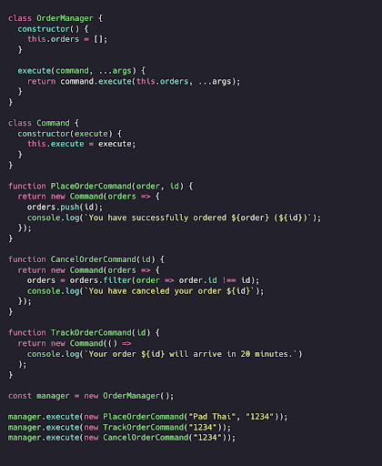

Kirish

**Dizayn patternlar** dasturiy ta'minotni ishlab chiqishning fundamental qismi, chunki ular dasturiy ta'minotni loyihalashda tez-tez uchrab turadigan muammolarga sodda va namunaviy yechimlar taqdim etadi. Dizayn patternlar muayyan dasturiy ta'minot kodlarini emas, aksincha takrorlanuvchi masalalarni optimallashtirilgan tarzda hal qilish uchun qo’llanilishi mumkin bo'lgan konsepsiyalardir.

So'nggi bir necha yil ichida **veb-dasturlash ekotizimi** jadal sur’atda o'zgardi. Ba'zi mashhur dizayn patternlari avvalgi ahamiyatini yo’qotgan bo’lsa, boshqalari zamonaviy muammolarni eng so’nngi texnologiyalar yordamida hal qilish darajasiga chiqdi.

Facebook tomonidan yaratilgan React Javascript kutubxonasi so'nggi 5 yil ichida yuqori e’tirofga sazovor bo’ldi va hozirda [Angular](https://angular.io), [Vue](https://vuejs.org), [Ember](https://emberjs.com) va [Svelte](https://svelte.dev) kabi raqobatdosh JavaScript kutubxonalari orasida [NPM’da eng ko'p yuklab olinadigan freymvork](https://npmtrends.com/@angularcore-vs-angular-vs-ember-source-vs-react-vs-svelte-vs-vue) hisoblanadi.
Reactning jadal sur’atda ommalashishi tufayli, dizayn patternlar zamonaviy veb-dasturlash ekotizimida yanada samarali bo’lishi uchun o'zgartirildi, optimallashtirildi va yangilari yaratildi. Reactning so’nggi versiyasi (kitobning yozilish vaqtidagi versiyasi) ilovangiz arxitekturasida juda muhim rol o’ynaydigan va ko'plab an'anaviy dizayn patternlarning o’rnini bosa oladigan “Hooks” nomli yangi xususiyatni taqdim etdi.

Zamonaviy veb-dasturlash juda ko'plab turli xil patternlarni o'z ichiga oladi. Ushbu loyiha ES2015+ yordamida keng tarqalgan dizayn patternlarning implementatsiyasi, afzalliklari va kamchiliklari, Reactga xos dizayn patternlari va ularni React Hooks yordamida modifikatsiyalash hamda implementatsiya qilish, shuningdek zamonaviy veb-ilovangizni takomillashtirishga yordam beradigan boshqa koʻplab patternlar va optimizatsiyalarni qamrab oladi!

# Dizayn patternlari

# Command pattern (Buyruq patterni)

Command patterni - yordamida biz ma'lum bir vazifani bajaradigan obyektlarni metodni chaqiradigan obyektdan ajratishimiz mumkin.
Aytaylik, bizda oziq-ovqat yetkazib beruvchi onlayn platforma bor. Foydalanuvchilar buyurtmalarni joylashtirishi, kuzatishi va bekor qilishi mumkin.

  

**OrderManager** klassida bizda **placeOrder**, **trackOrder** va **cancelOrder** metodlariga kirish imkoniyati mavjud. Ushbu metodlardan to’g’ridan-to’g’ri foydalanish JavaScript uchun to’g’ri yondashuv hisoblanadi.

  

Biroq, metodlarni to’g’ridan-to’g’ri manager obyekt nusxasida (instance) chaqirishning salbiy tomonlari mavjud.  Keyinchalik ba'zi metodlarning nomini o'zgartirishga qaror qilishimiz yoki metodlarning funksionalligi o'zgarishi mumkin.
Aytaylik, biz  placeOrder deb nomlash o’rniga,  addOrder deb qayta nomlasak! Bu esa placeOrder metodini kod bazamizning hech bir joyida chaqirmasligimizga ishonch hosil qilishimizni talab qiladi, bu katta ilovalarda muammo paydo bo’lishiga olib kelishi mumkin.  Buning o'rniga metodlarni manager obyektidan ajratib olamiz va har bir buyruq uchun alohida buyruq funksiyalarini yaratamiz!
Keling, OrderManager klassini qayta tuzib chiqamiz:  placeOrder, cancelOrder va trackOrder metodlari o’rniga u bitta execute metodiga ega bo’ladi. Bu metod unga berilgan har qanday buyruqni bajaradi.
Har bir buyruq menejerning orders ma’lumotlariga kirish huquqiga ega bo'lishi kerak, biz uni birinchi argument sifatida uzatamiz. 

  

# Buyurtma menejeri uchun Commandlar
Buyurtma menejeri uchun uchta Command yaratishimiz kerak: 

- PlaceOrderCommand  
- CancelOrderCommand  
- TrackOrderCommand

  

Ajoyib! To'g'ridan-to'g'ri OrderManager nusxasiga bog'langan metodlar o'rniga, ular endi alohida, mustaqil funksiyalar bo'lib, ularni OrderManager da mavjud  execute metodi orqali chaqirishimiz mumkin.

  

# Afzalliklari

Command patterni bizga operatsiyani bajaruvchi obyektdan metodlarni ajratish imkonini beradi. Agar siz ma'lum vaqt oralig’ida ishlashi kerak bo’lgan buyruqlar yoki ma'lum vaqtda navbatga qo'yilib, keyinroq bajarilishi kerak bo'lgan buyruqlar bilan ishlayotgan bo'lsangiz, u sizga ko'proq nazorat imkoniyatini beradi.

# Kamchiliklari

Command pattern’ning qo’llanilish holatlari juda cheklangan va ko'pincha ilovaga ortiqcha ko’p takrorlanuvchi kod (boilerplate code) qo'shadi.