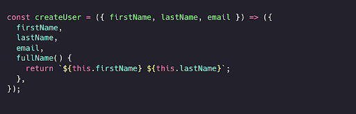
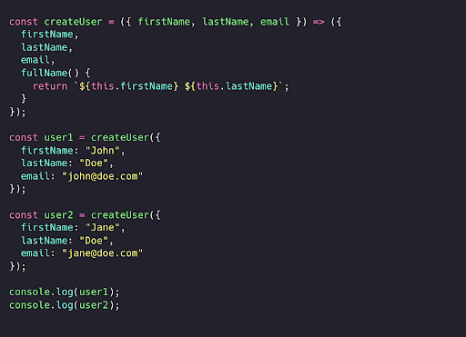
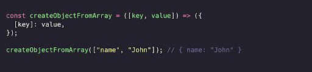
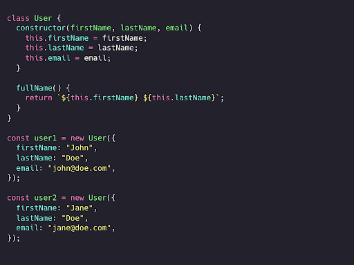
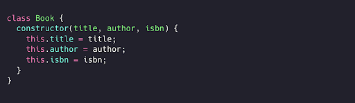
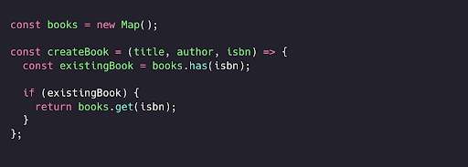
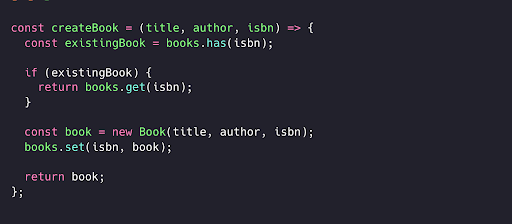
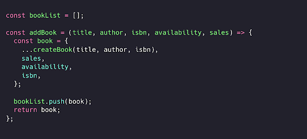
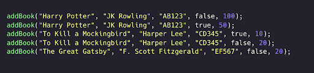
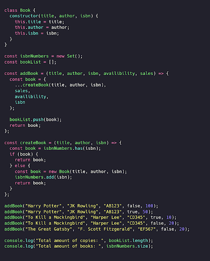

# **Factory pattern (Fabrika patterni)**

**Factory patterni** yordamida yangi obyektlar yaratish uchun factory funksiyalaridan foydalanishimiz mumkin. Agar funksiya `new` kalit so'zdan foydalanmasdan yangi obyektni qaytarsa, u factory funksiyasi hisoblanadi!

Aytaylik, ilovamiz uchun bizga ko'p foydalanuvchilar kerak. Biz `firstName`, `lastName` va `email` xususiyatlariga ega yangi foydalanuvchilarni yaratishimiz mumkin. Factory funksiyasi yangi yaratilgan obyektga `fullName` metodini ham qo'shadi, bu esa `firstName` va `lastName` larni qaytaradi.

  

Ajoyib! Endi `createUser` funksiyasini chaqirish orqali bir nechta foydalanuvchilarni osongina yaratishimiz mumkin.

  

Agar biz nisbatan murakkab va konfiguratsiya qilish mumkin bo'lgan obyektlarni yaratayotgan bo'lsak, *factory pattern* foydali bo'lishi mumkin. *Kalit (key) va qiymat (value)*lar ma'lum bir muhit yoki konfiguratsiyaga bog'liq bo'lishi mumkin. Factory pattern yordamida biz maxsus kalit va qiymatlarni o'z ichiga olgan yangi obyektlarni osongina yarata olamiz!

  

# Afzalliklari

*Factory pattern* bir xil xususiyatlarga ega bo'lgan bir nechta kichikroq obyektlarni yaratishda foydalidir. Factory funksiyasi joriy muhitga yoki foydalanuvchiga xos konfiguratsiyaga qarab maxsus obyektni osongina qaytarishi mumkin.

# Kamchiliklari

JavaScriptda *factory pattern* `new` kalit so'zidan foydalanmasdan obyektni qaytaradigan oddiy funksiyadan ko’p ham farq qilmaydi. [ES6 arrow funksiyalari](https://developer.mozilla.org/en-US/docs/Web/JavaScript/Guide/Functions#arrow_functions) bizga har safar obyektni bilvosita qaytaradigan kichik factory funksiyalarini yaratish imkonini beradi.

Biroq, ko'p hollarda har safar yangi obyektlar yaratish o'rniga yangi nusxalar yaratish xotirani samaraliroq qilishi mumkin.

  

# Havolalar

[JavaScript Factory Functions with ES6+](https://medium.com/javascript-scene/javascript-factory-functions-with-es6-4d224591a8b1) - Eric Elliott

# Flyweight pattern (Resurs tejovchi pattern)

**Ko'plab o'xshash obyektlarni yaratayotganimizda, *flyweight patterni* xotirani tejashning foydali usuli hisoblanadi.**

Ilovamizda foydalanuvchilar kitob qo'shish imkoniyatiga ega bo'lishlarini xohlaymiz. Hamma kitoblarning nomi, muallifi va ISBN raqami bor! Biroq, kutubxonada odatda kitobning bitta nusxasi bo'lmaydi: ko’p hollarda bitta kitobning bir nechta nusxasi mavjud.

Agar bir xil kitobning bir nechta nusxasi bo'lsa, har safar yangi kitob nusxasini yaratish maqsadga muvofiq emas. Buning o'rniga, biz bitta kitobni ifodalovchi `Book` konstruktorining bir nechta nusxalarini yaratamiz.

  

Keling, ro'yxatga yangi kitoblar qo'shish funksiyasini yarataylik. Agar kitob bir xil ISBN raqamiga ega bo'lsa, ya'ni aynan bir xil kitob turi bo'lsa, biz butunlay yangi `Book` nusxasini yaratmaymiz. Buning o'rniga, avvalo, bu kitobning mavjudligini tekshirishimiz kerak.

  

Agar unda hali kitobning ISBN raqami mavjud bo'lmasa, biz yangi kitob yaratamiz va uning ISBN raqamini `isbnNumbers`  to'plamiga qo'shamiz. 

  

`createBook` funksiyasi bir turdagi kitobning yangi nusxalarini yaratishga yordam beradi. Biroq, kutubxonada odatda bitta kitobning bir nechta nusxasi bo’ladi! Keling, bir xil kitobning bir nechta nusxasini qo'shish imkonini beruvchi `addBook` funksiyasini yarataylik. U yangi yaratilgan `Book` nusxasini yoki allaqachon mavjud nusxani qaytaradigan `createBook`  funksiyasini chaqirishi kerak.

Nusxalarning umumiy sonini kuzatib borish uchun kutubxonadagi kitoblarning umumiy sonini o'z ichiga olgan `bookList` massivini yaratamiz.

  

Ajoyib! Har safar nusxa qo'shganimizda yangi `Book` nusxasini yaratish o'rniga, biz ushbu nusxa uchun allaqachon mavjud `Book` nusxasidan samarali foydalanishimiz mumkin. Keling, 3 ta kitobning 5 ta nusxasini yarataylik: Garri Potter (Harry Potter), Mayna qushni o’ldirish (To Kill a Mockingbird) va Shovvoz Getsbi (The Great Gatsby).

  

5 nusxa mavjud bo'lsa-da, bizda faqat 3 ta `Book` obyekti bor!

  

*Flyweight patterni* tizimning barcha mavjud operativ xotirasini band qilishi mumkin bo'lgan juda ko'p obyektlarni yaratishda foydalidir. Bu bizga ishlatilayotgan xotira hajmini minimallashtirishga imkon beradi.

JavaScriptda biz ushbu muammoni [prototypal inheritance](https://developer.mozilla.org/en-US/docs/Web/JavaScript/Inheritance_and_the_prototype_chain) orqali osongina hal qilishimiz mumkin. Hozirgi vaqtda  texnik qurilmalarda bir necha GB tezkor xotira mavjud bo'lib, bu flyweight patterni’ning ahamiyatini biroz kamaytiradi.