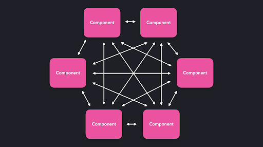
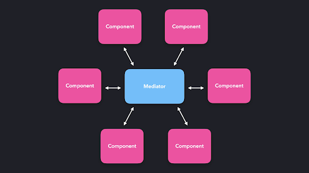
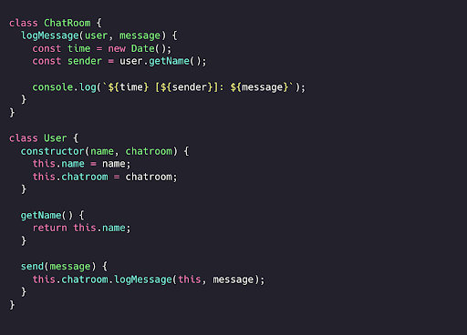
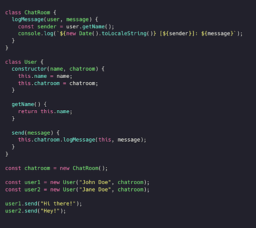
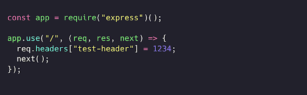
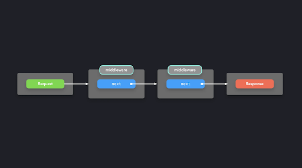
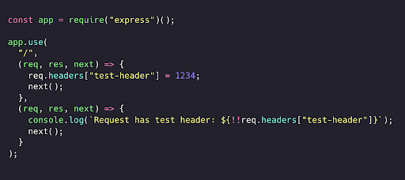
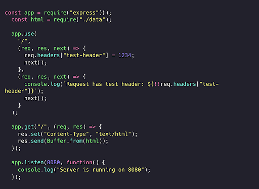

# **Mediator/Middleware pattern **
# **(Vositachi/Oraliq dastur patterni)**

**Mediator patterni** komponentlarga  markaziy nuqta - mediator (vositachi) orqali bir-biri bilan o'zaro aloqada bo’lish imkonini beradi. Komponentlar bir-biri bilan to'g'ridan-to'g'ri muloqot qilish o'rniga, mediator so'rovlarni qabul qiladi va ularni yo’naltiradi! JavaScriptda mediator odatiy obyekt yoki funksiya ko’rinishida bo’ladi.

Bu patternni havo harakatini nazorat qiluvchi dispetcher va uchuvchi o'rtasidagi munosabatga o’xshatish mumkin. Uchuvchilar bir-birlari bilan to'g'ridan-to'g'ri gaplashganda tartibsizlik yuzaga kelishi mumkin, shuning uchun ular havo harakati dispetcheri bilan muloqot qilishadi. Dispetcher barcha samolyotlarning xavfsiz parvoz qilishi va bir-biriga urilib ketmasligini ta’minlash uchun zarur ma'lumotlarni yetkazib turadi. 

Garchi, biz JavaScriptda samolyotlarni boshqarmasak ham, ko'pincha obyektlar orasidagi ko'p yo'nalishli ma'lumotlar bilan ishlashimizga to’g’ri keladi. Tizimda komponentlar soni ko’p bo’lganda, ular orasidagi aloqa chalkashib ketishi mumkin.

  

Har bir obyektning boshqa obyektlar bilan to'g'ridan-to'g'ri muloqot qilishiga yo’l qo’yish o’rniga (bu ko’pdan-ko’pga munosabatlarni keltirib chiqarishi tufayli), obyektlarning so'rovlari vositachi, ya’ni mediator, tomonidan boshqariladi. Mediator bu so'rovni qayta ishlaydi va uni kerakli manzilga yo’naltiradi.

  

*Mediator patterni* uchun enga yaxshi misol - bu onlayn muloqot xonasi (chatroom)! Bunday muloqot xonasidagi foydalanuvchilar bir-birlari bilan to’g’ridan-to’g’ri gaplashmaydi. Buning o'rniga, ushbu onlayn muloqot xonasi foydalanuvchilar o'rtasida vositachi, aniqroq aytadigan bo’lsak mediator bo'lib xizmat qiladi.

  

Biz onlayn muloqot xonasiga ulangan yangi foydalanuvchilarni yaratishimiz mumkin. Har bir foydalanuvchi obyekti xabarlarni yuborish uchun ishlatiladigan `send` metodiga ega.

  

# Amaliy misol
[Express.js](https://expressjs.com/) - mashhur veb-ilovalar server freymvorki hisoblanadi. Biz foydalanuvchi murojaat qila oladigan ma'lum yo’nalish(route)larga callback funksiyalarni qo'shishimiz mumkin.

Aytaylik, foydalanuvchi asosiy ``/`` yo’nalishiga murojaat qilganida, so'rovga sarlavha (header) qo'shmoqchimiz. Buni middleware callback orqali amalga oshirishimiz mumkin.

  

Ushbu `next` metodi so’rov-javob (request-response) siklida keyingi callbackni chaqiradi. Bu orqali *request* va *response* o'rtasida joylashgan middleware funksiyalari zanjirini samarali yaratgan bo'lardik yoki aksincha.

  

Keling, `test-header` to'g'ri qo'shilganligini tekshiradigan yana bir middleware funksiyasini qo'shamiz. Oldingi middleware funksiyasi tomonidan kiritilgan o'zgarish butun zanjir ketma-ketligida ko'rinadi.

  

Juda yaxshi! Endi biz request obyektini bir yoki bir nechta **middleware funksiyalari** orqali response’gacha kuzatib borish va o’zgartirish imkoniyatiga egamiz.

  

Har safar foydalanuvchi ``/`` asosiy yo’nalishiga murojaat qilganida, ikkita middleware callback funksiyasi ishga tushadi.

*Middleware patterni* obyektlar orasidagi ko'pdan-ko’pga bo’lgan munosabatlarni soddalashtirishga yordam beradi, chunki barcha aloqalar bitta markaziy nuqta orqali o’tadi.