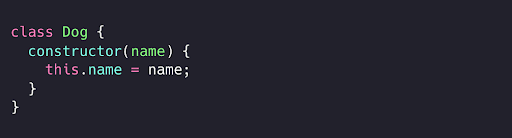
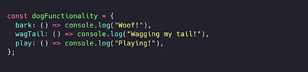
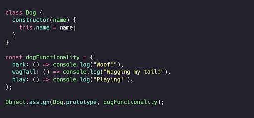
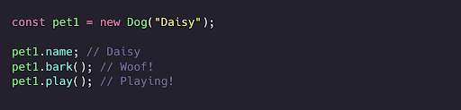
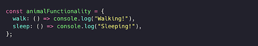
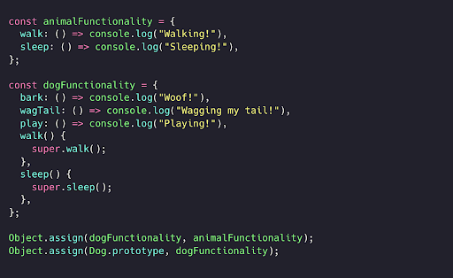
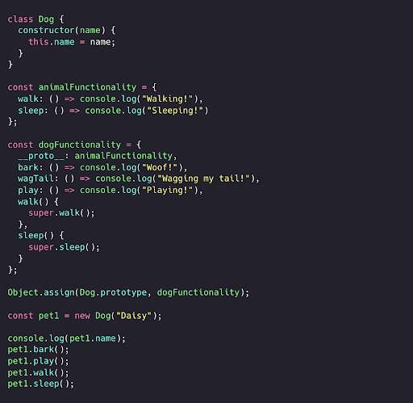
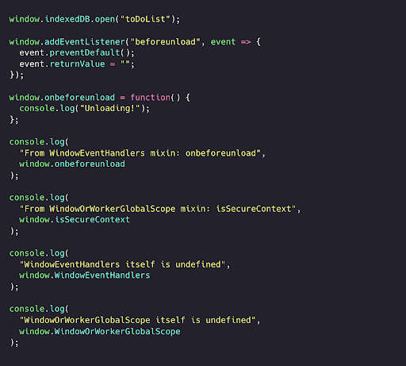

# Mixin pattern 
# (Qo’shimcha xususiyatlar patterni)

Mixin - bu vorislik(inheritance)dan foydalanmasdan boshqa obyekt yoki klassga qayta foydalanish mumkin bo'lgan funksionallikni qo'shish uchun ishlatiladigan obyekt. Mixinlarni mustaqil ravishda ishlata olmaymiz: ularning yagona vazifasi vorislik mavjud bo’lmagan obyektlar yoki klasslarga funksionallikni qo'shishdir. 

Aytaylik, dasturimiz uchun biz bir nechta it obyektlarini yaratishimiz kerak. Biroq, biz yaratadigan asosiy Dog klassi faqatgina name xususiyatiga ega xolos.

  

Lekin it faqatgina nomga ega bo’lish bilan cheklanmasligi lozim. U vovullash, dumini likillatish va o’ynash imkoniyatlariga ega bo’lishi kerak! Bularni to'g'ridan-to'g'ri  Dog klassiga qo'shish o'rniga, biz bark, wagTail va play  xususiyatlarini ta'minlaydigan mixin (ya’ni o’z nomi bilan qo’shimcha xususiyat) yaratishimiz mumkin.

  

Object.assign metodi yordamida Dog prototipiga dogFunctionality mixinini qo'shishimiz mumkin. Bu metod maqsad qilgan obyektimizga xususiyatlar qo'shish imkonini beradi: bu holda  Dog.prototype. Dog’ning har bir yangi obyekt nusxasi dogFunctionality xususiyatlariga murojaat qilish imkoniyatiga ega bo'ladi, chunki ular Dog prototipiga qo’shilgan. 

  

Keling, Daisy deb nomlanuvchi birinchi uy hayvonimiz pet1 ni yarataylik. Biz itning prototipiga dogFunctionality mixinini qo'shganimiz uchun, Daisy vovullash, dumini likillatish va o'ynash imkoniyatlariga ega bo'lishi kerak!

  

Juda soz! Mixinlar vorislikdan foydalanmasdan klasslarga yoki obyektlarga maxsus funksionalllikni qo'shishni osonlashtiradi.

Garchi biz mixinlar yordamida funksionallikni vorisliksiz qo'sha olsak ham, mixinlarning o'zi vorislikdan foydalanishi mumkin!

Aksariyat sutemizuvchilar (delfinlar va ya’na ba’zilari bundan mustasno) yurishi va uxlashi mumkin. It sutemizuvchi hayvon, shuning uchun unda ham yurish va uxlash imkoniyatlari bo’lishi kerak!

Keling, endi walk va sleep xususiyatlarini qo'shadigan animalFunctionality mixin yarataylik.

  

Ushbu xususiyatlarni Object.assign yordamida dogFunctionality prototipiga qo'shishimiz mumkin. Bu holda, biz maqsad obyekt dogFunctionality hisoblanadi.

  

Ajoyib! Endi Dog’ning har qanday yangi obyekt nusxasi walk va sleep metodlariga ham murojaat qila oladi.

  

Brauzer muhitining Window interfeysida mixinning real hayotdagi misolini ko’rishimiz mumkin. Window obyekti o'zining ko'pgina xususiyatlarini [WindowOrWorkerGlobalScope](https://udn.realityripple.com/docs/Web/API/WindowOrWorkerGlobalScope) hamda [WindowEventHandlers](https://udn.realityripple.com/docs/Web/API/WindowEventHandlers) mixinlaridan oladi. Bu bizga setTimeout, setInterval, indexedDB va isSecureContext kabi xususiyatlardan foydalanish imkonini beradi.
Bu mixin bo'lgani uchun, ya’ni faqat obyektlarga funksionallik qo'shish uchun ishlatilganligi sababli, siz  WindowOrWorkerGlobalScope turidagi obyektlarni yarata olmaysiz.

  

# React (ES6 dan oldin) 

ES6 klasslari joriy etilishidan oldin, React komponentlariga funksionallik qo'shish uchun mixinlar keng qo’llanilgan. React jamoasi [mixinlardan foydalanishni tavsiya etmaydi](https://legacy.reactjs.org/blog/2016/07/13/mixins-considered-harmful.html), chunki ular komponentlarga keraksiz murakkablik qo'shib, uni qo’llab quvvatlash va qayta ishlatishni qiyinlashtiradi. React jamoasi buning o'rniga [yuqori tartibli komponentlardan (high order components) foydalanishni tavsiya qildi](https://medium.com/@dan_abramov/mixins-are-dead-long-live-higher-order-components-94a0d2f9e750), ularni endi ko’p hollarda Hook’lar bilan almashtirish mumkin.

Mixinlar bizga obyektning prototipiga funksionallik kiritish orqali vorislikdan foydalanmasdan obyektlarga funksionallik qo'shish imkonini beradi. Obyektning prototipini o'zgartirish yomon amaliyot sifatida qaraladi, chunki bu prototipning ifloslanishiga va funksiyalarimizning kelib chiqishi bo’yicha noaniqlikka olib kelishi mumkin.
