# **Module pattern (Modul patterni)**

Ilovangiz va kod baza o'sib borishi bilan, kodni qo’llab-quvvatlash va alohida qismlarga ajratish ahamiyat kasb etadi. **Modul patterni** kodingizni kichikroq, qayta ishlatiluvchi qismlarga ajratish imkonini beradi.

Kodingizni qayta ishlatiluvchi kichikroq qismlarga ajratish imkoniyatidan tashqari, modullar faylingizdagi ma'lum qiymatlarni *yopiq (private)* holatda saqlashga imkon beradi. Modul ichidagi deklaratsiyalar standart holatda faqat shu modul doirasida chegaralangan *(inkapsulyatsiya qilingan)* bo’ladi. Agar biz biror qiymatni aniq eksport qilmasak, bu qiymat moduldan tashqarida mavjud bo’lmaydi. Bu kod bazangizning boshqa qismlarida e'lon qilingan qiymatlar bilan nom to'qnashuvlarining xavfini kamaytiradi, chunki qiymatlar global qamrov (global scope)da mavjud bo’lmaydi.

# ES2015 Modullari

ES2015 ichki o'rnatilgan JavaScript modullarini taqdim etdi. Modul - bu JavaScript kodini o'z ichiga olgan fayl bo'lib, oddiy skriptdan farqli xususiyatlarga ega.

Keling, matematik funksiyalarni o'z ichiga olgan `math.js`, deb nomlangan modul misolini ko'rib chiqaylik.

  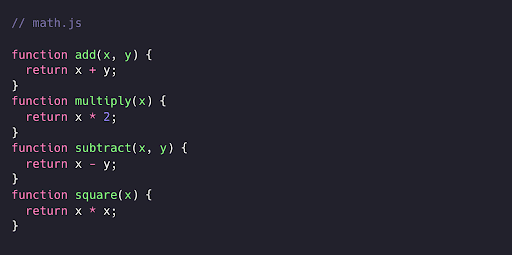

Bizda oddiy matematik amallarni bajaruvchi `math.js`, fayli bor. Unda foydalanuvchilarga qo'shish, ko'paytirish, ayirish va kvadratga ko’tarish imkonini beruvchi funksiyalar mavjud.

Biroq, biz bu funksiyalardan faqat `math.js` faylida emas, balki  `index.js`  faylida ham foydalanish imkoniyatiga ega bo‘lmoqchimiz! Hozirda  `index.js`  faylida xatolik yuzaga keladi: `index.js` faylida `add`, `subtract.js`, `multiply` yoki `square` funksiyalari mavjud emas. Biz  `index.js`  faylida mavjud bo'lmagan funksiyalarga murojaat qilishga harakat qilyapmiz.

  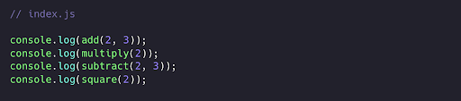

`math.js` funksiyalarini boshqa fayllarda ishlata olishimiz  uchun avval ularni *eksport* qilishimiz kerak. Moduldan kodni eksport qilish uchun `eksport`  kalit so'zidan foydalanishimiz mumkin. Funksiyalarni `eksport`  qilishning usullaridan biri - bu nomli eksport *(named export)*lardan foydalanish: `export` kalit so‘zini ommaga ochiq qilmoqchi bo‘lgan elementlar oldiga qo‘shamiz. Bu holatda, `eksport` kalit so'zini har bir funksiya oldiga qo'shishimiz kerak, chunki `index.js`  barcha to'rtta funksiyaga murojaat qila olishi kerak.

  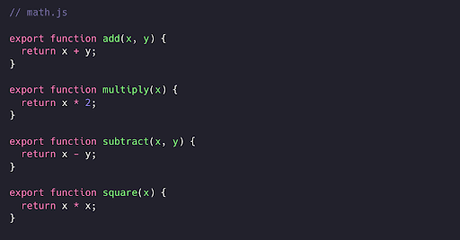

Biz `add`, `subtract`, `multiply` va `square` funksiyalarini eksport qilinuvchi qildik! Biroq, moduldan qiymatlarni eksport qilishning o’zi ularni barcha fayllar uchun ochiq qilish uchun yetarli emas. Moduldan eksport qilingan qiymatlardan foydalanish uchun ularni kerakli faylga aniq import qilish kerak.

`import` kalit so'zidan foydalanib, `index.js` faylining yuqori qismiga qiymatlarni import qilamiz. Javascriptga bu funksiyalarni qaysi moduldan import qilmoqchi ekanligimizni bildirish uchun `from`  kalit so’zi va modulga nisbiy yo’l *(relative path)* ko’rsatishimiz kerak.

  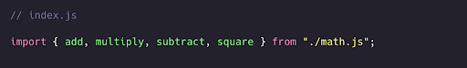

Biz `index.js` fayliga `math.js` modulidan to'rtta funksiyani import qildik! Keling, endi funksiyalardan foydalana olishimizni tekshirib ko’ramiz!

  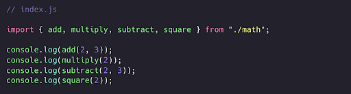

Murojaat xatosi (reference error) yo'qoldi, endi moduldan eksport qilingan qiymatlardan foydalana olamiz!

Modullarning  katta afzalligi shundaki, biz faqat `export` kalit so'zi *yordamida aniq eksport qilgan qiymatlargagina kira olamiz.* `export` kalit so‘zi yordamida aniq eksport qilinmagan qiymatlar faqat shu modul doirasida mavjud bo’ladi.

Keling, faqat `math.js` faylida mavjud bo’lishi kerak bo'lgan `privateValue` nomli qiymat yarataylik.

  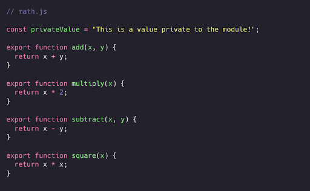

Agar payqagan bo’lsangiz `privateValue` oldiga `export` kalit so'zini qo'shmadik. `privateValue` oʻzgaruvchisini eksport qilmaganimiz uchun `math.js` modulidan tashqarida bu qiymatga kira olmaymiz!

  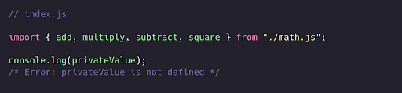

Qiymatni modul uchun yopiq holatda saqlash orqali global qamrovni tasodifan ifloslantirish xavfi kamayadi. Modulingizdan foydalanuvchi dasturchilar yaratgan qiymatlarni tasodifan qayta yozib yuborishdan xavfsirashingiz shart emas, chunki ular siz yozgan yopiq qiymatingiz bilan bir xil nomga ega bo'lishi mumkin: bu nom to'qnashuvlarining (name collisions) oldini oladi.

Ba'zida eksport nomlari lokal qiymatlar bilan to’qnashishi mumkin.

  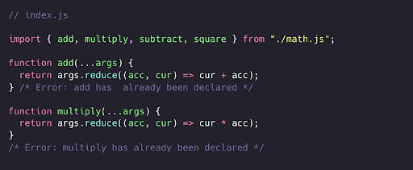

Bu holatda `index.js` faylida `add` va `multiply` deb nomlangan funksiyalar mavjud. Agar biz xuddi shu nomdagi qiymatlarni import qilsak, nom to'qnashuvi yuzaga keladi: `add` va `multiply` allaqachon e'lon qilingan! Yaxshiyamki, biz import qilingan qiymatlarni `as` kalit so'zidan foydalanib **qayta nomlashimiz* mumkin. 

Import qilingan `add` va `multiply` funksiyalarini `addValues` ​​va `multiplyValues` sifatida qayta nomlaymiz.

  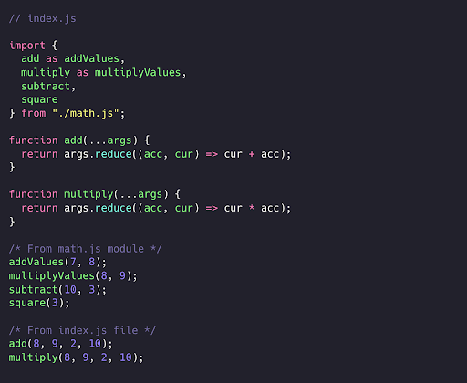

`export` kalit so'zi bilan belgilangan *nomli eksport (named export)*lardan tashqari, *standart eksport (default export)*dan ham foydalanishingiz mumkin. Har bir modulda faqat **bitta** standart eksport bo’lishi mumkin.

Keling, `add` funksiyasini *default export* qilamiz va boshqa funksiyalarni *named export* sifatida qoldiramiz. Qiymat oldiga `default export` kalit so’zini qo’shish orqali standart qiymatni eksport qilishimiz mumkin.

  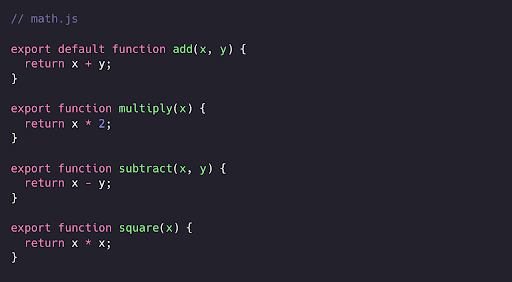

*Named export* va *default export* o'rtasidagi farq - bu qiymatni moduldan eksport qilish usuli bo’lib, natijada qiymatni import qilish usulini samarali tarzda o'zgartiradi.

Avval biz nomli (named) eksportlar uchun jingalak qavslardan foydalanishimiz kerak edi: `import { module } from 'module'.` Standart (default) eksport bilan esa qiymatni qavslarsiz import qilishimiz mumkin: `import module from 'module'.`

  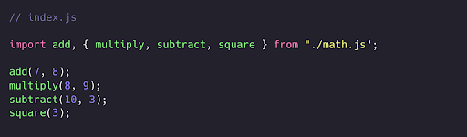

Moduldan qavslarsiz import qilingan qiymat, agar *default export* mavjud bo'lsa, har doim *default export* qiymati bo'ladi.

JavaScript bu qiymat har doim *default export* bilan eksport qilingan qiymat ekanligini bilganligi sababli, import qilingan standart qiymatga uni eksport qilgan nomdan boshqa nom berishimiz mumkin. `add` funksiyasini `add` nomi bilan import qilish o'rniga, masalan, biz uni `addValue` ​​deb nolmashimiz mumkin. 

  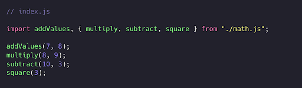

Biz `add` nomli funksiyasini eksport qilgan bo‘lsak ham, uni o‘zimizga maqul kelgan istalgan nom bilan import qilishimiz mumkin, chunki JavaScript *default export*’ni import qilayotganingizni biladi.

Shuningdek, biz moduldan barcha eksportlarni - barcha *nomli export* va *default export*’larni yulduzcha `*` yordamida va modulga beradigan nomimiz orqali import qilishimiz mumkin. Import qiymati barcha import qilingan qiymatlarni o'z ichiga olgan obyektga teng bo’ladi. Aytaylik, butun modulni `math` sifatida import qilmoqchimiz.

  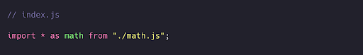

Import qilingan qiymatlar `math` obyektining xususiyatlari bo’ladi.

  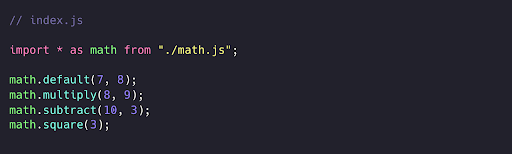

Bu holatda moduldan barcha eksportlarni import qilamiz. Buni qilishda ehtiyot bo'ling, chunki keraksiz qiymatlarni ham import qilib olishingiz mumkin.

`*` kalit so’zi faqat barcha eksport qilingan qiymatlarni import qiladi. Agar siz ularni aniq eksport qilmagan bo’lsangiz, modulning *yopiq* qiymatlar uni import qiluvchi faylda mavjud bo’lmaydi.

# React

React yordamida ilovalar yaratishda ko'pincha katta miqdordagi komponentlar bilan ishlashga to’g’ri keladi. Bu komponentlarning barchasini bitta faylga yozish o'rniga, ularni alohida fayllarga ajratishimiz mumkin, ya’ni har bir komponent uchun alohida modul yaratamiz.

Bizda *ro'yxat, ro'yxat elementlari, input maydoni va tugmani* o'z ichiga olgan sodda vazifalar ro'yxati (todo-list) mavjud.

  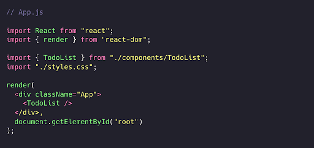

  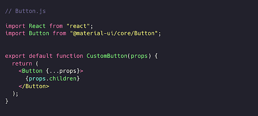

  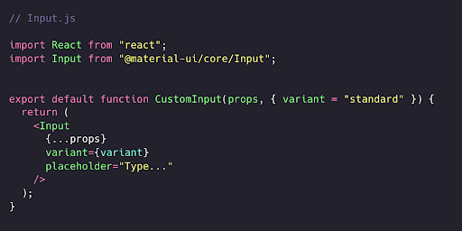

  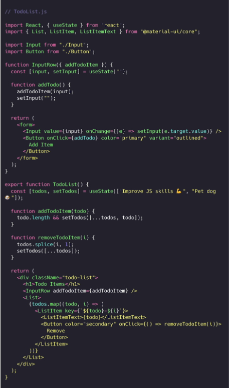

Biz komponentlarimizni quyidagi alohida fayllarga ajratdik:

 - `TodoList.js` - `List` komponenti uchun
 - `Button.js` - *moslashtirilgan* `Button` komponenti uchun
 - `Input.js` - *moslashtirilgan* `Input` komponenti uchun.

 Ilovamiz davomida biz [material-ui](https://mui.com/material-ui/) kutubxonasidan import qilingan *default* `Button` va `Input` komponentlaridan foydalanmoqchi emasmiz. Buning o'rniga, ularning fayllaridagi `styles` obyektida belgilangan maxsus stillarni qo’shib, o’zimizning komponentlarimizdan foydalanmoqchimiz. Ilovamizda har safar *default* `Button` va `Input`  komponentlarini import qilib, ularga qayta-qayta maxsus stillar qo‘shish o‘rniga, ularni bir marta import qilib, stillar qo’shib, o’zimizning maxsus komponentimizni eksport qilishimiz mumkin.

 # Dinamik import (Dynamic import)

 Faylning yuqori qismida barcha modullarni import qilganda, ular faylning qolgan qismidan oldin yuklanadi. Ba'zi hollarda bizga modul faqat ma'lum bir shartlar asosida kerak bo’ladi. **Dinamik import** yordamida biz modullarni kerak bo’lganda yuklashimiz mumkin.

 

  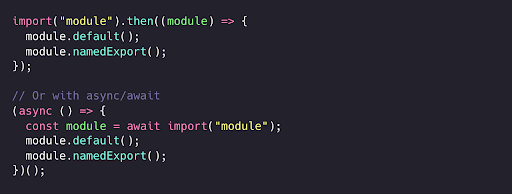

   Keling, oldingi misollarda ishlatilgan `math.js` ni dinamik ravishda import qilaylik.

   Modul faqat foydalanuvchi tugmani bosgandagina yuklanadi.

 

  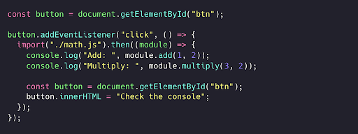

Modullarni dinamik import qilish orqali sahifi yuklash vaqtini qisqartirishimiz mumkin. Biz faqat foydalanuvchiga aynan kerak bo'lgan kodni kerak bo’lgan vaqtda yuklash, tahlil qilish va kompilyatsiya qilishimiz mumkin.

Modullarni talabga binoan (on-demand) import qilish imkoniyatidan tashqari `import()` funksiyasi ifoda (expressoin) qabul qilishi mumkin. Bu bizga shablon satrlar  (template literals)dan foydalanib, berilgan qiymat asosida modullarni dinamik yuklash imkonini beradi.

 

  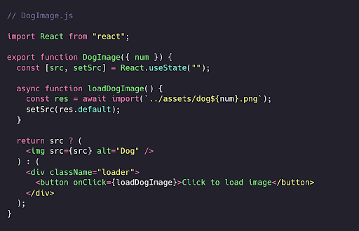

Yuqoridagi misolda, foydalanuvchi “*Click to load image”* tugmasini bosgandagina `date.js` moduli import qilinadi. `date.js` moduli uchinchi tomon `moment` modulini import qiladi, u ham faqat `date.js` moduli yuklangandagina import qilinadi. Agar foydalanuvchiga sanalarni ko'rsatish kerak bo'lmasa, bu uchinchi tomon kutubxonasini yuklashni umuman amalga oshirmasligimiz mumkin.

Har bir rasm foydalanuvchi tugmani bosgandan so'ng yuklanadi. Rasmlar lokal `.png` fayllar bo'lib, ular `num` qiymatiga asosan yuklanadi. 

 

  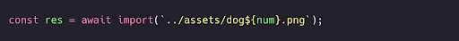

Bu holat o’zgarmas kodli (hard-coded) modul yo'llariga bog'liq emas. U foydalanuvchi kiritgan maʼlumotlar, tashqi manbadan olingan maʼlumotlar, funksiya natijasi va boshqalar asosida modullarni import qilishga moslashuvchanlik qo’shadi.

*Modul patterni* yordamida biz kodimizning ommaga oshkor etilmasligi kerak bo'lgan qismlarini inkapsulyatsiya (encapsulation) qilishimiz mumkin. Bu nomlarning tasodifiy to'qnashuvi va global qamrovning ifloslanishining oldini oladi, bu esa bir nechta qaramliklar (dependencies) va nomlar makoni (namespace) bilan ishlashni xavfsizroq qiladi. Barcha JavaScript kodni bajarilish vaqtlari (runtime)larida ES2015 modullaridan foydalanish uchun [Babel](https://babeljs.io/) kabi transpiler kerak bo’ladi. 