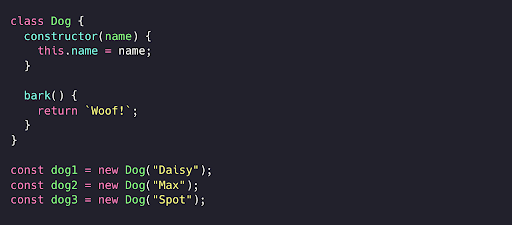
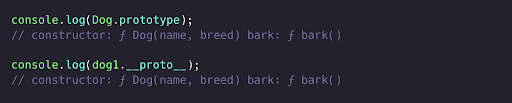
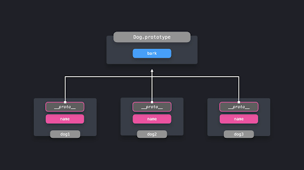
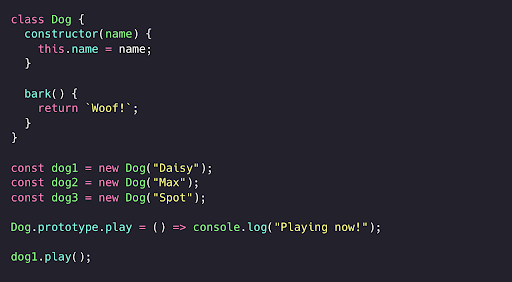
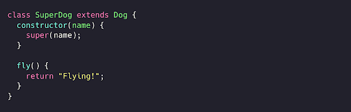
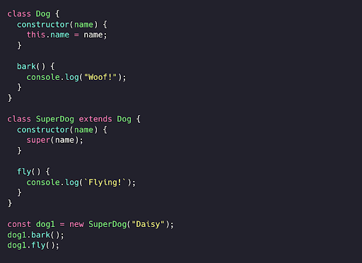
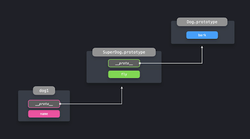
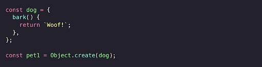
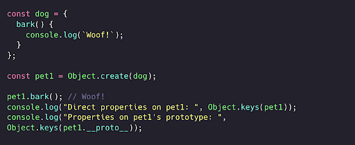

# **Prototype pattern (Prototip patterni)**

**Prototip patterni** bir xil turdagi ko'plab obyektlar orasida xususiyatlarni ulashishning foydali usuli hisoblanadi. Prototip - JavaScriptning o’ziga xos obyekti bo'lib, unga obyektlar prototip zanjiri orqali murojaat qila oladi.

Dasturlarimizda ko'pincha bir xil turdagi ko'plab obyektlarni yaratishga to'g'ri keladi. Buning eng qulay usuli - ES6 klassidan bir nechta obyekt nusxalarini yaratishdir.

Aytaylik, biz ko'plab it obyekt nusxalarini yaratmoqchimiz! Bizning misolimizda itlarning imkoniyatlari cheklangan: ularning faqat ismi bor va ular vovullay oladi!

 

  

Agar e’tibor bersangiz, konstruktor `name` xususiyatiga ega, klassning o’zida esa `bark` xususiyati mavjud. ES6 klasslaridan foydalanganda, klassning o’zida berilgan barcha xususiyatlar - bizning holatimizda `bark` - avtomatik ravishda prototipga qo'shiladi.

Biz prototipni to'g'ridan-to'g'ri konstruktordagi `prototype` xususiyatiga murojaat qilish orqali yoki istalgan *obyekt nusxasidagi* `__proto__` xususiyati orqali ko'rishimiz mumkin.

 

  

Konstruktorning har qanday nusxasidagi `__proto__` qiymati konstruktor prototipiga bevosita havoladir! Agar obyektda to'g'ridan-to'g'ri mavjud bo'lmagan biror xususiyatga murojaat qilmoqchi bo’lsak, JavaScript ushbu xususiyat mavjudligini tekshirish uchun *prototip zanjiriga murojaat qiladi.*

 

  

Prototype pattern bir xil xususiyatlarga ega bo'lishi kerak bo'lgan obyektlar bilan ishlashda juda qo’l keladi. Har bir obyekt nusxasi (instance) uchun xususiyatning dublikatini yaratish o'rniga, uni prototipga bir marta qo’shsak kifoya, chunki barcha obyekt nusxalari prototip obyektiga murojaat qila olishadi.

Barcha obyekt nusxalari prototipga kira olganligi uchun, ushbu nusxalarni yaratib bo’lgandan keyin ham prototipga yangi xususiyatlarni qo'shish oson.

Aytaylik, itlarimiz nafaqat vovullashi, balki o'ynay olishi ham kerak! Buning uchun prototipga play xususiyatini qo'shish orqali buni amalga oshirishimiz mumkin.

 

  

**Prototip zanjiri (prototype chain)** atamasi bir necha bosqich bo'lishi mumkinligini anglatadi. Haqiqatan ham! Hozirgacha biz faqat `__proto__`  havolasi bo'lgan birinchi obyektdagi bevosita mavjud bo'lgan xususiyatlarga qanday kira olishimiz mumkinligini ko'rib chiqdik. Biroq, prototiplarning o'zi ham `__proto__`  obyektiga ega!

Keling, yangi turdagi it - super itni yarataylik! Bu it oddiy `Dog` klassidagi barcha xususiyatlarni meros qilib olishi, qo’shimcha ravishda ucha olishi ham kerak. Buni `Dog` klassini kengaytirish va `fly` metodini qo'shish orqali amalga oshiramiz.

 

  

Keling, `Daisy` ismli uchuvchi itni yaratib, uning vovullash va uchish qobiliyatlarini sinab ko’ramiz! 

 

  

`Dog` klassini kengaytirganligimiz uchun bark metodidan foydalana olamiz. `SuperDog` prototipidagi `__proto__`  qiymati `Dog.prototype` obyektiga yo’naltirilgan!

 

  

Bu nima uchun `prototip zanjiri` deb atalishi endi tushunarli: biz obyektda bevosita mavjud bo'lmagan xususiyatga murojaat qilganimizda, JavaScript kerakli xususiyatni topguncha `__proto__` ko’rsatib turgan barcha obyektlar bo’ylab rekursiv tarzda pastga qarab izlaydi!

 ## `Object.create`

`Object.create` metodi bizga yangi obyekt yaratish imkonini beradi, bunda biz uning prototip qiymatini aniq ko’rsatishimiz mumkin.

 

  

Garchi `pet1`’ning o'zida hech qanday xususiyat bo'lmasa-da, u o'zining prototip zanjiridagi xususiyatlaridan foydalana oladi! Biz `dog` obyektini `pet1`’ning prototipi sifatida berganligimiz uchun, `bark` xususiyatidan foydalana olamiz.

 

  

Ajoyib! `Object.create` - bu obyektlarga boshqa obyektlarning xususiyatlarini to’g’ridan-to’g’ri meros qilib olish imkonini beradigan qualy usul. Bunda yangi yaratilayotgan obyektning prototipini aniq ko’rsatib o’tamiz. Yangi obyekt prototip zanjiri bo'ylab harakatlanib, yangi xususiyatlardan foydalana oladi.

*Prototype pattern* obyektlarga boshqa obyektlardan xususiyatlaridan osongina foydalanish va ularni meros qilib olish imkonini beradi. Prototip zanjiri obyektning o'zida to'g'ridan-to'g'ri aniqlanmagan xususiyatlardan foydalanish imkonini bergani uchun, metod va xususiyatlarning takrorlanishini olini olishimiz mumkin Bu esa xotiradan foydalanish hajmini kamaytiradi.