# Provider pattern (Provayder patterni)

Ba'zan shunday holatlar bo’ladiki, ilovamizning ko'plab (yoki barcha) komponentlariga ma'lumotlarni yetkazib berishimiz kerak bo’lib qoladi. props orqali ma’lumotlarni komponentlarga uzatish mumkin bo'lsa-da, agarda ilovadagi deyarli barcha komponentlar bu ma’lumotlardan bu ma’lumotlardan foydalanishi kerak bo'lsa, bu usul noqulay va murakkab bo’lishi mumkin.

Biz ko’pincha prop drilling (props’larni chuqur uzatish) muammoasiga duch kelamiz. Bu muammo props’larni komponentlar daraxtining eng pastki qatlamlarigacha uzatishimiz kerak bo’lganda yuzaga keladi. Bunday holatda props’larga boq’liq bo’lgan kodni refaktoring qilish deyarli imkonsiz bo’lib qoladi va ma'lumotlarning aynan qayerdan kelayotganini aniqlash qiyinlashadi.

Faraz qilaylik, bizda ma'lum ma'lumotlarni o'z ichiga olgan App komponenti bor. Komponentlar daraxti pastida esa shu ma'lumotlarni o’zida ishlatadigan ListItem, Header va Text komponentlari joylashgan. Bu ma'lumotlarni ushbu komponentlarga yetkazish uchun, uni bir nechta oraliq komponentlar orqali o'tkazishimiz kerak bo’ladi.

 

  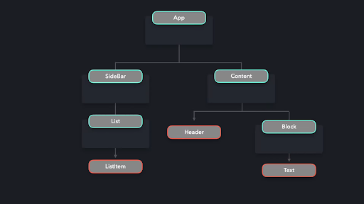

Bizning kodimizda bu quyidagicha ko'rinadi:

 

  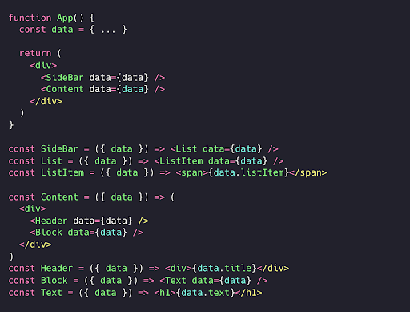

Props’larni bu tarzda uzatish juda chalkash bo’lib ketishi mumkin. Agar keyinchalik data props’ining nomini o'zgartirmoqchi bo’lib qolsak, uni barcha komponentlarda ham o’zgartirib chiqishimiz kerak bo'ladi. Ilova kattalashgan sari, prop drilling muammosi yanada murakkablashib boradi.

Ma'lumotlardan foydalanmaydigan oraliq komponentlarni chetlab o’tish imkoniyati bo’lganda edi, ancha qulay bo'lardi. Bizga shunday mexanizm kerakki, data ma’lumotlarini ishlatishi kerak bo’lgan komponentlar prop drilling’ga tayanmasdan, ushbu ma’lumotlarga to'g'ridan-to'g'ri murojaat qila olsin. 

Aynan shu yerda Provider Pattern bizga yordam beradi! Provider pattern yordamida ma'lumotlarni bir nechta komponentlarga taqdim etishimiz mumkin. Ma'lumotlarni har bir qatlam orqali props sifatida uzatish o'rniga, barcha komponentlarni Provider bilan o’rab olishimiz mumkin. Provider (Provayder) - bu  Context obyekti tomonidan taqdim etiladigan yuqori tartibli komponent. React bizga taqdim etgan createContext metodidan foydalanib, Context obyektini yaratamiz.

Provayder value props’ini qabul qiladi, bu props biz uzatmoqchi bo’lgan ma’lumotlarni o’z ichiga oladi. Provayder bilan o'ralgan barcha komponentlar bu value props’ining qiymatidan foydalana oladi.

 

  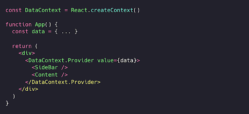

Biz endi data props’ini har bir komponentga alohida uzatib chiqishimiz shart emas! Xo'sh, endi ListItem, Header va Text  komponentlari data qiymatidan qanday foydalana oladi?

Har bir komponent useContext hook’i orqali ma'lumotlarga kira oladi. Bu hook bizning holatda DataContext’ga havola qilingan kontekstni qabul qiladi. useContext hook’i bizga kontekst (context) obyektidan ma'lumotlarni o'qish va unga yozish imkonini beradi.

 

  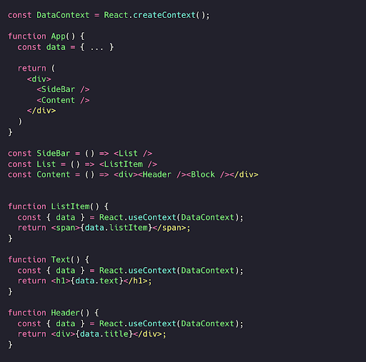

Ma'lumotlardan foydalanmaydigan komponentlar endi ular bilan umuman ishlamaydi. Endi props’larni ishlatmaydigan komponentlar orqali bir necha darajaga uzatish haqida bosh qotirishimizga hojat yo’q, bu esa refaktoringni ancha osonlashtiradi. 

 

  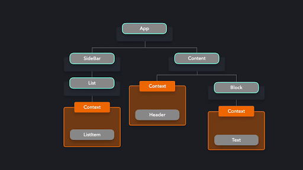

Provider pattern global ma'lumotlarni ulashish uchun juda foydali. Bu pattern’ning keng tarqalgan foydalanish holatlaridan biri - ko'plab komponentlar bilan interfeys mavzusi (UI)ning holatini ulashishdir.

Aytaylik, bizda ro'yxatni ko'rsatadigan oddiy ilova bor.

 

  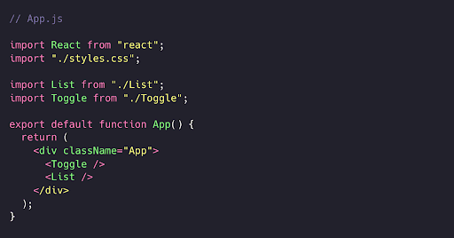

 

  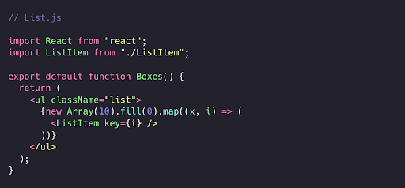

Biz foydalanuvchilarga tugmani bosib almashtirish orqali yorug' va qorong'i rejimlar orasida almashish imkoniyatini bermoqchimiz. Foydalanuvchi yorug’ rejimdan qorong’i rejimga va aksincha qilib almashtirganda, orqa fon rangi va matn rangi o'zgarishi kerak! Joriy mavzu qiymatini har bir komponentga alohida uzatish o'rniga, biz komponentlarni ThemeProvider bilan o’rab, joriy mavzu ranglarini provayderga uzatishimiz mumkin. 

 

  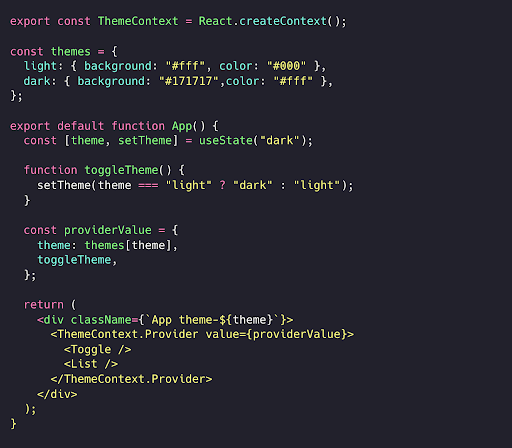

Toggle va List komponentlari ikkalasi ham ThemeContext provayderi bilan o‘ralgani uchun, biz provayderga value sifatida uzatilgan theme va toggleTheme qiymatlaridan foydalana olamiz.

Toggle komponentida mavzuni mos ravishda yangilash uchun toggleTheme funksiyasidan foydalanishimiz mumkin.

 

  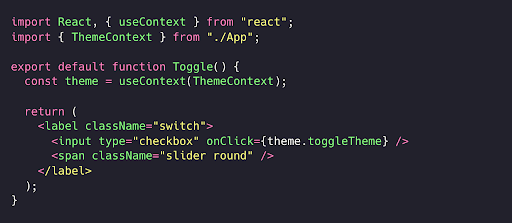

List komponentining o'zi joriy mavzu qiymatidan foydalanmaydi. Biroq, ListItem komponentlari esa undan foydalanadi! Biz theme  kontekstidan to'g'ridan-to'g'ri ListItem ichida foydalana olamiz. 

 

  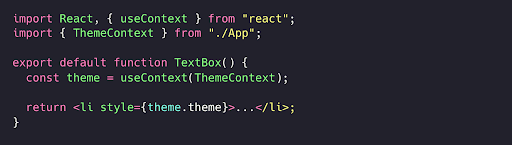

Juda soz! Joriy Mavzu qiymatidan foydalanmaydigan komponentlarga hech qanday ma'lumot uzatishimiz shart bo’lmadi.

# Hook’lar

Komponentlarga kontekst taqdim qilish uchun maxsus hook yaratishimiz mumkin. Har bir komponentda useContext va Context’ni alohida import qilish o'rniga, bizga kerakli kontekstdan qaytaradigan hook’dan foydalansak bo’ladi.

Hook’imiz to’g’ri mavzu qaytarayotganiga ishonch hosil qilish uchun, agar useContext(ThemeContext) noto’g’ri qiymat qaytarsa, xatoga chiqaramiz.

 

  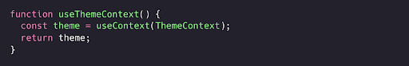

Komponentlarni to'g'ridan-to'g'ri ThemeContext.Provider komponenti bilan o'rash o'rniga, komponentga qiymatlarni taqdim etish uchun yuqori darajali komponent (HOC) yaratishimiz mumkin. Bu usul orqali biz kontekst logikasini render qiluvchi komponentlardan ajratib olamiz, bu esa provayderning qayta foydalanuvchanlik imkoniyatini oshiradi.

 

  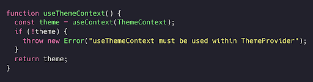

ThemeContext’dan foydalanishi kerak bo'lgan har bir komponent endi oddiy  useThemeContext hook’idan foydalanishi mumkin.

 

  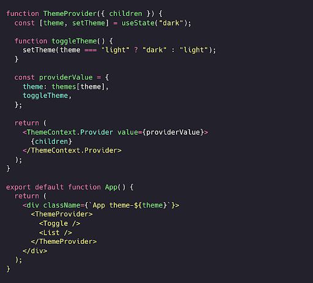

Turli kontekstlar uchun turli hook’lar yaratish orqali provayderlar logikasini ma'lumotlarni render qiluvchi komponentlardan oson ajratib olish mumkin.

# Amaliy misol

Ba'zi kutubxonalar ichki o’rnatilgan provayderlarni taqdim etadi, ularning qiymatlaridan biz komponentlarda foydalanishimiz mumkin. Buning ajoyib misoli - styled-components kutubxonasi.

“Eslatma: Bu misolni tushunish uchun styled-components bo’yicha tajriba talab etilmaydi.”

styled-components kutubxonasi bizga ThemeProvider’ni taqdim etadi. Har bir stilli komponent (styled component) bu provayderning qiymatidan qiymatidan foydalan oladi! O'zimiz kontekst API yaratish o'rniga, tayyor provayderdan foydalandak bo’ladi!

Keling, avvalga List misolimizni olib, komponentlarni styled-component kutubxonasidan import qilingan ThemeProvider bilan o'rab olaylik. 

 

  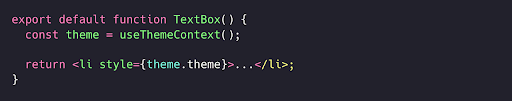

ListItem komponentiga ichki style props berish o'rniga, uni styled.li  komponentiga aylantiramiz. Bu stilli komponent bo'lgani uchun theme qiymatidan to’g’ridan-to’g’ri foydalana olamiz!

 

  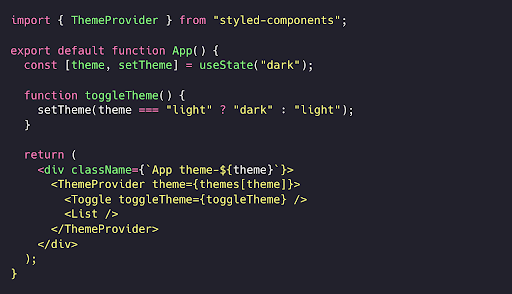

Ajoyib, endi biz ThemeProvider yordamida barcha stillli komponentlarimizga stillarni osongina qo'llashimiz mumkin!

  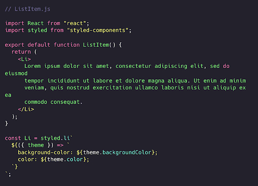

  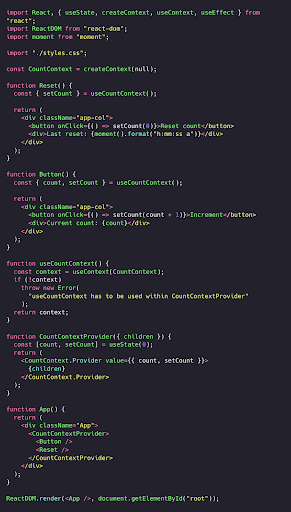

# Afzalliklari

Provider pattern/Context API ma'lumotlarni har bir komponent qatlamidan alohida o'tkazmasdan, ko'plab komponentlarga yetkazish imkonini beradi.

Bu kodni refaktoring qilishda tasodifiy xatolar kiritish xavfini kamaytiradi. Ilgari props nomini o'zgartirmoqchi bo'lsak, bu qiymat ishlatilgan barcha joylarda o’zgartirib chiqishimiz kerak edi. 

Endi bizga anti-pattern (yomon andoza) sifatida ko’riladigan prop-drilling bilan  shug’ullanishimizga hojat yo’q. Ilgari ilovaning ma'lumotlar oqimini tushunish qiyin bo’lardi, chunki props qiymatlari qayerdan kelgani doim ham aniq bo’lmasdi. Provider pattern bilan keraksiz props’larni uzatishdan qochamiz.

Provider pattern yordamida global state (holat ma’lumoti)ni saqlash osonlashadi, chunki komponentlarga ushbu state’dan foydalanish imkonini berishimiz mumkin.

# Kamchiliklari

Provider pattern’dan haddan ortiq foydalanish ishlash samaradorligi (performance) bilan bog'liq muammolarga olib kelishi mumkin. Kontekstdan foydalanuvchi barcha komponentlar har bir state o'zgarishida qayta render bo’ladi.

Keling, oddiy hisoblagich (counter) misolini ko'rib chiqaylik. Uning qiymati Button komponentidagi Increment tugmasini har bosganda ortadi. Shuningdek, bizda Reset komponentida Reset tugmasi mavjud bo'lib, u hisobni 0 ga qaytaradi.

Increment tugmasini bosganingizda nafaqat hisob, balki Reset komponentidagi sana ham qayta render bo’lishini ko’rasiz!

  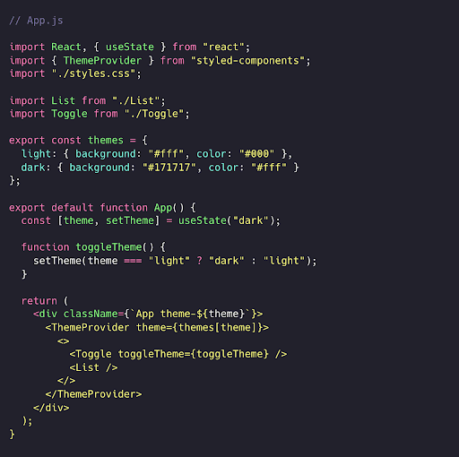

Reset komponenti ham useContext’dan foydalangani uchun qayta render bo’ladi. Nisbatan kichikroq ilovalarda bu xavotirga arzigulik muammo bo’lmasligi mumkin. Ammo, kattaroq ilovalarda tez-tez yangilanadigan qiymatni ko'plab komponentlarga uzatish ishlash samaradorligiga jiddiy salbiy ta'sir ko'rsatishi mumkin.

Komponentlar kerak bo’lmagan qiymatlarga ega provayderlardan foydalanmasligini ta’minlash uchun, har bir alohida foydalanish holati uchun alohida provayderlarni yaratishingiz mumkin.
