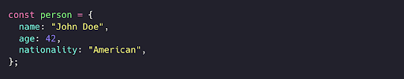
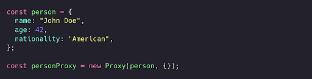
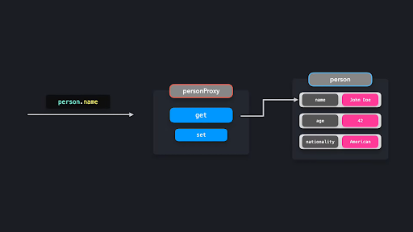
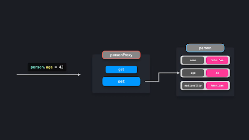
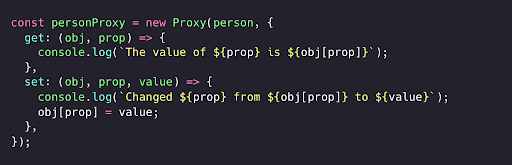
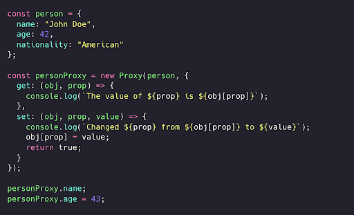
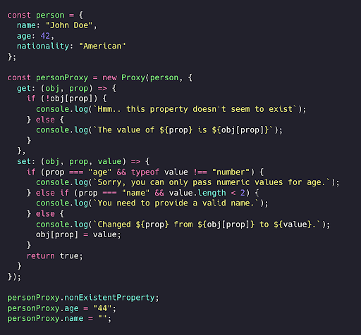
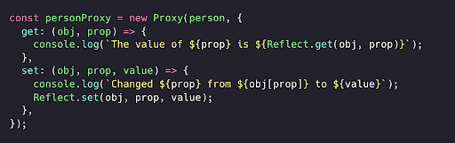

# Proxy pattern (Vositachi/Proksi patterni)

Proxy (Proksi) obyekti yordamida ma'lum obyektlar bilan o'zaro munosabatlarni yanada kuchliroq nazorat qila olamiz. Proxy obyekti obyekt bilan ishlash jarayonida - masalan, qiymat olish yoki qiymat o'rnatish paytida - xatti-harakatlarni boshqara oladi.

Umuman olganda, proksi kimningdir o’rnida turuvchi vositachi degani. Kimdir bilan to'g'ridan-to'g'ri gaplashish o'rniga, siz u odamnning vakili bo’lgan vositachi bilan gaplashasiz. JavaScriptda ham xuddi shunday bo'ladi: maqsad qilingan obyekt bilan to'g'ridan-to'g'ri ishlash o'rniga, biz Proxy obyekti bilan muloqot qilamiz.

 Keling, Jon Doeni ifodalovchi person obyektini yarataylik.

 

  

Bu obyekt bilan to'g'ridan-to'g'ri ishlash o'rniga, biz proksi obyekti orqali muloqot qilmoqchimiz. JavaScriptda yangi Proxy obyekt nusxasini yaratish orqali buni osongina amalga mumkin.

 

  

Proxy’ning ikkinchi argumenti - bu ishlov beruvchi (handler)ni ifodalovchi obyektdir. Ishlov beruvchi obyektda biz o'zaro interaktivlik turiga qarab muayyan xatti-harakatni belgilashimiz mumkin. Proxy ishlov beruvchi obyektiga [ko'plab metodlar](https://developer.mozilla.org/en-US/docs/Web/JavaScript/Reference/Global_Objects/Proxy)  qo’shish mumkin bo'lsa-da, eng ko’p ishlatiladigan ikkitasi  - bu get va set hisoblanadi. 

 - get: xususiyatga murojaat qilinganda ishga tushadi
 - set: xususiyat o'zgartirilganda ishga tushadi

 Natijada quyidagi jarayon sodir bo'ladi:

  

  

  

person obyekti bilan to'g'ridan-to'g'ri ishlash o'rniga, personProxy bilan ishlaymiz.

Keling, personProxy proksisiga ishlov beruvchi (handler)lar qo'shamiz. Proxy’ning set metodi chaqirilganda, ya’ni xususiyat o'zgartirilayotganda, xususiyatning oldingi va yangi qiymatini qayd etishini xohlaymiz. Proxy’ning get metodi chaqirilganda esa, ya’ni xususiyatga murojaat qilinayotganda, xususiyatning kaliti (key) va qiymatini (value) o'z ichiga olgan tushunishga oson bo’lgan xabarni qayd etishini xohlaymiz.

  

Juda ajoyib! Keling, endi xususiyatni o'zgartirishga yoki olishga harakat qilganimizda nima sodir bo'lishini ko'rib chiqamiz.

  

name xususiyatiga murojaat etganimizda, Proxy ancha tushunarli xabar qaytaradi: The value of name is John Doe.

name xususiyatini o'zgartirganimizda esa, Proxy ushbu xususiyatning oldingi va yangi qiymatini qaytardi: Changed age from 42 to 43.

Proxy validatsiya qo'shish uchun juda foydali. Masalan foydalanuvchi person obyektining yoshi qiymatini satr qiymatiga o'zgartira olmasligi yoki unga bo'sh ism bera olmasligi kerak. Yoki agar foydalanuvchi obyektda mavjud bo'lmagan xususiyatga murojaat qilmoqchi bo’lsa, biz uni bu haqda ogohlantirishimiz lozim. 

  

Noto'g'ri qiymatlar kiritishga urinib ko’raylik!

  

Proxy noto'g'ri qiymatlar bilan person obyektini o’zgartirishga yo’l qo’ymadi, bu esa bizga ma'lumotlarimizni butunligini va kodni toza saqlashga yordam beradi!

# Reflect

JavaScript ichki o’rnatilgan Reflect nomli obyektni taqdim etadi, bu proksilar bilan ishlashda maqsadli obyektni boshqarishni osonlashtiradi.

Avvalroq biz proksi ichidi maqsadli obyekt xususiyatlarini to'g'ridan-to'g'ri to’rtburchak qavs belgisi orqali olish yoki o'rnatish orqali o'zgartirishga va ularga murojaat qilishga harakat qilgan edik. Buning o'rniga biz Reflect obyektidan foydalanishimiz ham mumkin. Reflect obyektidagi metodlar handler obyektidagi metodlar bilan bir xil nomga ega.

obj[prop] orqali xususiyatlarga kirish yoki obj[prop] = value orqali xususiyatlarni o'rnatish o'rniga, Reflect.get() va Reflect.set() orqali maqsadli obyekt xususiyatlariga murojaat qilishimiz yoki o'zgartirishimiz mumkin. Bu metodlar ishlov beruvchi obyektidagi metodlar bilan bir xil argumentlarni qabul qiladi.

Juda yaxshi! Reflect obyekti yordamida maqsadli obyektning xususiyatlariga osongina murojaat qilib, ularni o'zgartirishimiz mumkin.

  

# Afzalliklari

Proksilar obyekt xatti-harakatlari ustidan nazoratni o’rnatishning kuchli usulidir. Proksilar turli maqsadlarda ishlatilishi mumkin: u validatsiya, formatlash, bildirishnomalar yoki nosozliklarni tuzatish (debugging)da qo’l kelishi mumkin.

# Kamchiliklari

Shunga qaramay, Proxy obyektini haddan tashqari ortiqcha ishlatish yoki har bir handler metodida og'ir operatsiyalarni bajarish ilovangizni ishlash samadorligiga salbiy ta'sir ko'rsatishi mumkin. Shuning uchun yuqori ishlash unumdorligini talab qiladigan kodda proksilardan foydalanmaslik tavsiya etiladi.