# Singleton pattern (Yagona nusxa patterni)

Singleton - bu faqat bir marta yaratilishi mumkin bo’lgan va global miqyosda foydalanish mumkin bo'lgan klass. Ushbu yagona nusxani butun ilova bo'ylab ulashish mumkin, shuning uchun Singleton ilovadagi global state’ni boshqarish uchun juda qulay.

Avvalo, ES2015 klassi yordamida singleton qanday yaratilishini ko'rib chiqaylik. Bu misol uchun quyidagi metodlarga ega bo’lgan Counter klassini yaratamiz:

  - getInstance - nusxa qiymatini qaytaruvchi metod
  - getCount - counter o'zgaruvchisining joriy qiymatini qaytaruvchi metod
  - increment - counter qiymatini bittaga oshiradigan metod
  - decrement - counter qiymatini bittaga kamaytiradigan metod

  

  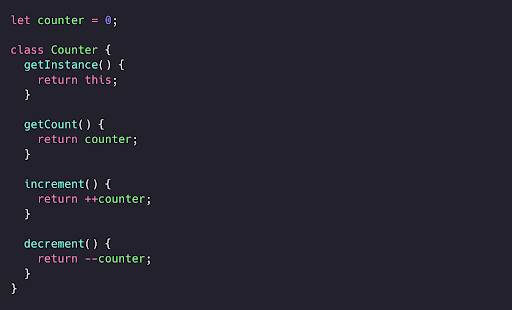

Biroq, bu klass hali Singleton talablariga javob bermaydi! Singleton faqat bir marta yaratilishi mumkin bo’lish kerak. Hozircha biz Counter klassining bir nechta nusxasini yarata olamiz.

  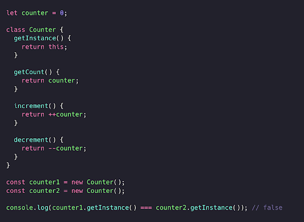

new metodini ikki marta chaqirish orqali counter1 va counter2 bo’lgan turli klass nusxalariga ega bo’lamiz. counter1 va counter2’dagi getInstance metodi bilan qaytarilgan qiymatlar turli klass nusxalariga havolalarni qaytardi: ular mutlaqo teng emas!

  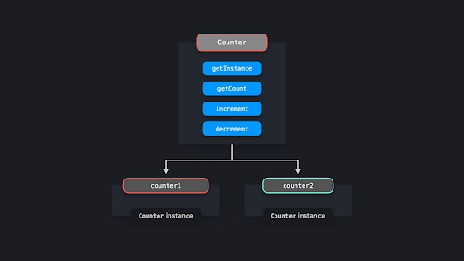

Keling Counter klassining faqat bitta nusxasini yaratish mumkinligiga ishonch hosil qilaylik.

Faqat bitta nusxa yaratilishini ta’minlashning bir usuli - instance nomli o'zgaruvchini yaratishdir. Counter konstruktorida yangi nusxa yaratilganda, biz ushbu instance o’zgaruvchisini ushbu nusxaga havola qilib o'rnatamiz. Agar instance o'zgaruvchisi allaqachon qiymatga ega bo’lsa, yangi nusxalarning yaratilishin oldini olishimiz mumkin. Bunday holatda nusxa (instance) allaqachon mavjud bo’ladi va bu xato hisoblanadi: foydalanuvchini ogohlantirish uchun xatolik chiqarilishi kerak. 

  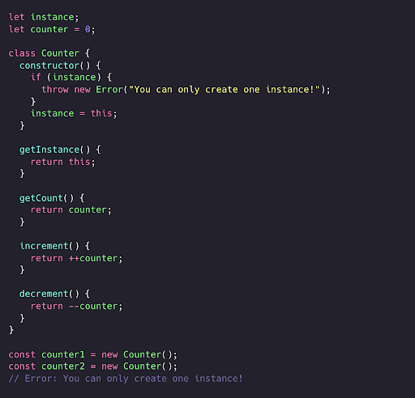

Juda yaxshi! Endi biz bir nechta nusxalar yarata olish imkoniyatidan mahrum bo’ldik.

Keling, endi Counter nusxasini counter.js faylidan eksport qilaylik. Ammo buni amalga oshirishdan oldin, nusxani ham muzlatib qo'yishimiz kerak. Object.freeze metodi tashqi kodning Singleton’ni o'zgartirish imkoniyatini to’liq cheklaydi. Muzlatilgan nusxaga yangi xususiyatlar qo'shish yoki mavjud xususiyatlarni o’zgartirish imkonsiz bo’lib qoladi. Bu esa Singleton’dagi qiymatlarning tasodifan qayta yozilishi xavfini sezilarli darajada kamaytiradi.

  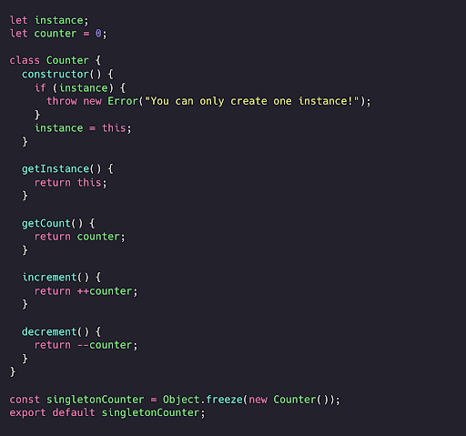

Keling, Counter misolini amalga oshiradigan dasturni ko'rib chiqaylik. Bizda quyidagi fayllar mavjud:

 - counter.js: Counter klassini o'z ichiga oladi va standart (default) eksport sifatida Counter nusxasini eksport qiladi
 - index.js: redButton.js va blueButton.js modullarini yuklaydi
 - redButton.js: Counter’ni import qiladi, qizil tugmaga Counter’ning increment metodini event listener sifatida qo'shadi va   getCount metodini chaqirish orqali counter’ning joriy qiymatini qayd etadi.
 - blueButton.js: Counter’ni import qiladi, ko’k tugmaga Counter’ning increment metodini event listener sifatida qo'shadi va getCount  metodini chaqirish orqali counter’ning joriy qiymatini qayd etadi.

 

  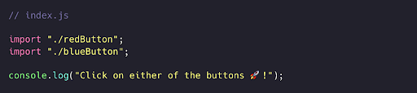

 

  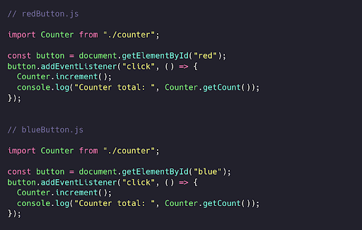

blueButton.js va redButton.js ikkalasi ham counter.js’dan bir xil nusxani import qiladi. Bu nusxa ikkala faylda ham Counter sifatida import qilinadi.

 

  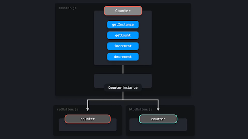

redButton.js yoki blueButton.js’da increment metodini chaqirganimizda, Counter nusxasidagi counter xususiyatining qiymati ikkala faylda ham yangilanadi. Qizil yoki ko'k tugmani bosishimizning farqi yo’q: bir xil qiymat barcha nusxalar orasida ulashiladi. Shuning uchun ham, garchi biz bu metodni turli fayllarda chaqirayotgan bo’lsak ham, hisoblagich har safar bittaga oshib boradi. 

# Afzallik va kamchiliklari

Klass nusxasi yaratishni faqat bitta nusxa bilan cheklash, potensial ravishda katta hajmdagi xotirani tejashga yordam beradi. Har safar yangi klass nusxasi uchun xotira ajratish o'rniga, biz faqat butun dastur davomida ishlatilayotgan bitta nusxa uchun xotira ajratamiz. Biroq, Singleton’lar aslida anti-pattern (yomon andoza) hisoblanadi va JavaScriptda buni ishlatishdan qochish mumkin (yoki qochish kerak). 

Java yoki C++ kabi ko'plab dasturlash tillarida JavaScriptdagi kabi obyektlarni to'g'ridan-to'g'ri yaratishni imkoni yo’q. Bu kabi obyektga yo'naltirilgan dasturlash tillarida (object-oriented programming) avval klass yaratishimiz, keyin esa obyekt yaratishimiz kerak bo’ladi. Bu yaratilgan obyekt, xuddi JavaScript misolidagi instance  qiymati kabi, klass nusxasining qiymatiga ega bo’ladi. 

Biroq, yuqoridagi misollarda ko'rsatilgan klass yondashuvi aslida ortiqcha murakkablik yaratadi. JavaScriptda to'g'ridan-to'g'ri obyektlar yaratish imkoniyati mavjud bo’lgani uchun, xuddi shunday natijaga erishish uchun oddiy obyektdan foydalanishimiz ham mumkin. Keling, Singleton’lardan foydalanishning ba'zi kamchiliklarini ko'rib chiqaylik! 

<h3>Oddiy obyektdan foydalanish</h3>

Keling, avvalgi misolimizni qayta ko’rib chiqaylik. Biroq, bu safar counter quyidagi xususiyatlarga ega bo’lgan obyekt:

 - count xususiyati
 - count qiymatini bittaga oshiradigan increment metodi
 - count qiymatini bittaga kamaytiradigan decrement metodi

 

  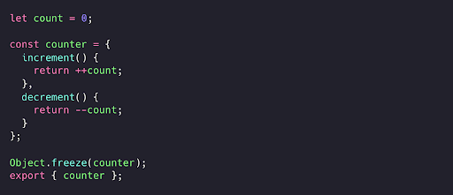

Javascriptda obyektlar havolar (reference) orqali uzatilganligi uchun, redButton.js va blueButton.js bir xil counter obyektiga havolani import qilmoqda. Bu fayllardan istalganida count qiymatini o'zgartirish counter obyektidagi qiymatni o'zgartiradi va bu o’zgarish ikkala faylda ham ko'rinadi.

# Testlash

Singleton’ga asoslangan kodni testlash murakkab bo'lishi mumkin. Har safar yangi klass nusxalari yarata olmasligimiz tufayli, barcha testlar avvalgi testning global nusxasiga kiritilgan o’zgartirishlarga bog’liq bo’ladi. Bu holatda testlarning bajarilish tartibi juda muhim, chunki bitta kichik o'zgarish butun test to'plamining ishdan chiqishiga olib kelishi mumkin. Testlashdan so'ng, testlar tomonidan kiritilgan o'zgarishlarni bekor qilish uchun butun nusxani qayta tiklashimiz kerak bo’ladi.

 

  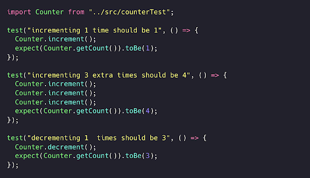

<h3>Qaramliklarning yashirinishi</h3>

Boshqa modulni (bizning holatimizda superCounter.js’ni) import qilayotganda, bu modul Singleton’ni import qilayotgani darhol ko’rinmasligi mumkin. Boshqa fayllarda, masalan index.js’da, biz bu modulni import qilib, uning metodlarini chaqirishimiz mumkin. Shu tarzda, biz bilmasdan Singleton’dagi qiymatlarni o'zgartirib qo’yamiz. Bu kutilmagan oqibatlarga olib kelishi mumkin, chunki ilova bo’ylab Singleton’ning bir nechta nusxalari ulashilgan bo'lishish mumkin va ularning hammasi o'zgartiriladi.

 

  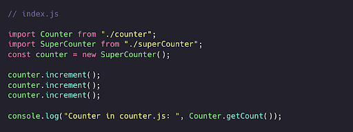

# Global xatti-harakat

Singleton klass nusxasi butun ilova bo'ylab murojaat qilinishi mumkin bo'lishi kerak. Global o'zgaruvchilar ham xuddi shunday xatti-harakatni namoyish etadi: global o'zgaruvchilar global ko’lamda mavjud bo'lgani uchun, biz ularga ilova bo’ylab murojaat qila olamiz.

Global o'zgaruvchilardan foydalanish odatda yomon loyihalash dizayn qarori sifatida ko’riladi. Global ko’lamning ifloslanisih global o'zgaruvchi qiymatining tasodifan qayta yozilishiga olib kelishi mumkin, bu esa ko'plab kutilmagan xatti-harakatlarga sabab bo’ladi. 

ES2015’da global o'zgaruvchilarni yaratish kamdan-kam uchraydi. Yangi let va const kalit so'zlari dasturchilarni ushbu ikkita kalit so'zlar bilan blok ko’lamida e'lon qilingan o'zgaruvchilarni saqlash orqali global ko’lamni tasodifan ifloslantirishdan saqlaydi. JavaScriptdagi yangi module tizimi moduldan qiymatlarni eksport qilish va ularni boshqa fayllarda import qilish orqali global ko’lamni ifloslantirmasdan global miqyosda mavjud qiymatlarni yaratishni osonlashtiradi.

Biroq, Singleton’ning asosiy qo’llanilishi - bu ilovangiz bo’ylab qandaydir global state’ga ega bo'lishdir. Kod bazasining turli qismlari bir xil o'zgaruvchan obyektga tayanishi kutilmagan xatti-harakatlarga olib kelishi mumkin.

Odatda, kod bazasining ayrim qismlari global state’dagi qiymatlarni o'zgartirsa, boshqalari bu ma'lumotlarni iste'mol qiladi. Bu yerda bajarilish tartibi juda muhim: biz iste'mol qilinadigan ma'lumot (hali) mavjud bo'lganda, ularni tasodifan iste'mol qilishni xohlamaymiz! Global state’dan foydalanishda ma'lumotlar oqimini tushunish, ilovangiz kattalashib borgani sayin va bir necha o’nlab komponentlar bir-biriga bog’liq bo’lib qolishi bilan juda murakkablashib ketishi mumkin.

# Reactda state menejment

Reactda biz ko'pincha Singleton’lardan foydalanish o'rniga Redux yoki React Context kabi state menejment vositalari orqali global state’dan foydalanamiz. Ularning global state ko’rinishi Singleton’nikiga o'xshash mumkin bo'lsa-da, bu vositalar Singleton’ning o'zgaruvchan holati o’rniga faqat o'qish (read-only) uchun mo’ljallangan holatni taqdim etadi. Reduxdan foydalanganda, faqat sof funksiya (pure function) reducer’larigina komponent dispetcher (dispatcher) orqali harakat (action) yuborganidan so'ng, holatni yangilashi mumkin.

Garchi global state’ga ega bo'lishning salbiy tomonlari bu vositalar yordamida sehrli tarzda yo'qolmasa-da, biz hech bo'lmaganda global state biz istagan tarzda o’zgartirilishini ta’minlay olamiz, chunki komponentlar holatni bevosita yangilay olmaydi.  