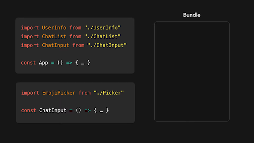
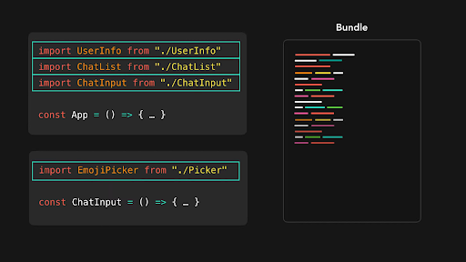
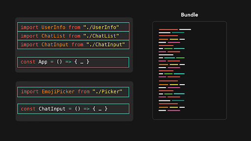
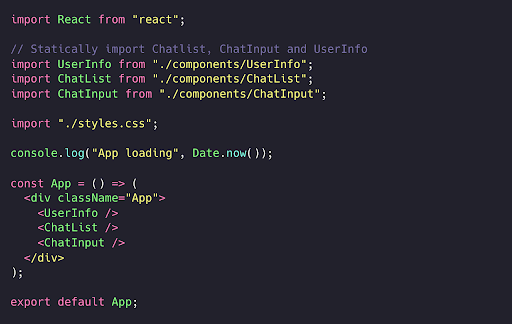
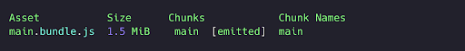

# **Static import (Statik import qilish)**

`import` kalit so'zi bizga boshqa modul tomonidan eksport qilingan kodni import qilish imkonini beradi. Standart holatda, biz *statik ravishda import* qilayotgan barcha modullar dastlabki to'plam paket (initial bundler)ga qo'shiladi. ES2015’ning *default import* sintaksisi `import from ‘module’` yordamida import qilingan modul statik ravishda import qilingan hisoblanadi.

  

  

  

Keling, bir misolni ko'rib chiqaylik! Oddiy chat ilovasi `Chat` komponentini o'z ichiga oladi. Unda biz uchta komponentni statik ravishda import qilib, ko'rsatamiz: `UserProfile`,  `ChatList` va xabarlarni yozish va yuborish uchun `ChatInput!` `ChatInput` modulida biz `EmojiPicker` komponentini statik ravishda import qilamiz. Bu komponent foydalanuvchi emoji tugmasini bosganda emoji tanlovchini ko‘rsatish uchun kerak bo’ladi. 

  

Javascript dvigateli import qilingan qatorga yetib kelishi bilan modullar bajarila boshlaydi. Konsolni ochganingizda, modullarning qaysi tartibda yuklangani ko’rinib turadi!

Komponentlar statik ravishda import qilingani uchun, Webpack modullarni dastlabki to'plam paketiga birlashtiradi. Ilova qurilgandan so'ng Webpack yaratgan to'plamni ko'rishimiz mumkin:

  

Chat ilovamizdagi manba kodi bitta to’plam - `main.bundle.js`’ga birlashtiriladi. To'plam paketining katta hajmi foydalanuvchining qurilmasi va tarmoq ulanishiga qarab ilovaning yuklanish vaqtiga sezilarli ta'sir ko'rsatishi mumkin. `App` komponenti o‘z tarkibini foydalanuvchi ekraniga chiqarishdan oldin u barcha modullarni yuklashi va tahlil qilishi kerak bo’ladi.

Yaxshiyamki, yuklanish vaqtini tezlashtirishning ko'plab usullari mavjud! Barcha modullarni bir vaqtning o'zida import qilish shart emas. Ba’zi modullar, foydalanuvchi harakati asosida ko'rsatilishi (masalan, bizning misolimizdagi `EmojiPicker` kabi) yoki sahifaning pastki qismida ko'rsatilishi kerak bo’lishi mumkin. Barcha komponentlarni statik ravishda import qilish o'rniga, biz modullarni *dinamik* ravishda, ya’ni `App` komponenti o'z tarkibini ko'rsatib bo’lgandan so'ng va foydalanuvchi  ilova bilan ishlash imkoniyatiga ega bo’lgandan so’ng import qilishimiz mumkin.