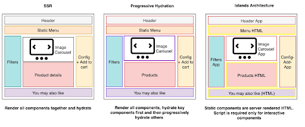
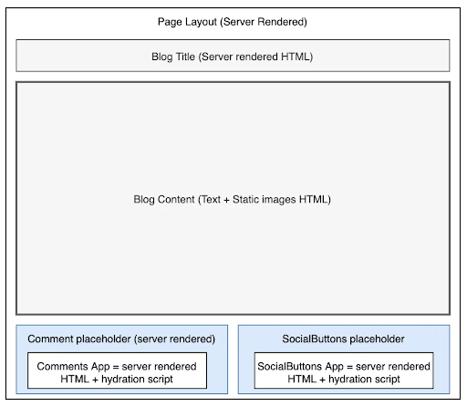
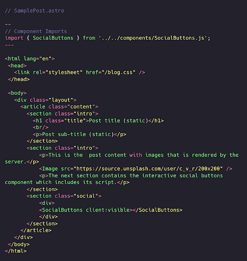
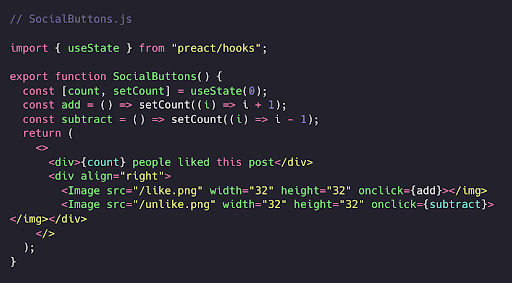
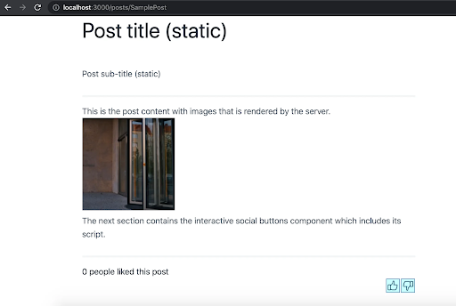
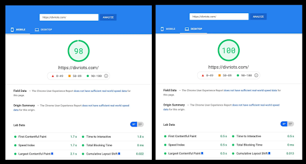

# **Renderlash patternlari**

# **Orollar arxitekturasi (Islands architecture)**

 *“Qisqacha mazmuni: ***Orollar arxitekturasi*** server tomonidan render qilingan (sever-rendered) veb-sahifalarda kichik va maqsadga yo'naltirilgan interaktiv qismlardan foydalanishni taklif etadi. Orollar natijasi asta-sekin takomillashtirilgan HTML bo'lib, bu takomillashtirishning qanday sodir bo'lishi aniq belgilangan. Butun sahifani ko'rsatishni bitta ilova boshqarish o'rniga, bir nechta kirish nuqtalari (entry points) mavjud. Bu “interaktivlik orollari” uchun skriptlar mustaqil ravishda yetkazib berilishi va hidratsiya qilinishi mumkin, bu esa sahifaning qolgan qismini oddiy statik HTML bo'lib qolishiga imkon beradi”.*

Ortiqcha JavaScriptni yuklash va qayta ishlash samaradorlikka salbiy ta’sir ko’rsatishi mumkin. Biroq, asosan statik bo’lgan veb-saytlarda ham ma'lum darajada interaktivlik va JavaScript talab qilinadi. Quyidagilar orasidagi muvozanatni topishga harakat qiladigan ilovalarni yaratishga imkon beruvchi *Statik Renderlash* turlarini muhokama qildik:

 1. Klient tomonida renderlangan (CSR) ilovalar darajasidagi interaktivlik
 2. Server tomonida renderlangan (SSR) ilovalar darajasidagi SEO afzalliklari.

SSR’ning asosiy tamoyili - HTML serverda render qilinadi va uni klientda qayta hidratsiya qilish uchun faqat zarur JavaScript qismi bilan birga yuboriladi. Qayta hidratsiyalash (rehydration) - bu server tomonidan render qilingan UI komponentlarining holatini klient tomonida qayta yaratish jarayoni jarayoni. Qayta hidratsiyalash resurs tomonidan [qimmatli](https://addyosmani.com/blog/rehydration/) bo’lgani uchun, SSR’ning har bir varianti bu jarayonni optimallashtirishga harakat qiladi. Bunga asosan muhim komponentlarni [qisman hidratsiya qilish](https://www.patterns.dev/posts/progressive-hydration/) yoki ular render qilinishi bilan  [uzluksiz oqim ko'rinishida uzatish](https://www.patterns.dev/posts/ssr/) (streaming) orqali erishiladi. Biroq, yuqoridagi usullarda yuborilgan JavaScript hajmi oxir-oqibat bir xil bo'lib qoladi.

[Orollar arxitekturasi](https://jasonformat.com/islands-architecture/) atamasi Keti Saylor-Miller va Jeyson Miller tomonidan ommalashtirilgan. Bu atama statik HTML ustiga mustaqil ravishda joylashtirilishi mumkin bo'lgan interaktiv "orollar" orqali yuboriladigan JavaScript hajmini kamaytirishga qaratilgan paradigmani tasvirlaydi. *Orollar* - komponentlarga asoslangan arxitektura bo’lib, u sahifani statik va dinamik orollarga bo’lingan holda ko’rinishini taqdim qiladi. Sahifaning statik qismlari sof nointeraktiv HTML bo'lib, hidratsiyaga muhtoj emas. Dinamik qismlar esa renderlashdan keyin o'zlarini qayta hidratsiya qilish qobiliyatiga ega bo’lgan HTML va skriptlar kombinatsiyasi hisoblanadi.

  

Keling, orollar arxitekturasini hozirda amalda mavjud bo’lgan turli implementatsiya variantlari bilan batafsilroq ko'rib chiqaylik.

# Dinamik komponentlar orollari

Aksariyat sahifalar statik va dinamik kontentning kombinatsiyasidan iborat. Odatda, sahifa izolyatsiya qilinishi mumkin bo'lgan interaktiv qismlar bilan boyitilgan statik kontentdan iborat. Masalan:

1. Blog postlar, yangiliklar maqolalari va tashkilotning bosh sahifalari matn va rasmlardan, hamda ijtimoiy tarmoq elementlari va chat kabi interaktiv komponentlardan iborat bo’ladi. 
2. Elektron tijorat saytlaridagi mahsulot sahifalarida mahsulotning statik tavsiflari va ilovadagi boshqa sahifalarga havolalar mavjud. Rasmli galereyasi va qidiruv kabi interaktiv komponentlar sahifaning turli qismlarida joylashgan bo’ladi.
3. Odatiy bank hisobi tafsilotlari sahifasida interaktiv filtrlar bilan ta’minlangan statik tranzaksiyalar ro'yxati mavjud.

Statik kontent stateless, ya’ni holatsiz bo’lib, hodisa (event)larni ishga tushirmaydi va render qilingandan so’ng qayta hidratsiya qilinishga muhtoj emas. Renderlashdan so'ng, dinamik kontent (tugmalar, filtrlar, qidiruv paneli) o’z hodisalariga qayta ulanishi kerak. DOM klient tomonida qayta yaratilishi kerak [(virtual DOM)](https://reactjs.org/docs/faq-internals.html#what-is-the-virtual-dom). Bu qayta yaratish, qayta hidratsiya bo’lish va hodisalarni boshqarish (event handling) funksiyalari klientga yuboriladigan JavaScript hajmini oshiradi.

Orollar uslubidagi arxitektura sahifalarni barcha statik kontentlari bilan server tomonida render qilishni osonlashtiradi. Bunday holda render qilingan HTML dinamik kontent uchun to'ldiruvchi joylar (placeholders)ni o'z ichiga oladi. Dinamik kontent to'ldiruvchi joylari o'z-o’zini boshqaradigan komponent vidjetlarini o’z ichiga oladi. Har bir vidjet kichik ilovaga o’xshash bo’lib, server tomonida render qilingan natijani va klient tomonidagi ilovani hidratsiyalash uchun ishlatiladigan JavaScriptni birlashtiradi.

Progressiv hidratsiyada sahifaning hidratsiya arxitekturasi yuqoridan pastga qarab ishlaydi. Sahifa individual komponentlarning rejalashtirish va hidratsiya qilinishini boshqaradi. Orollar arxitekturasida har bir komponentning o'zini hidratsiyalash skripti mavjud bo'lib, u sahifadagi boshqa skriptlardan mustaqil ravishda asinxron tarzda ishlaydi. Bir komponentdagi ishlash samaradorligi (performance) muammosi boshqasiga ta'sir qilmasligi kerak.

  

## **Orollar implementatsiyasi**

Orol arxitekturasi turli manbalardan tushunchalarni oladi va ularni optimal tarzda birlashtirishga qaratilgan. [Jekyll](https://jekyllrb.com/) va [Hugo](https://gohugo.io/) kabi shablonga asoslangan statik sayt generatorlari sahifalarda statik komponentlarni render qilishni qo'llab-quvvatlaydi. Ko'pgina zamonaviy JavaScript freymvorklari [izomorfik renderlashni](https://en.wikipedia.org/wiki/Isomorphic_JavaScript) ham qo'llab-quvvatlaydi, bu server va klient tomonida elementlarni renderlash uchun bir xil koddan foydalanish imkonini beradi. 

Jeyson o’z maqolasida komponentlarni hidratsiyalashni rejalashtirish yondashuvini amalga oshirish uchun [requestIdleCallback()](https://developer.mozilla.org/en-US/docs/Web/API/Window/requestIdleCallback)’dan foydalanishni taklif qiladi. Statik izomorfik renderlash va komponentlar darajasidagi qisman hidratsiyani rejalashtirish, orollar arxitekturasini qo'llab-quvvatlash uchun freymvork ichiga o'rnatilishi mumkin. Demak, freymvork quyidagilarni ta’minlashi kerak:

 1. Serverda JavaScriptsiz sahifalarni statik render qilishni qo'llab-quvvatlash.
 2. Statik kontentdagi to'ldiruvchi joylar orqali mustaqil dinamik komponentlarni joylashtirishni qo'llab-quvvatlash. Har bir dinamik komponent o'z skriptlariga ega bo’lib, asosiy oqim (main thread) bo'sh bo'lishi bilanoq `requestIdleCallback()` yordamida o'zini hidratsiya qila olishi kerak.
 3. Har ikki tomonda bir xil komponentni tanib olish uchun serverda komponentlarni izomorfik renderlash va klient tomonida hidratsiyalashga ruxsat berish.

Buni amalga oshirish uchun keyingi bo’limlarda muhokama qilinadigan tayyor variantlardan birini ishlatishingiz mumkin. 

# **Freymvorklar**

Bugungi kunda turli freymvorklar orollar arxitekturasini qo'llab-quvvatlashga imkoniyatiga ega. Ular orasida eng diqqatga sazovorlari:

 1. **Marko:**[Marko](https://markojs.com/) - bu eBay tomonidan server tomonida renderlashni ishlash samaradorligini takomillashtirish uchun [ishlab chiqilgan](https://tech.ebayinc.com/engineering/the-future-of-marko/) va [qo'llab-quvvatlanadigan](https://tech.ebayinc.com/engineering/ebay-launches-marko-5/) ochiq manbali freymvork. U oqimli renderlashni avtomatik qisman hidratsiya bilan birlashtirish orqali orollar arxitekturasini qo'llab-quvvatlaydi. HTML va boshqa statik resurslar tayyor bo'lishi bilanoq klient tomoniga oqim tarzida uzatiladi. Avtomatik qisman hidratsiya interaktiv komponentlarga o’z-o’zini hidratsiyalash imkonini beradi. Hidratsiya kodi faqat [interaktiv komponentlar uchun yuboriladi](https://medium.com/@mlrawlings/maybe-you-dont-need-that-spa-f2c659bc7fec), bu esa brauzer holatini o'zgartirishi mumkin. U izomorfik bo'lib, Marko kompilyatori qayerda ishlashiga (klient yoki server) qarab optimallashtirilgan kod yaratadi. 
 2. **Astro:** [Astro](https://astro.build/) - bu React, Preact, Svelte, Vue va boshqalar kabi boshqa freymvorklarda yaratilgan UI komponentlaridan yengil statik HTML sahifalarini yarata oladigan statik sayt quruvchisi. Klient tomonida JavaScript talab qiladigan komponentlar o'zlarining qaramliklari bilan alohida yuklanadi. Shunday qilib u ichki o'rnatilgan qisman hidratsiyani ta'minlaydi. Astro, shuningdek, komponentlarni ular ekranda ko’rinadigan bo’lganiga qarab [kerakli vaqtda yuklashi](https://codepen.io/jonneal/full/ZELvMvw) mumkin. Keyingi bo'limda biz Astro yordamida [namunaviy dasturni](https://www.patterns.dev/vanilla/islands-architecture#heading=h.zkdqbcq8za4) ko’rib chiqamiz.
 3. **Eleventy + Preact:** [Markus Oberlehner](https://markus.oberlehner.net/blog/building-partially-hydrated-progressively-enhanced-static-websites-with-isomorphic-preact-and-eleventy/#lazy-hydration) qisman hidratsiya qilinishi mumkin bo'lgan izomorfik Preact komponentlariga ega bo'lgan statik sayt generatori Eleventydan foydalanishni ko’rsatib beradi. U shuningdek *kerakli vaqtda hidratsiya qilish (lazy hydration)* texnikasini ham qo'llab-quvvatlaydi. Komponentning o'zi deklarativ tarzda komponentning hidratsiyasini boshqaradi. Interaktiv komponentlar klient tomoniga hidratsiya qilish uchun `withHydration` o’rovchisidan foydalanadi.

 E’tiborli jihati shundaki, Marko va Eleventy Jeyson tomonidan taqdim etilgan orollar ta'rifidan oldinroq yaratilgan bo’lsa-da, uni qo'llab-quvvatlash uchun zarur bo'lgan ba'zi xususiyatlarni o'z ichiga oladi. **Astro** esa aynan shu ta'rif asosida qurilgan va orollar arxitekturasini tabiiy ravishda qo'llab-quvvatlaydi. Kelasi mavzuda biz avval muhokama qilingan oddiy blog sahifasi misolida Astrodan foydalanishni ko'rsatamiz.

 ## **Amaliy misol**

 Quyida biz Astro yordamida yaratgan namunaviy blog sahifasi keltirilgan. `SamplePost` sahifasi bitta interaktiv komponent - `SocialButtons`’ni import qiladi. Ushbu komponent HTML’ga markup orqali kerakli joyda joylashtiriladi.

  

`SocialButtons` komponenti o’zining HTML va tegishli hodisa ishlov beruvchilarga ega bo’lgan Preact komponentidir.

  

Komponent ishga tushish vaqtida sahifaga joylashtiriladi va klient tomonida hidratsiyalanadi, shunda *bosish hodisalari (click event)* kerakli tarzda ishlaydi.

  

Astro HTML, CSS va skriptlar o'rtasida aniq chegaralashni ta’minlaydi va komponentlarga asoslangan dizaynni rag'batlantiradi. Ushbu freymvork yordamida veb-saytlarni o'rnatish va yaratishni boshlash oson.

# Afzallik va kamchiliklari

*Orollar arxitekturasi* server tomonida renderlash (server-side rendering), statik sayt yaratish (static site generation) va qisman hidratsiyalash (partial hydration) kabi turli xil renderlash usullaridan g'oyalarni birlashtiradi. Orollarni amalda qo’llashning asosiy afzalliklari quyidagilar: 

   1. **Ishlash samaradorligi (Performance):** Klientga yuboriladigan JavaScript kodi hajmini kamaytiradi. Yuborilgan kod faqat interaktiv komponentlar uchun zarur bo'lgan skriptdan iborat bo'lib, bu butun sahifa uchun virtual DOMni qayta yaratish va sahifadagi barcha elementlarni qayta hidratsiya qilish uchun zarur bo'ladigan skriptdan ancha kam. JavaScript hajmining kichikligi avtomatik ravishda sahifaning tezroq yuklanishi va Interaktivlikka o’tish vaqti (TTI)ni yaxshilaydi.

*Astroning Next.js va Nuxt.js uchun yaratilgan dokumentatsiya veb-saytlari bilan [taqqoslanishi](https://docs.astro.build/comparing-astro-vs-other-tools#nextjs-vs-astro) JavaScript kodining 83% ga qisqarganini ko'rsatdi. [Boshqa foydalanuvchilar](https://divriots.com/blog/our-experience-with-astro/) ham Astro bilan ishlash samaradorligi yaxshilanganligini ta’kidlashgan.*

  

*Rasm manbaasi: [https://divriots.com/blog/our-experience-with-astro/](https://divriots.com/blog/our-experience-with-astro/)*

   2. **SEO:** Barcha statik kontent serverda render qilinganligi sababli, sahifalar qidiruv tizimlari (SEO)ga juda yaxshi moslasgan bo’ladi.
   3. **Muhim kontentga ustuvorlik berish:** Asosiy kontent (ayniqsa bloglar uchun, yangiliklar maqolalari va mahsulot sahifalari uchun) foydalanuvchiga deyarli darhol taqdim etiladi. Interaktivlik uchun ikkinchi darajali funksiyalar odatda asosiy kontent o’qilgandan so'ng asosiy tarkib asta-sekin faollashadi.
   4. **Foydalanish imkoniyati qulayligi (accessibility):** Boshqa sahifalarga o’tish uchun standart statik HTML havolalaridan foydalanish veb-saytning foydalanish imkoniyati qulayligini yaxshilashga yordam beradi.
   5. **Komponentlarga asoslanganligi:** Arxitektura komponentlarga asoslangan yondashuvning barcha afzalliklarini taqdim etadi, masalan, qayta foydalanuvchanlik va qo’llab-quvvatlash qulayligi imkoniyatlari.

Ko’plab afzalliklarga qaramay, konsepsiya hali ham rivojlanish bosqichida. Cheklangan qo'llab-quvvatlash quyidagi ba'zi kamchiliklarga olib keladi.

   1. Orollarni implementatsiya qilish uchun dasturchilarda bo’lishi mumkin bo’lgan yagona imkoniyatlar mavjud bo'lgan bir nechta freymvorklardan birini ishlatish yoki arxitekturani mustaqil ishlab chiqishdan iborat. Mavjud saytlarni Astro yoki Markoga ko'chirish qo'shimcha mehnat talab qiladi.
   2. Jeysonning dastlabki maqolasidan tashqari, bu g'oya bo'yicha juda kam muhokamalar mavjud.
   3. [Yangi freymvorklar](https://github.com/bensmithett/tropical-utils/tree/main/packages/tropical-islands) orollar arxitekturasini qo'llab-quvvatlashini e’lon qilmoqda, bu esa o’zingizga mos keluvchi freymvorkni tanlashni qiyinlashtiradi. 
   4. Arxitektura minglab orollarni talab qilishi mumkin bo’lgan ijtimoiy tarmoq ilovalari kabi yuqori interaktiv sahifalar uchun mos kelmaydi.
 
Orollar arxitekturasi konsepsiyasi nisbatan yangi bo’lsa-da, lekin uning ishlash samaradorligi afzalliklari tufayli tez rivojlanishi kutilmoqda. Bu sahifaning ishlash samaradorligiga minimal ta'sir ko'rsatgan holda dinamik komponentlar orqali interaktivlikni qo'llab-quvvatlaydi, hamda statik kontentni render qilish uchun SSR’dan foydalanishni ta'kidlaydi. Umid qilamizki, kelajakda bu sohada ko’proq ishtirokchilar paydo bo’ladi va implementatsiya qilish variantlari kengayadi.