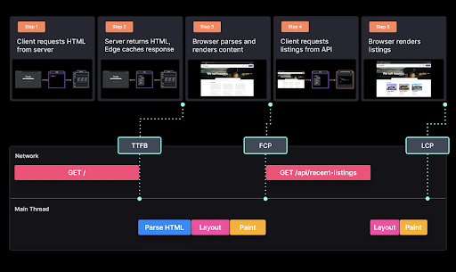

# **Kirish**

Yangi veb-ilovani arxitektura qilishni boshlaganingizda, siz qabul qilishingz kerak bo’ladigan asosiy qarorlardan biri - “Kontentni qanday va ​​qayerda renderlashim kerak bo’ladi?” savolidan iborat bo’ladi. U veb-serverda, qurish serveri (build serveri)da, Edge’da yoki to'g'ridan-to'g'ri klient tomonida render qilinishi kerakmi? Kontentni to’liq, qisman yoki bosqichma-bosqich, ya’ni progressiv tarzda, renderash kerakmi?

Bu muhim savollarga javoblar asosan foydalanish holatiga bog'liq. Eng mos keladigan renderlash patternini tanlash siz muhandislik jamoasi uchun yaratayotgan *Dasturchi bilan ishlash qulayligi (Developer Experience, DX)* va oxirgi foydalanuvchilaringiz uchun yaratayotgan *Foydalanuvchi bilan ishlash qulayligi (User Experience, UX)* sifatini tubdan yaxshilashi mumkin mumkin.

To'g'ri patternni tanlash tezroq qurish jarayoni va kam resurs sarflash evaziga mukammal yuklash tezligiga erishish imkonini beradi. Aksincha, patternni noto'g'ri tanlash ajoyib biznes g'oyasiga asoslangan ilovaning muvaffaqiyatsiz bo’lishiga olib kelishi mumkin. Shuning uchun, har qanday innovatsion g’oyangizni ishlab chiqishda juda mos bo’lgan renderlash patternidan foydalanib ilovangizni yaratayotganingizga ishonch hosil qilishingiz kerak. 

  

# **Renderlash patternlarining ahamiyati**

Ajoyib UX yaratish uchun biz odatda ilovalarimizni [Core Web Vitals (CWV)](https://web.dev/vitals/) (CWV - asosiy veb ko’rsatkichlari) kabi foydalanuvchiga yo’naltirilgan ko‘rsatkichlar uchun optimallashtirishga harakat qilamiz. CWV ko'rsatkichlari UX’ga eng ko’p ta’sir ko’rsatadigan parametrlarni o'lchaydi. CWV’ni optimallashtirish ajoyib UX’ni va ilovalarimiz uchun optimal SEO’ni ta'minlashga yordam beradi.

  

Loyiha/muhandislik jamoalarimiz uchun ajoyib DX yaratish uchun biz tezroq ilovani qurish vaqti, oson orqaga qaytarish imkoniyati (rollback), kengaytiriladigan infratuzilma va dasturchilar samaradorligini oshirishga yordam beradigan boshqa ko'plab xususiyatlarni ta'minlash orqali ishlab chiqish muhitimizni optimallashtirishimiz kerak.

  

Ushbu tamoyillar asosida ishlab chiqish muhitini sozlash bizning dasturchi jamoalarimizga sifatli dasturiy mahsulotni samarali yaratish imkonini beradi.

Kutilayotgan natijalarni umumlashtirib, ancha katta ro'yxat tuzdik. Ammo to'g'ri *renderlash patternni* tanlasangiz, bu afzalliklarning aksariyatini tayyor holda qo’lga kiritishingiz mumkin.

  

## **Pattern tanlash**

Renderlash patternlari Server tomonida renderlash (SSR) va Klient tomonida renderlash (CSR)dan tortib,  bugungi kunda turli forumlarda muhokama qilinadigan va baholanadigan murakkab patternlargacha olis yo’lni bosib o’tdi. Bu jarayon murakkab tuyulishi mumkin, lekin har bir pattern muayyan foydalanish holatlarini hal qilish uchun yaratilganligini yodda tutish lozim. Biror foydalanish holati uchun foydali bo'lgan pattern xususiyati boshqa holatda salbiy ta’sir ko’rsatishi mumkin. Shuningdek, bitta veb-saytning turli sahifalari turli xil renderlash patternlarini talab qilishi ham mumkin.

Chrome jamoasi dasturchilarga to‘liq qayta hidratsiya qilish yondashuvidan ko‘ra, statik yoki server tomonida renderlashni ko‘rib chiqishni [tavsiya etmoqda](https://web.dev/articles/rendering-on-the-web). Vaqt o'tishi bilan, progressiv tarzda yuklash va renderlash texnikasi zamonaviy freymvorkdan foydalanganda, standart holatda ishlash samaradorligi va funksionallikni yetkazib berishning optimal muvozanatiga erishishga yordam beradi.

Keyingi boblar turli xil - eski va yangi patternlarni batafsil yoritadi. Lekin, avval ularning qaysi holatlarda zo’r ishlashini tushunishingiz uchun ulardan ba'zilarini qisqacha ko’rib chiqamiz.

### **Statik Renderlash**

Statik renderlash - sahifalarni deyarli bir zumda yuklaydigan tezkor veb-saytlarni yaratish uchun ishlatiladigan oddiy, lekin kuchli va samarali pattern.

Statik renderlashda butun sahifa uchun HTML qurish (build) vaqtida generatsiya qilinadi va keyingi qurishgacha o'zgarmaydi. HTML kontenti statik va CDN yoki Edge tarmog'ida osongina keshlanadi. CDN’lar klient tomonida ma'lum bir sahifani olish uchun so’rov yuborganida, oldindan renderlangan keshlangan HTML’ni tezda yetkazib bera oladi. Bu odatdagi server tomonida renderlash jarayonida so'rovni qayta ishlash, HTML kontentini renderlash va so'rovga javob berish uchun ketadigan vaqtni sezilarli darajada qisqartiradi.

Yuqorida tavsiflangan jarayon tez-tez o'zgarmaydigan va qaysi tomondan (klient yoki server tomonidan) so’rov yuborilishidan qat'iy nazar, bir xil ma'lumotlarni ko'rsatadigan sahifalar uchun mos keladi. Bugungi kunda Internetda ko'plab dinamik, moslashtirilgan ma'lumotlardan foydalanilganligi sababli, bizda turli xil foydalanish holatlari uchun statik renderlashning turli xil variantlari mavjud. 

  

### **Oddiy Statik Renderlash**

Statik renderlashning ko'plab variantlari mavjud bo'lganligi sababli, keling, avvalroq muhokama qilgan asosiy texnikani *Oddiy Statik Renderlash (Plain Static Rendering)* deb ataymiz. Uni kam dinamik kontentli yoki umuman dinamik kontenti bo'lmagan sahifalar uchun ishlatishingiz mumkin.

Quyidagi ko'chmas mulk veb-sayti demosidagi sahifa har doim butun dunyo bo'ylab hamma uchun bir xil kontentni ko'rsatadi. Unda dinamik ma'lumotlar yoki personallashgan kontent mavjud emas.

Sayt ishga tushirilganda (masalan, Vercelda), tegishli HTML yaratiladi va serverdagi statik xotirada saqlanadi.

Foydalanuvchi sahifani olish uchun so’rov yuborganida, server oldindan yaratilgan HTML faylni klientga yuboradi. Yuborilgan HTML fayl foydalanuvchiga eng yaqin chekka server (edge serverda) keshlanadi. So’ng brauzer HTMLni renderlaydi va sahifani to’liq ishchi holatiga keltirish uchun hidratsiyalaydi, bu uchun JavaScript to'plam paketidan foydalanadi. 

  

Oddiy statik renderlash juda yuqori ishlash samaradorligini ta’minlaydi, chunki HTML fayli serverda oldindan mavjud bo’lgani uchun **Birinchi baytga yetish vaqti (Time to First Byte, TTFB)** ko’rsatkichi juda tez bo’ladi. Brauzer HTMLni tezda qabul qilib, uni darhol renderlay oladi, bu esa **Birinchi kontentli chizilish (First Contentful Paint, FCP)** va **Eng katta kontentli chizilish (Largest Contentful Paint, LCP)** ko’rsatkichlarining tezkorligini ta’minlaydi. Kontent statik bo'lgani uchun renderlash paytida **sahifa elementlarining siljishi (layout shift)** yuz bermaydi.

  

Shunday qilib, *Oddiy Statik Renderlash*, ayniqsa CDN orqali keshlash bilan birgalikda, foydalanish *Core Web Vitals* ko’rsatkichlarining yuqori bo’lishiga yordam beradi. Biroq, aksariyat veb-saytlarda kamida ma’lum darajada dinamik kontent yoki foydalanuvchi interaktivligi mavjud bo’ladi. 

### **Klient tomonida `fetch` bilan Statik Renderlash**

Faraz qilaylik, biz ko’chmas mulk demo saytimizni eng so'nggi e’lonlarni ro’yxat ko’rinishida ko'rsatadigan qilib takomillashtirmoqchimiz. Bu ro'yxatlarni olish uchun *ma'lumot provayderi (data provider)* foydalanishimiz kerak bo’ladi. 

  

Bunday holatda **Klient tomonida** `fetch` **bilan Statik Renderlash** usulidan foydalanishimiz mumkin. Bu pattern har bir so'rovda yangi ma'lumotlarni olish kerak bo’lgan holatlarda juda samarali ishlaydi.

  

Veb sayt uchun statik renderlashdan foydalanib, dinamik e’lonlar maʼlumotlari joylashadigan qismida **skelet (skeleton) komponenti** UI yaratishingiz mumkin. Keyin, sahifa yuklangandan so'ng, klient tomonida ma'lumotlarni (masalan, SWR kutubxonasi yordamida) yuklab olamiz.

  

CMS’dan ma'lumotlarni olish va bu ma'lumotlarni qaytarish uchun **Maxsus API route** yaratiladi.

Foydalanuvchi sahifani olish uchun so'rov yuborganida, oldindan yaratilgan HTML fayl klient tomoniga yuboriladi. Foydalanuvchi dastlab hech qanday ma'lumotsiz skelet UI’ni ko'radi. Klient tomoni *API rout*e orqali ma'lumotlarni oladi va e'lonlar ro'yxatini ko'rsatadi (hidratsiya jarayoni misolga kiritilmagan).

  

**Klient tomonida** `fetch` **bilan Statik Renderlash** usuli bizga **juda yaxshi TTFB** va **FCP** ko’rsatkichlarini taqdim qilsa-da, *LCP* ko’rsatkichi optimal bo’lmaydi, chunki "eng katta kontent" faqat *API route* orqali e’lonlar ro'yxati ma'lumotlarini olganimizdan keyingina ko'rsatilishi mumkin.

  

Bundan tashqari, agar skelet UI o’lchamlari keyinchalik renderlangan haqiqiy kontentga mos kelmasa, **sahifa elementlarining siljishi** muammosi yuzaga kelishi mumkin.

Yana bir kamchiligi shundaki, har bir sahifa so’rovi uchun *API route*’ni alohida chaqirish kerakligi tufayli **server xarajatlari oshib ketishi** mumkin.

Next.js dinamik ma’lumotlar bilan ishlashda ilovangiz ishlash samaradorligini yaxshilash uchun keyingi bo‘limlarda ko’rib chiqiladigan bir qancha yechimlarni taklif etadi.

### **`getStaticProps` bilan Statik Renderlash**

  

Bu metod sizga ilovani qurish vaqtida ma'lumotlar provayderiga murojaat qilib, ma'lumotlarni olish imkonini beradi. Agar statik sahifadagi dinamik ma'lumotlar har doim qurish vaqtida mavjud bo'lishini bilsangiz, bu yaxshi yechim bo'lishi mumkin.

  

`getStaticProps` metodi bizga serverda ma'lumotlar bilan HTML yaratish imkonini beradi. Bu klient tomonida ma'lumotlarni olish uchun *API route*’lar yaratish zaruratini yo’qotadi. Shuningdek, sahifa ma'lumotlar bilan birga render qilinganligi uchun, ma’lumotlar yuklanayotganda skelet komponentiga ham ehtiyoj qolmaydi.

Loyihani qurayotganimizda, ma'lumotlar provayderi chaqiriladi va qaytgan ma'lumotlar yaratilgan HTMLga uzatiladi.

Foydalanuvchi sahifani so’raganida, jarayon oddiy statik renderlashga o'xshaydi. So’rov natijasi keshlanadi, ekranga render qilinadi va brauzer sahifani hidratsiya qilish uchun zarur bo'lgan JavaScript to'plam paketlarini yuklaydi.

  

Klient tomoni nuqtai nazaridan, *tarmoq va asosiy thread* ishlashi oddiy statik renderlash bilan bir xil, shuning uchun biz xuddi shunday **yuqori ishlash samaradorligiga** erishamiz.

  

Biroq sayt kattalashib borgani sari, bu metoddan foyldanganda *DX* unchalik yaxshi bo'lmasligi mumkin.

Yuzlab sahifalarni statik tarzda quradigan saytlar (masalan, blog saytlari) uchun `getStaticProps` metodini qayta-qayta chaqirish **qurish vaqtining ortiqcha cho’zilishiga** olib keladi. Agar tashqi API’dan foydalanayotgan bo'lsangiz, so'rovlar limitiga yetib qolishingiz yoki **katta miqdordagi foydalanish to'loviga** duch kelishingiz mumkin.

Bu metod faqat qurish vaqtida ma'lumotlarni kam yangilash kerak bo’lgan hollardagina mos keladi. Ma'lumotlarning tez-tez yangilanishi ko'pincha saytni qayta qurish va qayta joylashtirishni talab qiladi.

### **Bosqichma-bosqich Statik Qayta Yaratish**

  

Qurish vaqti va ilgari muhokama qilingan dinamik ma'lumotlar muammolarini hal qilish uchun *Bosqichma-bosqich statik qayta yaratish (Incremental Static Regeneration, ISR)dan* foydalanishimiz mumkin.

ISR gibrid yechim hisoblanadi, chunki u faqat ayrim statik sahifalarni oldindan render qilib, qolgan dinamik sahifalarni foydalanuvchi so’rovi bo’yicha render qilish imkonini beradi. Bu qurish vaqtini qisqartiradi va ma'lum vaqt oralig'idan keyin keshni avtomatik yangilash hamda sahifani qayta yaratish imkonini beradi.

  

Aytaylik, biz avvalgi demoni takomillashtirish uchun har bir ko’chmas mulkning batafsil ma’lumotlarini ko'rsatmoqchimiz. Bu yangi sahifalarni oldindan render qilishimiz mumkin, shunda foydalanuvchi ro'yxatdagi elementni bosganida ular tezda yuklanadi.

  

Next.js `getStaticPaths` metodi yordamida dinamik yo’llarni yaratishda bizga yordam beradi. Biz Next.jsga so'rov parametri asosida qaysi sahifalarni oldindan yaratish kerakligini ko’rsatishimiz mumkin.

Keling endi demomiz uchun barcha e’lon ro'yxatlarini olib, har biri uchun sahifalarni oldindan yarataylik. E'tibor bering, agar ro’yxatda minglab e’lonlar bo'lsa, bu jarayon juda uzoq davom etadi. Bunday holda, biz Nextga faqat barcha sahifalarning bir qismini oldindan yaratishni va qolgan e’lonlar sahifalari foydalanuvchi so’rovi bo’yicha yaratilayotganda vaqtinchalik sahifa (fallback) render qilishini aytishimiz kerak bo’ladi. 

  

Oldindan render qilinadigan va so'rov bo'yicha yaratiladigan sahifalar bir xil tarzda yetkazib beriladi. Agar foydalanuvchi hali yaratilmagan sahifani so'rasa, u so’rov bo'yicha yaratiladi va Edge server tomonidan keshlanadi. Natijada, faqat birinchi foydalanuvchi oldindan render qilinmagan sahifalardan sekinroq ishlashini his qilishi mumkin. Qolgan barcha foydalanuvchilar tezkor, keshlangan natijadan foydalanadilar.

Bu oldingi metodlarning uzoq qurish vaqti muammosini hal qiladi. Lekin biz hali ham bosh sahifani har safar yangi e'lon qo'shilganda qayta joylashtirishimiz kerak bo'ladi.

  

Bosh sahifani yangilash imkoniyatini yoqish uchun, ma’lum vaqt oralig’ida keshni avtomatik ravishda yangilab, sahifani orqa fonda qayta yaratishimiz mumkin. Buning uchun qaytariladigan obyektga qayta tekshirish maydonini qo’shamiz.

Agar foydalanuvchi keshda belgilangan soniyalardan ko'proq vaqt davomida saqlanib turgan sahifani so'rasa, dastlab eski sahifani ko'radi. Shu vaqtning o’zida o'zida sahifani yangilash jarayoni boshlanadi. Sahifa orqa fonda qayta yaratilgach, kesh yangilanadi va yangi yaratilgan sahifa bilan almashtiriladi.

  

*Bosiqchma-bosqich Statik Qayta Yaratish* yordamida biz har bir necha soniyada sahifani avtomatik qayta tekshirish orqali dinamik kontentni ko’rsata olamiz.

Garchi bu avvalgisidan ancha yaxshilangan bo'lsa-da, bir nechta kamchiliklardan holi emas. Kontentimiz biz belgilagan vaqt oralig'idek tez-tez yangilanmasligi mumkin. Bu keraksiz ravishda sahifani qayta yaratishga va keshni bekor qilishga olib keladi. Har safar bu hodisa sodir bo'lganda, *serversiz (serverless)* funksiyalarimiz ishga tushadi, bu esa server xarajatlarining oshishiga olib kelishi mumkin.

### **So’rov bo’yicha Bosqichma-bosqich Statik Qayta Yaratish**

  

Yuqorida ta’kidlangan so'nggi kamchilikni hal qilish uchun bizda ***So’rov bo’yicha Bosqichma-bosqich Statik Qayta Yaratish*** mavjud. U ISR’dan foydalanish imkonini beradi, lekin qayta yaratish belgilangan vaqt oralig’ida emas, balki ma'lum hodisalar asosida amalga oshiriladi.

  

`revalidate` maydonidan foydalanish o'rniga, biz API yo’llaridagi yangi ma'lumotlar asosida qayta tekshirib ko’ramiz.

Misol uchun, ma'lumotlar provayderimizga yangi ma'lumotlar qo'shilganligini bildiruvchi *webhook* xabarini tinglab turishimiz mumkin. Qayta tekshirish metodini chaqirganimizda, ko’rsatilgan yo'ldagi sahifa avtomatik ravishda qayta yaratiladi.

Oddiy ISR bilan yangilangan sahifa faqat foydalanuvchi so'rovlarini qayta ishlagan *edge serverlarda* keshlanadi. So’rov bo'yicha ISR esa sahifani butun *edge tarmog’i* bo’ylab yangilab tarqatadi. Natijada dunyo bo'ylab foydalanuvchilar *edge keshdagi* sahifaning eng so'nggi versiyasini ko’radilar va eski kontentni ko’rmaydilar. Bundan tashqari, keraksiz yangilashlar va serversiz funksiya chaqiruvlaridan qochish orqali, oddiy ISR’ga nisbatan opersatsion xarajatlarni kamaytiramiz.

  

Shu tariqa, *So’rov bo’yicha ISR* bizga ham yuqori ishlash samaradorligi ham ajoyib DX taqdim etadi.

Umuman olganda, Statik yaratish - bu ajoyib pattern va uning turli ko’rinishlari, ayniqsa ISR, ko’plab foydalanish holatlarini qamrab olishi mumkin.

Bu bizga maqbul keladigan narxda doim onlayn bo'lgan tez va dinamik veb-saytlar yaratish imkonini beradi. Biroq, statik yondashuv eng yaxshi yechim bo'lmagan holatlar ham bor, masalan, har bir foydalanuvchi uchun alohida bo’lgan yuqori darajada dinamik, personallashgan sahifalar uchun bo’lgan holatlar. Keling, bunday holatlar uchun qaysi pattern eng ko’proq mos kelishini ko'rib chiqaylik. 

### **Server Tomonida Renderlash**

  

*Server Tomonida Renderlash (Server-Side Rendering, SSR)* yordamida har bir so'rov uchun HTML yaratiladi. Ushbu yondashuv yuqori darajada personallashgan ma'lumotlarni o'z ichiga olgan sahifalar uchun eng mos keladi. Masalan, foydalanuvchining cookie-fayliga asoslangan ma'lumotlar yoki umuman foydalanuvchi so'rovidan olinadigan har qanday ma'lumotlar uchun. Shuningdek, u autentifikatsiya holati asosida bloklash kerak bo'lgan (render-blocking) sahifalar uchun ham mos keladi. 

  

Shaxsiy boshqaruv paneli sahifadagi yuqori darajada dinamik kontentga ajoyib namuna bo’la oladi. Kontentning aksariyat qismi foydalanuvchi identifikatori yoki foydalanuvchi cookie-faylida saqlanishi mumkin bo'lgan avtorizatsiya darajasiga asoslanadi. Bu boshqaruv paneli faqat foydalanuvchi autentifikatsiya orqali tizimga kirganda ko’rinadi va boshqalarga ko’rsatilmasligi kerak bo'lgan foydalanuvchiga xos maxfiy ma'lumotlarni aks ettirishi mumkin.

  

Next.js bizga `getServerSideProps` metodi yordamida sahifani server tomonida renderlash imkonini beradi. Ushbu metod har bir so'rov uchun serverda ishga tushadi va natijada yaratilgan ma’lumotlarni HTMLni generatsiya qilish uchun sahifaga uzatadi.

Foydalanuvchi sahifani olish uchun so’rov yuborganda, `getServerSideProps` metodi ishga tushadi, sahifani yaratish uchun kerakli ma'lumotlarni qaytaradi va javob natijasini klient tomoniga yuboradi. Keyin klient tomonida ushbu HTML render qilinadi va elementlarni hidratsiya qilish uchun JavaScript to'plam paketini yuklash uchun qo’shimcha so'rov yuborishi mumkin.

Yaratilgan HTML kontenti har bir so’rov uchun noyob bo’lib, CDN tomonidan keshlanmasligi kerak.

  

Klient tomoni uchun *tarmoq va asosiy thread* ishlashi statik va server tomonida renderlashda deyarli bir xil. FCP deyarli LCP’ga teng va sahifaning dastlabki yuklanishidan keyin dinamik kontent yuklanmaganligi sababli *sahifa elementlarining siljishi* muammosidan oson xalos bo’lishimiz mumkin.

Biroq, server tomonida renderlangan sahifalar uchun TTFB statik renderlashga qaraganda ancha uzunroq, chunki sahifa har bir so'rovda yangidan yaratiladi.

  

Server tomonida renderlash yuqori darajada personallashgan ma'lumotlarni render qilish uchun ajoyib usul bo’lsa-da, yaxshiroq UX’ga erishish va server xarajatlarini kamaytirish uchun ba'zi narsalarni hisobga olish kerak. Server xarajatlari yuqori bo'lishi mumkin, chunki har bir so'rovda serversiz funksiyalar chaqiriladi.

1. `getServerSideProps`’**ning bajarilish vaqtini optimallashtirish**. `getServerSideProps` ma'lumotlari olish uchun mavjud bo'lmaguncha sahifa yaratilishi boshlanmaydi. Shuning uchun, `getServerSideProps` metodi juda uzoq vaqt ishlamasligini ta’minlashimiz zarur.

2. **Ma'lumotlar bazalarini serversiz funksiyangiz bilan bir mintaqada joylashtiring.** Agar ma'lumotlar bazadan olinayotgan bo'lsa, ma'lumotlar bazasidan olish uchun ketadigan so’rovlar bajarilish vaqtini qisqartirishimiz kerak. So'rovlarni optimallashtirish bilan birga, ma'lumotlar bazasining joylashuvi ham muhim ahamiyat kasb etadi.

Aytaylik, serversiz funksiyangiz San-Fransiskoda boʻlsa-yu, lekin maʼlumotlar bazangiz esa Tokiyoda joylashgan bo’lsa, ulanishni o’rnatish va maʼlumotlarni olish bir muncha ko’p vaqt talab qilishi mumkin. Buning o'rniga, ma'lumotlar bazasini serversiz funksiyangiz bilan bir mintaqaga joylashtirish orqali so’rovlar tezligini oshirishingiz mumkin.

3. **So’rov javoblariga** `Cache-Control` **sarlavhalarini qo'shing**. SSR ishlash samaradorligini yaxshilashning yana bir usuli - javoblarga `Cache-Control` sarlavhalarini qo'shishdir.

4. **Server qurilmasini yangilang.** Server uskunasini yangilash individual so'rovlarni tezroq qayta ishlashga va tezkor javob olish imkonini beradi.

Vercel sahifalaringizni server tomonida renderlash uchun serversiz funksiyalardan foydalanadi.

  

Serversiz funksiyalar juda ko'p afzalliklarga ega bo'lsa-da, masalan, faqat ishlatgan resurslarga haq to'lash, ularda cheklovlar mavjud. lambdani ishga tushirish uchun ketadigan vaqt (long cold boot) serversiz funksiyalarda uchraydigan keng tarqalgan muammo hisoblanadi. Bundan tashqari, ma'lumotlar bazalariga ulanish sekin kechishi mumkin. Shuningdek, sayyoramizning bir chekkasida joylashgan serversiz funksiyani boshqa chekkasidan chaqirish tavsiya etilmaydi.

### **Edge SSR + HTTP Streaming**

  

Vercel hozirda **Edge Server-Side Rendering** ustida ishlamoqda. Bu foydalanuvchilarga **barcha mintaqalardan server tomonida renderlashdan foydalanish** va **deyarli nolga teng cold boot** vaqtini ta’minlaydi. **Edge SSR**’ning yana bir afzalligi shundaki, chekka ish vaqti (edge runtime) **HTTP oqimlash (HTTP streaming)**ni qo’llab quvvatlaydi.

Serversiz funksiyalar yordamida butun sahifani server tomonida yaratib, hidratsiya boshlanishidan oldin klient tomonida butun to’plam paketi yuklanishi va tahlil qilinishini kutishimiz kerak.

*Edge SSR* texnikasi yordamida HTML dokumentining qismlari tayyor bo'lishi bilanoq ularni oqim tarzida uzatishimiz va bu komponentlarni alohida-alohida hidratsiya qilishimiz mumkin. Bu foydalanuvchilar uchun kutish vaqtini qisqartiradi, chunki ular komponentlarni birma-bir paydo bo’lishini oqim sifatida ko'rishlari mumkin.

  

**Streaming SSR** shuningdek, **React Server Komponentlarini** ham qo’llab-quvvatlaydi. **Edge SSR bilan React Server Komponentlari** birgalikda statik va server tomonida renderlashni juda ajoyib gibrid ko’rinishida yaratish imkonini beradi.

**React Server Komponentlari** React komponentlarini server tomonida qisman renderlash imkonini beradi. Bu esa klient tomonida yuklab olinishi shart bo‘lmagan katta kutubxonalarni talab qiladigan komponentlar uchun foydalidir.

  

Ko'chmas mulk veb-sayti misolimizga qaytsak, bosh sahifani yana ko’rsatib, foydalanuvchi uchun mintaqaviy e’lonlar ro'yxatini qo’shmoqchi bo’lsak, sahifaning katta qismi faqat statik ma'lumotlardan iborat bo’ladi. Faqat e’lonlar so'rov asosidagi ma'lumotlarni talab qiladi.

Butun sahifani server tomonida renderlash o'rniga, endi faqat e’lonlar ro'yxati komponentini server tomonida, qolgan qismini esa klient tomonida renderlashni tanlashimiz mumkin. Ilgari bu xususiyatni ta’minlash uchun butun sahifani server tomonida renderlashimiz kerak bo'lgan bo'lsa, endilikda *Server-Side Renderingni* dinamik afzalliklari bilan *Static Renderingning* yuqori samaradorligini birlashtira olamiz.

## **Xulosa**

  

Endi biz server tomonida kontent renderlashning ko'plab patternlari bilan tanishib chiqdik. To'liq qayta hidratsiya bilan [Client Side Rendering](https://www.patterns.dev/posts/client-side-rendering/) (CSR) hali ham dinamik veb-saytlar uchun tavsiya etiladi, ya’ni ekrandagi har bir komponent foydalanuvchi interaktivligiga qarab o'zgarishi mumkin bo’lgan holatlar uchun.

Ilova turi yoki sahifa turiga qarab, ayrim patternlar boshqalariga nisbatan maqbulroq bo’lishi mumkin. Quyidagi jadvalda turli patternlarning asosiy xususiyatlari taqqoslanadi va har biri uchun foydalanish holatlari ko'rsatilgan. 

  

[2022-yilda JavaScript veb-saytlarini yaratish patternlari](https://dev.to/this-is-learning/patterns-for-building-javascript-websites-in-2022-5a93) haqidagi quyidagi jadval ilovaning asosiy xususiyatlaridan kelib chiqqan holda boshqa nuqtai nazardan ko’rib chiqishni taklif etadi. Bu umumiy [ilova turlari](https://jasonformat.com/application-holotypes/) uchun mos pattern izlayotganlar uchun foydali bo'ladi.

  

