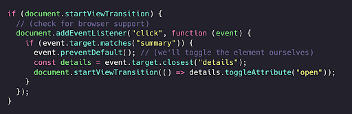
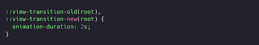
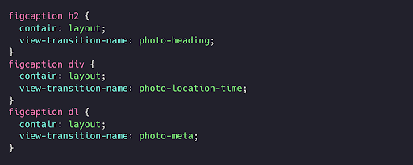
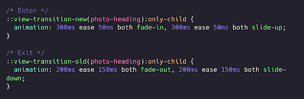
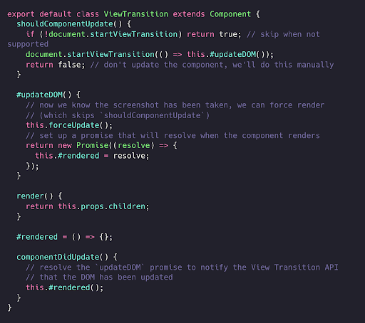
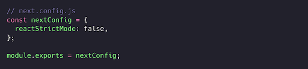
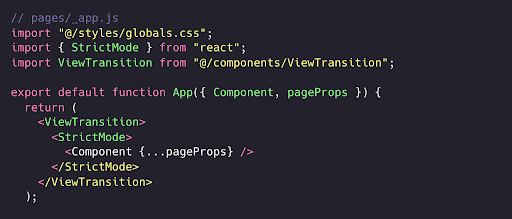
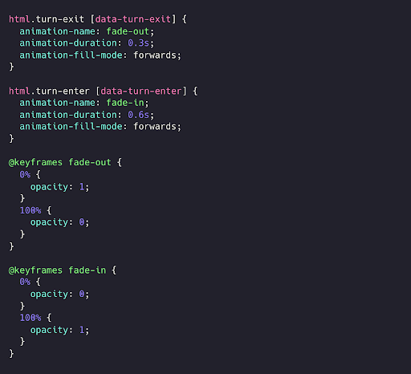

Animating View Transitions (Ko’rinishlar o’tishini animatsiyalash)

Eslatma: Bir sahifali ilovalar uchun *View Transitions API* Chrome 111+ versiyasidan boshlab mavjud

## View Transitions haqida

[*View Transitions API*](https://developer.chrome.com/docs/web-platform/view-transitions/) har qanday vizual DOM o’zgarishlarini bir holatdan ikkinchi holatga o’tkazishning sodda usulini taqdim etadi. Bu kichik o'zgarishlar bo’lishi mumkin (masalan, kontentni yashirish/ko’rsatish) yoki kattaroq o’zgarishlar (masalan, bir sahifadan boshqasiga o’tish) bo’lishi mumkin.

JavaScript API asosan `document.startViewTransition(callback)` atrofida qurilgan, bu yerda `callback` odatda DOMni boshqa holatga yangilaydigan funksiyadir.

Oddiy misol sifatida  `
` elementini ochib/yopib almashtirilishini olaylik:

  

`document.startViewTransition` callbackni chaqirishdan oldin joriy DOM holatining skrinshotini oladi. Bu misolda bizdagi callback faqat `open` atributini almashtiradi. Tugallangach, brauzer dastlabki holat skrinshoti va yangi versiya holati o'rtasida o'tishni (transition) amalga oshirishi mumkin. 

Ushbu eski va yangi holatlar psevdo elementlar sifatida taqdim etiladi va CSSda mos ravishda  `::view-transition-old(root)` va `::view-transition-new(root)` orqali murojaat qilish mumkin. Masalan, o’tishni sekinlashtirish uchun `animation-duration` (animatsiya davomiyligi)ni quyidagicha uzaytirishimiz mumkin:

  

Ko’rinish o’tishlari, shuningdek, bir nechta o'zgarishlarni standart *crossfade (kesishma yo’qolishi)* rejimidan tashqari murakkab animatsiyalar bilan jonlantirishga ham qodir. Muayyan elementlarga CSS `view-transition-name` va `layout` yoki `paint` `containment` berish, orqali API dasturchilarga elementlarning qanday o'tishini, jumladan, kengligi, balandligi va pozitsiyasi ustidan batafsil boshqarish imkonini beradi. Bu murakkab o’tishlar bir sahifadan boshqasiga o’tish jarayonini yaxshiroq tushuntirishga yordam beradi.

Misol tariqasida ushbu [fotogalereyani](https://charming-crumble-af45ba.netlify.app/) ko’raylik. Eng ko’zga tashlanadigan o’tish \- rasmning o'lchami va pozitsiyasi o’zgarishi. Bu har bir sahifadagi \<`img>` elementiga bir xil noyob `view-transition-name` va `layout`’ning `containment` qiymati berilganda avtomatik ravishda amalga oshadi. Bu demoda `view-transition-name`’lar stil atribyutlarida statik o’zgarmas qilib yozilgan, lekin ularni dinamik ravishda (masalan, `onclick` ishlov beruvchisi) ham qo'shishingiz mumkin, faqat ular sahifa uchun noyob bo’lishi va o’tish boshlanishidan oldin qo'shilgan bo’lishi kerak.

Rasm ostidagi tafsilotlar biroz ko'proq stil berishni talab qiladi. Ko’rib turganingizdek, tafsilotlarning har bir qatori uchun bosqichli *slide-in/slide-out* animatsiyasi mavjud.

Biz har bir qator elementiga o’zining `view-transition-name`’larini beramiz:

  

Bu har bir hudud uchun *o’tish guruhlari (transition groups)ni* yaratadi, ular xuddi yuqorida aytib o'tilgan yangi/eski skrinshotlar kabi, lekin butun dokumentni o’rniga faqat sahifaning bir qismini qamrab oladi. Dokumentning barcha o'tish elementlariga `::view-transition-old(root)` va `::view-transition-new(root)` orqali murojaat qilish mumkin bo’lgani kabi, bu o'tish guruhlariga `::view-transition-old(NAME)` va `::view-transition-new(NAME)` orqali ham murojaat qilish mumkin. Tafsilotlar matni fotogalereya sahifasida mavjud emasligini unutmang, shuning uchun galereya sahifasidan foto sahifasiga o'tishda faqat `::view-transition-new(NAME)` orqali bo'ladi, :`::view-transition-old(NAME)` emas va aksincha orqaga harakat qilganda ham shunday. Demak, biz bu holatlarni `:only-child` psevdo klassi yordamida aniqlab, animatsiyani  `::view-transition-new(root)` guruhi uchun sozlashimiz mumkin:

  

Bu API asoslari. [Jeyk Archibaldning View Transitions haqidagi ajoyib maqolasi](https://developer.chrome.com/docs/web-platform/view-transitions) tafsilotlarni yaxshi yoritib bergan. Keling, to'liq sahifa navigatsiyalarini qanday o'tkazishimiz mumkinligini ko'rib chiqaylik.

## Sahifa navigatsiyalari

## Oddiy sahifa navigatsiyasi quyidagicha ko'rinishda bo’ladi:

1. Foydalanuvchi havolani bosadi  
2. Ma’lumotlar uchun so’rov yuboriladi  
3. DOM so’rov javobi bilan yangilanadi

Bu jarayonda *view transition* qo'llash uchun bir nechta jihatlarni hisobga olish kerak.

Birinchidan, ekranning muzlatilgan holatda turish vaqtini kamaytirish kerak. Yuqoridagi sekin o'tish misolidan ko'rganingizdek, *view transition* boshlangandan so'ng callback tugaguncha DOM interaktiv bo'lmaydi. Agar foydalanuvchi havolani bosganida o’tishni boshlasak, ular muzlatilgan UI bilan uzoq kutib qolishlari mumkin. Bu noqulaylikni kamaytirish uchun, ideal holatda, so'rov tugagandan keyin `document.startViewTransition` chaqirilishi maqsadga muvofiq. Shunda biz o'zgarishlarga tayyor bo’lamiz va DOM imkon qadar tezroq yangilanishi mumkin.

Ikkinchidan, DOMni yangilashdan oldin dastlabki DOM skrinshoti olinganligiga ishonch hosil qilishimiz lozim. Uchinchi tomon freymvorklarida sahifa navigatsiyalari bilan ishlashda renderlash jarayonini to'liq nazorat qila olmaymiz; javob olinganda DOM avtomatik ravishda yangilanadi. Shuning uchun bizda `document.startViewTransition`’ga berishimiz mumkin bo’lgan, DOM yangilanishini tartibli bajaradigan alohida funksiya yo'q. DOMni yangilaydigan yagona funksiyaga ega ekanligimiz haqida tasavvur hosil qilish uchun renderlashni to'xtatish, pauza qilish va davom ettirish kerak bo'lishi mumkin.

Yaxshiyamki, agar DOMni yangilash callback’imizdan promise qaytarsak, *view transition API* animatsiyani amalga oshirishdan oldin uning bajarilishini kutadi. Yuqorida aytib o'tilgan vaqtlash masalalarini hal qilish uchun ushbu xususiyatdan foydalanish imkoniga egamiz. 

## 

## React komponenti namunasi

## Yuqoridagi muammolarni hal qilish uchun React klass komponentini yaratamiz, chunki bunda funksional komponentga nisbatan jarayonni tushuntirish osonroq. Renderlashni boshqarish uchun quyidagi *hayot sikli (lifecycle)* usullaridan foydalanamiz:

* `shouldComponentUpdate`: bu yerda `false`  qiymatini qaytaramiz va *view transitionni* boshlaymiz \- bu skrinshot olish uchun vaqt beradi.  
* `forceUpdate`: skrinshot olingandan so’ng komponentni o’zimiz mustaqil qayta renderlaymiz  
* `componentDidUpdate`: *view transition* *API’ga* DOM yangilanganligi haqida xabar berish uchun

Bunda kodimiz quyidagicha ko’rinishda bo’ladi:

  

Bundan Next.js ilovasida foydalanish uchun avval ishlab chiqish muhitida Reactning qat’iy rejimi (strict mode)bu o‘chirib qo‘yamiz. Qat’iy rejim o'z tekshiruvlarini komponentni ikki marta renderlash orqali amalga oshiradi. Bu ishlab chiqish jarayonida `ViewTransition` renderlash oqimiga xalaqit beradi, shuning uchun uni global miqyosda o‘chirib,  `StrictMode` komponenti orqli bola komponentlar uchun uni qayta yoqamiz.

  

Keyin, `pages/_app.js` faylida `Component`’ni `ViewTransition` va `StrictMode` komponentlari bilan o‘rab olamiz, shunda animatsiyali o’tishlarni ko’ra boshlashimiz kerak:

  

[Next.js namoyishi](https://frolicking-dusk-29be0a.netlify.app/), biz qilgan [jonli Next.js demo](https://photography-view-transitions-nextjs.vercel.app/) va uning [manba](https://github.com/domchristie/photography-view-transitions-nextjs) kodini ko‘rishingiz mumkin.

Eslatma: React dokumentatsiyasi `shouldComponentUpdate` va `forceUpdate`’dan foydalanmaslikni maslahat beradi, ular faqat ishlash samaradorligini optimallashtirish uchun ishlatilishi kerakligini va `shouldComponentUpdate` chaqirilishi kafolatlanmasligini ta’kidlaydi. Sahifa animatsiyalari qo’shimcha yaxshilash bo'lgani uchun va bu komponent `shouldComponentUpdate` chaqirilmasa ham ishlay olishi sababli, bu cheklovga rozi bo’lishimiz mumkin.

## 

## View Transition’siz muqobil yondashuv

## Sahifa o'tishlari uchun *View Transitions API*’ning asosiy kamchiliklaridan biri shundaki, animatsiyani boshlashdan oldin unga yangi sahifaning HTML’i kerak bo'ladi. Bu biroz vaqt talab qilishi mumkin va foydalanuvchi havolani bosgandan keyin hech qanday vizual javob ololmasdan qoladi. Yuklanish indikatori bu bo'shliqni to'ldirishi mumkin, ammo foydalanuvchi havolani bosishi bilan elementlarni animatsiya qilish orqali biroz vaqt yutishimiz mumkin, keyin esa yangi HTML kelganida uni animatsiya bilan jonlantiramiz. Bu standart iOS navigatsiyasiga o’xshaydi \- keyingi ekran yuklanayotganda ham darhol siljish animatsiyasi boshlanadi.

1. Foydalanuvchi havolani bosadi  
2. Elementlar animatsiya bilan yo’qoladi; shu vaqtda ma’lumotlar uchun so’rov yuboriladi  
3. Ham javob, ham animatsiyalar tugashini kutiladi  
4. Javob animatsiya bilan ko’rsatiladi

Ushbu yondashuv bilan *View Transitions API* oʻrtasidagi asosiy farq shundaki, u elementlarni bir holatdan ikkinchisiga o’tkaza olmaydi, chunki animatsiya boshlanganda yangi HTML hali mavjud bo’lmaydi.

Har ikkala yondashuv ham vaziyatga qarab foydali bo’lishi mumkin. Misol uchun, agar bir sahifadan ikkinchisiga o’tishda umumiy elementlar ko’p bo'lsa, *view transition* ishlatish ma’qul, agar o'zgarish katta bo’lib, umumiy elementlar kam bo'lsa, chiqish animatsiyasining tezkor vizual javobi foydali bo’lishi mumkin.

Buni amalga oshirish uchun biz foydalanayotgan freymvork yoki kutubxonaga bog'liq bo'lgan yo’naltirish hodisalari (routing events)ga ulanishimiz kerak. Ayniqsa, foydalanuvchi navigatsiya qilganda bizga xabar berilishi kerak. Next.js’da chiqish animatsiyalarini boshlash uchun [`routeChangeStart` yo’naltirish hodisasidan](https://nextjs.org/docs/pages/api-reference/functions/use-router#routerevents) foydalanishimiz mumkin, lekin keling, bunga Next.js, React yoki toʻliq klient tomonidan renderlangan HTMLsiz qanday erishish mumkinligini koʻrib chiqaylik.

## Turbo va Turn bilan server tomonida renderlangan ko'p sahifali ilovalarni animatsiyalash

Eslatma: *View Transition API’ni* ko'p sahifali navigatsiyalar uchun, ya'ni JavaScriptsiz ham, ishlashi rejalashtirilmoqda. Biroq, yanada takomillashgan murakkab o’tishlar uchun JavaScript API hali ham kerak bo'lishi mumkin.

[Hotwire](https://hotwired.dev/) kutubxonalar to'plamining bir qismi bo'lgan [Turbo](https://turbo.hotwired.dev/) ([Vercelning Turbosi](https://turbo.build/) bilan adashtirmaslik kerak) ko'p sahifali ilovalarni (MPA) progressiv tarzda yaxshilaydigan renderlash usulini taklif qiladi. U kodingizni to’liq klient tomonida renderlangan ilova sifatida yaratmasdan SPA tezligiga erishishni maqsad qiladi. Bunga havolalarni bosish va forma yuborishlarini ushlab qolish, JavaScript bilan so’rovni bajarish va `<body>` ni javobdan olingan yangi `<body>` bilan almashtirish orqali erishadi. Bu gibrid yondashuv: HTML server tomonida yaratiladi, ammo DOM JavaScript orqali yangilanadi.

[Turn](https://github.com/domchristie/turn) \- bu Turbo yordamida sahifa navigatsiyalarini animatsiyalash uchun kutubxona. U ikkala animatsiya yondashuvini ham qo'llab-quvvatlaydi (hozirda *view transitionlar* eksperimental bo'lsa ham). Turn tegishli vaqtlarda `<html>` elementiga `turn-before-exit`, `turn-exit` va `turn-enter` klasslarini qo’shadi, bu esa dasturchilarga animatsiyalarni sozlash imkonini beradi.

Uni ishga tushirish uchun animatsiya qilmoqchi bo'lgan elementlarga `data-turn-exit` va `data-turn-enter` atributlarini qo'shing, so'ngra CSS stillaringizni qo'llang. Masalan, asta-sekin paydo bo’lish/yo’qolish (fade-in/fade out) uchun:

  

Keyin `Turn` kutubxonasini ilovangizning JavaScript fayliga import qiling va `Turn.start()`’ni chaqiring.

U Turboning renderlash hodisalariga ulanib, oqimni kerakli tarzda boshqarish orqali ishlaydi:

1. `turbo:visit`: so’rov boshlanishidan oldin `turn-exit` klassini qo’shadi  
2. `turbo:before-render`: so’rov tugagandan keyin, lekin yangi HTML renderlashdan oldin  (Reactdagi `shouldComponentUpdate`’ga o’xshash), chiqish animatsiyalarini tugashini kutish uchun renderlashni to’xtatib turadi  
3. `turbo-render`: yangi HTML renderlangandan keyin, `turn-exit` klassini olib tashlab, `turn-enter` klassini qo’shadi  
4. chiqish animatsiyalari tugallangach, `turn-enter` klassini olib tashlaydi.

Turn shuningdek *view transitionlar* uchun eksperimental qo’llab-quvvatlashga ega, uni `Turn.config.experimental.viewTransitions = true`’ni o'rnatish orqali yoqish mumkin. Bu qo'llab-quvvatlanadigan joylarda *view transitionlardan* foydalanadi hamda CSS animatsiya usulini zaxira sifatida ishlatadi. (Yondashuvni har bir holat uchun alohida tanlash imkoniyatini o'rganish hali davom etmoqda :)

## Xulosa

Sahifa o’tishlari bir sahifadan ikkinchisiga o’tish jarayonini ko’rsatishning ajoyib usuli bo'lishi mumkin. Yangi ichki o'rnatilgan *View Transitions API* eski va yangi holatlar mavjud bo’lganda murakkab o'tishlarni amalga oshira oladi. Freymvork hodisalariga ulanish orqali biz ushbu holat o'zgarishlarini API bilan bog'lashimiz mumkin. Sahifa navigatsiyalari uchun, DOM nofaol holatda qolishiga yo'l qo'ymaslik uchun, o’tishlar so’rov tugagandan so'ng amalga oshirilishi maqsadga muvofiqdir.

Muqobil (yoki qo'shimcha) yondashuv \- foydalanuvchi havolani bosgandan so'ng darhol chiqish animatsiyalarini boshlasdir. Buning afzalligi shundaki, yangi HTML kelguncha so’rov bajaralishi uchun vaqtdan yutiladi.

