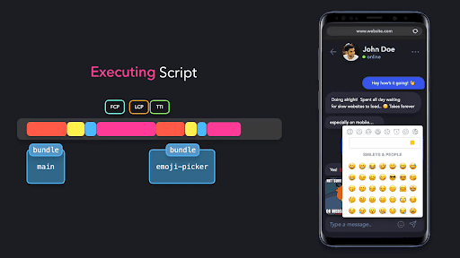

# **Bundle Splitting (To’plam paketini ajratish)**

Zamonaviy web ilovani yaratishda [Webpack](https://webpack.js.org/) yoki [Rollup](https://rollupjs.org/guide/en/) kabi *to'plash vositalari (bundlers)* ilovaning manba kodini olib, ularni bir yoki bir nechta to'plamlarga birlashtiradi. Foydalanuvchi veb-saytga kirganida, ma'lumotlarni foydalanuvchi ekraniga ko'rsatish uchun bu to’plam paketi so'raladi va yuklanadi.

[V8](https://v8.dev/docs) kabi JavaScript dvigatellari foydalanuvchi so’ragan ma’lumotlarni yuklash jarayonida tahlil qilish va kompilyatsiya qilish imkoniyatiga ega. Zamonaviy brauzerlar kodni imkon qadar tez va samarali tarzda tahlil qilish va kompilyatsiya qilishga moslashgan bo'lsa-da, dasturchining o’zi ham jarayonning ikki bosqichini: yuklash vaqti va so'ralgan ma'lumotlarni bajarish vaqtini optimallashtirishga mas'uldir. Asosiy thread’ni bloklashning oldini olish uchun bajarish vaqtini iloji boricha qisqa qilayotganimizga ishonch hosil qilishimiz kerak. 

Zamonaviy brauzerlar to'plam paketini kelishi bilanoq uni oqim (stream) tarzida uzatish imkoniyatiga ega bo'lsa-da, foydalanuvchi qurilmasida birinchi piksel chizilgunga qadar sezilarli vaqt o’tishi mumkin. To'plam paketi qanchalik katta bo'lsa, dvigatel birinchi renderlash chaqiruvi yozilgan qatorga yetib borguncha shuncha ko'p vaqt ketadi. Bu vaqt mobaynida foydalanuvchi bo'sh qarab turishi kerak bo’ladi, bu esa juda zerikarli va foydalanuvchi xafsalasini pir qiladigan holat bo'lishi mumkin\! 

  

Biz foydalanuvchiga ma'lumotlarni iloji boricha tezroq ko'rsatishni xohlaymiz. Kattaroq to'plam paketini yuklash, qayta ishlash va bajarish vaqtining ortishiga olib keladi. Ishni tezlashtirish uchun ushbu to'plam paketi hajmini kamaytirish ancha yaxshi yechim bo'lardi.

Keraksiz kodlarni o'z ichiga olgan bitta katta to'plam paketini so'rash o'rniga, ushbu to'plam paketini bir nechta kichikroq qismlarga bo'lishimiz mumkin\!

  

 

  

Ilovani *bundle-splitting* qilish orqali to’plam paketini yuklash, qayta ishlash va bajarish uchun ketadigan vaqtni qisqartiramiz\! Yuklash va bajarish vaqtini qisqartirish orqali foydalanuvchi ekraniga birinchi kontent chizilgunga qadar ketadigan vaqtni (FCP) va eng katta komponent ekranga chizilgunga qadar ketadigan vaqtni (LCP) kamaytirishimiz mumkin.  

Ekranimizda ma'lumotlarni ko'rish juda yaxshi, lekin hali bu yetarli emas. To'liq ishlaydigan ilova uchun foydalanuvchilar u bilan *interaktivlikka* kirisha olishini ham ta’minlashimiz kerak\! UI faqat to’plam paketi yuklangandan va bajarilgandan keyingina interaktiv bo'ladi. Barcha kontent ekranga chizilishi va interaktiv holga keltirilgunga qadar ketadigan vaqt *Interaktivlikka O’tish Vaqti (TTI)* ataladi. 

  

 

  

Kattaroq to’plam paketi doim ham uzoqroq bajarilish vaqtini anglatmaydi. Ba’zida foydalanuvchi umuman ishlatmaydigan juda ko’p kodni yuklab olishimiz mumkin\! Balki to’plam paketining ayrim qismlari faqat foydalanuvchining ma’lum harakatlari natijasida bajarilishi mumkin va bu harakat sodir bo’lishi yoki sodir bo’lmasligi ham mumkin\!

Dvigatel hali ham foydalanuvchi o'z ekranida biror narsani ko'ra olishi uchun dastlabki renderda ishlatilmaydigan kodni yuklashi, tahlil qilishi va kompilyatsiya qilishi kerak. Brauzer ushbu ikki bosqichni juda samarali bajarishi tufayli, tahlil qilish va kompilyatsiya qilish xarajatlarini inobatga olmasak ham bo’ladi, keragidan ortiqcha kattaroq to’plam paketini yuklash ilovangizning ishlash samaradorligiga o’z salbiy ta’sirini ko’rsatish mumkin. Past darajadagi qurilmalar yoki sekinroq tarmoqlardagi foydalanuvchilar to’plam paketi yuklanguncha sezilarli kechikishni his qilishadi.

  

  

  

  

Dvigatel faqat faylning oxirgi qismidan foydalansa ham, birinchi qism baribir yuklanishi va qayta ishlanishi kerak edi. Joriy navigatsiyada muhim bo'lmagan kod qismlarini dastlab so'rash o'rniga, bu kodni dastlabki sahifani render qilish uchun zarur bo'lgan koddan ajratishimiz mumkin.

  

  

Katta to’plamni ikkita kichikroq to’plamga \- `main.bundle.js` va `emoji-picker.bundle.js` ga bo’lish orqali, kichikroq hajmdagi maʼlumotlarni yuklash hisobiga dastlabki yuklash vaqtini qisqartiramiz.

  

  

Ushbu loyihada ilovamizni bir nechta kichikroq to’plam paketlariga bo'lish va resurslarni eng samarali yo’llar bilan yuklash imkonini beruvchi ba'zi metodlarni ko'rib chiqamiz.

