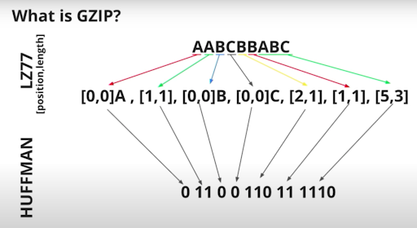
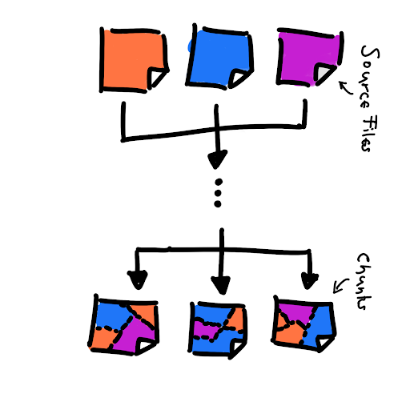

# **Compressing Javascript (Javascript kodini ixchamlash)**

*“JavaScript kodingizni ixchamlang va optimal ishlash uchun qism (chunk) o'lchamlarini kuzatib boring. JavaScript to’plam paketining haddan tashqari mayda qism bo’laklariga bo’linishi deduplikatsiya va keshlashda foydali bo’lishi mumkin, lekin 50-100 qism oralig’ida (brauzer jarayonlari, kesh tekshiruvlari va boshqalar tufayli) ixchamlash samaradorligi pasayishi va yuklash tezligiga salbiy ta’sir ko’rsatishi mumkin. Yakunida, o’zingiz uchun eng mos keladigan ixchamlash strategiyasini tanlang.”*

JavaScript [sahifa hajmiga ta’sir qiluvchi](https://almanac.httparchive.org/en/2020/page-weight#fig-2) ikkinchi eng katta omil va internetda rasmlardan keyin ikkinchi [eng ko’p so’raladigan](https://almanac.httparchive.org/en/2020/page-weight#fig-4) veb-resursdir. Veb-sayt ishlash samaradorligini yaxshilash uchun JavaScriptni uzatish, yuklash va bajarish vaqtini kamaytiradigan patternlardan foydalanamiz. Ixchamlash skriptlarni tarmoq orqali uzatish uchun zarur bo'lgan vaqtni qisqartirishga yordam beradi.

Katta hajmdagi JavaScript ta’sirini kamaytirish uchun ixchamlashni boshqa texnikalar bilan birlashtira olasiz, masalan, minifikatsiya, kodlarni bo’lish (code-splitting), to’plam paketlarini ajratish (bundling), keshlash va kerakli vaqtda yuklash (lazy-loading). Biroq, bu texnikalarning maqsadlari ba'zan bir-biriga zid bo'lishi mumkin. Ushbu bo'limda JavaScript ixchamlash texnikalari va kodni bo’lish hamda ixchamlash strategiyasini tanlashda e'tiborga olish kerak bo'lgan nozik jihatlarni ko’rib chiqamiz.

* Gzip va Brotli JavaScriptni kodini ixchamlashning eng keng tarqalgan usullari bo'lib, zamonaviy brauzerlar tomonidan keng qo'llab-quvvatlanadi.  
* Brotli bir xil ixchamlash darajasida yaxshiroq ixchamlash nisbatini taklif qiladi.  
* Next.js [standart holatda Gzip ixchamlashini](https://nextjs.org/docs/api-reference/next.config.js/compression) taʼminlaydi, lekin uni Nginx kabi HTTP proksi-serverida yoqishni tavsiya qiladi.  
* Agar siz kodingizni to’plash vositasi sifatida Webpackdan foydalanayotgan bo’lsangiz, Gzip ixchamlash uchun [Compression Plugin](https://github.com/webpack-contrib/compression-webpack-plugin) yoki Brotli ixchamlash uchun [BrotliWebpackPlugin](https://github.com/mynameiswhm/brotli-webpack-plugin)’dan foydalanishingiz mumkin.  
* Oyo kompaniyasi 15-20% va Wix esa Gzip o’rniga Brotli ixchamlashga o’tgandan soʻng fayl hajmini 21-25% ga kamaytirgan.  
* compress(a \+ b) \<= compress(a) \+ compress(b) \- ya’ni bitta katta to'plam paketi bir nechta kichik to’plam paketlariga qaraganda yaxshiroq ixchamlashadi. Bu deduplikatsiya va keshlash brauzer ishlash samaradorligi va ixchamlashish bilan ziddiyatga kiradigan muammoni keltirib chiqaradi. *Mayda bo’laklarga ajratish (Granular chunking)* bu muammoni hal qilishga yordam beradi.

## 

## HTTP ixchamlash

Ixchamlash hujjat va fayllar hajmini kamaytiradi, shuning uchun ular asl nusxalarga qaraganda diskda kamroq joy egallaydi. Kichikroq dokumentlar kamroq trafik sarflaydi va tarmoq orqali tezroq uzatilishi mumkin. *HTTP ixchamlash (HTTP compression)* veb-sayt kontentini siqish, [sahifa hajmini](https://almanac.httparchive.org/en/2020/page-weight) kamaytirish, trafik sarfini kamaytirish va ishlash samaradorligini yaxshilash uchun aynan shu oddiy konsepsiyadan foydalanadi.

HTTP ma'lumotlarini ixchamlash turli usullarda tasniflanishi mumkin. Ulardan biri \- yo’qotishli (lossy) va yo’qotishsiz (lossless) ixchamlash.

Yo’qotishli ixchamlash usulida ma’lumotlarni ixchamlash (compression) va uni qayta ochish jarayoni (decompression) natijasida dokument biroz o’zgaradi, lekin foydalanish uchun yaroqli holatda qoladi. O'zgarish odatda foydalanuvchi uchun sezilarsiz bo’ladi. Yo’qotishli ixchamlashning eng keng tarqalgan misoli \-  rasmlar uchun JPEG ixchamlashdir.

Yo’qotishsiz ixchamlash usulida esa ixchamlash va keyingi uni qayta ochishdan so'ng tiklangan ma'lumotlar asl nusxa bilan aynan bir xil bo’ladi. PNG ixchamlash rasmlarni yo’qotishsiz ixchamlashga misol bo’la oladi. Yo’qotishsiz ixchamlash tekst uzatishlar uchun muhim va HTML, CSS va JavaScript kabi tekstga asoslangan formatlarga qo'llanilishi kerak.

Brauzerda barcha Javascript kodi to’g’ri ishlashi kerak bo’lgani uchun, JavaScript kodi uchun yo’qotishsiz ixchamlash algoritmlaridan foydalanish zarur. Javascript kodini ixchamlashdan oldin, minifikatsiyalash, ya’ni kichraytirish keraksiz sintaksisni olib tashlaydi va uni faqat bajarish uchun zarur bo'lgan kodgacha qisqartirishga yordam beradi. 

## Minifikatsiya

Yuklama hajmini kamaytirish uchun Javascriptni ixchamlashdan oldin minifikatsiya, ya’ni minimallashtirishingiz mumkin. [Minifikatsiya](https://web.dev/reduce-network-payloads-using-text-compression/#minification) bo’sh joylarni va keraksiz kodlarni olib tashlash orqali ixchamlashni to’ldiradi, natijada kichikroq, lekin to’liq ishlaydigan kod fayli yaratiladi. Kodni yozishda kodning o'qilishi va qo’llab-quvvatlash imkoniyatini yaxshilash uchun qator uzilishlari, xatboshilar, bo'shliqlar, tushunarli o’zgaruvchi nomlari va izohlardan foydalanamiz. Biroq, ular umumiy JavaScript hajmini oshiradi va brauzerda ishlash uchun zarur emas. Minifikatsiya JavaScript kodini muvaffaqiyatli ishlashi uchun zarur bo'lgan minimal darajagacha qisqartiradi.

Minifikatsiya JS va CSS optimallashtirish uchun standart amaliyot hisoblanadi. JavaScript kutubxonasi dasturchilari odatda o’z fayllarining minifikatsiya qilingan versiyalarini foydalanish (production) muhiti uchun odatda *min.js* kengaytmasi bilan taqdim etadilar (masalan, `jquery.js` va `jquery.min.js`).

[HTML, CSS va JS resurslarini minifikatsiya qilish](https://developers.google.com/speed/docs/insights/MinifyResources) uchun ko’plab vositalar mavjud. [Terser](https://github.com/terser-js/terser) \- ES6+ uchun mashhur JavaScript ixchamlash vositasi, [Webpack](https://webpack.js.org/) v4 standard holatda bu kutubxona uchun minifikatsiya qilingan qurilish fayllarini yaratish uchun plaginni o‘z ichiga oladi. Shuningdek, TerserWebpackPlugin’ni Webpack’ning eski versiyalari bilan ishlatishingiz yoki Terser’ni modul to’plash vositasisiz CLI vositasi sifatida ishlatishingiz mumkin.

## Statik va dinamik ixchamlash

Minifikatsiya fayl hajmini sezilarli darajada kamaytirishga yordam bersa-da, JSni ixchamlashtirish yanada yaxshiroq natija beradi. Server tomondan ixchamlashni ikki usulda amalga oshirishingiz mumkin.

Statik ixchamlash: Resurslarni oldindan ixchamlash va ularni yaratish jarayonining bir qismi sifatida oldindan saqlash uchun statik ixchamlashdan foydalanishingiz mumkin. Kodni yuklab olish vaqtini yaxshilash uchun yuqoriroq ixchamlash darajalaridan foydalanishingiz mumkin. Yaratish vaqtining uzunligi veb-sayt ishlash samaradorligiga ta'sir qilmaydi. Kam o’zgaradigan fayllar uchun statik ixchamlashdan foydalanish tavsiya etiladi.

Dinamik ixchamlash: Ushbu jarayonda ixchamlash brauzer resurslarni so'raganda real vaqtda amalga oshiriladi. Dinamik ixchamlashni amalga oshirish osonroq, lekin pastroq ixchamlash darajalaridan foydalanishga to’g’ri keladi. Yuqori ixchamlash darajalari ko'proq vaqt talab qiladi va siz kichik kontent hajmidan olingan afzalliklarni yo'qotasiz. Tez-tez o'zgarib turadigan yoki dastur tomonidan yaratilgan kontent uchun dinamik ixchamlashdan foydalanish tavsiya etiladi.

Ilova kontent turiga qarab statik yoki dinamik ixchamlashdan foydalanishingiz mumkin. Ikkala usul ham mashhur ixchamlash algoritmlari yordamida amalga oshirilishi mumkin, lekin tavsiya etiladigan ixchamlash darajalari har bir holatda farq qiladi. Keling, buni yaxshiroq tushunish uchun ixchamlash algoritmlarini ko'rib chiqaylik.

## Ixchamlash algoritmlari

## [Gzip](https://datatracker.ietf.org/doc/html/rfc1952) va [Brotli](https://opensource.googleblog.com/2015/09/introducing-brotli-new-compression.html) bugungi kunda HTTP ma'lumotlarini ixchamlash uchun ishlatiladigan ikkita [eng keng tarqalgan](https://almanac.httparchive.org/en/2020/compression#fig-5) algoritmdir. 

### Gzip

Gzip ixchamlash formati deyarli 30 yildan beri mavjud bo'lib, [Deflate algoritmiga](https://www.youtube.com/watch?v=whGwm0Lky2s&t=851s) asoslangan yo’qotishsiz algoritmdir. Deflate algoritmining o'zi [LZ77 algoritmi](https://cs.stanford.edu/people/eroberts/courses/soco/projects/data-compression/lossless/lz77/algorithm.htm) va kirish ma'lumotlar oqimidagi ma'lumotlar bloklarida [Huffman kodlash](https://cs.stanford.edu/people/eroberts/courses/soco/projects/data-compression/lossless/huffman/algorithm.htm) kombinatsiyasidan foydalanadi.

LZ77 algoritmi takrorlanuvchi satrlarni aniqlaydi va ularni avvalgi elementga yo’naltirilgan havola bilan almashtiradi, bu avvalgi paydo bo'lgan joyga ko’rsatkich bo'lib, undan keyin satr uzunligi keladi. Keyinchalik, *Huffman kodlash* tez-tez ishlatiladigan havolalarni aniqlaydi va ularni qisqaroq bit ketma-ketligidagi havolalar bilan almashtiradi. Uzunroq bit ketma-ketliklari kamdan-kam ishlatiladigan havolalarni ifodalash uchun ishlatiladi.

  

Rasm manbaasi: [https://www.youtube.com/watch?v=whGwm0Lky2s\&t=851s](https://www.youtube.com/watch?v=whGwm0Lky2s&t=851s)

Barcha asosiy brauzerlar Gzip’ni qo'llab-quvvatlaydi. [Zopfli](https://github.com/google/zopfli) ixchamlash algoritmi kichikroq GZip’ga mos fayllarni yaratadigan Deflate/Gzip’ning sekinroq, ammo takomillashtirilgan versiyasidir. Bu statik ixchamlash uchun juda mos keladi, bu yerda u yanada muhim natijalar keltirishi mumkin.

### Brotli

2015-yilda Google [Brotli algoritmi](https://opensource.googleblog.com/2015/09/introducing-brotli-new-compression.html) va [Brotli ixchamlashgan maʼlumotlar formatini](https://datatracker.ietf.org/doc/html/rfc7932) taqdim etdi. GZip singari, [Brotli](https://github.com/google/brotli) ham LZ77 algoritmi va Huffman kodlashiga asoslangan yo’qotishsiz algoritmdir. Bundan tashqari, u shunga o'xshash tezlikda zichroq ixchamlashni olish uchun ikkinchi darajali kontekstni modellashtirishdan foydalanadi. Kontekstni modellashtirish \- bu bir blokda bir xil alifbo uchun bir nechta Huffman daraxtiga ruxsat beruvchi xususiyatdir. Brotli shuningdek, havolalar uchun [kattaroq oyna o’lchamini](https://blog.cloudflare.com/results-experimenting-brotli/) qo'llab-quvvatlaydi va statik lug'atga ega. Bu xususiyatlar ixchamlash algoritmi sifatida uning samaradorligini oshirishga yordam beradi.

Brotli bugungi kunda barcha asosiy serverlar va brauzerlar tomonidan [qo'llab-quvvatlanadi](https://caniuse.com/?search=brotli) va tobora [ommalashib bormoqda](https://almanac.httparchive.org/en/2020/compression#fig-5). Shuningdek, u [Netlify](https://www.netlify.com/blog/2020/05/20/gain-instant-performance-boosts-as-brotli-comes-to-netlify-edge/), [AWS](https://aws.amazon.com/about-aws/whats-new/2020/09/cloudfront-brotli-compression/) va [Vercel](https://vercel.com/docs/concepts/edge-network/compression) kabi hosting provayderlari va oraliq dasturiy ta’minot tomonidan qo’llab-quvvatlanadi va osonlik bilan faollashtirilishi mumkin.

[OYO](https://tech.oyorooms.com/how-brotli-compression-gave-us-37-latency-improvement-14d41e50fee4) va [Wix](https://web.dev/wix/#brotli-compression-\(vs.-gzip\)) kabi katta foydalanuvchi bazasiga ega veb-saytlar Gzip’ni Brotli bilan almashtirgandan so'ng o'z ishlash samaradorligini sezilarli darajada yaxshilashgan.

### Gzip va Brotli’ni taqqoslash

[Quyidagi jadvalda](https://paulcalvano.com/2018-07-25-brotli-compression-how-much-will-it-reduce-your-content/) Brotli va Gzip ixchamlash nisbatlari va turli ixchamlash darajalarida tezliklarning standart taqqoslash natijalari keltirilgan.

  

Bundan tashqari, quyida Chrome tadqiqotidan Gzip va Brotli yordamida JS’ni ixchamlash bo'yicha bir nechta xulosalar mavjud:

* Gzip 9 eng yaxshi ixchamlash tezligiga ega va siz uni boshqa Gzip darajalaridan oldin ishlatib ko’rishingiz kerak.  
* Brotli bilan 6-11 darajalarni ko'rib chiqing. Aks holda, biz Gzip yordamida shunga o'xshash ixchamlash tezligiga tezroq erisha olamiz.  
* Barcha o'lchamlar oralig'ida Brotli 9-11 Gzip’ga qaraganda ancha yaxshi ishlaydi, lekin juda sekin.  
* To’plam paketi qanchalik katta bo'lsa, ixchamlash darajasi va tezligi shunchalik yaxshi bo'ladi.  
* Algoritmlar o'rtasidagi munosabatlar barcha to’plam o'lchamlari uchun o'xshash (masalan, Brotli 7 har bir to’plam paketi o'lchami uchun Gzip 9 dan yaxshiroq va Gzip 9 barcha o'lcham oraliqlarida Brotli 5 dan tezroq).

Keling, serverlar va brauzerlar o'rtasida tanlangan ixchamlash formati haqidagi aloqani ko'rib chiqaylik.

### Ixchamlashni joriy etish

Yaratish jarayonining bir qismi sifatida statik ixchamlashni yoqishingiz mumkin. Agar siz kodingizni birlashtirish uchun Webpackdan foydalansangiz, Gzip ixchamlash uchun [CompressionPlugin](https://github.com/webpack-contrib/compression-webpack-plugin) yoki Brotli ixchamlash uchun [BrotliWebpackPlugin](https://github.com/mynameiswhm/brotli-webpack-plugin)’dan foydalanishingiz mumkin. Plaginni Webpack konfiguratsiya fayliga quyidagicha qo’shish mumkin:

  

Next.js [standart holatda Gzip ixchamlashni](https://nextjs.org/docs/api-reference/next.config.js/compression) taqdim etadi, lekin uni Nginx kabi HTTP proksi-serverlarida yoqishni tavsiya qiladi. Vercel platformasida esa ham Gzip, ham Brotli proksi darajasida qo'llab-quvvatlanadi.

Turli xil ixchamlash algoritmlarini qo'llab-quvvatlaydigan serverlarda (jumladan, Node.js) dinamik yo’qotishsiz ixchamlashni ham yoqishingiz mumkin. Brauzer o'zi qo'llab-quvvatlaydigan ixchamlash algoritmlarini so’rovdagi [Accept-Encoding](https://developer.mozilla.org/docs/Web/HTTP/Headers/Accept-Encoding) HTTP sarlavhasi orqali serverga xabar qiladi. Masalan, `Accept-Encoding: gzip, br`.

Bu brauzer ham Gzip, ham Brotli ixchamlash usullarini qo'llab-quvvatlashini bildiradi. Server turidan kelib chiqib, tegishli yo’riqnomalar asosida turli ixchamlash usullarini yoqishingiz mumkin. Masalan, Apache serverida Brotli’ni yoqish bo'yicha ko'rsatmalarni [bu yerdan](https://httpd.apache.org/docs/2.4/mod/mod_brotli.html#enable) topishingiz mumkin. [Express](https://expressjs.com/) \- bu Node uchun mashhur veb freymvork bo'lib, [ixchamlash](https://github.com/expressjs/compression) uchun oraliq dasturiy ta’minot kutubxonasini taqdim etadi. Bu kutubxona yordamida har qanday so'ralgan resursni avtomatik ravishda ixchamlash mumkin.

Brotli kichikroq fayl hamlarini ta’minlagani uchun boshqa ixchamlash algoritmlariga nisbatan afzalroq hisoblanadi. Brotli’ni qo'llab-quvvatlamaydigan brauzerlar uchun esa Gzip’ni zaxira variant sifatida yoqib qo’yish mumkin. Agar sozlamalar to’g’ri bajarilgan bo'lsa, server javobda qo’llanilgan ixchamlash algoritmini ko'rsatish uchun [Content-Encoding](https://developer.mozilla.org/docs/Web/HTTP/Headers/Content-Encoding) HTTP sarlavhasi orqali bildiradi. Masalan, `Content-Encoding: br`.

### Ixchamlash samaradorligini tekshirish

Yuklab olingan skriptlar yoki tekstlar server tomonidan ixchamlanganini Chrome brauzerining Devtools asboblar panelida tekshirish mumkin. Buning uchun DevTools \-\> network bo’limiga o’tib, Headers qismini ko’rish kerak. Bu yerda server javobida qo’llanilgan kontent-kodlash usuli ko'rsatiladi (quyidagi rasmdagi kabi).

  

Lighthouse hisoboti “*Tekst ixchamlashini yoqish” (Enable Text Compression)* deb nomlangan samaradorlik tekshiruvini o'z ichiga oladi. Bu tekshiruv tekst turdagi tekshiruvlar "br", "gzip" yoki "deflate" kontent-kodlash sarlavhalari bilan kelmaganligini aniqlaydi. Lighthouse resursni ixchamlash orqali erishish mumkin bo’lgan potensial tejamkorlikni hisoblash uchun Gzip’dan foydalanadi.

  

Rasm manbaasi: [https://web.dev/uses-text-compression/\#how-to-enable-text-compression-on-your-server](https://web.dev/uses-text-compression/#how-to-enable-text-compression-on-your-server)

## Javascript ixchamlash va yuklashning mayda detalliligi 

JavaScript ixchamlashning ta'sirini to'liq tushunish uchun JavaScript optimallashtirishning boshqa jihatlarini ham hisobga olish kerak, masalan, [route-based splitting](https://www.patterns.dev/posts/route-based/), [code-splitting](https://webpack.js.org/guides/code-splitting/) va [bundling](https://www.patterns.dev/posts/bundle-splitting/).

Katta hajmdagi JavaScript kodidan foydalanadigan zamonaviy veb-ilovalar kodni samarali yuklash uchun ko'pincha turli xil *code-splitting* va *bundling* usullaridan foydalanadi. Ilovalar kodni ajratish uchun mantiqiy chegaralardan foydalanadi, masalan, bir sahifali ilovalar uchun yo’nalish darajasidagi ajratish yoki interaktivlik yoki ko’rish maydoni ko’rinishiga qarab JavaScriptni bosqichma-bosqich yuklash. Ushbu chegaralarni aniqlash uchun to’plash vositlarini maxsus tarzda sozlash mumkin.

Keling, bu ixchamlashga qanday ta'sir qilishini ko’rib chiqishdan oldin, *code-splitting* va *bundling* bilan bog'liq ba'zi asosiy tushunchalarni ko'rib chiqaylik.

### Kodlarni birlashtirish terminologiyasi

Quyida muhokamamiz uchun muhim bo’lgan  asosiy atamalarni ko’rib chiqamiz. 

1. Modul: Aniq chegaralangan funksional birlik bo’lib, mustahkam abstraksiya va inkapsulyatsiyani ta'minlash uchun mo'ljallangan. Batafsil ma'lumot uchun [Module pattern](https://www.patterns.dev/posts/module-pattern/) mavzusiga qarang.   
2. To’plam paketi (Bundle): Manba fayllarning yakuniy versiyalarini o'z ichiga olgan, to’plash vositasida yuklash va kompilyatsiya qilish jarayonidan o'tgan alohida modullar guruhi.  
3. To’plam paketini ajratish (Bundle splitting): dasturni bir nechta to'plamlarga bo'lish uchun to’plash vositasi tomonidan qo'llaniladigan jarayon, bunda har bir to'plam alohida ajratilishi, nashr qilinishi, yuklab olinishi yoki keshlanishi mumkin.  
4. Bo’lak (Chunk): Webpack terminologiyasidan olingan atama bo’lib, bu *bundling* va *code-splitting* jarayonining yakuniy natijasi hisoblanadi. Webpack to’plam paketlarni [kirish](https://webpack.js.org/configuration/entry-context/) sozlamalari, [SplitChunksPlugin](https://webpack.js.org/plugins/split-chunks-plugin/) yoki [dinamik importlar](https://webpack.js.org/plugins/split-chunks-plugin/) asosida bo'laklarga ajratishi mumkin.

Agar modullar manba fayllarida joylashgan bo'lsa, kod yoki to’plam paketni ajratishdan keyingi qurish jarayonining yakuniy natijasi bo’lak deb nomlanadi. Shuni yodda tuting, manba fayllari ham, bo’laklar ham bir-biriga bog'liq bo'lishi mumkin.

  

Rasm manbaasi: [https://www.youtube.com/watch?v=ImjzA7EMI6I\&list=PLyspMSh4XhLP-mqulUMcaqTbLo-ZJxSX5\&index=29](https://www.youtube.com/watch?v=ImjzA7EMI6I&list=PLyspMSh4XhLP-mqulUMcaqTbLo-ZJxSX5&index=29)

JavaScript uchun chiquvchi hajm deganda JavaScript to’plash vositasi yoki kompilyator tomonidan optimallashtirish jarayonidan keyin bo’laklarning hajmi yoki xom o’lchami tushuniladi. Katta Javascript ilovalarini mustaqil ravishda yuklanadigan JavaScript fayllari bo'laklariga ajratish mumkin. Yuklashning mayda detalliligi (Loading granularity) chiqish bo’laklari sonini bildiradi \- bo’laklar soni qanchalik ko'p bo'lsa, har bir bo’lakning hajmi shunchalik kichik va mayda detallilik darajasi yuqori bo'ladi.

Ba'zi bo’laklar boshqalariga qaraganda muhimroqdir, chunki ular tez-tez yuklanadi yoki muhimroq kod yo'llarining bir qismi hisoblanadi (masalan, "to’lov" vidjetini yuklash). Qaysi bo’laklar eng muhim ekanligini bilish ilova haqida chuqur bilimni talab qiladi, ammo "asosiy" bo’lak har doim muhim deb hisoblash mumkin.

Sahifa uchun zarur bo'lgan har bir bayt foydalanuvchi qurilmalari tomonidan yuklab olinishi tahlil qilinishi/bajarilishi kerak. Bu kod ilovaning ishlash samaradorligiga [bevosita ta'sir qiladi](https://v8.dev/blog/cost-of-javascript-2019). Bo’laklar oxir-oqibat yuklab olinadigan kod bo'lgani uchun, ularni ixchamlash yuklash tezligini oshirishi mumkin.

Ushbu g’oyadan kelib chiqib, keling, yuklashning mayda detallilik darajasi va ixchamlash o'rtasidagi o'zaro bog'liqlikni muhokama qilaylik.

### Mayda detallilik muammosi

Ideal dunyoda mayda detallilik va bo’laklash strategiyasi bir-biriga qarama-qarshi bo'lgan quyidagi maqsadlarga erishishga qaratilgan bo'lishi kerak.

1\. Yuklab olish tezligini yaxshilash: Avvalgi bo'limlarda ko’rganimizdek, yuklab olish tezligini ixchamlash yordamida yaxshilash mumkin. Biroq, bitta katta bo’lakni ixchamlash, xuddi shu kodni bir nechta kichik bo'laklarga bo’lib ixchamlashdan ko'ra yaxshiroq natija beradi va kichikroq fayl hajmini ta’minlaydi.

`compress(a + b) <= compress(a) + compress(b)`

*“Cheklangan mahalliy ma’lumotlar kichikroq bo’laklar uchun 5% dan 10% gacha yo’qotishni ko’rsatadi. Bo’laklarga ajratilmagan holatda hajmi 20% ga ​​o'sishini ko'rsatadi. Kattaroq qismlar holatida har bir bo’lingan qismga qo’shimcha IPC (Inter-Process Communication), I/O (Input/ Output) va qayta ishlash xarajatlari qo’shiladi. V8 dvigatelida 30K ma’lumotlarni oqimlash/tahlil qilish chegarasi mavjud. Bu shuni anglatadiki, 30K dan kichik bo'lgan barcha bo’laklar muhim bo'lmasa ham, muhim yuklash yo'lida tahlil qilinadi.”*

*“Yuqoridagi sabablarga ko'ra, yuklab olish va brauzer ishlashini optimallashtirish uchun bir xil kod uchun katta bo’laklar kichikroq bo’laklarga nisbatan samaraliroq bo'lishi mumkin.”*

2\. Kesh samaradorligini oshirish: Kichikroq o’lchamli bo’laklar bilan ishlash, ayniqsa Javascript kodini bosqichma-bosqich yuklaydigan zamonaviy ilovalar uchun, kesh samaradorligini sezilarli darajada oshiradi.

\- Kichik bo'laklar bilan ishlashda o’zgarishlar cheklangan miqdordagi bo’laklarga ta’sir qiladi. Kod o'zgartirilganda, faqat ta'sirlangan bo’laklarni qayta yuklab olish kifoya qiladi va bu o’zgarishlar odatda kichik hajmni tashkil qiladi. Qolgan bo'laklar keshda topiladi, bu esa keshga murojaat qilishlar sonini oshiradi.

\- Kattaroq bo'laklar bilan ishlashda esa, kod o’zgartirilganda katta hajmdagi kod ta'sirlanadi va uni keyin qayta yuklab olishga to’g’ri keladi. 

Shu sababli, keshlash mexanizmidan samarali foydalanish uchun kichikroq bo'laklar bilan ishlash maqsadga muvofiqdir.

3\. Tez bajarish: Kod tez bajarilishi uchun quyidagi shartlar bajarilishi zarur.

\- Barcha kerakli qaramliklar darhol mavjud bo’lishi kerak \- ular birgalikda yuklab olinishi yoki keshda mavjud bo’lishi lozim. Bu barcha bog’liq kodlarni yirikroq bo'lakka birlashtirishingiz kerakligini anglatadi.

\- Faqat sahifa/yo’nalish uchun zarur bo'lgan kod bajarilishi kerak. Bu ortiqcha kod yuklab olinmasligi yoki bajarilmasligini ta’minlaydi. `commons` bo’lagi aksariyat sahifalar uchun kerak bo’lgan, lekin barcha sahifalar uchun zarur bo’lmagan qaramliklarni o’z ichiga olishi mumkin. Kod takrorlanishi oldini olish uchun kichikroq mustaqil bo'laklar kerak bo'ladi.

\- Asosiy thread’dagi uzoq davom etadigan vazifalar uni uzoq vaqt bloklashi mumkin. Shuning uchun bunday vazifalarni kichikroq bo'laklarga ajratish lozim. 

  

Rasm manbaasi: [https://www.youtube.com/watch?v=ImjzA7EMI6I\&list=PLyspMSh4XhLP-mqulUMcaqTbLo-ZJxSX5\&index=29](https://www.youtube.com/watch?v=ImjzA7EMI6I&list=PLyspMSh4XhLP-mqulUMcaqTbLo-ZJxSX5&index=29)

Yuqoridagi uchburchakda ko'rsatilganidek, bu maqsadlardan birini optimallashtirishga urinish, boshqa maqsadlardan uzoqlashishga olib keladi. Bu mayda detallilik muammosining asosiy mohiyatidir.

Kod takrorlanishini oldini olish va keshlash mexanizmlari brauzerning ishlash samaradorligi va ixchamlanish jarayoniga ziddir.

Bu murakkab muammo tufayli, bugungi kunda ko'pchilik foydalanish ilovalari bo'laklarining maksimal soni taxminan 10 tani tashkil qiladi. Katta hajmdagi JavaScript kodiga ega zamonaviy ilovalar uchun yanada samarali keshlash va kod takrorlanishini oldini olish ta’minlash maqsadida, bu chegarani oshirish zaruriyati mavjud.

### `SplitChunksPlugin` va mayda bo’laklash

Mayda detallilik muammosining potensial yechimi quyidagi talablarga javob berishi kerak.

1. Ishlash samaradorligiga ta’sir qilmagan holda, yaxshiroq keshlash va kod takrorlanishini oldini olish uchun kichikroq hajmli ko’proq bo'laklar (40 dan 100 gacha) yaratishga imkon berish.  
2. Ko’p sonli skript teglari uchun jarayonlararo aloqa (IPC), kiritish/chiqarish (I/O) va qayta ishlash xarajatlari tufayli paydo bo’ladigan qo’shimcha yukni hal qilish.  
3. Ko’p sonli kichik bo'laklar holatida ixshamlash samaradorligining pasayishini bartaraf etish.

Ushbu talablarga javob beradigan potensial yechim hali ishlab chiqilmoqda. Biroq, Webpack v4-ning [SplitChunksPlugin](https://webpack.js.org/plugins/split-chunks-plugin/) va mayda bo’laklash strategiyasi yuklashning mayda detalliligini ma'lum darajada oshirishga yordam beradi.

Webpack’ning oldingi versiyalari umumiy qaramliklar yoki umumlashgan modullarni bitta bo'lakka birlashtirish uchun `CommonsChunkPlugin`’dan foydalangan. Bu umumiy modullardan foydalanmaydigan sahifalar uchun yuklab olish va bajarish vaqtlarining keraksiz ortishiga olib kelishi mumkin edi. Bunday sahifalar uchun yaxshiroq optimallashtirish imkonini berish maqsadida, Webpack v4-da `SplitChunkPlugin` joriy etildi. Turli yo’nalishlar bo'ylab takroriy kodlarni yuklab olishni oldini olish uchun, bir nechta bo’lingan bo'laklar standart sozlamalar yoki konfiguratsiya asosida yaratiladi.

Next.js `SplitChunkPlugin` plaginni qo’lladi va mayda detallilik muammosini hal qiluvchi Webpack bo’laklarini yaratish uchun quyidagi [Granular Chunking](https://web.dev/granular-chunking-nextjs/) strategiyasini amalga oshirdi.

* Har qanday yetarlicha katta (160 KB dan ortiq) uchinchi tomon moduli alohida bo'laklarga bo'linadi.  
* Freymvork qaramliklari uchun alohida bo’lak yaratiladi (react, react-dom va hokazo).  
* Kerakli miqdorda (25 tagacha) umumiy bo’laklar yaratiladi.   
* Yaratiladigan bo’lakning minimal hajmi 20 KB ga o'zgartirildi.

Bitta bo’lak o’rniga bir nechta umumiy bo’laklarni yaratish turli sahifalarda yuklab olinadigan yoki bajariladigan keraksiz (yoki takroriy) kod miqdorini kamaytiradi. Katta uchinchi tomon kutubxonalari uchun mustaqil bo’laklar yaratish keshlash samaradorligini oshiradi, chunki ular tez-tez o'zgarib turmaydi. 20 kB minimal bo'lak hajmi ixchamlash yo’qotishlari imkon qadar past bo'lishini ta'minlaydi.

Mayda bo’laklash strategiyasi bir nechta Next JS ilovalariga sayt tomonidan ishlatiladigan umumiy JavaScript hajmini kamaytirishga imkon berdi.

  

Mayda bo’laklash strategiyasi [Gatsby](https://github.com/gatsbyjs/gatsby/pull/22253)’da ham xuddi shunday afzalliklarga ega bo'lgan holda amalga oshirildi.

## Xulosa

Ixchamlashning bitta o'zi JavaScript ishlash samaradorligi bilan bog'liq barcha muammolarni hal qila olmaydi, lekin brauzerlar va to’plovchi vositalar(bundler)ning parda ortida qanday ishlashini tushunish ixchamlashni yaxshiroq qo'llab-quvvatlaydigan to’plash strategiyasini yaratishga yordam beradi. Ekotizimdagi turli platformalarda yuklash mayda detalliligi muammosini hal qilish kerak. Mayda bo’laklash bu yo'nalishdagi bir qadam bo'lishi mumkin, ammo hali oldinda uzoq yo’l bor.