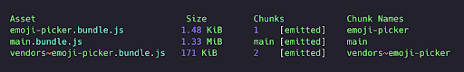
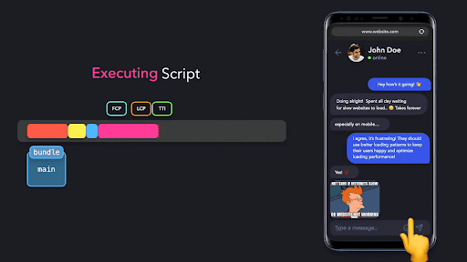
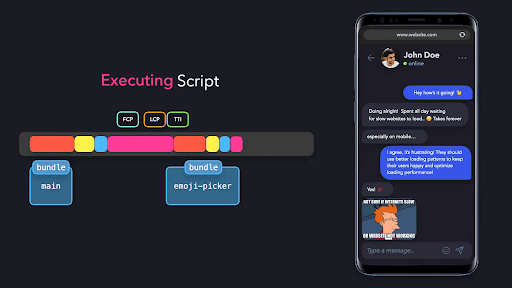
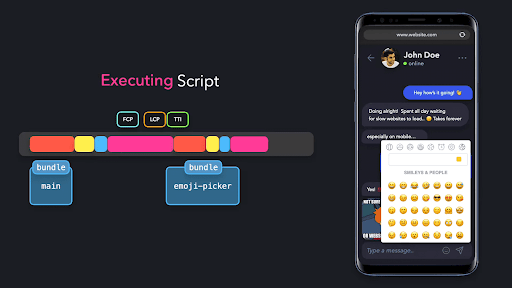
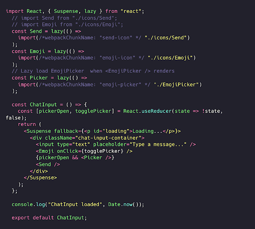
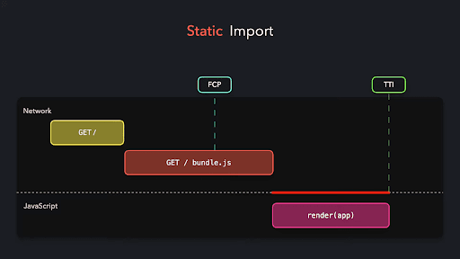
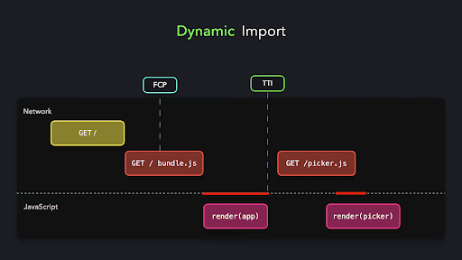
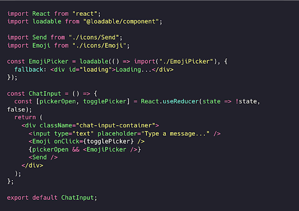
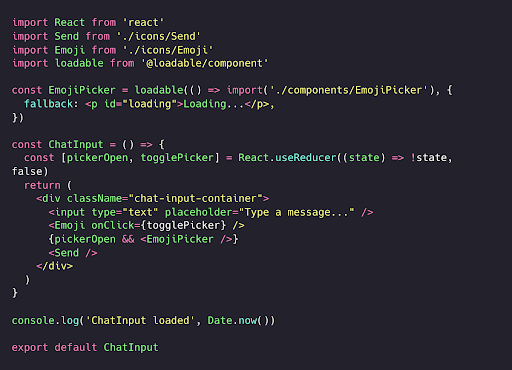

Dinamik import

Bizning chat ilovamizda to'rtta asosiy komponent mavjud: `UserInfo`, `ChatList`, `ChatInput` va `EmojiPicker`. Biroq, ushbu komponentlardan faqat uchtasi dastlabki sahifa yuklanishida darhol ishlatiladi: `UserInfo`, `ChatList` va `ChatInput`. `EmojiPicker` to'g'ridan-to'g'ri ko'rinmaydi va agar foydalanuvchi `EmojiPicker`’ni ochish uchun `Emoji` tugmasini bosmasa, umuman ko'rsatilmasligi mumkin. Bu shuni anglatadiki, biz `EmojiPicker` modulini dastlabki to'plam paketimizga keraksiz qo'shganmiz, bu esa yuklash vaqtini oshirishi mumkin\!

Buni hal qilish uchun  `EmojiPicker` komponentini *dinamik ravishda import* qilishimiz mumkin. Uni statik import qilish o'rniga, biz uni faqat  `EmojiPicker`’ni ko'rsatmoqchi bo'lganimizdagina import qilamiz. Reactda komponentlarni dinamik import qilishning oson usuli \- bu [React Suspense](https://react.dev/reference/react/Suspense)’dan foydalanishdir. `React.Suspense`  komponenti dinamik yuklanishi kerak bo’lgan komponentni qabul qiladi, bu esa `EmojiPicker` modulining importini to’xtatib turish orqali `App` komponentiga o’z kontentini tezroq ko’rsatish imkonini beradi\! Foydalanuvchi emoji ustiga bosganida, `EmojiPicker` komponenti birinchi marta render qilinadi. `EmojiPicker` komponenti kerakli vaqtda yuklash (lazy loading) texnikasi orqali import qilingan modulni (bu holatda `EmojiPicker`’ni) qabul qiluvchi `Suspense` komponentini render qiladi. `Suspense`  komponenti `fallback` props’ini qabul qiladi, u to'xtatib turilgan komponent hali yuklanayotganda render qilinishi kerak bo'lgan komponentni zahira sifatida qabul qiladi\!

`EmojiPicker`’ni dastlabki to'plam paketiga keraksiz qo'shish o'rniga, biz uni o'z to'plam paketiga ajratishimiz va dastlabki to'plam paketi hajmini kamaytirishimiz mumkin\!

Kichikroq dastlabki to'plam paket hajmi tezroq dastlabki yuklashni anglatadi: foydalanuvchi bo'sh yuklash ekraniga uzoq vaqt qarab turishi shart emas. `fallback` komponenti foydalanuvchiga bizning ilovamiz muzlab qolmaganligini bilish imkonini beradi: ular shunchaki modul qayta ishlanishi va bajarilishi uchun biroz kutishlari kerak.

  

Oldin dastlabki to‘plam paketi `1.5MiB` bo‘lgan bo‘lsa, `EmojiPicker` importini to‘xtatib turish orqali uni `1.33 MiB` gacha kamaytirishga erishdik\!

  

  

  

Konsolda siz `EmojiPicker`’ni ochmagunimizcha `EmojiPicker` bajarilmasligini ko'rishingiz mumkin\!

  

Ilovani qurish jarayonida Webpack yaratgan turli to'plam paketlarni ko'rishimiz mumkin.

`EmojiPicker` komponentini dinamik import qilish orqali dastlabki to’plam paket hajmini `1.5MiB` dan `1.33 MiB` gacha kamaytirishga erishdik\! Garchi foydalanuvchi `EmojiPicker` to’liq yuklanguncha biroz kutishi kerak bo’lsa-da, komponent yuklanayotganda ilova render qilingan va interaktiv bo’lishini ta’minlab, foydalanuvchi bilan ishlash qulayligini yaxshiladik.

  

  

## 

## Yuklanadigan komponentlar (Loadable Components)

## Server tomonida renderlash texnikasi React Suspense’ni (hozir, kitobni yozish vaqtida) qo'llab-quvvatlamaydi. React Suspense uchun  yaxshi muqobil variant \- bu SSR ilovalarda ishlatish mumkin bo'lgan [`loadable-components`](https://loadable-components.com/docs/getting-started/), ya’ni yuklanadigan komponentlar kutubxonasidir.

  

React Suspense kabi, *lazy loading* orqali import qilingan modulni `loadable`, ya’ni yuklanadigan modulga o'tkazishimiz mumkin, u modulni faqat `EmojiPicker` moduli so'ralgandagina import qiladi\! Modul yuklanayotganda esa `fallback` komponentni render qilishimiz mumkin.

  

Yuklanadigan komponentlar SSR ilovalari uchun React Suspense’ga ajoyib muqobil bo'lsa-da, ular CSR (Client-Side Rendering) ilovalarida ham modullarni import qilishni to’xatib turish uchun foydalidir.