# **Interaktivlik asosida import qilish**

*“Foydalanuvchi UI bilan interaktivlikka kirishganida bo'lganda, unga kerak bo’ladigan ikkilamchi resurslarni kerakli paytda yuklash”*

Sizning sahifangizda darhol zarur bo'lmagan komponent yoki resurs uchun kod yoki ma'lumotlar bo'lishi mumkin. Masalan, foydalanuvchi interfeysidagi sahifaning ayrim qismlarini foydalanuvchi bosmaguncha yoki sahifani skroll qilmaguncha ko'rinmaydigan bo’lishi mumkin. Bu siz yaratgan birinchi darajadagi kodlarning ko’p turlariga taalluqli bo’lishi mumkin, shuningdekbu video pleyerlar yoki chat vidjetlari kabi uchinchi tomon vidjetlariga ham tegishli bo’lib, bunda odatda asosiy interfeysni ko’rsatish uchun tugmani bosish talab etiladi.

Ushbu resurslarni shoshilinch tarzda (ya’ni darhol) yuklash, agar ular hajm jihatidan katta bo'lsa, [asosiy thread’ni bloklashi](https://web.dev/long-tasks-devtools/) mumkin, bu esa foydalanuvchining sahifaning muhim qismlari bilan qanchalik tez interaktivlikka kirishi olishiga o’z ta’sirini ko’rsatadi. Bu [Birinchi kiritishning kechikishi](https://web.dev/fid/) (First Input Delay), [Umumiy bloklash vaqti](https://web.dev/lighthouse-total-blocking-time/) (Total Blocking Time) va [Interaktivlikkacha bo’lgan vaqt](https://web.dev/interactive/) (Time to Interactive) kabi interaktivlikka tayyorlik ko'rsatkichlariga ta'sir qilishi mumkin. Ushbu resurslarni darhol yuklash o'rniga, ularni qulayroq vaqtda yuklashingiz mumkin, masalan:

* Foydalanuvchi ushbu komponent bilan birinchi marta interaktivlikka kirishish uchun bosganda  
* Komponent ko’rish maydoniga kirganda  
* yoki brauzer bekor turgan vaqtida ushbu komponentning yuklanishini kechiktirish orqali ([requestIdleCallback](https://developer.mozilla.org/en-US/docs/Web/API/Window/requestIdleCallback) yordamida)

Resurslarni yuklashning turli usullari yuqori darajada quyidagicha:

* Shoshilinch (Eager) \- resursni darhol yuklash (skriptlarni yuklashning odatiy usuli)  
* Kerakli vaqtda (lazy, [yo’nalish asosida](https://web.dev/code-splitting-with-dynamic-imports-in-nextjs/#route-based-and-component-based-code-splitting)) \- foydalanuvchi sahifalar orasida harakatlanganida yuklash  
* Kerakli vaqtda (Interaktivlik asosida) \- foydalanuvchi UI elementini bosganida yuklash (masalan, Chatni ko'rsatish)  
* Kerakli vaqtda (Ko’rish maydoni asosida) \- foydalanuvchi komponent tomon skroll qilganda yuklash  
* Oldindan yuklash ([Prefetch](https://web.dev/link-prefetch/)) \- kerak bo'lishidan avval, lekin muhim resurslar yuklangandan keyin yuklash  
* Ustuvor yuklash ([Preload](https://web.dev/preload-critical-assets/)) \- Yuqori ustuvorlik bilan darhol yuklash

*“Birinchi darajali kodni interaktivlik asosida import qilish faqat interaktivlikdan oldin resurslarni oldindan yuklay olmagan taqdiringizda qo’llanilishi kerak. Biroq, bu pattern uchinchi tomon kodi uchun juda mos keladi, bu yerda siz odatda muhim bo'lmagan kodni keyingi vaqtga kechiktirishni xohlaysiz. Bunga turli yo'llar bilan erishish mumkin (interaktivlikkacha, brauzer bekor turgan vaqtgacha yoki boshqa evristikalardan foydalangunga qadar kechiktirish).”*

Interaktivlik asosida xususiyat kodini kerakli paytda yuklash patterni (lazy-load) biz ushbu postda ko'rib chiqadigan ko’p kontekstlarda qo’llaniladi. Siz undan ilgari foydalangan bo'lishingiz mumkin bo'lgan misol bu Google Docs bo'lib, u yerda ulashish xususiyati uchun 500 KB hajmli skriptni foydalanuvchi interaktivligi vaqtigacha kechiktirish orqali yuklanishini tejashga erishilgan.

  

Interaktivlik asosida import qilish yaxshi mos keladigan yana bir holat \- bu uchinchi tomon vidjetlarini yuklashdir.

## Fasad yordamida uchinchi tomon foydalanuvchi interfeysini simulyatsiya qilish

Siz uchinchi tomon skriptini import qilayotganingizda, uning nimani ko'rsatishi yoki kodni qachon yuklashi ustidan to’liq nazoratga ega bo’lmasligingiz mumkin. Interaktivlikni yuklashni amalga oshirishning eng sodda usuli \- [fasaddan](https://github.com/patrickhulce/third-party-web/blob/10ec0f8f30bbbb73e2de5640cb652a07dd4d7d11/facades.md) foydalanishdir. Fasad \- bu murakkab komponent uchun "oldindan ko’rish" yoki "joyni egallash" elementi bo'lib, asosiy foydalanish imkoniyatini rasm yoki skrinshot orqali simulyatsiya qiladi. Bu atamani biz Lighthouse jamoasida aynan shu g'oyani ifodalash uchun ishlatamiz.

Foydalanuvchi "oldindan ko’rish" (fasad) elementini bosganida, tegishli kod yuklanadi. Bu foydalanuvchilar funksiyadan foydalanmasalar, yuklanish xarajatini to’lamaslikni ta’minlaydi. Shuningdek, fasadlar sichqoncha uning ustiga keltirilgandayoq (hover) kerakli resurslarga oldindan ulanishni ([preconnect](https://web.dev/uses-rel-preconnect/) qilishni) boshlashi mumkin.

*“Uchinchi tomon resurslari ko'pincha saytning umumiy yuklanish jarayoniga qanday ta’sir qilishi to'liq hisobga olinmagan holda sahifalarga qo'shiladi. Sinxron yuklanadigan uchinchi tomon skriptlari brauzer tahlilini bloklab qo’yadi va hidratsiyani kechiktirishi mumkin. Iloji bo'lsa, birinchi darajali skriptlari tarmoq tezligidan mahrum bo'lmasligini ta'minlash uchun uchinchi tomon skriptlari asinxron/kechiktirilgan (async/defer, yoki boshqa usullar) holda yuklanishi kerak. Agar ular juda muhim bo'lmasa, ularni interaktivlik asosida import qilish kabi patternlar yordamida kechroq yuklash uchun mo’ljallash maqsadga muvofiq”.*

## Video Pleyerni joylashtirish

Fasadning ajoyib namunasi \- Pol Irish tomonidan yaratilgan [YouTube Lite Embed](https://github.com/paulirish/lite-youtube-embed) komponenti. Bu YouTube video identifikatorini qabul qilib, minimal eskiz va ijro tugmasini taqdim etadigan Maxsus Element. YouTube joylash kodini to'liq yuklaydi. Bu esa ijro tugmasini hech qachon bosmaydigan foydalanuvchilar uni yuklab olish va qayta ishlashlari uchun ketadigan ortiqcha yuklanish xarajatini oldini oladi.

  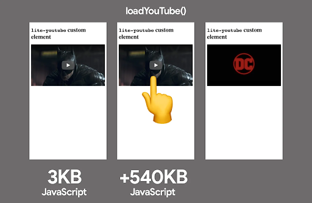

Xuddi shunga o'xshash texnika bir qator Google saytlarida ishlab chiqarishda qo'llaniladi. Android.com saytida YouTube video playerini darhol yuklash o'rniga, foydalanuvchilarga soxta ijro tugmasi bo'lgan eskiz ko'rsatiladi. Ular tugmani bosganlarida, to’liq YouTube video pleyeri yordamida videoni avtomatik ijro etuvchi modal oyna yuklanadi:

  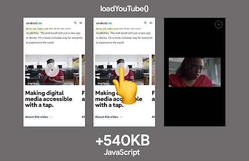

## Autentifikatsiya

Ilovalar klint tomoni JavaScript SDK orqali xizmat bilan autentifikatsiyani ta’minlashi kerak bo‘lishi mumkin. Bunday SDK’lar ba’zida katta Javascript bajarish sig’imiga ega bo’lib, agar foydalanuvchi tizimga kirmoqchi bo'lmasa, ularni oldindan yuklash maqsadga muvofiq bo’lmaydi. Buning o'rniga, foydalanuvchi "Kirish" tugmasini bosganida autentifikatsiya kutubxonalarini dinamik ravishda import qilish kerak, bu esa boshlang'ich yuklash paytida asosiy jarayonni yanada samaraliroq ishlashini ta’minlaydi.

  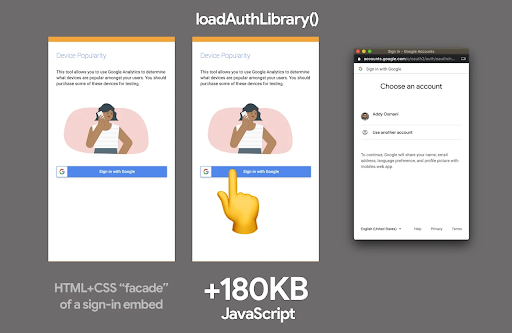

## Chat vidjetlari

Calibre ilovasi shunga o'xshash fasad yondashuvidan foydalanib, [Intercomga asoslangan jonli chatning ishlash tezligini 30% ga oshirdi](https://calibreapp.com/blog/fast-live-chat). Ular CSS va HTMLdan foydalangan holda "simulyatsiya qilingan" tez yuklanadigan jonli chat tugmasini yaratdilar, bu tugma bosilganda ularning Intercom to'plamlari yuklanadi.

  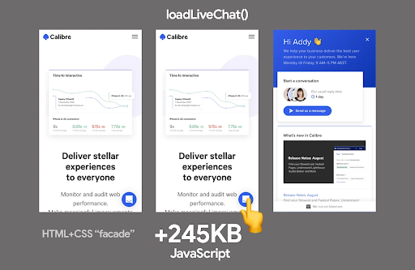

[Postmark](https://wildbit.com/blog/2020/09/30/getting-postmark-lighthouse-performance-score-to-100) kompaniyasi o’zlarining ularning “Yordam” chat vidjeti mijozlar tomonidan kamdan-kam hollarda foydalanilgan bo'lsa ham, har doim darhol yuklanishini ta’kidladi. Vidjet 314KB hajmli skriptni yuklaydi, bu ularning butun bosh sahifasi hajmidan ham kattaroq hajm. Foydalanuvchi bilan ishlash qulayligini yaxshilash maqsadida ular vidjetni HTML va CSS yordamida yaratilgan haqiqiy bo’lmagan versiya, ya’ni simulyatsiya bilan almashtirib, haqiqiy vidjetni faqat bosish orqali yuklaydigan qildilar. Ushbu o'zgarish *Interaktivlikkacha bo’lgan Vaqtni* 7,7 soniyadan 3,7 soniyaga qisqartirdi. 

  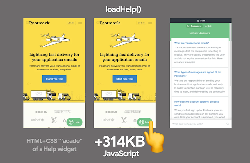

## Boshqa misollar

[Ne-digital](https://medium.com/ne-digital/how-to-reduce-next-js-bundle-size-68f7ac70c375) kompaniyasi foydalanuvchi “yuqoriga qaytish” tugmasini bosganida sahifaning yuqorisiga animatsiyali o‘tish uchun React kutubxonasidan foydalangan. Ular react-scroll modulini darhol yuklash o'rniga, uni faqat tugma bosilgandagina yuklashni amalga oshirib, \~ 7KB hajmni tejashga erishgan:

  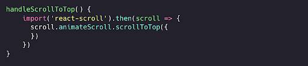

## Interaktivlik asosida import qilish qanday amalga oshiriladi?

### Vanilla Javascript

JavaScriptda [dinamik import()](https://v8.dev/features/dynamic-import) funksiyasi modullarni kerak bo’lganda yuklash imkonini beradi va promise qaytaradi. To'g'ri qo'llanilganda bu juda samarali usul hisoblanadi. Quyida tugma *event listener’da* *lodash.sortby* modulini dinamik import qilish va undan foydalanish misoli keltirilgan.

  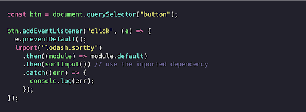

Dinamik import mavjud bo’lmagan holatlar yoki u mos kelmaydigan foydalanish holatlari uchun, Promise asosidagi skript yuklovchi yordamida sahifaga skriptlarni dinamik ravishda kiritish ham yaxshi yechim edi (tizimga kirish fasadini namoyish etuvchi to'liq implementatsiya uchun [bu yerni o’qing](https://glitch.com/edit/#!/tree-fluffy-stop?path=script.js%3A1%3A0)):

  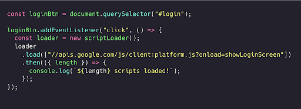

## React

Faraz qilaylik, bizda `<MessageList>`, `<MessageInput>` va `<EmojiPicker>` komponentlaridan tashkil topgan Chat ilovasi bor ([emoji-mart](https://bundlephobia.com/result?p=emoji-mart@3.0.0) yordamida ishlaydi, hajmi 98KB, minifikatsiya va gzip qilingan). Odatda bunday komponentlarning barchasini sahifa yuklanishi bilan darhol yuklash keng tarqalgan amaliyot.

  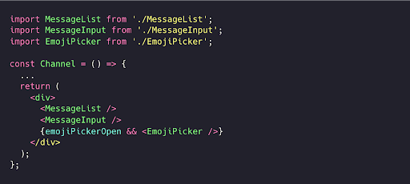

  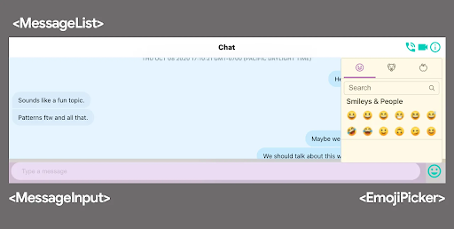

Bu yuklanish jarayonini sindirish [kodlarni bo’lib yuklash](https://web.dev/reduce-javascript-payloads-with-code-splitting/) texnikasi yordamida bo’laklarga ajratish nisbatan oson. `React.lazy` metodi dinamik import yordamida React ilovasini komponentlar darajasida bo’laklarga ajratishni osonlashtiradi. `React.lazy`  funksiyasi ilovadagi komponentlarni minimal kuch sarflab, Javascript kodini alohida bo’laklarga ajratishning ichki o’rnatilgan usulini taqdim etadi. Keyin uni `Suspense` komponenti bilan birga ishlatilganda, yuklanish holatlarini ham boshqarish imkonini beradi.

  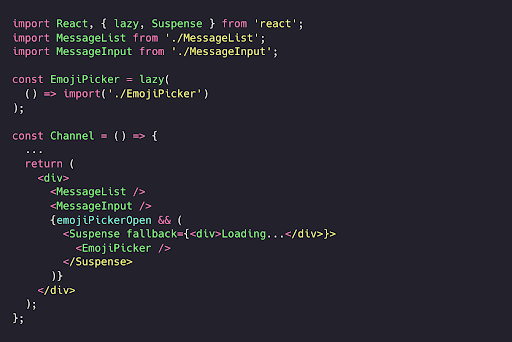

Bu yondashuvni yanada rivojlantirib, `EmojiPicker` komponenti kodini ilova yuklanishi bilan emas, balki faqat `<MessageInput>` komponentidagi emoji belgisi bosilgandagina yuklash mumkin:

  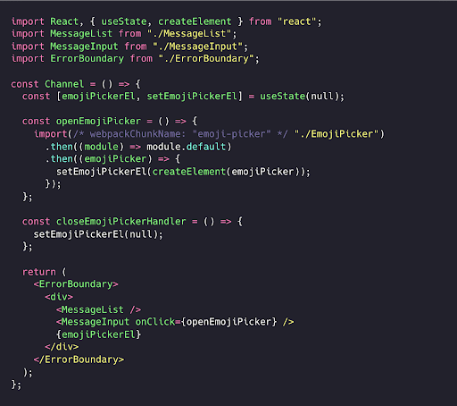

  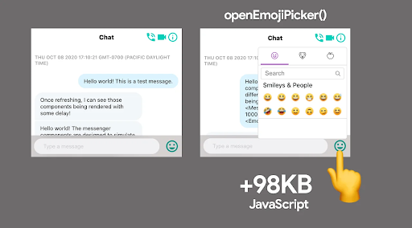

## Vue

Vue.js’da ham interaktivlik asosida import qilish patternini bir necha xil usullar bilan amalga oshirish mumkin. Bulardan biri \- `EmojiPicker` Vue komponentini funksiyaga o’ralgan dinamik import orqali yuklash, yaʼni `() => import("./Emojipicker")`. Odatda bu usul Vue.js’ga komponentni faqat renderlash kerak bo'lgandagina yuklash imkonini beradi.

Keyingi qadam \- *lazy-loading* orqali yuklashni foydalanuvchi interaktivligiga bog’lash. Tanlagich (picker) uchun ota `div` elementida `v-if` direktivasi yordamida shartli ko’rsatish va tugma bosilganda uni boshqarish orqali, `EmojiPicker` komponentini foydalanuvchi interaktivligiga ko’ra yuklash va render qilish mumkin.

  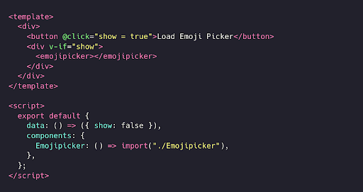

Interaktivlik asosida import qilish patterni dinamik komponent yuklashni qo'llab-quvvatlaydigan ko'pgina freymvorklar va kutubxonalar, shu jumladan [Angular](https://johnpapa.net/angular-9-lazy-loading-components/) bilan ishlay oladigan bo'lishi kerak.

## Progressiv yuklashning bir qismi sifatida birinchi darajali kod uchun interaktivlik asosida import

Interaktivlik paytida kodni yuklash *Google Flights* va *Google Photos* kabi yirik ilovalarda progressiv yuklashni boshqarishning muhim qismi hisoblanadi. Buni tushuntirish uchun, keling, Shubhie Panicker tomonidan avvalroq taqdim etilgan misolni ko'rib chiqaylik.

Tasavvur qiling, foydalanuvchi Hindistonning Mumbay shahriga sayohat qilishni rejalashtirmoqda va narxlarni ko'rish uchun *Google Hotels* xizmatidan foydalanmoqda. Bu interaktivlik uchun zarur bo'lgan barcha resurslarni darhol yuklashi mumkin, ammo foydalanuvchi hali biror manzilni tanlamagan bo'lsa, xarita uchun zarur bo'lgan HTML/CSS/JS kerak bo'lmaydi.

  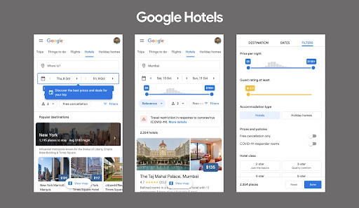

Eng oddiy yuklab olish holatida, *Google Hotels* oddiy [klient tomonida renderlashdan](https://developers.google.com/web/updates/2019/02/rendering-on-the-web#csr) (CSR) foydalanayotgan bo’lsin. Barcha kod oldindan yuklanadi va qayta ishlanadi: avval HTML, keyin JS, CSS va ma'lumotlar yuklanadi, faqat hammasi narsa tayyor bo’lgandan so’ng sahifa render qilinadi. Biroq, bu foydalanuvchini ekranda hech narsa ko’rsatilmagan holda uzoq vaqt kutishga majbur qiladi. JavaScript va CSS’ning katta qismi esa keraksiz bo'lishi mumkin.

  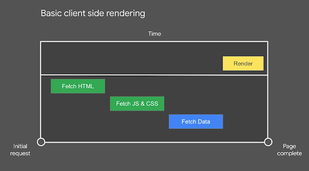

Endi bu tajribani [server tomonida renderlash](https://developers.google.com/web/updates/2019/02/rendering-on-the-web#server-vs-static) (SSR) ga o’tkazilganini tasavvur qiling. Biz foydalanuvchiga vizual jihatdan to'liq sahifani tezroq ko’rish imkonini beradi, bu juda yaxshi, ammo serverdan ma'lumotlar olinmaguncha va klient freymvorki hidratsiya jarayonini tugatmaguncha sahifa interaktiv bo'lmaydi.

  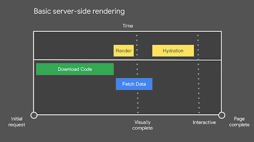

SSR texnikasi bir qarashda yaxshilanish yechimi bo’lishi mumkin, lekin foydalanuvchi noqulay holatga tushishi mumkin \- sahifa tayyordek ko’rinadi, lekin undan foydalanib bo’lmaydi. Ba'zan buni “g'azabli bosishlar” deb atashadi, chunki foydalanuvchilar sabrsizlik bilan qayta-qayta bosishga moyil bo’lishadi.

*Google Hotels* qidiruv misoliga qaytadigan bo'lsak, interfeysni kattalashtirib, yaqinroq razm solib ko’rilganda, foydalanuvchi kerakli mehmonxonani topish uchun "qo’shimcha filtrlar" tugmasini bosganida, ushbu komponent uchun kerakli kod yuklanishini ko'rishimiz mumkin.

## Dastlab minimal kod yuklanadi, undan keyingi kod yuklash foydalanuvchi harakatlariga asoslanadi

Keling, ushbu yuklash ssenariysini batafsil ko'rib chiqaylik.

  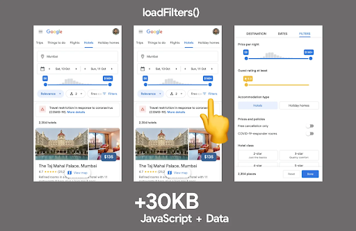

Interaktivlikka asoslangan kechiktirilgan yuklashning bir qator muhim jihatlari bor:

* Dastlab minimal kodni yuklab olamiz, bu sahifani tezda vizual to’ldirishga imkon beradi.  
* Foydalanuvchi sahifa bilan ishlashni boshlagach, uning harakatlariga qarab qo’shimcha kod yuklanadi, masalan, "qo’shimcha filtrlar" komponenti uchun kodini yuklash.  
* Natijada sahifadagi ko'plab funksiya va xususiyatlar uchun kod umuman brauzerga yuklanmaydi, chunki foydalanuvchi ulardan foydalanmagan.

  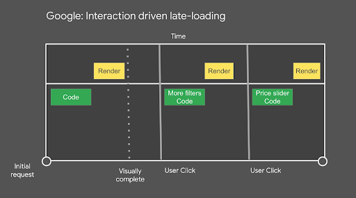

## Dastlabki bosishlarni yo'qotmaslik uchun nima qilish kerak?

Google jamoalari foydalanayotgan freymvork stekida bosishlarni erta aniqlash mumkin, chunki HTML’ning birinchi bo’lagi kichik hodisa (event)lar kutubxonasini ([JSAction](https://github.com/google/jsaction)) o’z ichiga oladi. U freymvork ishga tushishidan oldin barcha bosishlarni kuzatadi. Hodisalar ikki maqsadda ishlatiladi:

* Foydalanuvchi interaktivligiga asosan komponent kodini yuklab olishni boshlash  
* Freymvork yuklab olingandan so'ng foydalanuvchi harakatlarini qayta ijro etish

Qo'llanilishi mumkin bo'lgan boshqa usullar komponent kodini quyidagi holatlarda yuklashni o'z ichiga oladi:

* Bekor turish vaqtidan so’ng  
* Foydalanuvchi sichqonchani tegishli interfeys elementi/tugma/harakatga keltiruvchi element ustiga olib borganda  
* Brauzer signallari (masalan, tarmoq tezligi, trafik tejash rejimi va h.k.) asosidagi shoshilinchlilik darajasiga qarab.

  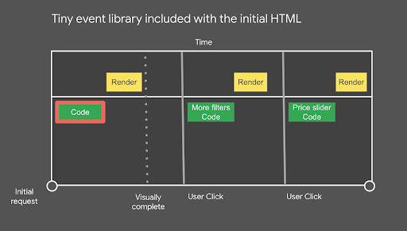

## Ma’lumotlar bilan ishlash

## Sahifani render qilish uchun zarur bo’ladigan boshlang’ich ma'lumotlar SSR HTML tarkibiga kiritiladi va uzatiladi. Qo’shimcha ma'lumotlar foydalanuvchi harakatlari asosida yuklab olinadi, chunki biz ular qaysi komponentga tegishli ekanini bilamiz.

Bu CSS va Javascript funksiyalari kabi ma'lumotlarni olish bilan interaktivlik asosida import qilish jarayonini yakunlaydi. Komponent o’ziga kerakli bo’lgan kod va ma'lumotlarni bilganligi sababli, uning barcha resurslari bir so'rov masofasida joylashgan.

  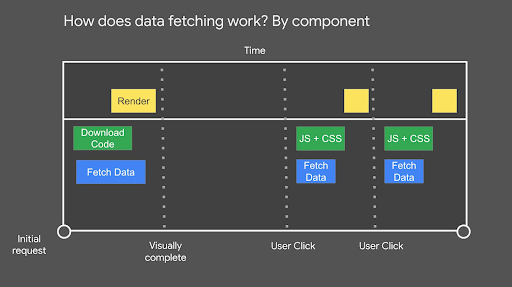

Bu tizim komponentlar va ularning qaramliklarini qurish vaqtida grafik ko’rinishida yaratish orqali ishlaydi. Veb-ilova istalgan vaqtda ushbu grafikka murojaat qilib, har qanday komponent uchun zarur bo'lgan resurslarni (kod va ma'lumotlar) tezda olishi mumkin. Shuningdek, bu bizga yo’nalishlar emas, balki komponentlar asosida kodni ajratish imkonini beradi.

Yuqoridagi misolni yaxshiroq tushunish uchun [JavaScript hamjamiyati yordamida veb-platformani rivojlantirish](https://www.youtube.com/watch?v=-xZHWK-vHbQ) mavzusidagi taqdimotni ko’ring.

## Afzallik va kamchiliklar

Murakkab operatsiyalarni foydalanuvchi harakatlariga yaqinlashtirish sahifalarning dastlabki yuklanish tezligini optimallashtirishga yordam beradi, ammo bu usulning o’z kamchiliklari bor.

Foydalanuvchi harakatidan so’ng skriptni yuklash uzoq vaqt talab qilsa-chi?

*Google Hotels* misolida kichik, alohida qismlar foydalanuvchining kod va ma'lumotlarni yuklash hamda bajarish uchun uzoq kutish ehtimolini kamaytiradi. Boshqa holatlarda, katta hajmli qaramliklar sekinroq tarmoqlarda aynan shu muammoni keltirib chiqarishi mumkin.

Bu muammoni sodir bo'lish ehtimolligini kamaytirishning usullaridan biri \- sahifadagi muhim kontent yuklangandan so'ng, resurslarni bo’lib yuklash yoki oldindan yuklash mumkin. Sizning ilovangizda bu qanchalik muhim ekanligini aniqlash uchun uning ta'sirini o'lchashni tavsiya qilaman.

Foydalanuvchi harakatidan oldin funksionallikning cheklanganligi haqida nima deyish mumkin?

Fasadlarning yana bir kamchiligi \- foydalanuvchi harakatidan oldin funksionallikning cheklanganligi. Masalan, joylashtirilgan video pleyer mediani avtomatik ijro eta olmaydi. Agar bunday funksionallik muhim bo'lsa, resurslarni yuklashning muqobil usullarini ko'rib chiqishingiz mumkin, masalan, uchinchi tomon iframe'larini foydalanuvchi harakati, masalan bosganida yuklashni o’rniga, ko’rish maydoniga skroll qilinganda yuklash usulini qo’llash mumkin.

## Interaktiv joylashtirilgan elementlarni statik variant bilan almashtirish

Biz interaktivlik asosida import qilish patterni va progressiv yuklash haqida gaplashib o’tdik, ammo joylashtirilgan elementlarning foydalanish holati uchun butunlay statik holatga o'tish haqida nima deyish mumkin?

Ba'zi hollarda, masalan, dastlabki ko'rish maydonida ko'rinadigan ijtimoiy media posti kabi, joylashtirilgan elementning yakuniy ko’rinish kontenti darhol kerak bo'lishi mumkin. Bu, ayqnisa element 2-3MB JavaScript hajmini olib kelganda, o'ziga xos muammolarni keltirib chiqarishi mumkin. Ushbu joylashtirilgan kontent darhol kerak bo'lgani uchun, kerakli paytda yuklash va fasadlar kamroq qo’l kelishi mumkin.

Ishlash samaradorligini optimallashtirishda, joylashtirilgan elementni o'xshash ko'rinishdagi statik variant bilan to'liq almashtirish va interaktiv versiyaga (masalan, asl ijtimoiy media postiga) havola berish mumkin. Qurilish vaqtida, joylashtirish uchun ma'lumotlar olinib, statik HTML versiyasiga aylantirilishi mumkin.

  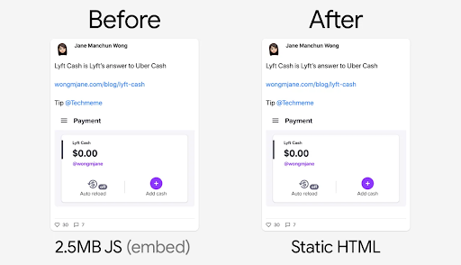

[Bu](https://twitter.com/wongmjane/status/1330676158724116481) [@wongmjane](https://twitter.com/@wongmjane) o'z blogida ijtimoiy media elementining bir turi uchun [qo'llagan yondashuv](https://twitter.com/wongmjane/status/1330273157245243394) bo'lib, u sahifa yuklanish samaradorligini oshirdi, joylashtirilgan kod zaxira matnini kuchaytirishi natijasida yuzaga keladigan va sahifa elementlarining siljishiga olib keladigan [to'plangan tartib o'zgarishi](https://web.dev/articles/cls) (Cumulative Layout Shift) muammosini bartaraf etdi.

Statik almashtirishlar ishlash samaradorligi uchun foydali bo'lsa-da, ular ko'pincha maxsus yechimlarni talab qiladi, shuning uchun variantlaringizni baholashda buni hisobga oling.

## Xulosa

Birinchi darajali Javascript zamonaviy veb-sahifalarning interaktivligiga ta’sir qiladi, lekin u ko'pincha asosiy thread’ni band qiladigan birinchi yoki uchinchi tomon manbalaridan kelgan muhim bo'lmagan Javascript ortida kechikishi mumkin.

Umuman olganda, dokument sarlavhasida sinxron uchinchi tomon skriptlaridan qoching va birinchi darajali Javascript yuklangandan so'ng bloklashsiz uchinchi tomon skriptlarini yuklashga harakat qiling. Interaktivlik asosida import qilish kabi patternlar bizga muhim bo'lmagan resurslarni foydalanuvchiga kerak bo’lgan paytgacha kechiktirish imkonini beradi.

*Shubhie Panicker, Connor Clark, Patrick Hulce, Anton Karlovskiy va Adam Reynga ularning qo’shgan o'z hissalari uchun alohida minnatdorchilik bildiramiz.*
