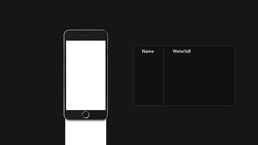
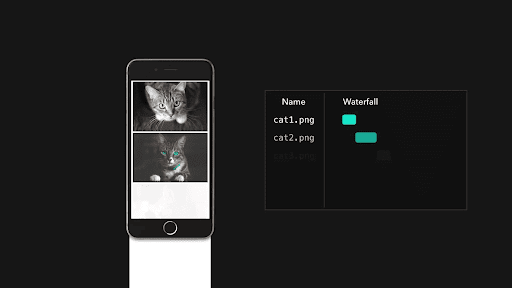
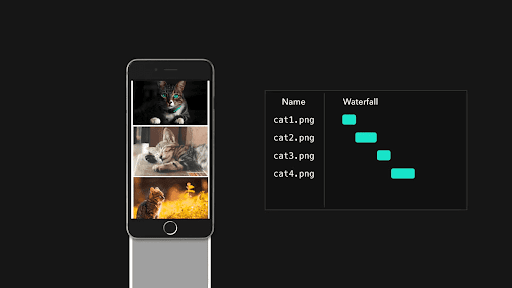
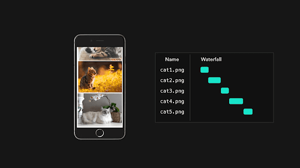
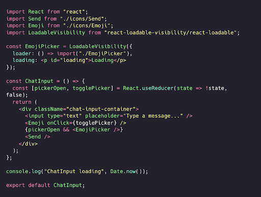
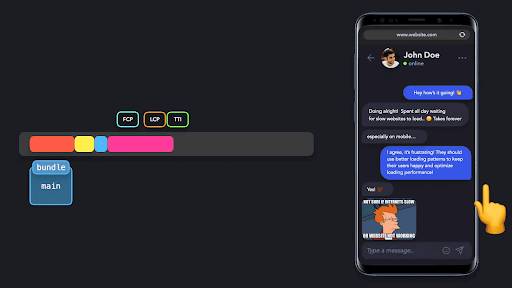
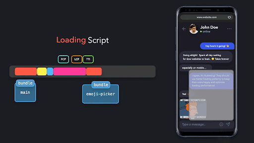
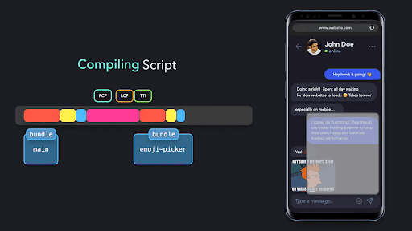
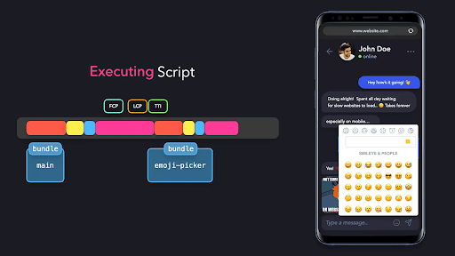

# **Ko’rinishga asoslangan import**

Foydalanuvchi interaktivligidan tashqari, bizda ko'pincha dastlabki sahifada ko'rinmaydigan komponentlar mavjud bo’ladi. Bunga eng yaxshi misol \- ko’rish maydonida bevosita ko'rinmaydigan, faqat foydalanuvchi pastga skroll qilganida yuklanadigan yuklash tasvirlari.

  

  

  

  

Barcha rasmlarni darhol so’rovda talab qilmaganimiz uchun, dastlabki yuklash vaqtini qisqartirishimiz mumkin. Xuddi shu usulni komponentlar bilan ham qo’llashimiz mumkin\! Komponentlar ayni paytda ko’rish maydonimizda bor yoki yo'qligini aniqlash uchun [`IntersectionObserver`](https://developer.mozilla.org/en-US/docs/Web/API/Intersection_Observer_API) API’dan foydalanishimiz yoki ilovamizga ko'rinishga asoslangan importni tezda qo'shish uchun `react-lazyload` yoki `react-loadable-visibility` kabi kutubxonalardan foydalanishimiz mumkin.

  

`EmojiPicker` ekranda ko'rsatilishi kerak bo’lganda, ya’ni foydalanuvchi Gif tugmasini bosgandan so'ng, `react-loadable-visibility`  `EmojiPicker`  elementi ekranda ko'rinishi kerakligini aniqlaydi. Shundan keyingina, foydalanuvchiga yuklash komponenti ko’rsatilayotgan paytda, modulni import qilishni boshlaydi.

  

  

  

  

  

Ushbu zaxira komponent foydalanuvchiga ilovamiz “muzlab” qolmaganligini ko’rsatadi: ular shunchaki modul yuklanishi, tahlil qilinishi, kompilyatsiya qilinishi va bajarilishi uchun biroz vaqt kutishlari kerak\!