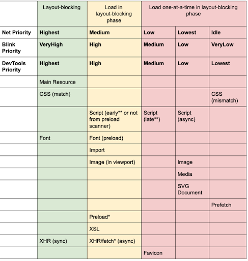
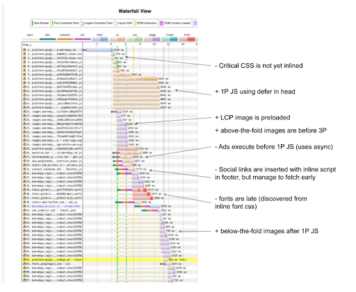

# **Yuklash ketma-ketligini optimallashtirish**

Eslatma: Ushbu maqolaga Chrome brauzeridagi [Aurora jamoasi](https://web.dev/introducing-aurora/), xususan, optimal yuklash ketma-ketligini tadqiq qilgan [Shubhie Panikerning](http://twitter.com/shubhie) fikrlari katta ta'sir ko'rsatgan.

Har bir muvaffaqiyatli veb-sahifa yuklanishida ba'zi muhim komponentlar va resurslar foydalanuvchiga muammosiz va silliq yuklash tajribasini taqdim etish uchun aynan kerakli vaqtda mavjud bo'ladi. Bu foydalanuvchilarga ilovaning ishlashini a'lo darajada his qilishlarini ta'minlaydi. Ushbu ajoyib foydalanuvchi bilan ishlash qulayligi, odatda, Asosiy Veb Ko’rsatkichlari ([Core Web Vitals](https://web.dev/vitals/)) dan ham muvaffaqiyatli o'tishga olib kelishi kerak.

Ishlash samaradorlikni o'lchash uchun ishlatiladigan Birinchi Kontent Ko’rinishi ([First Content Paint](https://web.dev/fcp/)), Eng Katta Kontentli Ko’rinish ([Largest Contentful Paint](https://web.dev/lcp/)), Birinchi Kiritish Kechikishi ([First Input Delay](https://web.dev/fid/)) va shu kabi asosiy [ko'rsatkichlar](https://web.dev/metrics/) bevosita muhim resurslarni yuklash ketma-ketligiga bog'liq. Misol uchun, agar [asosiy tasvir](https://en.wikipedia.org/wiki/Hero_image) kabi muhim resurs yuklanmagan bo'lsa, sahifadagi LCP ko’rsatkichi shakllanmaydi. Ushbu maqolada resurslarni yuklash ketma-ketligi va veb-ko’rsatkichlar (Web Vitals) o'rtasidagi bog'liqlik haqida so’z yuritiladi. Bizning maqsadimiz yaxshiroq veb-ko’rsatkichlar uchun yuklash ketma-ketligini optimallashtirish bo'yicha aniq ko'rsatmalar berishdir.

Ideal yuklash ketma-ketligini o'rnatishdan oldin, keling, avval nima uchun yuklash ketma-ketligini to'g'ri tashkil qilish juda qiyinligini tushunishga harakat qilaylik.

## Nima uchun optimal yuklashga erishish qiyin?

Ko'pgina hamkorlarimizning veb-saytlarining ishlash samaradorligini tahlil qilish uchun noyob imkoniyatga ega bo'ldik. Biz turli hamkor saytlarda sahifalarni samarali yuklash bilan bog'liq bir nechta shunga o'xshash muammolarni aniqladik.

Ko’pincha, dasturchilarning kutganlari bilan brauzer sahifadagi resurslarni qanday ustuvorlik bilan yuklashi o’rtasida muhim tafovut mavjud. Bu ko'pincha samaradorlik ko’rsatkichlarining optimal bo’lmagan natijalariga olib keladi. Ushbu tafovutga nima sabab bo'lganini aniqlash uchun biz chuqurroq tahlil o’tkazdik va quyidagi fikrlar tahlilimizning mohiyatini aks ettiradi. 

### Optimal bo’lmagan ketma-ketlik

[Veb Ko’rsatkichlarini](https://web.dev/vitals) optimallashtirish nafaqat har bir ko'rsatkich nimani anglatishini, balki ularning paydo bo'lish tartibini va turli muhim resurslar bilan qanday bog'liqligini ham yaxshi tushunishni talab qiladi. Birinchi Kontent Ko’rinishi (FCP) Eng Katta Kontent Ko’rinishi (LCP)dan oldin sodir bo’ladi, LCP o’zi esa Birinchi Kiritish Kechikishi (FID)dan avval sodir bo'ladi. Shuning uchun, FCP’ga erishish uchun zarur bo'lgan resurslar LCP tomonidan talab qilinadiganlaridan ustonroq bo’lishi kerak, undan keyin esa FID uchun zarur bo’lgan resurslar keladi.

Resurslar ko'pincha to’g’ri ketma-ketlikda joylashtirilmaydi va optimallashtirilmaydi. Buning sababi dasturchilar ko'rsatkichlarning resurs yuklanishiga bog'liqligini to’liq anglamasliklari mumkin. Natijada, tegishli ko'rsatkichni ishga tushirish uchun kerakli resurslar ba'zan kerakli vaqtda mavjud bo’lmaydi. 

### Misollar:

a) FCP ishga tushirilganda, LCP’ni ishga tushirish uchun asosiy tasvir allaqachon mavjud bo'lishi kerak.

b) LCP ishga tushgunga qadar JavaScript (JS) allaqachon yuklab olingan, tahlil qilingan va foydalanuvchi interaktivligini (FID) blokdan chiqarishga tayyor (yoki allaqachon bajarilayotgan) bo'lishi kerak.

### Tarmoq/Protsessordan foydalanish

Resurslar, shuningdek, protsessor va tarmoqdan to'liq samarali foydalanishni ta'minlash uchun mos ravishda taqsimlanmaydi. Bu jarayon tarmoqqa bog’liq bo’lganda protsessorda "Bekor turish vaqti" (Dead time) hosil qiladi va aksincha.

Bunga bir vaqtning o'zida yoki ketma-ket yuklab olinishi mumkin bo'lgan skriptlar yaxshi misol bo'la oladi. Bir vaqtning o'zida yuklab olish paytida tarmoq kengligi bo’linganligi sababli, barcha skriptlarni yuklab olish uchun umumiy vaqt ketma-ket va bir vaqtda yuklab olish uchun bir xil bo'ladi. Agar skriptlarni bir vaqtning o'zida yuklab olsangiz, yuklab olish paytida protsessor resurslaridan yetarlicha foydalanilmaydi. Biroq, skriptlarni ketma-ket yuklab olsangiz, protsessor birinchi skript yuklab olingandan so'ng darhol uni qayta ishlashni boshlashi mumkin. Bu protsessor va tarmoq resurslaridan yanada samaraliroq foydalanishga olib keladi.

### Uchinchi tomon (3P) mahsulotlari

3P kutubxonalari ko'pincha veb-saytga umumiy xususiyatlar va funksionallikni qo'shish uchun talab qilinadi. Uchinchi tomonlarga reklamalar, analitika tizimlari, ijtimoiy tarmoq vidjetlar, jonli muloqot oynalari va veb-saytni quvvatlaydigan boshqa o’rnatmalar kiradi. Uchinchi tomon kutubxonasi o'zining JavaScript kodi, tasvirlari, shriftlari va boshqa resurslari bilan birga keladi. 

3P mahsulotlari odatda mijoz saytining yuklash tezligini optimallashtirish va qo'llab-quvvatlashdan manfaatdor emas. Ular foydalanuvchi interaktivligini kechiktiradigan yoki boshqa muhim resurslarni yuklab olishga to’sqinlik qiladigan og’ir JavaScriptni bajarish yukiga ega bo'lishi mumkin.

3P mahsulotlarini qo’shayotgan dasturchilar ko’pincha ishlash samaradorligiga ta'siridan ko'ra, ular qo'shadigan funksional qiymatga ko'proq e'tibor qaratishadi. Natijada, 3P resurslari ba'zan umumiy yuklash ketma-ketligiga qanday ta’sir qilishi to'liq hisobga olinmasdan, tartibsiz qo'shiladi. Bu ularni nazorat qilish va rejalashtirishni qiyinlashtiradi.

### Platformaning g’ayrioddiy xususiyatlari

Brauzerlar so'rovlarga ustuvorlik berish va ko’rsatmalarni amalga oshirishda farq qilishi mumkin. Agar siz platforma va uning g'ayrioddiy jihatlari haqida chuqur bilimga ega bo'lsangiz, optimallashtirish osonroq bo'ladi. Muayyan brauzerga xos xatti-harakatlar istalgan yuklash ketma-ketligiga izchil erishishni qiyinlashtiradi.

Bunga misol qilib chromium platformasidagi oldindan yuklash xatosi  ([preload bug](https://bugs.chromium.org/p/chromium/issues/detail?id=788757))ni keltirish mumkin. [Oldindan yuklash](https://medium.com/reloading/preload-prefetch-and-priorities-in-chrome-776165961bbf) (`<link rel=preload>`) ko'rsatmasi brauzerga asosiy resurslarni imkon qadar tezroq yuklab olishni aytish uchun ishlatilishi mumkin. U faqat resurs joriy sahifada ishlatilishiga ishonchingiz komil bo'lganida ishlatilishi kerak. Chromiumdagi xatolik uning shunday ishlashiga olib keladiki, `<link rel=preload>` orqali yuborilgan so‘rovlar, hatto ular ustuvorroq bo‘lsa ham, oldindan yuklash skaneri tomonidan ko‘riladigan boshqa so‘rovlardan oldin boshlanadi. Bu kabi muammolar optimallashtirish rejalariga to’sqinlik qiladi.

### HTTP2 ustuvorligi

Protokolning o'zi resurslarning tartibi va ustuvorligini sozlash uchun ko'p variantlar yoki boshqaruv mexanizmlarini taqdim etmaydi. Hatto yaxshiroq ustuvorlik mexanizmlari mavjud bo'lsa ham, [HTTP2 ustuvorligi bilan bog'liq asosiy muammolar](https://github.com/andydavies/http2-prioritization-issues) mavjud bo'lib, ular optimal ketma-ketlikka erishishni qiyinlashtiradi. Asosiy muammo shundaki, serverlar yoki CDN’lar alohida resurslarga bo'lgan so'rovlarni qanday tartibda ustuvorlik berishini oldindan ayta olmaymiz. Ba'zi CDNlar so'rovlarga qayta ustuvorlik beradi, boshqalari esa qisman, noto'g'ri yoki umuman ustuvorlikni amalga oshirmaydi.

### Resurs darajasini optimallashtirish

Samarali ketma-ketlik ketma-ketlashtirilayotgan resurslar tez yuklanishi uchun optimal tarzda xizmat ko'rsatishni talab qiladi. Muhim CSS to’g’ridan-to’g’ri HTML ichiga joylashtirilishi, tasvirlarining o'lchami to'g'ri bo'lishi va Javascript kodi qismlarga bo'linishi hamda bosqichma-bosqich yetkazib berilishi kerak.

Freymvorkning o'zida kodlarni bo'lib yuklash imkonini beruvchi va Javascript va ma'lumotlarga bosqichma-bosqich xizmat ko'rsatadigan konstruktsiyalar mavjud emas. Foydalanuvchilar birinchi tomon Javascript kodining katta qismlarini ajratish uchun quyidagilardan biriga tayanishi kerak:

1. Zamonaviy React ([Suspense / Concurrent mode / Data Fetching](https://reactjs.org/docs/concurrent-mode-reference.html)) \- Bu hali ham faqat tajriba uchun mavjud.  
2. [Dinamik import](https://reactjs.org/docs/code-splitting.html) yordamida kerakli vaqtda yuklash \- Bu intuitiv emas va dasturchilar kodni qayerlarda ajratish kerakligini mustaqil ravishda belgilashlari kerak.

Kodni ajratishda dasturchilar mayda detallarga ajratish darajasi va ishlash samaradorligi o'rtasidagi muvozanatni topishlari lozim.

Yuqori darajadagi mayda detallilik judayam zarur, chunki u:

1. Har bir yo’nalish va keyingi foydalanuvchi interaktivligi uchun zarur bo'lgan Javascript hajmini minimallashtiradi.  
2. Umumiy kutubxonalarni keshda saqlash imkonini beradi. Bu kutubxonadagi o'zgarishlar butun to’plam paketini qayta yuklashni talab qilmasligini ta'minlaydi.

Biroq, kodni haddan tashqari mayda bo’laklarga ajratish ham zararli, chunki juda ko'p mayda bo’laklar alohida bo’laklar uchun ixchamlash tezligini pasaytiradi va brauzer ishlash samaradorligiga salbiy ta'sir qiladi.

Resurslarni optimallashtirish jarayoni, shuningdek, o'lik yoki foydalanilmaydigan kodlarni tozalashni ham talab qiladi. Keraksiz yoki eskirgan Javascript kodi ko'pincha zamonaviy brauzerlarga ham yuborilishi mumkin, bu esa ishlash samaradorligiga salbiy ta'sir qiladi. ES5 formatiga o’zgartirilgan va polyfill’lar bilan to’ldirilgan Javascript zamonaviy brauzerlar uchun ortiqcha hisoblanadi. Kutubxonalar va npm paketlari ko'pincha ES modul formatida chiqarilmaydi. Bu esa to’plash vositalariga keraksiz kodlarni tozalash (tree shaking) va optimallashtirishni qiyinlashtiradi.

Ko’rib turganingizdek, bu muammolar ma'lum bir resurslar yoki platformalar doirasi bilan cheklanmaydi. Ushbu muammolarni hal qilish uchun butun texnologik to'plamni va optimal ko'rsatkichlarga erishish uchun turli xil resurslarni qanday muvofiqlashtirish mumkinligini tushunish talab etiladi. Umumiy optimallashtirish strategiyasini belgilashdan oldin, keling, alohida resurslarga bo'lgan talablar bizning maqsadimizga qanday to’sqinlik qilishi mumkinligini ko'rib chiqaylik.

## Resurlar haqida batafsil \- munosabatlar, cheklovlar va ustuvorliklar

Oldingi bo'limda biz FCP yoki LCP kabi ma'lum bir hodisa sodir bo’lishi uchun qanday ma'lum resurslar talab qilinishiga bir nechta misollar keltirib o’tgan edik. Keling, ular bilan ishlash usulini muhokama qilishdan oldin, avvalo, barcha bunday barcha qaramliklarni tushunib olaylik. Quyida ideal ketma-ketlikni begilashdan oldin hisobga olinishi kerak bo'lgan tavsiyalar, cheklovlar va muhim nuqtalarning resurslar bo’yicha ro'yxati keltirilgan.

### Muhim CSS (Critical CSS)

[Muhim CSS](https://web.dev/extract-critical-css/) deganda FCP uchun zarur bo'lgan minimal CSS tushuniladi. Bunday CSS’ni alohida fayldan import qilishdan ko'ra, to’g’ridan-to’g’ri HTML ichiga joylash (inline) afzalroq. Har bir sahifa yo’nalishi uchun faqat zarur bo'lgan CSS yuklanishi va barcha muhim CSS’lar mos ravishda bo'linishi kerak.

Agar to’g’ridan-to’g’ri joylash imkoni bo'lmasa, muhim CSS oldindan yuklanishi va dokument bilan bir xil manbadan uzatilishi kerak. Google Fonts kabi uchinchi tomon muhim CSS’laridan to'g'ridan-to'g'ri foydalanishdan yoki muhim CSS’ni bir nechta domenlardan uzatishdan saqlaning. Buning o’rniga, serveringiz uchinchi tomon muhim CSS uchun proksi vazifasini bajarishi mumkin.

CSS’ni yuklashdagi kechikish yoki noto'g'ri tartibda yuklash FCP va LCP ko’rsatkichlariga ta'sir qiladi. Bunga yo'l qo'ymaslik uchun HTML ichiga to’g’ridan to’g’ri ichki joylanmagan (non-inlined) CSS’ga tarmoqda birinchi tomon Javascript va ekranning yuqori qismidagi tasvirlardan yuqoriroq ustuvorlik berilishi kerak.

Haddan tashqari ko'p ichki joylangan CSS HTML hajmining ortib ketishiga va asosiy thread’da stillarni vaqtining cho’zilib ketishiga olib keladi. Bu FCP ko’rsatkichiga salbiy ta’sir qilishi mumkin. Shuning uchun qaysi CSS muhimligini aniqlash va *code-splitting* texnikasini ishlatish juda muhimdir.

Ichki joylangan CSS’ni keshlab bo’lmaydi. Buning vaqtinchalik yechimlaridan biri CSS uchun keshlanishi mumkin takroriy so'rov yuborishdir. Biroq shuni yodda tutish lozimki, bu FID ko’rsatkichiga ta'sir qilishi mumkin bo'lgan bir nechta to'liq sahifa qayta tartiblashlariga olib kelishi mumkin.

### Shriftlar

Muhim CSS kabi, [muhim shriftlar](https://web.dev/font-best-practices/) uchun CSS ham to’g’ridan to’g’ri HTML ichiga joylashtirilishi kerak. Agar buning amalga oshirib bo'lmasa, skript belgilangan oldindan bog’lanish ([preconnect](https://web.dev/uses-rel-preconnect/)) ko’rsatmasi bilan yuklanishi kerak. Shriftlarni, masalan, Google shriftlari yoki boshqa domendan olinadigan shriftlarni yuklashdagi kechikish FCP ko’rsatkichiga ta'sir qilishi mumkin. Ushbu oldindan bog’lanish buyrug’i brauzerga ushbu resurslarga ulanishni oldindan tayyorlashni bildiradi.

Shriftlarni HTML ichiga joylashtirish uning hajmini sezilarli darajada oshirishi va boshqa muhim resurslarni yuklashni kechiktirishi mumkin. FCP bloklanishiini ochish va matnni ko’rsatish uchun zaxira shriftlardan ([Font fallback](https://css-tricks.com/css-basics-fallback-font-stacks-robust-web-typography/)) foydalanish mumkin. Biroq, zaxira shriftlardan foydalanish shriftlarning o'tishlari tufayli [CLS](https://web.dev/cls/) ko’rsatkichlariga ta'sir qilish ehtimoli mavjud. Bundan tashqari, asl shrift yuklanganda asosiy thread’da katta hajmdagi stil va tartiblash vazifasi bajarilishi tufayli FID ko’rsatkichiga ham ta'sir qilishi mumkin.

### Ekranning yuqori qismidagi tasvirlar (ATF)

Bu dastlab sahifa yuklanganda foydalanuvchiga ko'rinadigan tasvirlar bo’lib, chunki ular ko’rish maydoni (viewport) ichida joylashgan bo’ladi. ATF tasvirlari uchun alohida holat \- bu sahifaning asosiy tasviridir. Barcha ATF tasvirlari o'lchamlari belgilangan bo'lishi kerak. O'lchami belgilanmagan to’liq yuklanganda sahifa elementlarning siljishi sodir bo’lishi tufayli CLS ko'rsatkichiga salbiy ta’sir qiladi. ATF tasvirlari uchun joy belgilovchilar server tomonidan render qilinishi kerak.

Asosiy tasvirning kechikishi tasviri yoki bo'sh joy belgilovchilar LCP ko’rsatkichining kechikishiga olib keladi. Bundan tashqari, agar joy belgilovchining o'lchami asl tasvirining ichki o'lchamiga mos kelmasa va almashtirish paytida tasvir ustiga qoplanmasa, LCP qayta ishga tushadi. ATF tasvirlar FCP ko’rsatkichiga ta'sir qilmasligi kerak, lekin amalda tasvir FCP’ni ishga tushirishi mumkin.

### Ekranning pastki qismidagi tasvirlar (ATF)

Bular sahifa yuklanganda foydalanuvchiga darhol ko'rinmaydigan tasvirlardir. Shuning uchun ular *lazy-loading* uchun ideal variantlardir. Bu ularning sahifada zarur bo'lgan birinchi tomon Javascript yoki muhim uchinchi tomon resurslari bilan raqobatlashmasligini ta'minlaydi. Agar BTF tasvirlar birinchi tomon Javascript yoki muhim uchinchi tomon resurslaridan oldin yuklangan bo'lsa, FID kechikishi mumkin.

### Birinchi tomon Javascript

Birinchi tomon Javascript (1P JS) ilovaning foydalanuvchi interaktivligining tayyorligiga ta'sir qiladi. U tasvirlar va uchinchi tomon Javascript (3P JS) ortida tarmoqda hamda uchinchi tomon Javascript ortida asosiy thread’da kechikishi mumkin. Shuning uchun u tarmoqda ATF tasvirlaridan oldin yuklanishni boshlashi va asosiy oqimda uchinchi tomon Javascriptdan oldin bajarilishi kerak. Server tomonida ko'rsatilgan sahifalarda FCP va LCP ni bloklamaydi.

### Uchinchi tomon Javascript

HTML sarlavhasidagi uchinchi tomon sinxron skriptlar CSS va shriftlarni tahlil qilishni, shuningdek FCP’ni bloklashi mumkin. Sarlavhadagi sinxron skript HTML tanasini tahlil qilishni ham bloklaydi. Asosiy thread’da uchinchi tomon skriptning bajarilishini kechiktirishi va hidratsiya hamda FID’ni ortga surishi mumkin. Shuning uchun uchinchi tomon skriptlarni yuklashni yaxshiroq nazorat qilish talab etiladi.

Ushbu tavsiyalar va cheklovlar, odatda, texnologik stek va brauzerdan qat'iy nazar qo'llaniladi. E'tibor bering, tavsiya cheklovga ham aylanishi mumkin. Misol uchun, shriftlarni va CSS’ni HTML ichiga joylashtirish foydali, lekin haddan tashqari ko’p joylashtirish uning hajmini oshirib yuboradi. Asl mahorat "Juda kam, juda kech" va "Juda ko'p, juda erta" o'rtasidagi muvozanatni topishdir.

Quyidagi jadval turli xil resurslarni yuklash uchun Chrome brauzerining ustuvorliklarini tushunishga yordam beradi. Ustuvorliklar haqidagi ma'lumotlar va resurs turlari bo’yicha muhokamani birlashtirish keyingi bo'limda taklif qilinadigan yuklash ketma-ketligini yaxshiroq anglashga yordam beradi.

  

Quyida ushbu jadvaldan asosiy xulosalar keltirilgan.

* CSS va shriftlar eng yuqori ustuvorlik bilan yuklanadi. Bu muhim CSS va shriftlarga ustuvorlik berishga yordam beradi.  
* Skriptlar dokumentdagi joylashuvi va ularning asinxron, kechiktirilgan yoki blokirovka qiluvchi ekanligiga qarab turli xil ustuvorliklarga ega bo'ladi. Birinchi tasvirdan oldin so'ralgan blokirovka qiluvchi skriptlarga (yoki hujjatning boshidagi tasvirdan oldin) birinchi tasvir yuklangandan keyin so'ralgan blokirovka qiluvchi skriptlardan ko'ra yuqoriroq ustuvorlik beriladi. Dokumentning qayerida joylashganidan qat'iy nazar, asinxron/kechiktirilgan/qo’shilgan skriptlar eng past ustuvorlikka ega. Shunday qilib, [async va defer](https://javascript.info/script-async-defer) atributlaridan tegishli tarzda foydalanib, turli skriptlarga ustuvorlik berishimiz mumkin.  
* Ko'rinadigan va ko’rish maydonidagi tasvirlar (Net: Medium) ko’rish maydonidan tashqaridagi tasvirlarga (Net: Lowest) qaraganda yuqoriroq ustuvorlikka ega. Bu ATF tasvirlarni BTF tasvirlardan ustun qo'yishimizga yordam beradi.

Keling, endi optimal yuklash ketma-ketligini aniqlash uchun yuqoridagi barcha ma’lumotlarni qanday qilib birlashtirish mumkinligini ko'rib chiqaylik.

## Ideal yuklash ketma-ketligi qanday bo’lishi kerak

Yuqoridagi ma’lumotlarga asoslanib, endi birinchi va uchinchi tomon resurslarini yuklashni optimallashtiradigan ketma-ketlikni taklif qilishimiz mumkin. Taklif etilayotgan ketma-ketlik optimallashtirish uchun misol sifatida [Next.js](https://nextjs.org/) Server Tomonida Renderlash (SSR)dan foydalanadi.

### Joriy holat

Tajribamizga asoslanib, optimallashtirishdan oldin Next.js SSR ilovasining odatiy yuklash ketma-ketligi quyidagicha:

| CSS | CSS Javascriptdan avval yuklanadi, lekin HTML ichiga joylashtirilmagan |
| ----- | ----- |
| JavaScript | 1P JS oldindan yuklanadi 3P JS boshqarilmaydi va dokumentning istalgan joyida renderlashni bloklashi mumkin. |
| Shriftlar | Shriftlar HTML ichiga joylashtirilmagan va oldindan ulanish ishlatilmagan Shriftlar tashqi stillar jadvallari orqali yuklanadi, bu esa yuklashni kechiktiradi Shriftlar ekranda ko’rsatishni bloklashi yoki bloklamasligi mumkin. |
| Tasvirlar | Asosiy tasvirlarga ustuvorlik berilmagan ATF va BTF tasvirlari optimallashtirilmagan |

Quyida bizning hamkor saytlarimizdan birining shunday ketma-ketlik namunasi keltirilgan. Yuklash ketma-ketligining ijobiy va salbiy tomonlari izohlar sifatida ko’rsatilgan.

  

### Uchinchi tomon resurslarisiz taklif etilayotgan ketma-ketlik

Quyida avval muhokama qilingan barcha cheklovlarni hisobga oladigan yuklash ketma-ketligi keltirilgan. Avval uchinchi tomon resurslarisiz ketma-ketlikni ko’rib chiqamiz. Keyin ketma-ketlikka uchinchi tomon resurslarini qanday qilib qo’shish mumkinligini ko'ramiz. E'tibor bering, bu yerda *Google Fonts* birinchi tomon resurs sifatida qaralgan.

|  |  |  |  |
| ----- | ----- | ----- | ----- |
| **ASOSIY BRAUZER THREAD’DAGI HODISALAR TARTIBI** |  | **TARMOQDAGI SO’ROVLAR TARTIBI.** |  |
| 1 | HTML tahlili  | Kichik ichki joylashgan 1P skriptlari. | 1 |
|  |  |  |  |
| 2 | Kichik ichki joylashgan 1P skriptlarini bajarish | Ichki joylashgan muhim CSS (tashqi bo’lsa oldindan yuklash) | 2 |
|  |  | Ichki joylashgan muhim shriftlar (tashqi bo’lsa oldindan ulanish) | 3 |
| 3 | FCP resurslarini tahlil qilish (Muhim CSS, shrift) | LCP tasvir (tashqi bo’lsa oldindan ulanish) | 4 |
| First Contentful Paint (FCP) |  | Shriftlar (Inline shrift CSS’dan chaqirilgan (Oldindan bog’langan) | 5 |
| 4 | LCP rsurslarini render qilish (Asosiy tasvir, matn) | Muhim bo’lmagan (async) CSS | 6 |
|  |  | Interaktivlik uchun birinchi tomon JS | 7 |
|  |  | Sahifaning yuqori qismidagi tasvirlar (oldindan ulangan) | 8 |
| Largest Contentful Paint (LCP) |  | Sahifaning pastki qismidagi tasvirlar |   9 |
| 5 | Muhim bo’lgan ATF tasvirlarni renderlash |  |  |
| Visual jihatdan to’liq |  |  |  |
| 6 | Muhim bo’lmagan (async) CSS’ni tahlil qilish |  |  |
| 7 | 1P JS’ni bajarish va hidratsiya qilish | Kerakli paytda yuklanadigan JS bo’laklari | 10 |
| First Input Delay (FID) |  |  |  |

Ushbu ketma-ketlikning ba'zi qismlari intuitiv bo'lishi mumkin bo'lsa-da, quyidagi nuqtalar uni yanada asoslashga yordam beradi.

1. Oldindan yuklashdan iloji boricha qochish tavsiya etiladi, chunki u har bir oldingi resursni mustaqil yuklashni talab qiladi va tartibni o’zimiz mustaqil belgilashimizga olib keladi. Ayniqsa, shriftlarni oldindan yuklashdan qochish kerak, chunki muhim shriftlarni aniqlash murakkab.  
2. Font-CSS ideal holatda HTML ichiga joylashtirilgan bo'lishi kerak. Boshqa manbadagi shriftlar oldindan ulanish (preconnect) yordamida yuklanishi kerak.  
3. Boshqa manbalardan olinadigan barcha resurslar uchun oldindan ulanish tavsiya etiladi. Bu resurslarni yuklab olish uchun ulanish oldindan o'rnatilishini ta'minlaydi.  
4. Muhim bo’lmagan CSS foydalanuvchi interaktivligini ta’minlanishi boshlanishidan oldin yuklanishi kerak (FID). Bu shunday CSS’ni keyingi renderlashda uslublash muammolarini keltirib chiqarmasligini ta’minlaydi.  
5. Birinchi tomon Javascript’ni tarmoqda yuqori qism tasvirlaridan oldin yuklashni boshlang. Javascriptnini yuklab olish va tahlil qilish uchun biroz vaqt kerak bo'ladi.  
6. Birinchi tomon Javascript tahlil qilinayotganda, asosiy thread’da HTMLni tahlil qilish va ATF tasvirlarini yuklab olish parallel ravishda davom etishi mumkin.

### Uchinchi tomon resurslari bilan taklif etilayotgan ketma-ketlik

Nihoyat, zamonaviy veb-ilovada odatda yuklanadigan barcha muhim resurslar uchun ketma-ketlikni taklif qilishimiz mumkin bo'lgan bosqichga yetdik. Quyida uchinchi tomon resurslari bilan brauzerning asosiy thread’idagi hodisalar va tarmoq so’rovlari ketma-ketligi qanday ko’rinishda bo’lishi haqida ma’lumot berilgan.

| HODISALAR KETMA-KETLIGI | TARMOQ SO’ROVLARI KETMA-KETLIGI | TAVSIF |
| ----- | ----- | ----- |
| 1 | HTML tahlili  | FCP’ni bloklaydigan uchinchi tomon resurslari |
| 2 |  |  |
| 3 |  | Kichik ichki joylangan 1P skriptlar |
| 4 | Kichik ichki joylangan 1P skriptlarni bajarish | Ichki joylashgan muhim CSS (tashqi bo'lsa oldindan yuklash) |
| 5 | FCP’ni bloklaydigan uchinchi tomon resurslar tahlili  | Ichki joylashgan muhim shriftlar (tashqi bo'lsa oldindan ulanish) |
| 6 | FCP resurslarini tahlil qiling (muhim CSS, shrift) | LCP uchun zarur bo’lgan 3P personallashgan ATF tasviri  |
| 7 | First Contentful Paint (FCP) | LCP tasviri (tashqi bo'lsa oldindan ulanish) |
| 8 | LCP uchun 3P personallashgan ATF tasvirini ko'rsatish  | Shriftlar (ichki joylashgan shrift CSS’dan chaqirilgan (oldindan ulanish)) |
| 9 |  | Muhim bo'lmagan (async) CSS |
| 10 | LCP resurslarini render qilish (Asosiy tasvir, matn) | Birinchi foydalanuvchi interaktivligidan oldin bajarilishi kerak bo'lgan 3P resurslar |
| 11 |  | Interaktivlik uchun birinchi tomon JS |
| 12 | **Largest Contentful Paint (LCP)** |  |
| 13 | Muhim ATF tasvirlarini renderlash | Standart 3P JS |
| 14 | Muhim bo'lmagan (async) CSS tahlili  |  |
| 15 | Birinchi foydalanuvchi interaktivligi uchun kerakli 3P resurslarini bajarish | Pastki qism tasvirlari |
| 16 | 1P JS’ni bajarish va hidratsiya qilish | Kerakli paytda yuklanadigan JS qismlari |
| **First Input Delay (FID)** |  | Muhim bo’lmagan 3P JS |

Bu yerdagi asosiy masala \- uchinchi tomon skriptlarining optimal va kerakli ketma-ketlikda yuklab olinishini qanday ta'minlashdir.

Skript so’rovi boshqa domenga yo’naltirilganligi uchun, quyidagi uchinchi tomon so’rovlari uchun oldindan ulanish tavsiya etiladi. Bu yuklab olishni optimallashtirishga yordam beradi.

* \#1 \- FCP’ni bloklovchi uchinchi tomon resurslar  
* \#5 \- LCP uchun zarur bo’lgan uchinchi tomon personallashgan yuqori qism tasviri talab qilinadi  
* \#9 \- Birinchi foydalanuvchi harakatidan oldin bajarilishi kerak bo’lgan uchinchi tomon resurslar  
* \#12 \- Standart uchinchi tomon Javascript

Kerakli ketma-ketlikka erishish uchun [Next uchun ScriptLoader](https://github.com/vercel/next.js/discussions/18172) komponentidan foydalanishni tavsiya etamiz. Bu komponent "muhim renderlash yo'lini optimallashtirishga va tashqi skriptlar optimal sahifa yuklanishiga to'sqinlik qilmasligini ta'minlash" uchun mo'ljallangan. Bizning muhokamamiz uchun eng mos xususiyat \- bu Yuklash Ustuvorliklari. Bu bizga turli foydalanish holatlarini qo'llab-quvvatlash uchun skriptlarni turli bosqichlarda rejalashtirish imkonini beradi. Quyida yuklash ustuvorliklari mavjud. 

After-Interactive: Keyingi hidratsiyadan so’ng maxsus uchinchi tomon skriptini yuklaydi. Bu teg-menejerlar, reklamalar yoki analitika skriptlari kabi imkon qadar ertaroq, lekin birinchi tomon skriptlaridan keyin bajarilishi kerak bo’lgan skriptlar uchun ishlatilishi mumkin.

Before-Interactive: Hidratsiya qilishdan oldin maxsus uchinchi tomon skriptini yuklaydi. Bu uchinchi tomon skripti birinchi tomon skriptidan oldin bajarilishi kerak bo’lgan hollarda ishlatilishi mumkin. Masalan, polyfill.io, botni aniqlash, xavfsizlik va autentifikatsiya, foydalanuvchi roziligini boshqarish (GDPR) va boshqalar.

Lazy-Onload: Belgilangan uchinchi tomon skriptiga nisbatan boshqa barcha resurslarga ustunlik beradi va skriptni kerakli paytda yuklaydi. U Google Feedback kabi CRM komponentlari, yoki ulashish tugmalari, izohlar uchin ishlatiladigan ijtimoiy tarmoq skriptlari kabi kamroq muhim funksionallik uchun ishlatilishi mumkin. 

Shunday qilib, oldindan ulanish, skript atributlari va Next.js uchun ScriptLoader birgalikda barcha skriptlarimiz uchun kerakli ketma-ketlikni ta’minlashga yordam beradi. 

## Xulosa

Ilovalarni optimallashtirish mas'uliyati ham foydalaniladigan platformalar yaratuvchilari, shuningdek, undan foydalanadigan dasturchilarning zimmasiga tushadi. Umumiy muammolar hal qilinishi kerak. Biz ketma-ketlikni ichkaridan tashqariga osonlashtirishni maqsad qilganmiz. Turli foydalanish holatlari va Script Loader kabi tashabbuslar uchun sinovdan o’tgan tavsiyalar to‘plami bunga React-Next.js stekida bunga erishishga yordam beradi. Keyingi qadam \- yangi ilovalarning yuqoridagi tavsiyalarga muvofiqligini ta'minlash bo'ladi.

*Ushbu maqolani yozishga qo’shgan barcha hissasi uchun [Liena Sohoniga](https://www.linkedin.com/in/leena-sohoni-0636b2) (texnik tahlilchi/yozuvchi) alohida minnatdorchilik bildiramiz.*