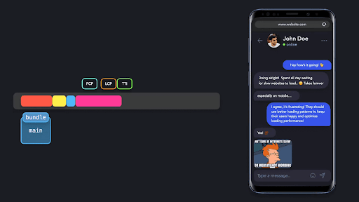

# Oldindan tayyorlash (Prefetch)

Prefetch (`<link rel="prefetch">`) \- bu brauzer optimallashtirishining bir turi bo’lib, u keyingi yo’nalishlar yoki sahifalar uchun zarur bo'lishi mumkin bo'lgan resurslarni oldindan tayyorlash imkonini beradi. Oldindan tayyorlashni bir necha usul yordamida amalga oshirish mumkin. Buni quyidagi misoldagidek HTML’da deklarativ tarzda, HTTP sarlavhasi (`Link: </js/chat-widget.js>; rel=prefetch`), [Service worker’lar](https://googlechrome.github.io/samples/service-worker/prefetch/) yoki Webpack kabi boshqa vositalar orqali amalga oshirish mumkin. 

  

Ko’rinishga yoki foydalanuvchi interaktivligiga asoslangan modullarni qanday import qilishni ko'rsatadigan misollarda, komponentni ko’rsatish/yashirish uchun tugmani bosish va ekranda haqiqiy komponentni ko'rsatish o'rtasida ko'pincha biroz kechikish bo'lishini ko'rdik. Bu kechikish foydalanuvchi tugmani bosganida modul hali ham so'ralishi va yuklanishi kerak bo’lganligi bois yuz berardi\!

  

  

  

  

  

Ko’p hollarda, foydalanuvchilar sahifaning dastlabki renderidan so'ng ma'lum resurslarni darhol so’rashini bilamiz. Garchi bu resurslar darhol ko'rinmasligi sababli dastlabki to'plam paketiga kiritilmasligi kerak bo’lsa-da, foydalanuvchi bilan ishlash qulayligini yaxshilash uchun yuklash vaqtini imkon qadar qisqartirish foydali bo’ladi\! 

Ilovaning ma'lum bir nuqtasida ishlatilish ehtimoli bo'lgan komponentlar yoki resurslarni oldindan tayyorlash mumkin. Import bayonotiga [maxsus izoh](https://webpack.js.org/api/module-methods/#magic-comments) qo‘shish orqali Webpack’ga qaysi to‘plam paketlarini oldindan tayyorlash kerakligini bildirishimiz mumkin: `/* webpackPrefetch: true */`.

  

Ilova yaratilgandan so'ng, biz `EmojiPicker` oldindan tayyorlashini ko’rishimiz mumkin.

  

Haqiqiy chiquvchi natija dokumentimizning `head` qismida `rel=”prefetch”` atributi bilan  `link` tegi sifatida ko'rinadi.

  

Oldindan tayyorlanadigan modullar foydalanuvchi so’rovidan oldin ham brauzer tomonidan so'raladi va yuklanadi. Brauzer bekor turganida va yetarli trafik mavjudligini hisoblsa, u resursni yuklash va uni keshlash uchun so'rov yuboradi. Resursni keshlash yuklash vaqtini sezilarli darajada qisqartirishi mumkin, chunki foydalanuvchi tugmani bosganidan so'ng so'rov tugashini kutish shart emas. U yuklangan resursni to’g’ridan-to’g’ri keshdan odatiy tarzda olishi mumkin.

Ushbu *Prefetching* texnikasi yuklash vaqtini optimallashtirish uchun ajoyib usuli bo'lsa-da, uni haddan tashqari ko’p ishlatmang. Agar foydalanuvchi hech qachon `EmojiPicker` komponentini ishlatmasa, resursni behuda yuklagan bo’lamiz. Bu foydalanuvchiga qo’shimcha xarajat yoki ilovaning sekinlashishiga olib kelishi mumkin. Faqatgina zarur bo’lgan resurslarni oldindan tayyorlang.