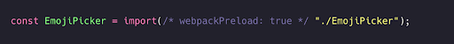

Oldindan yuklash (Preload)

[Preload](https://developer.mozilla.org/en-US/docs/Web/HTML/Preloading_content) (`<link rel="preload">`) \- bu muhim resurslarni (kechroq aniqlanishi mumkin bo’lgan) ertaroq so'rash imkonini beruvchi [brauzer optimallashtirishidir](https://web.dev/uses-rel-preload/). Agar siz asosiy resurslaringizni yuklash tartibini mustaqil boshqarish haqida o'ylayotgan bo'lsangiz, bu [Asosiy Veb Ko’rsatkichlaridagi](https://web.dev/vitals) yuklash unumdorligi va metrikalariga ijobiy ta'sir ko'rsatishi mumkin. Shuni ta’kidlash kerakki, oldindan yuklash barcha muammolarning yechimi emas hamda ba'zi afzallik va kamchiliklarini hisobga olishni talab qiladi. 

  

[Interaktivlikka erishish Vaqti](https://web.dev/tti) yoki [Birinchi Kiritish Kechikishi](https://web.dev/fid) kabi metrikalarni optimallashtirishda interaktivlik uchun zarur bo'lgan JavaScript to'plam paketlarini (yoki bo’laklarini) yuklash uchun oldindan yuklash (preload) foydali bo'lishi mumkin. Shuni yodda tutingki, [FCP](https://web.dev/fcp) yoki [LCP](https://web.dev/lcp) uchun zarur bo’lgan resurslarni (masalan, asosiy tasvirlar yoki shriftlarni) kechiktirish hisobiga interaktivlikni yaxshilashdan qochish uchun oldindan yuklashdan foydalanishda ehtiyot bo’lish kerak. 

Agar siz birinchi tomon JavaScriptni yuklashni optimallashtirmoqchi bo'lsangiz, ushbu resurslarni ertaroq aniqlashga yordam berish uchun dokumentning `<head>` va `<body>` qismlarida `<script defer>` dan foydalanishni ham ko'rib chiqishingiz mumkin. 

## Bir sahifali ilovalarda oldindan yuklash

Oldindan tayyorlash (prefetching) tez orada so'ralishi mumkin bo'lgan resurslarni keshlashning ajoyib usuli bo'lsa-da, biz darhol ishlatilishi kerak bo'lgan resurslarni oldindan yuklash (preloading) orqali yuklab olishimiz mumkin. Ehtimol, bu dastlabki renderda ishlatiladigan ma'lum bir shrift yoki foydalanuvchi darhol ko'radigan ba'zi tasvirlar bo’lishi mumkin.

Aytaylik, `EmojiPicker` komponentimiz dastlabki renderda darhol ko'rinishi kerak. U asosiy to'plam paketiga kiritilmasligi kerak bo’lsa-da, parallel ravishda yuklanishi kerak. Oldindan tayyorlash kabi, Webpack’ga ushbu modulni oldindan yuklash kerakligini bildirish uchun maxsus izoh qo'shishimiz mumkin. 

  

  

  

*Webpack 4.6.0+ versiyalarida importga* `/* webpackPreload: true */` *qo‘shish orqali resurslarni oldindan yuklashga imkon beradi. Webpack’ning eski versiyalarida oldindan yuklashni amalga oshirish uchun webpack konfiguratsiyasiga* [`preload-webpack-plugin`](https://github.com/GoogleChromeLabs/preload-webpack-plugin)’ni *qo'shishingiz kerak bo'ladi.*

  

  

Ilovani yaratgandan so'ng, `EmojiPicker` oldindan yuklanishini ko'rishimiz mumkin. 

  

Haqiqiy chiquvchi natija dokumentimizning `head` qismidada `rel=”preload”` atributi bilan `link` tegi sifatida ko'rinadi.

  

Oldindan yuklangan `EmojiPicker` dastlabkk to'plam paketi bilan parallel ravishda yuklanishi mumkin. `prefetch`’dan farqli o'laroq, brauzer hali resursni oldindan tayyorlashi uchun yetarli darajada yaxshi internet ulanishi va trafik yetarlimi-yo’qmi degan qarorni qabul qilmaydi, oldindan yuklanadigan resurs har qanday holatda ham yuklanadi.

Dastlabki renderdan keyin `EmojiPicker` yuklanishini kutish o'rniga, resurs biz uchun darhol mavjud bo'ladi\! Resurslarni oqilona tartibda yuklayotganimiz sababli, dastlabki yuklash vaqti foydalanuvchining qurilmasi va internet ulanishiga qarab sezilarli darajada oshishi mumkin. Faqat dastlabki renderdan keyin \~1 soniya ichida ko'rinishi kerak bo'lgan resurslarni oldindan yuklang.

## Oldindan yuklash va asinxron yechim

Agar siz brauzerlar skriptni yuqori ustuvorlik sifatida yuklab olishini xohlasangiz, lekin HTML tahlilchisi skriptni kutib to’xtab qolishini istamasangiz, quyidagi oldindan yuklash va asinxronlik usulidan foydalanishingiz mumkin. Boshqa resurslarning yuklanishi bu holatda oldindan yuklash tufayli kechikishi mumkin, ammo bu dasturchi qabul qilishi kerak bo’lgan murosali yechimdir:

  

## Chrome 95+ da oldindan yuklash

Chrome 95+ versiyasida oldindan yuklashning [navbat tartibiga](https://docs.google.com/document/d/1ZEi-XXhpajrnq8oqs5SiW-CXR3jMc20jWIzN5QRy1QA/edit?usp=sharing) oid ba’zi [tuzatishlar](https://twitter.com/patmeenan/status/1436374668450177026) kiritilganligi tufayli, bu funksiyadan kengroq foydalanish biroz xavfsizroq bo‘ldi. Oldindan yuklash bo'yicha Chrome jamoasining a’zosi Pat Meenan quyidagi yangi tavsiyalarni taklif qiladi: 

* Uni HTTP sarlavhalariga joylash barcha resurslardan oldin yuklanishni ta’minlaydi  
* Umuman olganda, o’rta va undan yuqori ustuvorlikdagi oldindan yuklanishlar HTML tahlilchisi (parser) ularga duch keladigan tartibda yuklanadi, shuning uchun HTML boshida oldindan yuklanishlarni joylashtirish ehtiyotkorlikni talab qiladi  
* Shriftlarni oldindan yuklashni `head` qismining oxiri yoki `body` qismining boshiga joylashtirish maqsadga muvofiqdir  
* Import oldindan yuklanishi importga muhtoj bo'lgan skript tegidan keyin joylashtirilishi kerak (asosiy skript avval yuklanib, tahlil qilinishi uchun)  
* Rasmlarni oldindan yuklash past ustuvorlikka ega bo'ladi va ular asinxron skriptlar hamda boshqa past ustuvorlikdagi teglar bilan bog’liq holda tartiblanishi kerak.

## 

## Xulosa

Oldindan yuklashdan tejamkorlik bilan foydalaning va har doim uning foydalanish (production) muhitidagi ta'sirini o'lchang. Agar tasviringiz uchun oldindan yuklash dokumentda kerakli joydan oldinroq joylashgan bo’lsa, bu brauzerlarga uni tezroq aniqlash va boshqa resurslarga nisbatan tartibga solishga yordam beradi. Noto'g'ri qo'llanilganda, oldindan yuklash Birinchi Kontentli Ko’rinish (masalan, CSS, shriftlarni) kechikishiga olib keladi \- bu esa siz xohlagan natijaning aksi bo’lishi ham mumkin. Shuni ham yodda tutish kerakki, bunday qayta ustuvorlashtirish harakatlari samarali bo'lishi uchun serverlar [so'rovlarni to'g'ri ustuvorlashi](https://github.com/andydavies/http2-prioritization-issues#cdns--cloud-hosting-services) ham muhim.

Shuningdek, `<link rel=”preload”>` [skriptlarni bajarmasdan](https://developer.mozilla.org/en-US/docs/Web/HTML/Preloading_content#scripting_and_preloads) yuklab olish kerak bo'lgan holatlar uchun foydali bo'lishi mumkin.