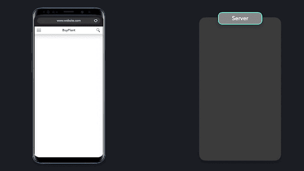

# PRPL pattern

Ilovalarimizni global miqyosda foydalanish uchun ochiq qilish murakkab masala\! Ilova past darajadagi qurilmalarda va internet aloqasi sust bo'lgan hududlarda samarali ishlashini ta’minlashimiz kerak. Ilovamiz murakkab sharoitlarda imkon qadar samarali yuklanishini ta’minlash uchun biz PRPL patternidan foydalanishimiz mumkin.

PRPL patterni to'rtta asosiy samaradorlik jihatlariga e’tibor qaratadi:

* Push (surish) \- muhim resurslarni samarali yetkazish orqali serverga murojaat qilishlar sonini va yuklash vaqtini kamaytirish.  
* Render (renderlash, ko’rsatish) \- Foydalanuvchi bilan ishlash qulayligini yaxshilash uchun dastlabki yo’nalishni (route) imkon qadar tezroq renderlash.  
* Pre-cache (oldindan keshlash) \- Serverga so’rovlar sonini kamaytirish va oflayn rejimda yaxshiroq ishlashni ta’minlash uchun tez-tez tashrif buyuriladigan yo’nalishlar uchun resurslarni orqa fonda oldindan keshlash.  
* Lazy-load (kerakli vaqtda yuklash) \- Kam so’rov yuboriladigan yo’nalishlar yoki resurslarni kerak bo’lgandagina yuklash. 

Veb-saytga kirmoqchi bo'lganimizda, avval ushbu resurslarni olish uchun serverga so'rov yuborishimiz kerak. Server bizga kirish nuqtasi ko’rsatgan faylni qaytaradi \- bu odatda dasturimizning dastlabki HTML fayli bo’ladi\! Brauzerning HTML tahlilchisi ushbu ma'lumotlarni serverdan qabul qila boshlagan zahoti darhol uni tahlil qilishni boshlaydi. Agar tahlilchi stillar jadvallari yoki skriptlar kabi ko'proq resurslar kerakligini aniqlasa, ularni olish uchun serverga yana HTTP so'rovi yuboriladi\!

  

  

  

Resurslarni qayta-qayta so'rash samarali emas, chunki biz klient va server o'rtasidagi muloqotlar sonini iloji boricha kamaytirishga intilamiz\!

Uzoq vaqt davomida klient va server o'rtasida aloqa o'rnatish uchun HTTP/1.1 protokolidan foydalanganmiz. HTTP/1.1 o’zidan oldingi HTTP/1.0’ga nisbatan ko'p yaxshilanishlarni, masalan yangi HTTP so'rovlarini `keep-alive` sarlavhasi yordamida yuborilishidan oldin klient va server o'rtasidagi TCP ulanishini saqlab turish imkoniyatini taqdim etgan bo’lsa-da, lekin hanuz hal qilinishi kerak bo’lgan muammolar yetarlicha mavjud edi\!

HTTP/2 HTTP/1.1’ga nisbatan bir qator muhim o'zgarishlarni olib keldi. Bu o’zgarishlar klient va server o'rtasidagi ma’lumot almashinuvini optimallashtirishni ancha osonlashtirdi.

HTTP/1.1 so'rovlar va javoblarda yangi qatorga ajratiladigan oddiy matnli protokoldan foydalangan bo'lsa, HTTP/2 ularni “freymlar” deb ataladigan kichikroq qismlarga ajratadi. Sarlavha va asosiy qismdan iborat HTTP so'rovi kamida ikkita freym: sarlavha va ma’lumot freymlariga bo'linadi. 

HTTP/1.1’da klient va server o'rtasida maksimal 6 ta TCP ulanish mavjud edi. Bir TCP ulanishi orqali yangi so'rov yuborishdan oldin, avvalgi so'rov yakunlanishi kerak edi\! Agar oldingi so‘rovni hal qilish uchun uzoq vaqt ketayotgan bo‘lsa, bu so‘rov boshqa so‘rovlarni yuborishni bloklaydi. Ushbu keng tarqalgan muammo “navbat boshini blokirovka qilish” deb ataladi va ma'lum resurslarni yuklash vaqtini oshirishi mumkin\!

HTTP/2 ikki tomonlama oqimlardan foydalanadi, bu esa klient va server o'rtasida bir nechta so’rov va javob freymlarini o'tkazishi mumkin bo'lgan bir nechta ikki tomonlama oqimlarni o'z ichiga olgan bitta TCP ulanishiga ega bo'lish imkonini beradi\!

Server ushbu maxsus so'rov uchun barcha so'rov freymlarini qabul qilgandan so'ng, ularni qayta yig'adi va javob freymlarini yaratadi. Ushbu javob freymlari ularni qayta yig'adigan klientga qaytariladi. Oqim ikki yo‘nalishli bo‘lgani uchun biz so’rov va javob freymlarini bir xil oqim orqali yuborishimiz mumkin. 

  

HTTP/2 oldingi so'rov hal bo'lgunga qadar bir xil TCP ulanishi bilan bir nechta so’rovlarni yuborishga ruxsat berish orqali navbat boshi blokirovkasi muammosini hal qiladi\! 

HTTP/2 shuningdek, server tomonidan surish (server push) deb nomlangan ma'lumotlarni yuklashning yanada optimallashtirilgan mexanizmini taqdim etdi. HTTP so'rovlarini har safar alohida yuborish o'rniga, server kerakli qo’shimcha resurslarni "push" qilish orqali avtomatik ravishda yuborishi mumkin.

  

  

  

  

Klient qo'shimcha resurslarni qabul qilgandan so'ng, ular brauzer keshida saqlanadi. Keyinchalik, kirish faylini tahlil qilish jarayonida bu resurslar kerak bo’lganda, brauzer serverga yangi HTTP so'rovini yuborish o'rniga, ularni to’g’ridan-to’g’ri keshdan olishi mumkin\!

Garchi resurslarni *push* qilish qo'shimcha resurslarni olish vaqtini qisqartirsa-da, *server push* mexanizmi HTTP kesh tizimi bilan integratsiya qilinmagan\! Ya’ni veb-saytga keyingi safar tashrif buyurganimizda, avval *push* qilingan resurslar keshda saqlanmaydi va ularni qayta so'rashga to'g'ri keladi. Bu muammoni hal qilish uchun PRPL patterni dastlabki yuklanishdan so’ng [service worker](https://developer.mozilla.org/en-US/docs/Web/API/Service_Worker_API)’lardan foydalanadi. *Service worker*’lar resurslarni keshlaydi va klientning keraksiz so’rovlar yuborishining oldini oladi.

Sayt yaratuvchilari sifatida biz qaysi resurslarni erta bosqichda yuklash muhimligini aniq bilamiz, brauzerlar esa buni tahmin qilishga harakat qiladi. Yaxshiyamki, biz muhim resurslarga `preload` ko’rsatmasini qo'shish orqali brauzerga yordam bera olamiz\!

Brauzerga ma'lum bir resursni oldindan yuklash kerakligini aytganingizda, siz brauzerga uni o’zi topishidan ham ko'ra tezroq yuklashni xohlayotganingizni bildirgan bo’lasiz\! Oldindan yuklash \- joriy yo’nalish uchun juda muhim bo'lgan resurslarni yuklash vaqtini optimallashtirishning ajoyib usuli hisoblanadi.

Resurslarni oldindan yuklash server bilan aloqa sonini kamaytirish va yuklash vaqtini optimallashtirish uchun yaxshi usul bo'lsa-da, haddan tashqari ko’p fayllarni *push* qilish zararli bo'lishi mumkin. Brauzer keshi cheklangan va siz klientga aslida kerak bo'lmagan resurslarni so'rash orqali internet trafigidan behuda foydalanayotgan bo'lishingiz ehtimoli mavjud.

PRPL patterni dastlabki yuklashni optimallashtirishga qaratilgan. Boshlang'ich yo’nalish to’liq yuklanib, render qilinmaguncha boshqa hech qanday resurs yuklanmaydi\!

Bunga ilovamizni kichik, samarali to’plam paketlari (bundle)ga ajratish (code-splitting) orqali erishishimiz mumkin. Ushbu to'plam paketlari foydalanuvchilarga faqat o'zlariga kerak bo'lgan resurslarni aynan kerak bo'lgan vaqtda yuklash imkonini berishi va shu bilan birga keshlash imkoniyatini maksimal darajada oshirish kerak\!

Katta to’plam paketlarini keshlash muammoli bo'lishi mumkin. Ba’zida bir nechta to'plam paketlari bir xil resursladan foydalanishi mumkin.

  

Brauzer to'plam paketning qaysi qismlari turli yo’nalishlar o'rtasida umumiy ekanligini aniqlashda qiynaladi va shuning uchun bu resurslarni keshlay olmaydi. Resurslarni keshlash esa serverga murojaatlar sonini kamaytirish va ilovamizni oflayn rejimda ishlashi uchun muhim ahamiyatga ega\!

PRPL patterni bilan ishlayotganda, biz so'rayotgan to'plam paketlar ayni vaqtda kerak bo'lgan resurslarning minimal miqdorini o'z ichiga olishiga va brauzer tomonidan keshlanishi mumkinligiga ishonch hosil qilishimiz kerak. Ba'zi hollarda, umuman to'plam paketlarsiz ishlash yanada samaraliroq bo’lishi va shunchaki to’plamlarga ajratilmagan modullar bilan ishlashimiz mumkin\!

Ilovani to'plam paketlariga ajratish orqali minimal resurslarni dinamik ravishda so'rashning afzalligi brauzer va serverni HTTP/2 *push*’ni qo'llab-quvvatlash uchun sozlash va resurslarni samarali keshlash orqali ham amalga oshirishi mumkin. HTTP/2 *server push*’ni qo'llab-quvvatlamaydigan brauzerlar uchun esa server bilan aloqalar sonini minimallashtirish uchun optimallashtirilgan versiyani yaratishimiz mumkin. Klient to'plam paketlariga ajratilgan yoki ajratilmagan resurs olayotganini bilishi shart emas: server har bir brauzer uchun mos versiyani yetkazib beradi.

PRPL patterni ko'pincha asosiy kirish nuqtasi sifatida ilova qobig'i (app shell)dan foydalanadi. Bu minimal fayl bo’lib, ilovaning asosiy logikasini ko'p qismini o'z ichiga oladi va barcha yo’nalishlar uchun umumiy hisoblanadi\! Shuningdek, u kerakli resurslarni dinamik ravishda so’ray oladigan ilova router’ini ham o'z ichiga oladi.

  

  

  

PRPL patterni foydalanuvchi qurilmasida boshlang'ich yo’nalish ko’rinmaguncha boshqa resurslar so'ralmasligi yoki render qilinmasligini ta’minlaydi. Dastlabki yo’nalish muvaffaqiyatli yuklangandan so'ng, *service worker* orqa fonda tez-tez tashrif buyuriladigan boshqa yo’nalishlar uchun resurslarni yuklash uchun o'rnatilishi mumkin\!

  

  

  

  

  

  

Ushbu ma'lumotlar orqa fonda yuklanayotganligi sababli, foydalanuvchi hech qanday kechikishlarni sezmaydi. Agar foydalanuvchi *service worker* tomonidan keshlangan tez-tez tashrif buyuradigan yo’nalishga o'tmoqchi bo'lsa, *service worker* serverga so'rov yuborish o'rniga keshdan kerakli resurslarni tezda oladi.

Kam tashrif buyuriladigan yo’nalishlar uchun resurslar esa dinamik ravishda import qilinishi mumkin. 