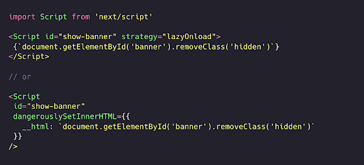

Uchinchi tomon resurslarini yuklashni optimallashtirish

*Uchinchi tomon resurslari saytlarning ishlashini sekinlashtirishi va ularni optimallashtirish murakkab vazifa bo'lishi mumkin. Turli xil uchinchi turdagi tomon resurslarini samarali ravishda yuklash yoki kechiktirish uchun ma’lum eng yaxshi amaliyotlarga amal qilishingiz mumkin. Shuningdek, [Next.js Script komponenti](https://nextjs.org/docs/pages/building-your-application/optimizing/scripts) kabi framework darajasidagi komponentlardan foydalanishingiz mumkin \- bu komponent uchinchi tomon skriptlarini “qachon” va “qanday” yuklash uchun tayyor shablon taqdim etadi. Bundan tashqari, [Partytown](https://github.com/BuilderIO/partytown) kabi eksperimental yechimlar ham e’tiborga loyi bo’lishi mumkin.*

Bugungi kunda alohida ishlayotgan zamonaviy saytni topish qiyin. Aksariyat saytlar ma'lumotlar, funksiyalar, kontent va boshqa ko'plab resurslar uchun Internetdagi boshqa manbalar bilan o’zaro bog'liq va ularga tayanadi. Boshqa domenda joylashgan va saytingiz tomonidan foydalanadigan har qanday resurs saytingiz uchun uchinchi tomon (3P) resursi hisoblanadi. Saytlarga qo’shiladigan odatiy uchinchi tomon resurslari quyidagilarni o'z ichiga oladi:

* Xaritalar, videolar, ijtimoiy tarmoqlar va chat xizmatlari uchun joylashtirilgan komponentlar;  
* Reklamalar;  
* Analitika komponentlar va tag menejerlar;  
* A/B testlash va personallashgan skriptlar;  
* Ma'lumotlarni vizualizatsiya qilish yoki animatsiyalar uchun tayyor yordamchi funksiyalarni taqdim etuvchi yordamchi kutubxonalar;  
* Bot aniqlovchi [reCAPTCHA](https://www.google.com/recaptcha/about/) yoki CAPTCHA;

Kontentingizga qo’shimcha qiymat beruvchi funksiyalarni integratsiya qilish yoki saytni noldan yaratish bilan bog'liq murakkabliklarni kamaytirish uchun uchinchi tomon resurslaridan foydalanishingiz mumkin. 2021-yilgi Web Almanac hisobotiga ko'ra, Internetdagi sahifalarning [94%](https://almanac.httparchive.org/en/2021/third-parties#prevalence) dan ortig’i uchinchi tomon resurslaridan foydalanadi \- bunda [rasmlar va JavaScript](https://almanac.httparchive.org/en/2020/third-parties#content-types) eng ko’p ishlatiladigan tashqi kontent hisoblanadi. Quyida kontent turi va toifasi bo’yicha uchinchi tomon so’rovlarining foydali [taqsimoti](https://almanac.httparchive.org/en/2021/third-parties#fig-10) keltirilgan:

  

Uchinchi tomon resurslari saytingizni foydali xususiyatlar bilan boyitishi mumkin bo'lsa-da, quyidagi hollarda uni ishlashini sekinlashtirishi mumkin:

* Har bir kerakli resurs uchun uchinchi tomon domeniga qo'shimcha so’rovlar yuborishi kerak bo'ladi.  
* JavaScript kodidan ko'p foydalanadi (yuklab olish va bajarish vaqtiga ta'sir qiladi) yoki optimallashtirilmagan tasvirlar/videolar tufayli hajmi katta.  
* Individual sayt egalari ularning ishlashiga ta'sir o’tkaza olmaydi va ularning xatti-harakatlari kutilmagan bo’lishi mumkin.  
* Sahifadagi boshqa muhim resurslarning render qilinishini bloklashi va [Core Web Vitals](https://web.dev/vitals/) (CWV) ko’rsatkichlariga ta'sir qilishi mumkin.

Ushbu muammolarga qaramay, uchinchi tomon resurslari biznesingiz uchun muhim bo'lishi mumkin. Agar ulardan voz kecha olmasangiz, keyingi eng yaxshi yechim \- ularning ishlash samaradorligiga ta'sirini kamaytirish uchun optimallashtirishdir. Biz ushbu bo'limda aynan shu mavzuni ko'rib chiqamiz.

Biz uchinchi tomon skriptlarining har xil turlariga taalluqli bo’lgan ayrim strategiyalar va eng yaxshi amaliyotlarni kiritdik. *Next.js Script* komponenti ushbu eng yaxshi amaliyotlarning ko'pini o'z ichiga oladi va siz bu haqida ushbu maqolaning ikkinchi qismida bilib olishingiz mumkin. Keling, birinchi navbatda uchinchi tomon skripti sahifaning ishlash samaradorligiga qanday salbiy ta’sir ko’rsatayotganini aniqlash usullarini ko'rib chiqaylik.

## 3P resurslarining ishlash samaradorligiga ta’sirini baholash

Uchinchi tomon kodlari saytingizga qanday ta'sir qilishini aniqlash uchun bir nechta usullardan foydalanishingiz mumkin.

* Quyidagi Lighthouse tekshiruvlari CWV’ga ta'sir qiluvchi sekin uchinchi tomon skriptlarini aniqlashga yordam beradi.  
  * Asosiy thread’ni bloklaydigan skriptlar uchun [uchinchi tomon kodlarining ta'sirini kamaytiring](https://web.dev/third-party-summary/)  
  * Bajarilishi uzoq davom etadigan skriptlar uchun [JavaScript bajarilish vaqtini](https://web.dev/bootup-time/) qisqartiring.   
  * Katta skriptlar uchun haddan tashqari katta [tarmoq yuklamalaridan saqlaning](https://web.dev/total-byte-weight/). 

  

  

  

* [Bloklash effektiga ega uchinchi tomon skriptlarini](https://nooshu.com/blog/2019/10/02/how-to-read-a-wpt-waterfall-chart/#third-party-blocking-javascript) aniqlash uchun WebPageTest (WPT) sharsharali diagrammasidan yoki [uchinchi tomon teglarining taʼsirini o’lchash](https://andydavies.me/blog/2018/02/19/using-webpagetest-to-measure-the-impact-of-3rd-party-tags/) uchun WPT yonma-yon taqqoslashdan foydalaning.  
* [Bundlephobia](https://bundlephobia.com/) kabi saytlar to'plam paketlaringizga mavjud npm paketlarini qo'shishning “narxini” baholashga yordam beradi. Bundan tashqari, [npm paket qidiruvi](https://www.npmjs.com/package/) yordamida har qanday paketning hajmi va qaramliklarini topishingiz mumkin.

Muammoli uchinchi tomon kodini aniqlash bo'yicha ushbu fon bilan uni optimallashtirish yo'llarini ko'rib chiqaylik.

## Optimallashtirish strategiyalari

Uchinchi tomon kodi sizning nazoratingiz ostida bo’lmaganligi sababli, kutubxonalarni to'g'ridan-to'g'ri optimallashtirib bo’lmaydi. Bu sizga ikkita imkoniyat qoldiradi:

1. Almashtirish yoki olib tashlash: Agar uchinchi tomon skriptining foydasi uning ishlash tezligining ta’siriga mos kelmasa, uni olib tashlashni o'ylab ko'ring. Shuningdek, shunga o'xshash funksionallikni ta'minlaydigan, ammo yengilroq boshqa muqobil variantlarni ham ko’rib chiqishingiz mumkin. [Ushbu](https://www.patterns.dev/posts/nextjs-casestudy/#packages-switched) amaliy misolda biz yengilroq muqobillar va shunga o'xshash xususiyatlarga ega paketlarni almashtirish orqali filmlar ilovasining ishlashini qanday yaxshilaganimizni muhokama qilamiz.  
2. Yuklash ketma-ketligini optimallashtirish: Yuklash jarayoni brauzerda bir nechta birinchi va uchinchi tomon resurslarini yuklashni o'z ichiga oladi. Optimal yuklash strategiyasini ishlab chiqish uchun siz turli xil resurslar uchun brauzer belgilagan ustuvorlikni, ularning sahifadagi joylashuvini va veb-sahifa uchun har bir resurs qiymatini hisobga olishingiz kerak. Biz [React/Next.js ilovasi uchun optimal yuklash ketma-ketligini](https://www.patterns.dev/vanilla/loading-sequence/) taklif qildik. Endi bu turli xil uchinchi tomon resurslariga qanday qo’llanilishini va ularni optimal tarzda yuklash uchun qanday qadamlar qo'yishimiz mumkinligini ko'rib chiqamiz.

### Uchinchi tomon resurslarini samarali yuklash

Quyida to'g'ri qo’llanilganda uchinchi tomon resurslarining ishlash tezligiga ta’sirini kamaytiradigan, vaqt sinovidan o'tgan eng yaxshi amaliyotlar keltirilgan.

Skriptlarning boshqa kontentni bloklashiga yo'l qo'ymaslik uchun async yoki defer’dan foydalaning.  
Qo'llanilishi mumkin: Muhim bo’lmagan skriptlar (teg menejerlari, analitika).

JavaScriptni yuklab olish va bajarish standart bo'yicha sinxron bo'lib, asosiy thread’da HTML tahlilchisi va DOM qurilshini bloklashi mumkin. [`<script>`](https://developer.mozilla.org/en-US/docs/Web/HTML/Element/script) elementida [async](https://developer.mozilla.org/en-US/docs/Web/HTML/Element/script#attr-async) yoki [defer](https://developer.mozilla.org/en-US/docs/Web/HTML/Element/script#attr-defer) atributlaridan foydalanish brauzerga skriptlarni asinxron tarzda yuklab olishga ko’rsatma beradi. Siz bulardan asosiy renderlash yo’li uchun zarur bo’lmagan har qanday skriptni yuklash uchun foydalanishingiz mumkin (masalan, asosiy UI komponenti).

* `defer`: skript tahlillovchi bajarilayotgan vaqtda parallel ravishda yuklanadi va skriptning bajarilishi tahlil qilish jarayoni tugaguniga qadar kechiktiriladi. DOM qurilishi tugaguncha bajarilishni kechiktirish uchun `defer` standart tanlov bo'lishi kerak.  
* `async`: skript tahlil qilish vaqtida parallel ravishda yuklanadi, lekin tayyor bo’lishi bilanoq darhol bajariladi va bu vaqtda tahlillovchini to’xtatib qo’yadi. Qaramliklari bo'lgan modul skriptlari uchun skript va uning barcha qaramliklari `defer` navbatida bajariladi. Yuklash jarayonida avvalroq ishlashi kerak bo'lgan skriptlar uchun `async`’dan foydalaning. Misol uchun, erta sahifa yuklash ma'lumotlarini yo’qotmaslik uchun muayyan analitika skriptlarni ertaroq bajarishni xohlashingiz mumkin.

  

  

*Manbaa: [developers.google.com](https://developers.google.com/web/fundamentals/performance/optimizing-content-efficiency/loading-third-party-javascript)*

Bu yerda e’tibor berish kerak bo'lgan nozik jihat shundaki, *async* va *defer* brauzerning resurslarga berilgan ustuvorligini pasaytiradi, bu esa ularning ancha kechroq yuklanishga olib keladi. Ustuvorlik ko’rsatmalari ([Pritority hints](https://web.dev/articles/fetch-priority)) yangi xususiyati ushbu muammoni hal qilishga yordam berishi mumkin.

### Resurs ko’rsatmalari yordamida kerakli manbalar bilan oldindan ulanishlarni o’rnating

Qo'llanilishi mumkin: Muhim skriptlar, shriftlar, CSS, uchinchi tomon CDN’laridan olingan rasmlar.

Uchinchi tomon manbalariga ulanish har bir uchinchi tomon serveri uchun zarur bo'lgan DNS qidiruvlari, qayta yo'naltirishlar va ko’p marta aloqa o’rnatishlar tufayli sekin bo'lishi mumkin. Resurs ko’rsatmalari \- DNS oldindan tayyorlash (dns-prefetch) va oldindan ulanish (preconnect) funksiyalari sahifa yuklash jarayonining boshida ulanishlarni tayyorlash orqali sozlashlar uchun ketadigan vaqtni qisqartirishga yordam beradi.

Domenga mos keladigan [dns-prefetch](https://developer.mozilla.org/en-US/docs/Web/Performance/dns-prefetch) resurs ko’rsatmasi qo’shish DNS qidiruvini oldindan amalga oshiradi va shu bilan DNS qidiruvlari bilan bog'liq kechikishni kamaytiradi. Buni eng muhim resurslar uchun [preconnect](https://developer.mozilla.org/en-US/docs/Web/HTML/Link_types/preconnect) bilan birga ishlatishingiz mumkin. Oldindan ulanish DNS qidiruviga qo'shimcha ravishda TCP aloqalarini o’rnatish va TLS muzokaralarini amalga oshirish orqali uchinchi tomon domeniga ulanishni boshlaydi.

  

[Ideal yuklash ketma-ketligi](https://www.patterns.dev/posts/loading-sequence/#proposed-sequence-with-3p) haqidagi maqolamizda *preconnect* funksiyasidan foydalanish kerak bo'lgan uchinchi tomon resurslari ro'yxati keltirilgan.

Resurs ko'rsatmalaridan foydalanishning afzalliklari ushbu misolda yaqqol ko'rinib turibdi, unda Andy Davies *preconnect* yordamida uchinchi tomon CDN tasviriga erta ulanishni o’rnatish orqali asosiy mahsulot tasvirini [yuklash vaqtini qanday qisqartirgani](https://andydavies.me/blog/2019/03/22/improving-perceived-performance-with-a-link-rel-equals-preconnect-http-header/) muhokama qiladi.

"*Amaliy ko'rsatkichlar o'rtacha qiymatda 400 ms yaxshilanishni va 95 foizda 1 soniyadan ko'proq yaxshilanishni ko'rsatdi.*"

Xuddi shunday, bot aniqlash (reCaptcha) va ruxsat boshqaruvi (consent management) kabi muhim uchinchi tomon xizmatlari uchun yuklash vaqtini optimallashtirish maqsadida resurs ko’rsatmalaridan foydalanishingiz mumkin.

### Sahifaning pastki qismidagi uchinchi tomon resurslarini kerakli vaqtda yuklash

Qo’llanilishi mumkin: YouTube, Xaritalar, Reklamalar va ijtimoiy tarmoqlar uchun joylashtirilgan komponentlar (embed) 

Ijtimoiy tarmoq oqimlari (feed), reklamalar, YouTube videolari va xaritalar uchun ishlatiladigan uchinchi tomon joylashtirilgan komponentlari veb-sahifalarning ishlash samaradorligini pasaytiradi. Biroq, bunday komponentlarning barchasi sahifa yuklanganda foydalanuvchilarga ko'rinmasligi va foydalanuvchi pastga aylantirganida *lazy-loading* texnikasi orqali yuklanishi mumkin. Brauzer qo’llab-quvvatlashiga qarab turli xil *lazy-loading* usullaridan foydalanishingiz mumkin: 

1. [loading](https://web.dev/iframe-lazy-loading/) atributi odatda YouTube yoki Google Xaritalar kabi uchinchi tomon komponentlarini yuklash uchun ishlatiladigan tasvirlar va iframelar bilan ishlatilishi mumkin.  
2. [IntersectionObserver API](https://developers.google.com/web/updates/2016/04/intersectionobserver)’dan foydalangan holda maxsus implementatsiya kuzatilayotgan element brauzerning ko'rish maydoniga qachon kirishi yoki chiqishini aniqlash imkonini beradi.  
3. [Lazy-sizes](https://github.com/aFarkas/lazysizes) \- sizning o’rningizga kerakli vaqtda yuklashni amalga oshiradigan mashhur JavaScript kutubxonasi.

Kerakli vaqtda yuklash komponentlarining boshqa varianti \- sahifa yuklanishida foydalanuvchilarga ko'rsatiladigan statik yoki dinamik old fasad ko’rinishi (facade). Xarita komponentini yuklash o'rniga, siz xaritada ma'lum bir hududni ko'rsatish uchun haqiqiy komponentning statik tasviridan foydalanishingiz mumkin. Shu bilan bir qatorda, joylashtirilgan komponentga o'xshash, lekin foydalanuvchi uni bosganda yoki u interaktivlikka kirishgandagina yuklanadigan fasaddan foydalanishingiz mumkin. Mashhur komponentlar uchun fasadlarni amalga oshirishning ba'zi usullari orasida xaritalar uchun [Map Static API](https://developers.google.com/maps/documentation/maps-static/overview), Twitter komponentlari uchun [Tweetpik](https://tweetpik.com/), YouTube uchun [lite-youtube-embed](https://github.com/paulirish/lite-youtube-embed), chat vidjetlari uchun [React-live-chat-loader](https://github.com/calibreapp/react-live-chat-loader) kutubxonalari mavjud. Ushbu texnikalar borasida batafsil muhokama [bu yerda](https://web.dev/embed-best-practices/) mavjud.

Kerakli vaqtda yuklash (lazy-loading) va fasadlar bilan bog'liq muhim eslatmalar:

* YouTube uchun fasad iOS va MacOS 11+ da Safari brauzerida biroz boshqacha ishlaydi. Birinchi marta bosish haqiqiy joylashtirilgan video komponentini yuklaydi. Videoni ijro etish uchun foydalanuvchilar yana bir marta bosishlari kerak bo‘ladi.  
* Agar joylashtirilgan komponent hajmi ko'rsatilmagan bo'lsa, kerakli vaqtda yuklash sahifa tartibining o’zgarishi muammosiga (layout shift) olib kelishi va foydalanuvchi bilan ishlash qulayligiga ta'sir qilishi mumkin. Ushbu muammoni oldini olish uchun barcha keraklil vaqtda yuklanadigan komponentlar yoki ularning konteyner elementlari uchun o'lchamni belgilashingiz kerak.

### Qo’shimcha so’rovlarni kamaytirish uchun 3P skriptlarini o’zingizning serveringizda joylashtiring

Qo’llanilishi mumkin: JavaScript fayllari, shriftlar

*Preconnect* yoki *dns-prefetch* uchinchi tomon manbalariga ulanishni erta boshlashga imkon bersa ham, ulanishlar baribir talab qilinadi. Bundan tashqari, uchinchi tomon manbalari bilan ularning keshlash strategiyasiga tayanishingiz kerak b’olad, bu esa optimal yechim bo'lmasligi mumkin.

Skriptlarning nusxasini o’z serveringizda joylashtirish sizga skriptlarni yuklash va keshlash jarayonini yaxshiroq nazorat qilish imkonini beradi. O’z serveringizda joylashtirish DNS qidiruvi uchun zarur bo'lgan vaqtni qisqartiradi va [HTTP keshlash](https://developers.google.com/web/fundamentals/performance/optimizing-content-efficiency/http-caching) yordamida skriptlarni keshlash strategiyasini yaxshilash imkonini beradi. Shuningdek, foydalanuvchiga kerak bo'lishini biladigan skriptlar uchun [HTTP/2 server push](https://www.smashingmagazine.com/2017/04/guide-http2-server-push/)’dan foydalanishingiz mumkin. [Casper.com](http://Casper.com) buning [ajoyib misoli](https://medium.com/caspertechteam/we-shaved-1-7-seconds-off-casper-com-by-self-hosting-optimizely-2704bcbff8ec) \- ular [Optimizely](https://www.optimizely.com/) tomonidan taqdim etilgan uchinchi tomon skriptlarini o’z serverlarida joylashtirish orqali bosh sahifasining ko'rsatilish vaqtini 1,7 soniyaga yaxshilagan.

O’z serveringizda joylashtirilgan uchinchi tomon skriptlari nusxalari bilan, asl nusxadagi o'zgarishlar asosida o’z nusxangizni muntazam yangilab turishingiz kerak bo’ladi. Yangilanishlarsiz skript eskirib qolishi, muhim tuzatishlar yoki bog'liqliklarga mos keladigan o'zgarishlar yetishmayotgan bo'lishi mumkin. CDN o'rniga oddiy serverda joylashtirish, shuningdek, CDN tomonidan qo'llaniladigan [edge-caching](https://www.cloudflare.com/learning/cdn/glossary/edge-server/) mexanizmlaridan foydalanishingizga to'sqinlik qiladi.

### Imkon bo’lgan joylarda skriptlarni keshlash uchun service worker’lardan foydalaning

Qo’llanilishi mumkin: JavaScript fayllari, shriftlar bilan foydalaniladi.

O’z serverida joylashtirish (self-hosting) tez-tez o'zgarib turadigan skriptlar uchun mos bo'lmasligi mumkin. Bunday uchinchi tomon skriptlari uchun keshlashni yaxshilash maqsadida *service worker’lardan* foydalanishingiz mumkin, shu bilan birga CDN *edge caching* mexanizmidan ham foydalanish imkoniyati saqlanib qolinadi. Ushbu uslub sizga tarmoq orqali qayta yuklashlar chastotasini yaxshiroq boshqarish imkonini beradi. Bu texnikani texnikani *preconnect* bilan birgalikda qo’llash orqali tarmoq so’rovlari “narxini” yanada kamaytirishimiz mumkin. Shuningdek, resurslarni shunday yuklashingiz mumkinki, muhim bo'lmagan uchinchi tomon skriptlari uchun so'rovlar sahifa foydalanuvchining asosiy holatiga yetguncha kechiktiriladi.

### Ideal yuklash ketma-ketligiga rioya qiling

Turli xil uchinchi tomon resurslari va ularning sahifa ahamiyati uchun ahamiyati bo’yicha yuqoridagi ko'rsatmalarni hisobga oling. Har bir resursdan maqsadli foydalanishga asoslanib, sahifani tezroq yuklash uchun birinchi va uchinchi tomon resurslarini optimal tarzda birlashtirish maqsadida bog‘lashda [ideal yuklash ketma-ketligiga](https://www.patterns.dev/posts/loading-sequence/#proposed-sequence-with-3p) rioya qilishingiz mumkin.

### Skript turi bo’yicha eng yaxshi amaliyotlar

Ba'zi skriptlarni optimallashtirish boshqalarga qaraganda osonroq. Turli uchinchi tomon resurslarini optimallashtirish, kuzatilgan ba'zi odatiy cheklovlar va ularni yuklash bo’yicha mutaxassislar bilan muhokama qiziqarli xulosalarga olib keldi. Umumiy g’oya shundan iboratki, ko'pchilik foydalanuvchilar kontentning ma'lum bir qismi ko'rinmaguncha sayt bilan interaktivlikka kirishmaydilar. Quyida turli xil skript turlariga xos ko'rsatmalar keltirilgan.

### Muhim bo’lmagan Javascript

Chat vidjetlari yoki analitika skriptlari kabi uchinchi tomon resurslarining aksariyati foydalanuvchi bilan ishlash qulayligi uchun muhim emas va ularni kechiktirish mumkin. `defer` skript atributidan foydalanish ushbu skriptlarning yuklanishi va bajarilishini kechiktirishning eng keng tarqalgan usuli hisoblanadi.

Reklama yoki analitika guruhlari skriptlarni kechiktirish ilovaning ko'rinishi va reklama daromadiga ta'siri haqida xavotirlanishlari mumkin. [Telegraph’ning amaliy misoli](https://medium.com/the-telegraph-engineering/improving-third-party-web-performance-at-the-telegraph-a0a1000be5) bu borada ko’p keltiriladi \- bu unda barcha skriptlarni kechiktirish hech qanday analitika yoki reklama ko'rsatkichlarini buzmagani, aksincha, birinchi reklama yuklash vaqti o'rtacha 4 soniyaga yaxshilangani ko’rsatilgan. Ba'zi dasturchilar uchinchi tomon resurslarining yuklanishini [sahifa interaktiv bo'lgunga qadar kechiktirish uchun yechimlarni ishlab chiqdilar.](https://www.renderbetter.com/guides/improving-shopify-site-speed-can-increase-conversions-case-study)

### Bot aniqlovchi/ReCaptcha

Botlarning veb-formalaringizga kirishini oldini olish uchun, dasturchilar odatda ushbu skriptlarni iloji boricha ertaroq yuklaydilar. Biroq, ReCaptcha katta hajmdagi Javascript kodi va asosiy thread’da sezilarli iz qoldirishi tufaylui, uni kerak bo’lguncha kechiktirish uchun sabab bor. Ushbu skriptni optimallashtirishning bir necha usullari bor:

1. Uni faqat bot tomonidan spam qilinishi mumkin bo'lgan foydalanuvchi kiritadigan formalar mavjud sahifalardagina yuklang.  
2. Foydalanuvchi forma elementlari bilan ishlayotganda, masalan forma fokusida, skriptni [kerakli vaqtda yuklang](https://dev.to/uf4no/improve-page-performance-lazy-loading-recaptcha-442o).  
3. Sahifani yuklanishini bajarish uchun skript kerak bo'lganda, oldindan ulanishlarni o'rnatish uchun resurs ko’rsatmalaridan foydalaning.

### Google Teg Menejer (GTM)

Katta saytlar ko'pincha [Google Teg Menejerga](https://marketingplatform.google.com/about/resources/tag-manager-product-overview/) marketing guruhlari yoki agentliklariga kirish huquqini beradi. Bu ularga yaxshiroq kuzatuv uchun saytning barcha sahifalariga yangi marketing teglarini qo'shish imkonini beradi. Ishlash samaradorligi (performance) marketing jamoasi uchun asosiy masala emas va ularning hammasi ham teglarni o'ylamasdan qo'shish saytni sekinlashtirishi mumkinligini bilmaydi. GTM skriptlarini optimallashtirishda asosiy e’tibor [GTM’ga kimlar kirishini nazorat qilish](https://www.tunetheweb.com/blog/adding-controls-to-google-tag-manager/) va ular kiritgan o'zgarishlarni kuzatishga qaratiladi.

Siz sayt egalari tashqi agentlikka emas, balki hisobga egalik qilishiga ishonch hosil qilishdan boshlashingiz mumkin. Bu teglarni qo'shish, tahrirlash va nashr etish huquqlarini mayda detallik darajasigacha batafsil boshqarish imkonini beradi. Ishlab chiqish va marketing bo'limlari o'rtasida yangi teglarni tekshirish va foydalanilmayotgan teglarni olib tashlash uchun [yaxshi hamkorlik](https://medium.com/the-telegraph-engineering/improving-third-party-web-performance-at-the-telegraph-a0a1000be5) o’rnatish mumkin.

Sizning saytingizga barcha sahifalarda GTM kerak bo'lmasligi mumkin (masalan, marketing guruhi tomonidan elektron tijorat saytining to’lov sahifasida hodisalarni kuzatish uchun hech qanday sabab yo'q). Keraksiz GTM qo'shimchalarini olib tashlash uchun har bir sahifa alohida tekshirilishi kerak. Cookie bannerlaridan foydalanadigan saytlar, agar foydalanuvchi cookie-fayllarni rad etsa, GTM’ni yuklamaslikni ham tanlashi mumkin. Va nihoyat, agar siz GTM’ni sahifaga yuklashingiz kerak bo'lsa, asosiy kontentni yuklaganingizdan so'ng skriptlarni ishga tushirish uchun kechiktirishingiz mumkin.

Eski uchinchi tomon skript teglari uchun qo'llaniladigan yana bir optimallashtirish [`document.write()`](https://developer.mozilla.org/en-US/docs/Web/API/Document/write) bilan bog'liq. `document.write()` yordamida skriptlarni kiritish xavfli va brauzer hamda skript turiga qarab ogohlantirishlar yoki xatolarga olib kelishi mumkin. Ba'zi uchinchi tomon skriptlari hali ham ushbu usuldan foydalanadi. GTM o'zining [Maxsus HTML teg yaratish](https://support.google.com/tagmanager/answer/6107167?hl=en) interfeysida *“Support document.write()”* deb nomlangan konfiguratsiyani taqdim etadi. Agar bu yoqilgan bo'lsa, Google Teg Menejer vaqtinchalik standart `document.write()` funksiyasini o'zining xavfsiz versiyasi bilan almashtiradi.

### A/B Testlash va  Personallashtirish

Saytlar veb-sahifaning qaysi versiyasi yaxshiroq ishlashini tekshirish uchun [A/B testlarini](https://www.optimizely.com/optimization-glossary/ab-testing/) o'tkazadi. Sahifaning ikkita variantidan biri tanlangan foydalanuvchilar guruhida turli foydalanuvchilar uchun yuklanadi. A/B testlari ular ishga tushirilgan sahifalarning ishlash samaradorligiga sezilarli ta'sir ko'rsatishi mumkin, bunda har bir test yuklash vaqtiga 1 soniya qo'shishi mumkin. Hozirgi vaqtda ko'plab A/B testlari tashqi uchinchi tomon resurslari orqali olinadi va dasturchilar ushbu testlar uchun foydalanuvchi interfeysini o'zgartirish uchun bajariluvchi JavaScript kodini nazorat qila olmaydi.

[Saytni personallashtirish](https://www.dynamicyield.com/lesson/web-personalization/) \- bu ma'lum ma'lumotlar asosida turli foydalanuvchilar uchun moslashtirilgan tajribani taqdim etish uchun skriptlarni ishga tushirishni o'z ichiga olgan tegishli tushunchadir. Bu skriptlar ko’p resurs talab qiladi va ularni optimallashtirish qiyin. A/B test skriptlari singari, personallashtirilgan skriptlar ham erta ishga tushishi kerak, chunki render qilinadigan foydalanuvchi interfeysi skript natijasiga bog'liq. [A/B testi va personallashtirish uchun serverga asoslangan maxsus yechimni](https://www.fasterize.com/en/blog/a-b-testing-imperative-to-marketing-perilous-to-web-performance/) ishlab chiqish A/B testini optimallashtirishning ideal usuli hisoblanadi. Biroq, bu har doim ham amalga oshirilmasligi mumkin.

Uchinchi tomon A/B test skriptlarini optimallashtirish uchun skriptni oladigan foydalanuvchilar sonini cheklashingiz mumkin. Skript evristika asosida qaysi versiyani ko'rsatishni aniqlaydi va foydalanuvchi uchun to'g'ri versiyani yoqadi. Bu barcha foydalanuvchilar uchun sahifani sekinlashtirishi mumkin. Google Optimize foydalanuvchilarni [tanlash qoidalarini sozlash](https://support.google.com/optimize/answer/6283420#zippy=%2Cin-this-article) imkonini beradi. Ushbu qoidalarning aksariyati Google serverlarida baholanishi mumkin, shuning uchun tanlangan guruhga kirmaydigan foydalanuvchilar uchun [ishlash samaradorligiga ta'siri past](https://support.google.com/optimize/answer/7071747?hl=en) bo'ladi.

### Youtube va joylashtirilgan xarita komponentlari

Ushbu joylashtirilgan komponentlar (embeds) og'ir va ko’p resurs talab qiluvchan, shu bilan birga dasturchilar ularni optimallashtirish uchun ularni yuklash uchun kerakli vaqtda yuklash yoki bosganda yuklash patternlarini qo’llashlari kerak bo’ladi. [Lite-youtube-embed](https://github.com/paulirish/lite-youtube-embed) kabi yechimlardan foydalanish tavsiya etiladi, bunda iOS/macOS Safari brauzerida ushbu fasad yordamida videoni ijro etish uchun ikki marta bosish talab qilinishini hisobga olish kerak.

### Ijtimoiy tarmoq joylashtirilgan komponentlari

Ba'zi ijtimoiy tarmoq komponentlari o'z skriptlarini kerakli vaqtda yuklash imkonini beradi (masalan, Facebook komponentlarida [data-lazy](https://developers.facebook.com/docs/plugins/embedded-posts/)). Ishlash samaradorligini yaxshilash uchun buni qo’llashingiz mumkin. Yana bir muqobil yo’l \- mustaqil yaratilgan tasvir fasadlaridan yoki [tweetpik](https://tweetpik.com/) kabi vositalardan foydalanish.

### Tayyor optimallash yechimlari

Uchinchi tomon resurslarini optimallashtirish uchun ishlab chiqish guruhlari resurs ko’rsatmalari, kerakli vaqtda yuklash, HTTP keshlash va *service worker* kabi texnikalarning nozik jihatlarini tushunishlari va keyin ularni o'z yechimlarida qo'llashlari kerak. Ba'zi freymvorklar va kutubxonalar ushbu eng yaxshi amaliyotlarni dasturchilar osongina foydalanishi mumkin bo'lgan tarzda qamrab olgan.

[Builder.io tomonidan yaratilgan Partytown](https://github.com/QwikDev/partytown) eksperimental kutubxona bo’lib, u asosiy thread o’rniga [web worker’da](https://developer.mozilla.org/en-US/docs/Web/API/Web_Workers_API) resursni ko’p resurs talab qiladigan skriptlarni ishga tushirishga yordam beradi. Ularning tamoyili shundan iboratki, asosiy thread faqat sizning kodingiz uchun ajratilgan bo'lishi va muhim yo'l (critical path) uchun kerak bo’lmagan har qanday skriptlar web worker’ga ajratilishi izolyatsiya qilinishi mumkin. Partytown sizga cookie-fayllar, localStorage, userAgent va boshqalar kabi asosiy thread API’lariga kirishni sozlash imkonini beradi. Skriptlar nima qilayotganini yaxshiroq tushunish uchun API chaqiruvlari argumentlar bilan ham qayd etilishi mumkin.

JavaScript proksilar va *service worker* ikkalasi *web worker* va asosiy thread o'rtasidagi aloqani boshqaradi. Partytown skriptlari HTML dokumentlari bilan bir xil serverda joylashtirilishi kerak. U React yoki Next.js ilovalari bilan yoki freymvorksiz ham ishlatilishi mumkin. Veb-serverda bajarilishi mumkin bo'lgan har bir uchinchi tomon skripti o'zining ochilish skripti tegining *type* atributini *text/partytown*’ga quyidagicha o'rnatishi kerak.

  

Kutubxona, shuningdek, siz bevosita React yoki Next.js loyihalaringizga qo’shishingiz mumkin bo'lgan [React Partytown komponentini](https://github.com/BuilderIO/partytown#react) taqdim etadi. Uni Next.js dokumenti uchun quyida ko'rsatilganidek, `<head>` qismiga kiritish mumkin.

  

Partytown shuningdek, [Google Teg Menejer](https://github.com/BuilderIO/partytown#integrations) kabi umumiy analitika kutubxonalari uchun React komponentlarini ham o'z ichiga oladi. Quyidagi misol buni React/Next.js loyihalaringizga qanday qo'shishingiz mumkinligini ko'rsatadi.

  

Next.js o‘zining Script komponenti orqali uchinchi tomon skriptlari uchun tayyor optimallashtirish yechimi taqdim etadi. Keling, bu turli uchinchi tomon resurslari uchun yuklash samaradorligini qanday yaxshilashga imkon berishini ko'rib chiqaylik.

### Next.js `Script` komponenti 

Next.js 11 2021-yil o’rtalarida Googlening Aurora jamoasi tomonidan taqdim etilgan [Conformance](https://web.dev/conformance/) metodologiyasiga asoslangan komponentlar bilan chiqarildi. Conformance \- bu optimal yuklash va *Core Web Vitals*’ni qo'llab-quvvatlash uchun puxta ishlab chiqilgan yechimlar va qoidalarni taqdim etadigan tizim. Conformance eng yaxshi amaliyotlarni dasturchilar osongina qo’llashi mumkin bo'lgan qoidalar to'plamiga aylantiradi. Kuchli standart holatlar va amaliy qoidalar ushbu tizimning asosini tashkil qiladi. Ular dasturchilarga to'g'ri ish qilishni osonlashtiradi va yomon andozalarning (anti-pattern) kirib kelishini oldini oladi.

[Next.js Script komponenti](http://Next.js) yuklash samaradorligini yaxshilaydigan moslashtirilgan shablonni taqdim etish orqali conformance’dan foydalanadi. Script komponenti `<script>` tegini o’z ichiga oladi va `strategy` atributidan foydalangan holda uchinchi tomon skriptlari uchun yuklash ustuvorligini belgilash imkonini beradi. `strategy` atributi uchta qiymatni qabul qilishi mumkin.

1. `beforeInteractive`: Sahifa interaktiv bo'lishidan oldin brauzer bajarishi kerak bo'lgan muhim skriptlar uchun foydalaning (masalan, bot aniqlash).   
2. `afterInteractive`: Sahifa interaktiv bo'lgandan keyin brauzer ishga tushirishi mumkin bo'lgan skriptlar uchun foydalaning (masalan, teg menejerlari).  Bu qo'llaniladigan standart strategiya bo’lib va skriptni `defer` bilan yuklashga tengdir.   
3. `lazyOnload`: Brauzer bo’sh vaqtida kerakli vaqtda yuklash (lazy-loading) texnikasi orqali yuklanishi mumkin bo'lgan skriptlar uchun foydalaning.

Strategiyani sozlash Next.js’ga eng yaxshi yuklash ketma-ketligini ta'minlagan holda skriptni yuklash uchun optimallashtirish va eng yaxshi amaliyotlarni avtomatik ravishda qo'llashga yordam beradi. Quyida ko'rsatilganidek, `strategy` atributi bilan `script` tegidan foydalanishingiz mumkin. Oddiy HTML skript tegidan farqli o'laroq, `next/script` tegini `next/head` komponenti yoki `pages/documents.js`’ga joylashtirmasligingiz kerak.

Oldin:

  

Keyin: 

  

Script komponenti yuqorida muhokama qilingan ko'plab foydalanish holatlarini qamrab olish imkonini beradi. Siz undan analitika, ijtimoiy tarmoqlar, yordamchi kutubxonalar va boshqalar uchun uchinchi tomon skriptlarini yuklashda foydalanishingiz mumkin. Quyidagi misollar yuqoridagi strategiyalarni har xil turdagi uchinchi tomon skriptlariga qanday qo'llashingiz mumkinligini ko'rsatadi.

### Polyfill’larni erta yuklash

Asosiy kontent uchun kerakli polyfill’ erta yuklashni istasangiz, [Next.js](https://nextjs.org/docs/pages/building-your-application/optimizing/scripts#loading-polyfills) [dokumentatsiyasidagi](http://Next.js) quyidagi misolda ko‘rsatilganidek, polyfill’ni yuklash uchun `beforeInteractive` strategiyasidan foydalanishingiz mumkin.

  

### Ijtimoiy tarmoq komponentlarini kerakli vaqtda yuklash

Ijtimoiy tarmoq joylashtirilgan komponentlari, ayniqsa sahifa yuklanishida ko'rinmaydigan qismlari, foydalanuvchi ularga skroll qilganda yoki brauzer bo’sh vaqtidakechiktirib yoki faqat kerak bo’lganda yuklanishi mumkin. [Quyidagi kodda ko'rsatilganidek](https://nextjs.org/docs/basic-features/script#lazy-loading), `lazyOnload` strategiyasidan foydalanishingiz mumkin.

  

### Kodni yuklangandan so'ng shartli ravishda bajarish

Ba’zi kodlar ma’lum bir uchinchi tomon skripti yuklanganidan keyin bajarilishi kerak bo'lishi mumkin. Buni Script komponentining `onLoad` atributida ko'rsatish mumkin. Misol uchun, [quyidagi kod](https://nextjs.org/blog/next-11#script-optimization) foydalanuvchilarning ruxsati asosida bajariladigan kodni qanday kiritish kerakligini ko'rsatadi.

  

### 

### Script tegi ichida ichki skriptlardan foydalanish

### 

### Uchinchi tomon komponenti yuklangandan so’ng bajarilishi kerak bo'lgan ichki skriptlar ham Script komponentiga [quyidagicha](https://nextjs.org/docs/pages/building-your-application/optimizing/scripts#inline-scripts) kiritilishi mumkin.

  

Bu yerda ichki skript uchinchi tomon reklama bannerining ko'rinishini kerakli vaqtda yuklaganidan keyin o'zgartirish uchun ishlatiladi. Ichki skriptlar `dangerouslySetInnerHTML` atributi orqali ham kiritilishi mumkinligini yodda tuting.

### Atributlarni uchinchi tomon skriptlariga uzatish

Script komponentida uchinchi tomon skripti tomonidan ishlatilishi mumkin bo'lgan maxsus atribut qiymatlarini o'rnatishingiz mumkin. [Quyidagi misolda](https://nextjs.org/docs/basic-features/script#forwarding-attributes) analitika skriptiga ikkita shunday atribut qanday uzatilishi ko'rsatilgan.

  

### 

### Analitika skriptlarini yuklash

### 

### Google Analytics (GA) va Google Tag Manager (GTM) yordamida saytingizga analitikani qo’shishning turli usullari mavjud. Next.js saytida [gtag.js](https://developers.google.com/analytics/legacy/universal-analytics) yoki [analytics.js](https://developers.google.com/analytics/legacy/universal-analytics) skriptlarini optimal tarzda yuklash uchun Script komponentidan foydalanishingiz mumkin. Ushbu skriptlarni qayerda bajarmoqchi ekanligingizga qarab, ularni `_app.js` (barcha sahifalarga tegishli) yoki muayyan sahifalarga yuklashingiz mumkin.

GTM’ni `_app.js` ichidagi Script komponenti  orqali quyidagicha kiritish bilan saytning barcha sahifalarida yoqish mumkin:

  

Buning o'rniga, agar ma’lum sahifalarga analytics.js yuklamoqchi bo'lsangiz, uni quyidagicha sahifaga qo'shishingiz mumkin.

  

Yuqoridagi ikkala misolda ham analitika skriptlar `strategy="afterInteractive"` bilan yuklanishiga e’tibor bering.

## Xulosa

Veb-sahifalaringizni o’z serverlaringiz va Internetning boshqa qismlaridagi resurslarni birlashtirgan holda yaratayotganda, bu resurslar o'rtasidagi o’zaro ta’sirni tez-tez kuzatib borishingiz kerak. Resurslarni to'g'ri ketma-ketlikda joylashtirish va eng yaxshi amaliyotlarga amal qilishdan boshlashingiz mumkin. Shuningdek, o’z dizaynida eng yaxshi amaliyotlar o'rnatilgan freymvorklar yoki yechimlarga tayanishingiz mumkin.

Sayt rivojlanib borgan sari, ishlash samaradorligi hisobotlari va muntazam tekshiruvlar ortiqcha narsalarni bartaraf etishga va ishlash samaradorligiga ta'sir qiluvchi skriptlarni optimallashtirishga yordam beradi. Va nihoyat, biz doimo umid qilamizki, odatda ishlash samaradorligi muammolari mavjud bo'lgan uchinchi tomon resurslari o’z kodlarini optimallashtirishadi yoki bu muammolarni hal qilish uchun vaqtinchalik yechimlarni taqdim etuvchi API’larni ochib berishadi.