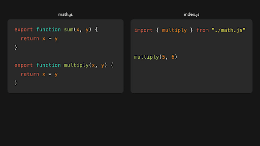
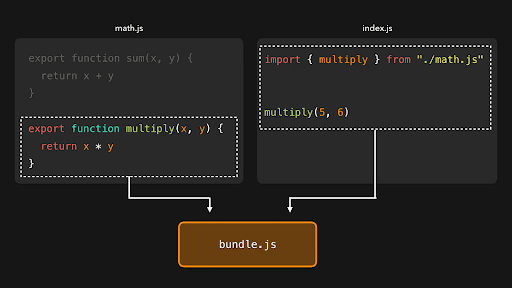
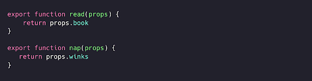
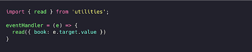

# Keraksiz kodlarni tozalash (Tree Shaking)

To’plam paketimizga ilovamizning hech bir joyida ishlatilmaydigan kodlar qo’shilishi mumkin. To’plam hajmini kamaytirish va keraksiz ma'lumotlarni yuklashning oldini olish uchun bunday “o'lik kod” qismlarini olib tashlash mumkin\! To’plam paketiga qo'shishdan oldin “o'lik kod”ni tozalash jarayoni “tree shaking” deb ataladi.

  

  

`math` moduli kabi oddiy modullar uchun *tree shaking* ishlasa-da, ba'zi hollarda bu jarayon murakkab bo’lishi mumkin.

## Asosiy tushunchalar

*Tree shaking* yakuniy JavaScript to'plam paketidan hech qachon ishlatilmaydigan kodlarni olib tashlashga qaratilgan. To'g'ri bajarilganda, u JavaScript to'plamlar hajmini qisqartiradi hamda yuklab olish, tahlil qilish (parse) va (ba'zi hollarda) bajarish vaqtini kamaytirishi mumkin. Modul to’plovchi (webpack yoki Rollup kabi) ishlatiladigan zamonaviy JavaScript ilovalarining aksariyatida, to’plovchi (bundler) o'lik kodni avtomatik ravishda olib tashlashi kutiladi.

Ilovangizni va uning qaramliklarini mavhum sintaksis daraxti sifatida tasavvur qiling (uni optimallashtirish uchun “silkitmoqchimiz”). Daraxtdagi har bir tugun ilovangizning funksionalligini taʼminlovchi qaramlikdir. *Tree shaking* jarayonida kirish fayllari graf (graph) sifatida ko'rib chiqiladi. Grafdagi har bir tugun kodda "qism" deb ataladigan yuqori darajali bayonotdir. *Tree shaking* \- bu kirish nuqtasidan boshlanadigan va o’tgan yo’llarni qo’shish uchun belgilaydigan grafik tarmoq bo’ylab harakatdir.

Har bir komponent belgilarni e’lon qilishi, ularga murojaat qilishi va boshqa fayllarga tayanishi mumkin. Hatto "qism"lar ham *side effect* (yon ta’silar)ga ega yoki yo'qligi bilan belgilanadi. Misol uchun, `let firstName = 'Jane'` ifodasida hech qanday *side effect* yo'q, chunki `firstName` hech qayerda kerak bo'lmasa, bu ifodani hech qanday sezilarli farqsiz olib tashlash mumkin. Ammo `let firstName = getName()` ifodasida *side effect* bor, chunki `getName()`’ga murojaat hatto `firstName` hech qayerda kerak bo’lmasa ham, kod ma'nosini o'zgartirmasdan olib tashlanishi mumkin emas. 

## Importlar

Faqat ES2015 modul sintaksisi (`import` va `export`) bilan belgilangan modullardagina ortiqcha kodni tozalashni amalga oshirish, ya’ni  *tree shaking*, qilinishi mumkin. Modullarni import qilish usuli modul *tree shaking* qilinishi mumkinmi yoki yo'qligini belgilaydi.

Tree shaking kirish nuqtasi faylining *side effect’ga* ega barcha qismlarini ko’rib chiqishdan boshlanadi va yangi bo'limlarga yetib borguncha graf chetlari bo’ylab harakatlanishni davom ettiradi. Harakat tugagach, JavaScript to’plam paketi faqat harakat davomida yetib borilgan qismlarni o'z ichiga oladi, boshqa qismlar tashlab yuboriladi. Keling, quyidagi `utilities.js` faylini ko’rib chiqaylik:⁣⁣

  

Va bizda quyidagi index.js fayli bor: 

  

⁣Ushbu misolda `nap()` funksiyasi muhim emas va shuning uchun to’plam paketiga kiritilmaydi.

## Side effect’lar

ES6 modulini import qilganimizda, bu modul darhol ishga tushadi. Kodimizning hech qayerida modul eksportlariga murojaat qilmasak ham, modul bajarilayotganda global qamrovga ta'sir qilishi mumkin (masalan, polyfill’lar yoki global stillar jadvali). Bu side effect deb ataladi. Garchi biz modulning eksportlariga murojaat qilmasak ham, agar modul boshida qiymatlarni eksport qilgan bo'lsa, modul import qilinayotganda maxsus xatti-harakatlari tufayli *tree shaking* jarayonidan o’tkazib bo'lmaydi\!

Webpack dokumentatsiyasida *tree shaking* va uning buzilishining oldini olish haqida [batafsil tushuntirish berilgan](https://webpack.js.org/guides/tree-shaking/#clarifying-tree-shaking-and-sideeffects).