# Ro’yxat virtualizatsiyasi (List virtualization)

Ushbu qo'llanmada biz ro'yxat virtualizatsiyasi (oyna usuli deb ham ataladi) haqida mulohaza yuritamiz. Bu dinamik ro'yxatda butun ro’yxat o’rniga faqat ko’rinib turadigan kontent qatorlarini ko'rsatish g'oyasidir. Render qilingan qatorlar to'liq ro'yxatning faqat kichik bir qismi bo'lib, foydalanuvchi skroll qilganda ko'rinadigan qism (oyna) harakatlanadi. Bu renderlash samaradorligini oshirishi mumkin.

Agar siz Reactdan foydalansangiz va katta hajmdagi ma’lumotlar ro'yxatini samarali ko'rsatishingiz kerak bo'lsa, siz [`react-virtualized`](https://bvaughn.github.io/react-virtualized/) kutubxonasi bilan tanish bo'lishingiz mumkin. Bu [Brayan Von](https://twitter.com/brian_d_vaughn) tomonidan yaratilgan oynalash kutubxonasi bo'lib, u ro'yxatda faqat ayni paytda ko’rinib turgan elementlarni ko'rsatadi (skroll "ko’rish maydoni" ichida). Bu bir vaqtning o'zida minglab ma'lumot qatorlarini renderlash xarajatini to’lamasligingizni bildiradi. `react-window` bilan ro'yxatni virtualizatsiya qilish bo'yicha video tushuntirish ham ushbu maqolaga ilova qilingan.

### Ro’yxat virtualizatsiyasi qanday ishlaydi?

Elementlar ro'yxatini "virtualizatsiya qilish" oynani saqlash va uni ro'yxat bo’ylab siljitishni o'z ichiga oladi. react-virtualized kutubxonasida oynalash quyidagicha ishlaydi:

* Nisbiy joylashuvli (oyna) kichik konteyner DOM elementiga (`<ul>` kabi) ega bo’lishi  
* Skroll qilish uchun katta DOM elementiga ega bo’lishi  
* Ichki elementlarni konteyner ichida absolyut ravishda joylashtirib, ularning yuqori, chap, kenglik va balandlik stillarini o’rnatish

Ro’yxatdagi minglab elementlarni bir vaqtda render qilish o’rniga (bu dastlabki renderlashning sekinlashishiga yoki skroll samaradorligiga taʼsir qilishi mumkin), virtualizatsiya faqat foydalanuvchiga ko’rinib turgan elementlarni renderlashga e’tibor qaratadi.

  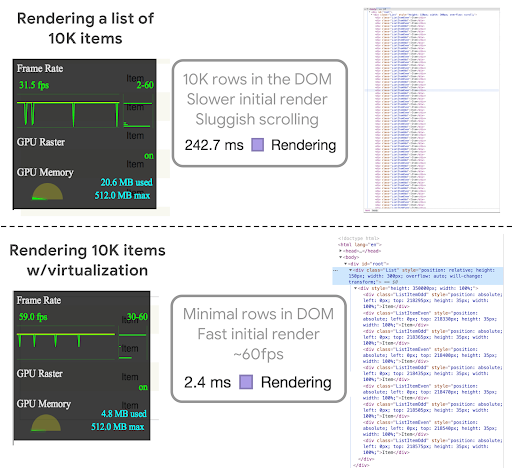

Bu o'rta va past darajadagi qurilmalarda ro'yxatni tez render qilishga yordam beradi. Foydalanuvchi skroll qilganda ko’proq elementlarni yuklash/ko’rsatish, oldingi yozuvlarni olib tashlash va ularni yangilari bilan almashtirish mumkin.

### react-virtualized uchun ixchamroq muqobil

[react-window](https://react-window.now.sh/) \- bu xuddi shu muallif tomonidan yaratilgan react-virtualized kutubxonasining qayta yozilgan versiyasi bo’lib, u kichikroq, tezroq va ko'proq [tree-shaking](https://developers.google.com/web/fundamentals/performance/optimizing-javascript/tree-shaking/) qilishga mos.

  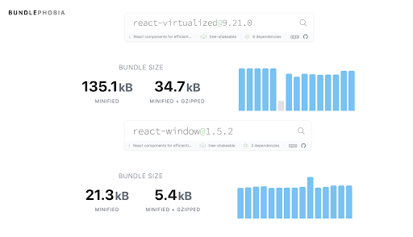

*Tree-shaking* qilishga mos kutubxonada hajm siz tanlagan API yuzalarining funksiyasidir. Men react-virtualized o'rniga ishlatganda \~ 20-30 KB (gzip) tejalganini ko'rdim:

  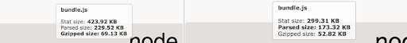

Ikkala paket uchun API’lar o'xshash va ular farq qiladigan joylarda `react-window` oddiyroq. `react-window` komponentlariga quyidagilar kiradi:

### List (Ro’yxat)

Ro’yxatlar oynalashtirilgan elementlar ro’yxatini (qatorni) render qiladi, yaʼni foydalanuvchilarga faqat ko’rinib turgan qatorlar ko’rsatiladi (masalan, [FixedSizeList](https://react-window.now.sh/#/examples/list/fixed-size), [VariableSizeList](https://react-window.now.sh/#/examples/list/variable-size)). Ro'yxatlar qatorlarni render qilish uchun Grid’dan (ichki tarzda) foydalanadi va props’ni shu ichki Grid’ga uzatadi.

  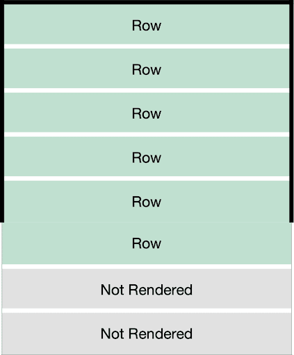

### React yordamida ma’lumotlar ro’yxatini render qilish

React yordamida oddiy ma'lumotlar ro'yxatini (`itemsArray`) renderlashga misol:

  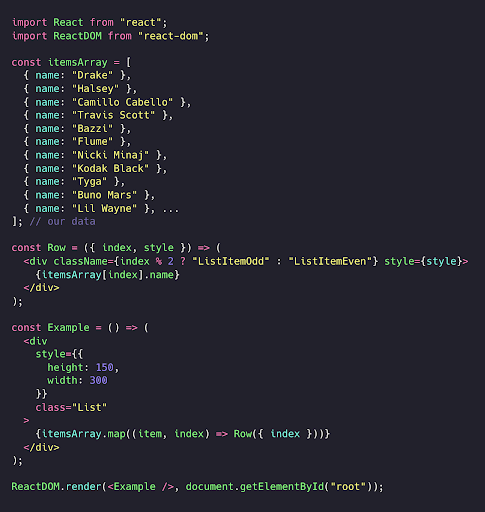

### react-window yordamida ro’yxatni render qilish

…va mana shu misolning `react-window`’ning `FixedSizeList` komponenti yordamida ko’rsatilishi. U bir nechta xususiyatlar (`width`, `height`, `itemCount`, `itemSize`) va ichki element sifatida uzatiladigan qatorni renderlash funksiyasini qabul qiladi:

  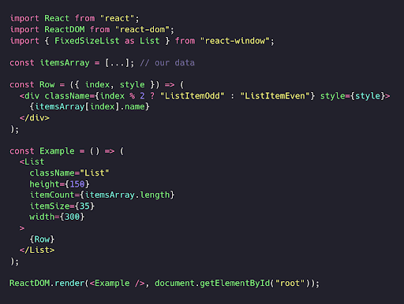

`FixedSizeList`’ni [CodeSandboxda](https://codesandbox.io/p/sandbox/github/bvaughn/react-window/tree/master/website/sandboxes/fixed-size-list-vertical) sinab ko’rishingiz mumkin.

### To’r (Grid)

To’r vertikal va gorizontal o’qlar bo'ylab virtuallashtirilgan jadval ma'lumotlarini ko'rsatadi (masalan, [FizedSizeGrid](https://react-window.now.sh/#/examples/grid/fixed-size), [VariableSizeGid](https://react-window.now.sh/#/examples/grid/variable-size)). U faqat joriy gorizontal/vertikal skroll pozitsiyalari asosida o'zini to'ldirish uchun zarur bo'lgan To’r katakchalarini ko'rsatadi.

  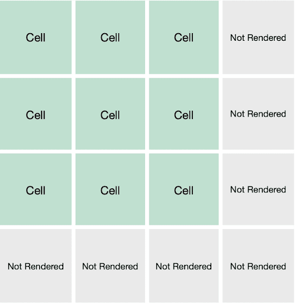

Agar biz avvalgi ro’yxatni to’r tartibida render qilmoqchi boʻlsak va kiruvchi ma’lumotimiz ko’p o’lchovli massiv bo’lsa, buni `FixedSizeGrid` yordamida quyidagicha amalga oshirishimiz mumkin:

  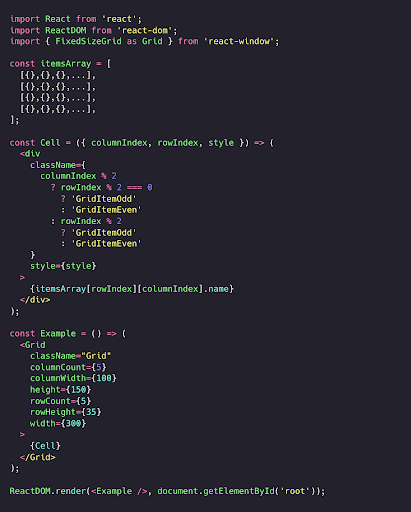

`FixedSizeGrid`’ni [CodeSandboxda](https://codesandbox.io/p/sandbox/github/bvaughn/react-window/tree/master/website/sandboxes/fixed-size-list-vertical) sinab ko’rishingiz mumkin.

### react-window’ning chuqurroq namunalari

[Skott Teylor](https://github.com/staylor) `react-window` va `FixedSizeGrid` yordamida ochiq manbali [Pitchfork musiqa sharhlari yig’uvchisini (manba ochiq)](http://pitchfork.highforthis.com/) yaratdi.

Pitchfork scraper [`react-window-infinite-loader` (demo)](https://github.com/bvaughn/react-window-infinite-loader)’dan foydalanadi, bu katta ma'lumotlar to'plamlarini foydalanuvchi ko’rish maydoniga skroll qilinganda yuklanishi mumkin bo'lgan qismlarga ajratishga yordam beradi.

Mana bu ilovada `react-window-infinite-loader` qanday qo’llanilgani haqida:

  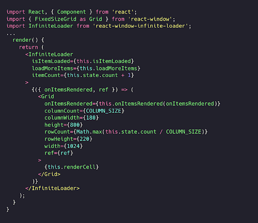

Agar bizda to’rni virtualizatsiya qilish uchun yanada murakkab talablarimiz bo'lsa-chi? Biz [The Movie Database](https://www.themoviedb.org/) [demo](https://tmdb-viewer.surge.sh/) ilovasini topdik, u ichki qismida `react-virtualized` va *Infinite Loader’dan* foydalangan.

  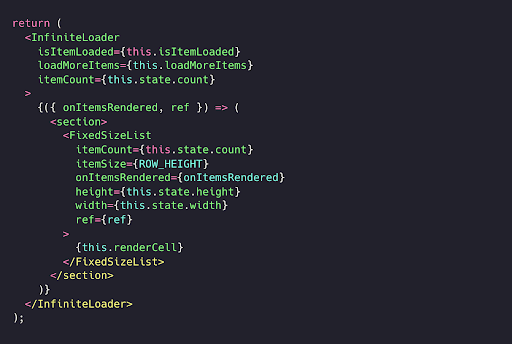

Uni `react-window` va `react-window-infinite-loader`’ga [portlash](https://github.com/addyosmani/tmdb-viewer/blob/master/src/components/InfiniteMoviesList.js) orqali o’tkazish ko'p vaqt talab qilmadi, lekin ba’zi komponentlar hali qo'llab-quvvatlanmasligini aniqladik. Shunga qaramay yakuniy funksionallik [juda o’xshash chiqdi](https://tmdb-viewer.firebaseapp.com/).

  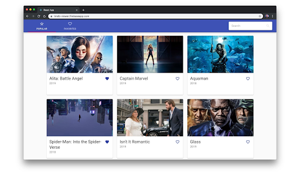

Yetishmayotgan komponentlar `WindowScroller` va `AutoSizer` edi… ularni keyinroq ko'rib chiqamiz.

  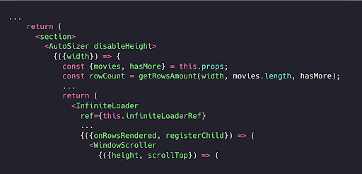

### react-window’da nima yetishmaydi?

`react-window` hali `react-virtualized` kutubxonasichalik to'liq API’ga ega emas, shuning uchun uni ko'rib chiqayotganda [taqqoslash dokumentatsiyasini](https://github.com/bvaughn/react-window#how-is-react-window-different-from-react-virtualized) tekshiring. Quyidagilar mavjud emas:

* [WindowScroller](https://github.com/bvaughn/react-virtualized/blob/master/docs/WindowScroller.md) \- Bu `react-virtualized` komponenti bo’lib, oynadagi skroll pozitsiyalarga qarab ro’yxatlarni skroll qilish imkonini beradi. Hozircha buni `react-window` uchun amalga oshirish [rejalashtirilmagan](https://github.com/bvaughn/react-window/issues/30), shuning uchun buni foydalanuvchi darajasida hal qilishingiz kerak bo'ladi.  
* [AutoSizer](https://github.com/bvaughn/react-virtualized/blob/master/docs/AutoSizer.md) \- Barcha mavjud joyga mos keladigan, bitta ichki elementning kengligi va balandligini avtomatik ravishda moslaydigan yuqori tartibli komponent (HOC). Brayan buni [mustaqil](https://www.npmjs.com/package/react-virtualized-auto-sizer) paket sifatida amalga oshirdi. So'nggi yangilanishlar uchun [ushbu masalani](https://github.com/bvaughn/react-window/issues/5) kuzatib boring.  
* [CellMeasurer](https://github.com/bvaughn/react-virtualized/blob/master/docs/CellMeasurer.md) \- Katakcha tarkibini foydalanuvchiga ko'rinmaydigan tarzda renderlash orqali avtomatik o’lchaydigan yuqori tartibli komponent. Qo'llab-quvvatlash bo'yicha muhokamalar uchun [bu yerni](https://github.com/bvaughn/react-window/issues/6) kuzatib boring.

Shunday bo’lsa-da, biz `react-window`’ning o’zida mavjud funksiyalari ko’p ehtiyojlarimizni qondirish uchun yetarli ekanligini aniqladik.

### Veb platformadagi yaxshilanishlar

Ba'zi zamonaviy brauzerlar endi [CSS content-visibility](https://web.dev/content-visibility/) xususiyatini qo'llab-quvvatlaydi. `content-visibility:auto` sizga kerak bo’lmaguncha ekrandan tashqaridagi kontentni renderlash va chizishni o’tkazib yuborish imkonini beradi. Agar sizda renderlash qimmatga tushadigan uzun HTML dokumentingiz bo'lsa, ushbu xusuiyatni sinab ko'ring.

Dinamik kontentli ro'yxatlarni renderlash uchun men hamon `react-window` kabi kutubxonadan foydalanishni tavsiya qilaman. Bugungi kunda ko'plab ro’yxat virtuallashtirish kutubxonalari `display:none` yoki ekrandan tashqaridagi DOM tugunlarini olib tashlash usulidan samaraliroq ishlashi mumkin bo’lgan `content-visibility:hidden` versiyasini yaratish qiyinroq bo’lardi.