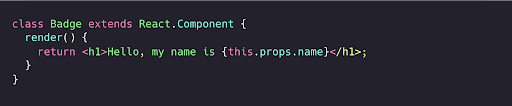

# React.js haqida umumiy ma’lumot

Yillar davomida JavaScriptdan foydalangan holda foydalanuvchi interfeyslarini yaratishning sodda usullariga talab ortib bordi. [React](https://react.dev/) (React.js deb ham ataladi) \- bu Facebook tomonidan ishlab chiqilgan foydalanuvchi interfeyslari yoki UI komponentlarini yaratish uchun foydalaniladigan ochiq manbali JavaScript kutubxonasi hisoblanadi.

React, albatta, mavjud bo’lgan yagona UI kutubxonasi emas. [Preact](https://preactjs.com/), [Vue](https://vuejs.org/), [Angular](https://angular.dev/), [Svelte](https://svelte.dev/), [Lit](https://lit.dev/) va boshqalar ham qayta foydalanish mumkin bo’lgan elementlardan interfeyslar yaratish uchun juda yaxshi vositalardan biri hisoblanadi. Reactning ommalashganini hisobga olgan holda, uning ishlash tamoyillarini ko'rib chiqish muhim, chunki biz undan ushbu qo'llanmadagi ba'zi dizayn, renderlash va ishlash samaradorligi patternlari bilan tanishish uchun foydalanamiz.

Frontend dasturchilar kod haqida gapirganda, bu ko'pincha veb uchun interfeyslar yaratish nuqtai nazaridanbo'ladi. Interfeys tuzilishi haqida tugmalar, ro’yxatlar, navigatsiya va shunga o’xshash elementlar orqali fikr yuritamiz. React ushbu elementlardan interfeyslarni ifodalashning optimallashtirilgan va soddalashtirilgan usulini taqdim etadi. Shuningdek, u interfeysingizni uchta asosiy tushunchaga – *komponentlar*, *props* va *state* tuzilmalariga ajratish orqali murakkab interfeyslarni yaratishga yordam beradi.

React kompozitsiyaga ko’proq e’tibor qaratgani sababli, u sizning dizayn tizimingiz elementlariga mukammal tarzda mos kelishi mumkin. Ya’ni, mohiyatan, React uchun dizayn qilish modulli fikrlashni rag’batlantiradi. Bu sizga sahifa yoki ko’rinishni yig’ishdan oldin alohida komponentlarni loyihalash imkonini beradi, shuning uchun siz har bir komponentning ko'lami va maqsadini to'liq tushunasiz \- bu jarayon *komponentizatsiya*, ya’ni komponentlarga ajratish deb ataladi.

### Biz foydalanadigan terminologiyalar

* React / React.js / ReactJS \- Facebook tomonidan 2013-yilda yaratilgan React kutubxonasi  
* ReactDOM \- DOM va serverda renderlash uchun paket  
* JSX \- JavaScript uchun sintaksis kengaytmasi  
* Redux \- Markazlashtirilgan *state (holat)* konteyneri  
* Hooks \- *State* va boshqa React xususiyatlaridan klass yozmagan holda foydalanishning yangi usuli  
* ReactNative \- Javascript yordamida turli platformalar uchun mahalliy ilovalarni ishlab chiqish uchun kutubxona  
* Webpack \- React hamjamiyatida mashhur bo'lgan JavaScript modul to’plovchisi.  
* CRA (Create React App) \- Loyihani boshlash uchun React ilovasi yaratuvchi CLI vositasi.  
* Next.js \- SSR, kodlarni bo’lib yuklash (code-splitting) va ishlash samaradorligi uchun optimallashtirilgan va boshqa eng yaxshi xususiyatlarga ega bo’lgan React freymvorki.

### JSX bilan render qilish

Biz ayrim misollarimizda JSX’dan foydalanamiz. JSX \- bu JavaScript kengaytmasi bo'lib, XML’ga o'xshash sintaksis yordamida Javascript kodiga HTML shablonini joylashtirish imkonini beradi. U to’g’ri Javascript kodiga aylantirilishi kerak, ammo bu o’zgartirishning implementatsiyaga, ya’ni amalga oshirishga bog’liq. JSX React kutubxonasi bilan mashhurlikka erishdi, ammo keyinchalik boshqa ilovalarda ham qo’llanila boshladi.  

  

### Komponentlar, Prop’lar va State’lar

Komponentlar, prop’lar va state \- Reactdagi uchta asosiy tushunchadir. Reactda sinab ko'rilmoqchi yoki qilmoqchi bo’lgan deyarli har qanday narsa ushbu asosiy tushunchalarning kamida bittasiga tasniflanishi mumkin va bu asosiy tushunchalarni qisqacha ko'rib chiqamiz:

### 1\. Komponentlar

  

Komponentlar har qanday React ilovasining asosiy qurilish bloklari hisoblanadi. Ular ixtiyoriy kirish ma’lumotlarini (*Prop’lar*) qabul qiluvchi va ekranda nima ko’rsatilishi kerakligini tavsiflovchi React elementlarini qaytaradigan JavaScript funksiyalariga o'xshaydi.

Tushunish kerak bo'lgan birinchi narsa shuki, React ilovasida ekrandagi hamma narsa komponentning bir qismidir. Aslida, React ilovasi \- bu komponentlar ichidagi boshqa komponentlar tarkibidagi komponentlardir. Ya’ni, dasturchilar Reactda sahifalar emas, balki komponentlar yaratadi.

Komponentlar foydalanuvchi interfeysini mustaqil, qayta foydalanish mumkin bo'lgan qismlarga ajratish imkonini beradi. Agar siz sahifalar yaratishga o’rgangan bo'lsangiz, bunday modulli yondashuv katta o'zgarish bo’lib tuyulishi mumkin. Ammo siz dizayn tizimi yoki uslublar qo'llanmasidan foydalansangiz-chi? Unda bu paradigma o'zgarishi unchalik qiyin tuyilmasligi mumkin.

Komponentni yaratishning eng to'g'ridan-to'g'ri usuli \- JavaScript funksiyasini yozishdir:

  

Bu funksiya to’g’ri React komponenti hisoblanadi, chunki u maʼlumotlar bilan bitta xususiyatlar obyektini (props) argument sifatida qabul qiladi va React elementini qaytaradi. Bunday komponentlar "funksiya komponentlari" deb ataladi, chunki ular aslida JavaScript funksiyalaridir.  

  

Funksiya komponentlaridan tashqari, boshqa turdagi *"klass komponentlari”* ham mavjud. Klass komponenti funksiya komponentidan farq qiladi, chunki u quyida ko‘rsatilganidek, ES6 klass orqali aniqlanadi:

  

### Komponentlarni ajratib olish

Komponentlarni kichikroq qismlarga bo'lish mumkinligini ko'rsatish uchun quyidagi `Tweet` komponentini ko'rib chiqamiz:

  

Buni quyidagicha amalga oshirish mumkin:

  

Ushbu komponent juda zich joylashgani uchun uni boshqarish va uning alohida qismlarini qayta ishlatish qiyin bo’lishi mumkin. Ammo, undan bir nechta komponentlarni ajratib olishimiz mumkin.

Birinchi navbatda `Avatar` komponentini ajratib olamiz:

  

`Avatar` u `Comment` ichida render qilinayotganini bilishi shart emas. Shuning uchun biz undagi prop’ga umumiyroq nom berdik: `author` emas, `user`.

Endi tvitni biroz soddalashtiramiz: 

  

Keyingi qadam \- foydalanuvchi nomining yonida `Avatar`’ni ko'rsatadigan `User` komponentini yaratish:

  

Endi `Tweet`’ni yanada soddalashtiramiz:

  

Komponentlarni ajratib olish birmuncha zerikarli ish kabi ko’rinishi mumkin, lekin qayta foydalanish mumkin bo'lgan komponentlar katta ilovalar uchun kor yozishni osonlashtiradi. Komponentlarni soddalashtirish uchun quyidagi mezonni hisobga olish foydali: agar UI qismi bir necha marta ishlatilsa (`Button`, `Panel`, `Avatar`) yoki o’zi yetarli darajada murakkab bo'lsa (`App`, `FeedStory`, `Comment`), uni alohida komponentga ajratish maqsadga muvofiq. 

### 2\. Props (Xususiyatlar)

*Props* tushunchasi xususiyatlarning qisqartmasi bo'lib, ular Reactda komponentning ichki ma'lumotlariga ishora qiladi. Ular komponent chaqiruvida yoziladi va komponentlarga uzatiladi. Ular, shuningdek, HTML atributlari bilan bir xil sintaksisdan foydalanadi, masalan, `prop=”value”`. Props haqida ikki narsani eslab qolish muhim: Birinchidan, props’ning qiymatini komponentning qurilishidan oldin aniqlaymiz va uni loyihaning bir qismi sifatida ishlatamiz. Ikkinchidan, props qiymati hech qachon o'zgarmaydi, ya'ni props komponentlarga o'tkazilgandan keyin faqat o'qiladigan bo’ladi.

Prop’ga kirish har bir komponent foydalana oladigan `this.props` xususiyati orqali amalga oshiriladi.

### 3\. State (Holat)

*State* \- bu komponentning ishlash muddati davomida o'zgarishi mumkin bo'lgan ma'lumotlarni saqlaydigan obyekt. Ya’ni, bu komponentning *Props’ida* saqlangan ma'lumotlarning joriy ko’rinishi. Ma'lumotlar vaqt o'tishi bilan o'zgarishi mumkin, shuning uchun komponent kerakli vaqtda dasturchilar xohlagandek ko'rinishini ta'minlash uchun ma'lumotlar o'zgarishini boshqarish usullari zarur bo'ladi, bu *State management*, ya’ni state boshqaruvi, deb ataladi.  

  

State boshqaruvi g'oyasiga duch kelmasdan turib, React haqida bitta paragrafni o'qish deyarli imkonsiz. Dasturchilar bu mavzuni tushuntirishni yaxshi ko'radilar, lekin aslida state boshqaruvi eshitilganchalik murakkab emas.

Reactda state’ni global miqyosda kuzatish va kerak bo'lganda ma'lumotlarni komponentlar o'rtasida almashish mumkin. Aslida, bu React ilovalarida ma'lumotlarni yangi joylarda yuklash boshqa texnologiyalardagidek qimmat tushmasligini anglatadi. React ilovalari qaysi ma'lumotlarni qachon saqlash va yuklash kerakligini yaxshiroq biladi. Bu ma'lumotlardan foydalanish yangicha usullarda foydalanadigan interfeyslar yaratish imkoniyatlarini beradi.

React ilovalarini o'z ma'lumotlari, mantiqiy qismi va taqdimotiga ega bo’lgan kichik ilovalar deb tasavvur qiling. Har bir komponent bitta maqsadga ega bo'lishi kerak. Dasturchi sifatida siz bu maqsadni belgilaysiz va har bir komponentning xatti-harakati hamda qanday ma'lumotlardan foydalanishini to'liq nazorat qilishingiz mumkin. Endi siz sahifaning qolgan qismidagi ma'lumotlar bilan cheklanmaysiz. Loyihangizda bundan har qanday usulda foydalanishingiz mumkin. Foydalanuvchi bilan ishlash qulayligini yaxshilash yoki dizayndagi qismlarni yanada kontekstga mos qilish uchun qo'shimcha ma'lumotlarni taqdim etish imkoniyatlari mavjud.

### Reactda state’ni qanday qo’shish mumkin

Loyihalash davomida state qo’shish \- bu oxirgi navbatda bajarilishi kerak bo'lgan vazifa. Har bir narsani imkon qadar state’siz (stateless), props va hodisa (event)’lardan foydalangan holda loyihalash yaxshiroqdir. Bu komponentlarni qo’llab-quvvatlash, testlash va tushunishni osonlashtiradi. State’ni qo'shish [Redux](https://redux.js.org/) va [MobX](https://mobx.js.org/README.html), kabi state konteynerlar yoki konteyner/o’rovchi komponenti orqali amalga oshirilishi kerak. Redux \- bu reaktiv freymvorklar uchun mashhur state boshqaruvi tizimi. U harakat (action)’lar bilan boshqariladigan markazlashtirilgan state mashinasini amalga oshiradi.  

  

Quyidagi misolda state uchun joy `LoginContainer` o'zi bo'lishi mumkin. Keling, buning uchun *React Hook*’laridan foydalanamiz (bu keyingi bo'limda muhokama qilinadi):

  

Yuqoridagi kabi qo’shimcha misollar uchun [React 2020 da fikrlash](https://dev.to/lukeshiru/thinking-in-react-the-2020-version-4c18) havolasini ko’rib chiqing.

### Props va State taqqoslash

Props va state bir-biriga o’xshash bo’lgani uchun ba'zan chalkashib ketishi mumkin. Quyida ular orasidagi ba'zi asosiy farqlar:

| PROPS | STATE |
| ----- | ----- |
| Ma'lumotlar komponentdan komponentga o'zgarishsiz o’tadi | Ma'lumotlar komponentning Props’da saqlangan ma'lumotlarning joriy suratidir. U komponent hayotiy sikli  davomida o'zgaradi |
| Ma’lumotlar faqat o’qiladi  | Ma’lumotlar asinxron bo’lishi mumkin  |
| Props’dagi ma’lumotlarni o’zgartirib bo’lmaydi  | State’dagi ma’lumotlarni `this.setState` orqali o’zgartirish mumkin |
| Props komponentga uzatiladigan ma’lumotlar  | State komponent ichida boshqariladi  |

### 

### Reactdagi boshqa tushunchalar

Komponentlar, props va state \- Reactda qiladigan har qanday ish uchun uchta asosiy tushuncha. Ammo o'rganish kerak bo’lgan tushunchalar ham bor:

### 1\. Hayotiy sikl (Lifecycle)

Har bir react komponenti uch bosqichdan o'tadi: o’rnatish (mounting), renderlash (rendering), va o’chirish (unmounting). Ushbu uch bosqichda sodir bo'ladigan hodisalar ketma-ketligi komponentning hayotiy sikli deyiladi. Bu hodisalar qisman komponentning state’i (uning ichki ma'lumotlari) bilan bog'liq bo'lsa-da, lekin hayotiy sikli biroz boshqacha. React komponentlarni kerak bo'lganda yuklaydigan va o’chiradigan ichki kodga ega va komponent bu ichki kod ichida bir necha bosqichlarda mavjud bo'lishi mumkin.

Hayotiy sik metodlari ko'p, lekin eng ko’p ishlatiladiganlari quyidagilar:

`render()` \- bu metod Reactdagi klass komponentida talab qilinadigan yagona va  eng ko'p qo'llaniladigan metod. Nomidan ko'rinib turibdiki, u komponentingizni UI’ga render qilish bilan shug'ullanadi va bu komponentingizni o'rnatish va renderlash paytida sodir bo'ladi.

Komponent yaratilganda yoki o’chirilganda:

* `componentDidMount()` komponentning chiqishi DOM’ga render qilingandan keyin ishga tushadi.  
* `componentWillUnmount()` komponent o'chirilishi va yo'q qilinishidan oldin darhol chaqiriladi. 

Props yoki state yangilanganda:

* `shouldComponentUpdate()` yangi props yoki state qabul qilinayotganda renderlashdan oldin chaqiriladi.  
* `componentDidUpdate()` yangilanish sodir bo'lgandan so'ng darhol chaqiriladi. Bu met dastlabki render uchun chaqirilmaydi.

### 2\. Yuqori tartibli komponent (HOC)

[Yuqori tartibli komponentlar](https://www.patterns.dev/posts/hoc-pattern) \- bu Reactda komponent logikasini qayta ishlatish uchun qo’llaniladigan takomillashgan texnikadir. Ya’ni, yuqori tartibli komponent \- bu komponentni argument sifatida qabul qilib, yangi komponentni qaytaruvchi funksiyadir. Ular Reactning kompozitsion tabiatidan kelib chiqadigan patternlardir. Komponent props​​’ni UI’ga o'zgartirsa, yuqori tartibli komponent esa bir komponentni boshqa komponentga o’zgartiradi va ular uchinchi tomon kutubxonalarida keng tarqalgan.

### 3\. Context

Odatiy React ilovasida ma'lumotlar props orqali uzatiladi, ammo bu ilova ichidagi ko'plab komponentlar tomonidan talab qilinadigan ba'zi turdagi props’lar uchun noqulay bo'lishi mumkin. *Context* ierarxiyaning har bir darajasi orqali props’ni aniq o'tkazmasdan turib, bunday turdagi ma'lumotlarni komponentlar o'rtasida almashish imkonini beradi. Ya’ni, context yordamida biz oraliq elementlar orqali props’larni o'tkazishni oldini olishimiz mumkin.

### React Hooks (React Hook’lari)

Hooks \- bu funksional komponentlardan React state’i va hayotiy sikl xususiyatlariga "ulanish" imkonini beruvchi funksiyalar. Ular sizga klass yozmasdan state va boshqa React xususiyatlaridan foydalanish imkonini beradi. Hook’lar haqida ko'proq ma'lumotni bizning [Hooks](https://www.patterns.dev/posts/hooks-pattern) qo'llanmamizdan bilib olishingiz mumkin.  

  

### 

### Reactda fikrlash

Reactning chindan ham hayratlanarli jihati shundaki, u ilovalarni yaratish jarayonida sizni ular haqida chuqur fikrlashga undaydi. Ushbu bo'limda biz sizga *React Hooks* yordamida *qidiruv imkoniyatiga ega mahsulot ma'lumotlari jadvalini* yaratish bo'yicha fikrlash jarayonini ko’rsatib beramiz.

1-qadam: Maket bilan boshlash

Tasavvur qiling-a, bizda allaqachon JSON API va interfeysimizning maket holatidagi versiyasi mavjud:

  

Bizning JSON API quyidagi ko’rinishdagi ma'lumotlarni qaytaradi:

  

Maslahat: UI va komponentlaringizning yuqori darajadagi maket holatini chizish uchun [Excalidraw](https://excalidraw.com/) kabi foydali va bepul vositalardan foydalanishingiz mumkin.

2-qadam: UI’ni ierarxiya komponentlariga ajratish

Maketingiz tayyor bo’lgach, keyingi qadam quyida ko'rsatilganidek, maketdagi har bir komponent (va quyi komponent) atrofiga to’rtburchaklar chizish va ularning barchasini nomlashdir.

Yagona mas'uliyat tamoyili (Single responsibility principle)’dan foydalaning: komponent ideal holda bitta funksiyaga ega bo'lishi kerak. Agar u kattalashib ketsa, uni kichikroq quyi komponentlarga bo’lish kerak bo’ladi. Yangi funksiya yoki obyekt yaratish kerakmi yoki yo'qligini aniqlash uchun xuddi shu texnikadan foydalaning.  

  

Yuqoridagi rasmda ilovamizda beshta komponent mavjudligini ko'rasiz. Har bir komponent ifodalayotgan ma'lumotlarni sanab o'tdik.

* `TweetSearchResults` (to’q sariq): butun komponent uchun konteyner  
* `SearchBar` (ko’k): qidirilayotgan narsani kiritish uchun foydalanuvchi interfeysi  
* `TweetList` (yashil): foydalanuvchi kiritgan maʼlumotlar asosida tvitlarni koʻrsatadi va filtrlaydi  
* `TweetCategory` (moviy): har bir kategoriya uchun sarlavhani ko'rsatadi  
* `TweetRow` (qizil): har bir tweet uchun qatorni ko’rsatadi

Maketdagi komponentlar aniqlangach, keyingi qadam ularni ierarxiyaga saralash bo'ladi. Maketda boshqa komponent ichida joylashgan ierarxiyada quyi element sifatida ko’rinishi kerak:

* `TweetSearchResults`  
  * `SearchBar`  
  * `TweetList`  
    * `TweetCategory`  
    * `TweetRow`

3-qadam: Komponentlarni Reactda implementatsiya qilish

Komponentlar ierarxiyasini yaratib bo’lgandan keyingi qadam \- ilovangizni ishlab chiqishdin. Yaqin-yaqingacha eng tezkor usul ma'lumotlar modelingizni olib, UI’ni render qiladigan, lekin umuman interaktivlikka ega bo’lmagan versiyani yaratish edi, ammo *React Hooks* joriy etilgandan beri ilovangizni yaratishning osonroq yo'li quyida ko'rsatilganidek, Hook’lardan foydalanishdir:

I. Filtrlanadigan tvitlar ro’yxati

  

II. Qidiruv paneli

  

III. Tvitlar ro’yxati

  

IV. Tvit kategoriyasi qatori

  

V. Tvit qatori

  

Yakuniy implementatsiya yuqorida ko’rsatilgan ierarxiyada barcha kodlarni birgalikda yozishdan iborat bo'ladi:

* `TweetSearchResults`  
  * `SearchBar`  
  * `TweetList`  
    * `TweetCategory`  
    * `TweetRow`

### Ishni boshlash

Reactdan foydalanishni boshlashning turli usullari mavjud.

1\. To'g'ridan-to'g'ri veb-sahifaga yuklash: Bu Reactni sozlashning eng oddiy usuli. React JavaScriptni sahifangizga `npm` *dependency* yoki CDN orqali qo'shing.

2\. `create-react-app`’dan foydalanish: `create-react-app` sizni Reactdan iloji boricha tezroq foydalanishga yo’naltirilgan loyiha bo'lib, bir sahifadan kattaroq bo’lishi kerak bo'lgan har qanday React ilovasi `create-react-app`’ning aynan shu ehtiyojni qondira olishini ko’radi. Keyinchalik jiddiyroq foydalanish ilovalari uchun [Next.js](https://nextjs.org/)’dan foydalanishni ko'rib chiqishlari kerak, chunki unda kuchliroq standart sozlamalar(masalan, kodlarni bo’lib yuklash) o’rnatilgan.

3\. Code Sandbox: `create-react-app` strukturasiga ega bo‘lishning oson yo‘li \- uni o‘rnatmasdan [https://codesandbox.io/s](https://codesandbox.io/s)  saytiga kirib, “React”ni tanlash.

4\. Codepen: Agar siz React komponenti prototipini yaratayotgan bo'lsangiz va Codepen’dan foydalanishni yoqtirsangiz, [bir qator](https://codepen.io/topic/react/templates) React uchun [boshlang'ich namunalar](https://codepen.io/flaviocopes/pen/VqeaxB) ham mavjud.

### Xulosa

React.js kutubxonasi modulli, qayta foydalanish mumkin boʻlgan foydalanuvchi interfeysi komponentlarini yaratish jarayonini sodda va intuitiv qilish uchun mo’ljallangan. Boshqa qo’llanmalarimizni o’qib chiqqach, ushbu qisqacha muqaddimani sizga foydali bo’lgan yuqori darajadagi sharh bo’ldi deb umid qilamiz.

*Ushbu qo’llanmadan [rasmiy React komponentlari va prop](https://reactjs.org/docs/components-and-props.html)s, [Reactda fikrlash](https://dev.to/lukeshiru/thinking-in-react-the-2020-version-4c18), [React Hooks’da fikrlash](https://davidpfahler.com/thinking-in-react-hooks) va [scriptverse](https://scriptverse.academy/tutorials/reactjs-pass-props-to-functional-component.html) dokumentatsiyalarisiz foydalanish mumkin bo'lmas edi.*