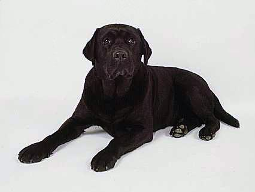

# HOC modeli

Ilovamiz ichida biz ko'pincha bir xil mantiqni bir nechta komponentlarda ishlatishni xohlaymiz. Bu mantiq tarkibiy qismlarga ma'lum uslubni qo'llash, avtorizatsiyani talab qilish yoki global holatni qo'shishni o'z ichiga olishi mumkin.

Bir xil mantiqni bir nechta komponentlarda qayta ishlatishning usullaridan biri yuqori tartibli komponent modelidan foydalanishdir. Ushbu model bizning dasturimiz davomida component mantig’idan qayta foydalanishga imkon beradi.

Yuqori tartibli komponent (HOC) \- bu boshqa komponentni oladigan komponent. Higher Order Component biz parametr sifatida o'tadigan komponentga qo'llamoqchi bo'lgan ma'lum mantiqni o'z ichiga oladi. Ushbu mantiqni qo'llaganidan so'ng, HOC elementni qo'shimcha mantiq bilan qaytaradi.

Aytaylik, biz har doim ilovamizdagi bir nechta komponentlarga ma'lum bir uslubni qo'shishni xohlaganmiz. Har safar mahalliy uslub obyektini yaratish o'rniga, biz unga o'tadigan komponentga style obyektlarini qo'shadigan HOC yaratishimiz mumkin.

```js
function withStyles(Component) {
  return props => {
    const style = { padding: '0.2rem', margin: '1rem' }
    return <Component style={style} {...props} />
  }
}
const Button = () = <button>Click me!</button>
const Text = () => <p>Hello World!</p>
const StyledButton = withStyles(Button)
const StyledText = withStyles(Text)
```

Biz hozirgina StyledButton va StyledText komponentlarini yaratdik, ular Button va Text komponentining o'zgartirilgan versiyalari. Endi ikkalasi ham withStyles HOCga qo'shilgan uslubni o'z ichiga oladi\! 

Keling, Container/Presentational patternda ilgari ishlatilgan DogImages misolini ko'rib chiqaylik\! Ilova API dan olingan it tasvirlari ro'yxatini ko'rsatishdan boshqa hech narsa qilmaydi.

# **Browse Dog Images 🐕**

<div align="center">
  
</div>

<div align="center">
  
</div>

<div align="center">
  
</div>

<div align="center">
  
</div>

<div align="center">
  
</div>

<div align="center">
  
</div>

Keling, foydalanuvchi tajribasini biroz yaxshilaylik. Ma'lumotlarni olishda biz foydalanuvchiga "Yuklanmoqda..." belgisini ko'rsatmoqchimiz. DogImages komponentiga to'g'ridan-to'g'ri ma'lumotlarni qo'shish o'rniga, biz uchun ushbu mantiqni qo'shadigan Yuqori tartibli komponentdan foydalanishimiz mumkin.

Keling, withLoader deb nomlangan HOC yarataylik. HOC komponentni qabul qilishi va bu komponentni qaytarishi kerak. Bunday holda, withLoader HOC ma'lumotlar olinmaguncha Loading... ko'rsatilishi kerak bo'lgan elementni olishi kerak.

Biz foydalanmoqchi bo'lgan withLoader HOC ning minimal versiyasini yaratamiz\!

```js
function withLoader(Element) {
  return (props) => <Element />;
}
```

Biroq, biz faqat olingan elementni qaytarishni xohlamaymiz. Buning o'rniga, biz ushbu elementda ma'lumotlar hali ham yuklayotgani yoki yo'qligi haqidagi mantiqni o'z ichiga olishini xohlaymiz.

withLoader HOC-ni qayta foydalanishga yaroqli qilish uchun biz ushbu komponentda Dog API url-ni qattiq kodlamaymiz. Buning o'rniga biz URL manzilni withLoader HOC-ga argument sifatida yuborishimiz mumkin, shuning uchun bu yuklovchi boshqa API so'nggi nuqtasidan ma'lumotlarni olish paytida yuklash ko'rsatkichiga muhtoj bo'lgan har qanday komponentda ishlatiladi.

```js
function withLoader(Element, url) {
  return (props) => {};
}
```

HOC elementni qaytaradi, bu holda funksional komponent props \=\> {} ga Loading… bilan matnni ko‘rsatish imkonini beruvchi mantiqni qo‘shmoqchimiz, chunki ma’lumotlar hali ham olinmoqda. Ma'lumotlar olingandan so'ng, komponent olingan ma'lumotlarni rekvizit sifatida uzatishi kerak.

```js
import React, { useEffect, useState } from "react";
 export default function withLoader(Element, url) {
  return (props) => {
    const [data, setData] = useState(null);
    useEffect(() => {
      async function getData() {
        const res = await fetch(url);
        const data = await res.json();
        setData(data);
      }
      getData();
    }, []);
    if (!data) {
      return <div>Loading...</div>;
    }
    return <Element {...props} data={data} />;
  };
 }
```

Ajoyib\! Biz hozirgina istalgan komponent va urlni qabul qila oladigan HOC yaratdik.

1. UseEffect hookda withLoader HOC API so'nggi nuqtasidan ma'lumotlarni oladi, biz url qiymati sifatida o'tkazamiz. Ma'lumotlar hali qaytarilmagan bo'lsa-da, biz Loading... matnini o'z ichiga olgan elementni qaytaramiz.  
2. Ma'lumotlar olingandan so'ng, biz olingan ma'lumotlarga teng ma'lumotlarni o'rnatamiz. Ma'lumotlar endi null emasligi sababli, biz HOCga o'tgan elementni ko'rsatishimiz mumkin\!

Xo'sh, DogImages ro'yxatida Loading... indikatorini ko'rsatishi uchun qanday qilib biz ushbu xatti-harakatni ilovamizga qo'shishimiz mumkin?

DogImages.js da biz endi oddiy DogImages komponentini eksport qilishni xohlamaymiz. Buning o'rniga biz DogImages komponenti atrofida Loading HOC bilan "wrapped"ni eksport qilmoqchimiz.

```js
export default withLoading(DogImages);
```

withLoader HOC shuningdek, url ma'lumotlarni qaysi so'nggi nuqtadan olishni bilishini kutadi. Bunday holda, biz Dog API so'nggi nuqtasini qo'shamiz.

```js
export default withLoader(
  DogImages,
  "https://dog.ceo/api/breed/labrador/images/random/6"
);
```

withLoader HOC elementni qo’shimcha ma’lumot rekviziti bilan qaytarganligi sababli, bu holda biz DogImages komponentidagi ma’lumot rekvizitiga kira olamiz.

```js
 import React from "react";
 import withLoader from "./withLoader";
 function DogImages(props) {
  return props.data.message.map((dog, index) => (
    
  ));
 }
 export default withLoader(
  DogImages,
  "https://dog.ceo/api/breed/labrador/images/random/6"
 );
```

Ajoyib\! Endi biz ma'lumotlar olinayotganda Loading... yozuvini ko'ramiz.

Higher Order Component modeli barcha mantiqni bir joyda saqlagan holda bir nechta komponentlarga bir xil mantiqni taqdim etishga imkon beradi. withLoader HOC qabul qiladigan komponent yoki URL manziliga ahamiyat bermaydi: agar u yaroqli komponent va yaroqli API so‘nggi nuqtasi bo‘lsa, u ma’lumotlarni o‘sha API so‘nggi nuqtasidan biz uzatadigan komponentga uzatadi.

## Composing

Bundan tashqari, biz bir nechta Yuqori tartibli komponentlarni yaratishimiz mumkin. Aytaylik, foydalanuvchi kursorni DogImages ro'yxatiga olib kelganida Hovering\! yozuv maydonini ko'rsatadigan funksiyani ham qo'shmoqchimiz\! 

Biz o'tadigan elementga hovering propni ta'minlaydigan HOC yaratishimiz kerak. Ushbu propga asoslanib, foydalanuvchi DogImages listi ustida kursorni o'tayotganiga qarab matn maydonini shartli ravishda ko'rsatishimiz mumkin.

```js
import React, { useState } from "react";
 export default function withHover(Element) {
  return props => {
    const [hovering, setHover] = useState(false);
    return (
      <Element
        {...props}
        hovering={hovering}
        onMouseEnter={() => setHover(true)}
       onMouseLeave={() => setHover(false)}
     />
    );
  };
 }
```

Endi biz withHover HOCni withLoader HOC atrofiga o’raymiz.

```js
import React from "react";
 import withLoader from "./withLoader";
 import withHover from "./withHover";
 function DogImages(props) {
  return (
    <div {...props}>
      {props.hovering && <div id="hover">Hovering!</div>}
      <div id="list">
        {props.data.message.map((dog, index) => (
          
        ))}
      </div>
    </div>
  );
 }
 export default withHover(
 withLoader(DogImages, "https://dog.ceo/api/breed/labrador/images/random/6")
 );
```

[https://images.dog.ceo/breeds/labrador/n02099712\_7406.jpg](https://images.dog.ceo/breeds/labrador/n02099712_7406.jpg)

DogImages elementi endi biz withHover va withLoader-dan uzatilgan barcha proplarni o'z ichiga oladi. Endi biz shartli ravishda Hovering\! yozuv maydonini render qilishimiz mumkin, bu hovering prop  qiymatining true yoki false ekanligiga asoslanadi.

*HOClarni yaratish uchun ishlatiladigan taniqli kutubxona [recompose](https://github.com/acdlite/recompose) hisoblanadi. HOClar asosan React Hooks bilan almashtirilishi mumkinligi sababli, recompose kutubxonasi endi saqlanmaydi, shuning uchun bu mavzu ushbu maqolada ko'rib chiqilmaydi.*

## Hooks

Ba'zi hollarda biz HOC patternni React Hooks bilan almashtirishimiz mumkin.

Keling, withHover HOCni useHover hook bilan almashtiramiz. HOC-ga ega bo'lish o'rniga, biz elementga mouseOver va mouseLeave hodisa tinglovchisini qo'shadigan hookni eksport qilamiz. Biz HOC bilan bo'lgani kabi elementni boshqa o'tkaza olmaymiz. Buning o'rniga, biz mouseOver va mouseLeave hodisalarini olishi kerak bo'lgan hookdan refni qaytaramiz. 

```js
import { useState, useRef, useEffect } from "react";
 export default function useHover() {
  const [hovering, setHover] = useState(false);
  const ref = useRef(null);
  const handleMouseOver = () => setHover(true);
  const handleMouseOut = () => setHover(false);
  useEffect(() => {
    const node = ref.current;
    if (node) {
      node.addEventListener("mouseover", handleMouseOver);
      node.addEventListener("mouseout", handleMouseOut);
      return () => {
        node.removeEventListener("mouseover", handleMouseOver);
        node.removeEventListener("mouseout", handleMouseOut);
      };
   }
  }, [ref.current]);
  return [ref, hovering];
 }
```

Use Effect hook component ga voqea tinglovchisi qo'shiladi va foydalanuvchi element ustida hovering bo’layotganiga qarab, true yoki false qiymatga o'rnatadi. Ref va hovering qiymatlari ham hookdan qaytarilishi kerak: ref, mouseOver va mouseLeave eventlarini qabul qiladigan komponentga ref qo‘shishi va Hovering\! matn maydonini render qilishi lozim. 

DogImages komponentini withHover HOC bilan o‘rash o‘rniga, biz DogImages komponenti ichida useHover hookdan foydalanishimiz mumkin.

```js
import React from "react";
 import withLoader from "./withLoader";
 import useHover from "./useHover";
 function DogImages(props) {
  const [hoverRef, hovering] = useHover();
  return (
    <div ref={hoverRef} {...props}>
      {hovering && <div id="hover">Hovering!</div>}
      <div id="list">
        {props.data.message.map((dog, index) => (
          
        ))}
      </div>
    </div>
  );
 } 
 export default withLoader(
  DogImages,
  "https://dog.ceo/api/breed/labrador/images/random/6"
 );
```

Ajoyib\! DogImages komponentini withHover komponenti bilan o‘rash o‘rniga biz to‘g‘ridan-to‘g‘ri komponent ichida useHover hookdan foydalanishimiz mumkin.

Umuman olganda, React Hooks HOC patternni almashtirmaydi.

"*Ko'p hollarda hooklar yetarli bo'ladi va sizdagi tree da nestingni kamaytirishga yordam beradi."* \- [React Docs](https://reactjs.org/docs/hooks-faq.html#do-hooks-replace-render-props-and-higher-order-components).

React docs bizga aytganidek, Hooksdan foydalanish component treening chuqurligini kamaytirishi mumkin. HOC patterndan foydalanib, chuqur o'rnatilgan component tree bilan yakunlash oson.

```js
<withAuth>
  <withLayout>
    <withLogging>
      <Component />
    </withLogging>
  </withLayout>
</withAuth>
```

Komponentga to'g'ridan-to'g'ri Hook qo'shish orqali biz endi komponentlarni o'rashimiz shart emas.

Higher Order componentlardan foydalanish bir xil  mantiqni ko'plab komponentlarga ta'minlash imkonini beradi va shu mantiqning hammasini bitta joyda saqlaydi. Hooklar bizga komponentdan custom behaviorga o'tish uchun imkon yaratadi, bu esa bir nechta komponentlar ushbu behaviorga tayansa, HOC patternga nisbatan bug-larni kiritish xavfini oshirishi mumkin.

HOC uchun eng yaxshi foydalanish holatlari:

* Xuddi shu, moslashtirilmagan xatti-harakatlar dastur davomida ko'plab komponentlar tomonidan qo'llanilishi kerak.  
* Komponent qo'shimcha maxsus mantiqsiz mustaqil ishlashi mumkin.

Hooklar uchun eng yaxshi foydalanish holatlari:

* Behavior uni ishlatadigan har bir komponent uchun moslashtirilgan bo'lishi kerak.  
* Behavior ilova bo'ylab tarqalmaydi, faqat bitta yoki bir nechta komponentlar behaviordan foydalanadi.  
* Behavior komponentga ko’p xususiyatlarni qo’shadi.

## Tahlil namunasi

HOC patternga tayangan ba'zi kutubxonalar chiqarilgandan keyin Hooks support qo’shildi. Bunga yaxshi misol \- [Apollon mijozi](https://www.apollographql.com/docs/react).

*Ushbu misolni tushunish uchun Apollo Client bilan tajriba kerak emas.*

Apollo Client-dan foydalanishning bir usuli graphql() yuqori tartibli komponentidir.
```js
 import React from "react";
 import "./styles.css";
 import { graphql } from "react-apollo";
 import { ADD_MESSAGE } from "./resolvers";
 class Input extends React.Component {
  constructor() {
    super();
    this.state = { message: "" };
  }
  handleChange = (e) => {
    this.setState({ message: e.target.value });
  };
  handleClick = () => {
    this.props.mutate({ variables: { message: this.state.message } });
  };
  render() {
    return (
      <div className="input-row">
        <input
          onChange={this.handleChange}
          type="text"
          placeholder="Type something..."
        />
        <button onClick={this.handleClick}>Add</button>
      </div>
    );
  }
 }
export default graphql(ADD_MESSAGE)(Input);
```

graphql() HOC yordamida biz mijozdan olingan ma'lumotlarni HOC bilan o'ralgan komponentlar uchun ochiq qilishimiz mumkin\! Hozirda biz graphql() HOC dan foydalana olsakda, uni ishlatishning ba'zi salbiy tomonlari mavjud.

Komponent bir nechta resolverlarga kirishi kerak bo'lganda, biz buni implement qilish uchun bir nechta graphql() higher order componentlarini yaratishimiz kerak. Bir nechta HOCni yaratish ma'lumotlarning komponentlaringizga qanday uzatilishini tushunishni qiyinlashtirishi mumkin. HOClarning tartibi ba'zi hollarda muhim va bu kodni qayta tiklashda buglarga sabab bo’ladi.

Hooks chiqarilgandan so'ng, Apollon Apollo Client kutubxonasiga Hooks supportni qo'shdi. graphql() higher order komponentidan foydalanish o'rniga, dasturchilar endi kutubxona taqdim etgan hooklar orqali ma'lumotlarga bevosita kirishlari mumkin.

Keling, graphql() higher order komponentli misolda ilgari ko'rganimizdek, xuddi shu ma'lumotlardan foydalanadigan namunani ko'rib chiqaylik. Bu safar biz komponentga ma'lumotlarni Apollo Client biz uchun taqdim etgan useMutation hookdan foydalanib taqdim etamiz.

```js
 import React, { useState } from "react";
 import "./styles.css";
 import { useMutation } from "@apollo/react-hooks";
 import { ADD_MESSAGE } from "./resolvers";
 export default function Input() {
  const [message, setMessage] = useState("");
  const [addMessage] = useMutation(ADD_MESSAGE, {
    variables: { message }
  });
  return (
    <div className="input-row">
      <input
        onChange={(e) => setMessage(e.target.value)}
        type="text"
        placeholder="Type something..."
      />
      <button onClick={addMessage}>Add</button>
    </div>
  );
 }
```

UseMutation hookdan foydalanib, biz komponentga ma'lumotlarni taqdim etish uchun zarur bo'lgan kod miqdorini kamaytirdik.

Boilerplatening qisqarishidan tashqari, komponentda bir nechta resolver ma'lumotlaridan foydalanish ham ancha oson. Bir nechta HOC yaratish o'rniga, biz komponentga bir nechta hooklar yozishimiz mumkin. Ma'lumotlarning komponentga qanday uzatilishini bilish shu tarzda ancha osonlashadi va komponentlarni qayta ishlash yoki ularni kichikroq qismlarga bo'lishda dasturchilar tajribasini yaxshilaydi.

## Foydali taraflari

HOC modelidan foydalanish bizga barchasini bir joyda qayta ishlatmoqchi bo'lgan mantiqni saqlashga imkon beradi. Bu kodni qayta-qayta takrorlash va har safar yangi buglarni kiritish orqali dastur bo'ylab buglarning tasodifan tarqalishi xavfini kamaytiradi. Mantiqning barchasini bir joyda saqlash orqali biz kodimizni BEXATAR saqlashimiz va concernlarni ajratishni osonlik bilan amalga oshirishimiz mumkin.

## Kamchiliklari

HOC elementga o'tishi mumkin bo'lgan propning nomi nomlash bilan bog’liq muammoga olib kelishi mumkin.

```js
function withStyles(Component) {
  return props => {
    const style = { padding: '0.2rem', margin: '1rem' }
    return <Component style={style} {...props} />
  }
}
const Button = () = <button style={{ color: 'red' }}>Click me!</button>
const StyledButton = withStyles(Button)
```

Bunday holda, withStyles HOC biz o'tadigan elementga style deb nomlangan propni qo'shadi. Biroq, Button komponentida allaqachon style deb nomlangan, uning ustiga yozsa bo’ladigan prop mavjud edi\! HOC prop nomini o'zgartirish yoki proplarni birlashtirish orqali tasodifiy nom to'qnashuvini hal qila olishiga ishonch hosil qiling.

```js
function withStyles(Component) {
  return props => {
    const style = {
      padding: '0.2rem',
      margin: '1rem',
      ...props.style
    }


    return <Component style={style} {...props} />
  }
}


const Button = () = <button style={{ color: 'red' }}>Click me!</button>
const StyledButton = withStyles(Button)
```

Barcha proplarni ular ichida o'ralgan elementga o'tkazadigan bir nechta tuzilgan HOC-lardan foydalanilganda, qaysi HOC qaysi hook uchun javobgar ekanligini aniqlash qiyin bo'lishi mumkin. Bu koddagi xatolarni bartaraf etish va dasturni oson o'lchashga xalaqit beradi.

## Havolalar

* [Higher-Order Components \- React](https://reactjs.org/docs/higher-order-components.html)