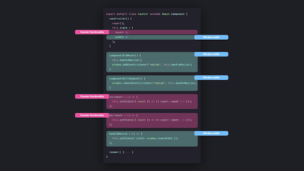
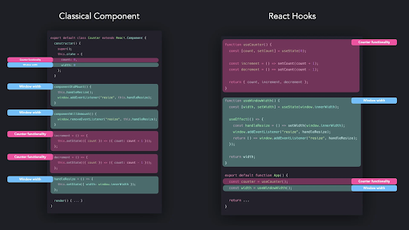

# Hooks Pattern

React 16.8 [Hooks](https://reactjs.org/docs/hooks-intro.html) deb nomlangan yangi xususiyatni taqdim etdi. Hooklar ES2015 class komponentini ishlatmasdan React holati va lifecycle usullaridan foydalanish imkonini beradi.

Hooklar har doim ham dizayn modeli bo'lmasa-da, hooklar dastur dizayningizda juda muhim rol o'ynaydi. Ko'pgina an'anaviy dizayn namunalari hooklar bilan almashtirilishi mumkin.

## Class componentlari

Hooks Reactga kiritilishidan oldin biz komponentlarga state va lifecycle usullarini qo'shish uchun class komponentlaridan foydalanishimiz kerak edi. Reactdagi odatiy class komponenti quyidagicha ko'rinishi mumkin:

```js
class MyComponent extends React.Component {
  /* Adding state and binding custom methods */
  constructor() {
    super()
    this.state = { ... }


    this.customMethodOne = this.customMethodOne.bind(this)
    this.customMethodTwo = this.customMethodTwo.bind(this)
  }


  /* Lifecycle Methods */
  componentDidMount() { ...}
  componentWillUnmount() { ... }


  /* Custom methods */
  customMethodOne() { ... }
  customMethodTwo() { ... }


  render() { return { ... }}
}
```

Class komponenti o'z konstruktoridagi holatni, komponentdagi lifecyclega asoslangan salbiy ta'sirlarni amalga oshirish uchun componentDidMount va componentWillUnmount kabi lifecycle usullarini va classga qo'shimcha mantiq qo'shish uchun maxsus usullarni o'z ichiga olishi mumkin.

React Hooks joriy etilgandan keyin ham class komponentlaridan foydalanishimiz mumkin bo'lsa-da, class komponentlaridan foydalanishning kamchiliklari mavjud\! Keling, class komponentlarini ishlatishda eng ko'p uchraydigan muammolarni ko'rib chiqaylik.

### ES2015 classlarini tushunish

Class componentlari React Hooksdan oldin state va lifecycle usullarini boshqara oladigan yagona komponent bo'lganligi sababli, biz ko'pincha qo'shimcha funksiyalarni qo'shish uchun funksional komponentlarni class komponentlariga qayta tiklashga majbur bo'ldik.

Ushbu misolda bizda button vazifasini bajaradigan oddiy div mavjud.

```js
function Button() {
  return <div className="btn">disabled</div>;
}
```

Har doim disabled ni ko‘rsatish o‘rniga, foydalanuvchi butonni bosganida uni enabled qilib o‘zgartirmoqchimiz va bu sodir bo‘lganda buttonga qo‘shimcha CSS uslubini qo‘shmoqchimiz.

Buni amalga oshirayotganda holat enabled yoki disabledligini bilish uchun komponentga state qo'shishimiz kerak. Bu shuni anglatadiki, biz funksional komponentni to'liq qayta tiklashimiz va undagi button stateni kuzatib boruvchi class komponentiga aylantirishimiz lozim.

```js
export default class Button extends React.Component {
  constructor() {
    super();
    this.state = { enabled: false };
  }


  render() {
    const { enabled } = this.state;
    const btnText = enabled ? "enabled" : "disabled";


    return (
      <div
        className={`btn enabled-${enabled}`}
        onClick={() => this.setState({ enabled: !enabled })}
      >
        {btnText}
      </div>
    );
  }
}
```

Vanihoyat, button biz xohlagandek ishlaydi\!

```js
 import React from "react";
 import "./styles.css";
 export default class Button extends React.Component {
  constructor() {
    super();
    this.state = { enabled: false };
  }
  render() {
    const { enabled } = this.state;
    const btnText = enabled ? "enabled" : "disabled";
    return (
      <div
        className={`btn enabled-${enabled}`}
        onClick={() => this.setState({ enabled: !enabled })}
      >
        {btnText}
      </div>
    );
  }
 } 
```

Ushbu misolda komponent juda kichik va refactoring unchalik katta ish emas edi. Biroq, sizning real hayotingizdagi komponentlar, ehtimol, ko'proq kod qatorlarini o'z ichiga oladi, bu esa komponentni qayta ishlashni ancha qiyinlashtiradi.

Komponentni qayta tiklashda tasodifan hech qanday behaviorni o'zgartirmasligingizga ishonch hosil qilishdan tashqari, ES2015 sinflari qanday ishlashini ham tushunishingiz kerak. Nima uchun biz maxsus usullarni bog'lashimiz kerak? Konstruktor nima qiladi? Ushbu keyword qayerdan kelgan? Ma'lumotlar oqimini tasodifiy o'zgartirmasdan komponentni qanday qilib to'g'ri qayta tiklashni bilish qiyin bo'lishi mumkin.

### Restructuring (Qayta qurish)

Kodni bir nechta komponentlar o'rtasida bo’lishishning keng tarqalgan usuli bu [Higher Order Component](https://www.patterns.dev/posts/hoc-pattern) yoki [Render Props](https://www.patterns.dev/posts/render-props-pattern) modellaridan foydalanishdir. Garchi ikkala pattern ham to'g'ri va yaxshi amaliyot bo'lsa-da, keyinchalik ushbu patternlarni qo'shish ilovangizni qayta qurishingizni talab qiladi.

Ilovangizni qayta qurishga majbur bo’lganda komponentlaringiz qanchalik katta bo'lsa, shunchalik qiyin kechadi, ichki qatlamdagi komponentlar o'rtasida kod almashish uchun ko'plab o'rash komponentlariga ega bo'lish o’rash bilan bog’liq tartibsizlikka olib kelishi mumkin. 

Dastur vositalarni ochish va shunga o'xshash tuzilmani ko'rish odatiy hol emas:

```js
<WrapperOne>
  <WrapperTwo>
    <WrapperThree>
      <WrapperFour>
        <WrapperFive>
          <Component>
            <h1>Finally in the component!</h1>
          </Component>
        </WrapperFive>
      </WrapperFour>
    </WrapperThree>
  </WrapperTwo>
</WrapperOne>
```

O’rash borasidagi tartibsizlik ilovangiz orqali ma'lumotlar qanday o'tayotganini tushunishni qiyinlashtirishi mumkin, bu esa nima uchun kutilmagan xatti-harakat sodir bo'layotganini ham aniqlashni qiyinlashtiradi.

### Murakkablik

Class komponentlariga ko'proq mantiq qo'shsak, komponentning o'lchami tez o'sib boradi. Ushbu komponent ichidagi mantiq chigallashgan va tartibsiz bo'lishi mumkin, bu esa dasturchilarga class komponentida ma'lum mantiqdan qayerda foydalanilishini tushunishni qiyinlashtirishi mumkin. Bu xatolarni tuzatish va faoliyatni optimallashtirishni qiyinlashtirishi mumkin.

Lifecycle usullari, shuningdek, kodda juda ko'p takrorlashni talab qiladi. Quyida Counter va Width komponentidan foydalanilgan misolni ko'rib chiqamiz.

```js
 import React from "react";
 import "./styles.css";
 import { Count } from "./Count";
 import { Width } from "./Width";
 export default class Counter extends React.Component {
  constructor() {
    super();
    this.state = {
      count: 0,
      width: 0
    };
  }
  componentDidMount() {
    this.handleResize();
    window.addEventListener("resize", this.handleResize);
  }
  componentWillUnmount() {
    window.removeEventListener("resize", this.handleResize);
  }
  increment = () => {
    this.setState(({ count }) => ({ count: count + 1 }));
  };
  decrement = () => {
    this.setState(({ count }) => ({ count: count - 1 }));
  };
  handleResize = () => {
    this.setState({ width: window.innerWidth });
  };
  render() {
    return (
      <div className="App">
        <Count
          count={this.state.count}
          increment={this.increment}
          decrement={this.decrement}
        />
        <div id="divider" />
        <Width width={this.state.width} />
      </div>
    );
  }
 }
```

Ilova komponentining tuzilishini quyidagicha tasvirlash mumkin:

<div align="center">
  
</div>

Bu kichik komponent bo'lsa-da, komponent ichidagi mantiq juda chigal. Muayyan qismlar sanash mantig’iga xos bo'lsa, boshqa kenglik mantig’iga xosdir. Komponentingiz rivojlangani sari, komponentingiz ichida mantiqni tuzish, komponent ichida tegishli mantiqni topish tobora qiyinlashishi mumkin.

Tartibsiz mantiqdan tashqari, biz lifecycle usullarida ba'zi mantiqlarni takrorlaymiz. ComponentDidMount va componentWillUnmountda biz dasturning xatti-harakatini oyna o’lchami o’zgarish hodisasi asosida moslashtirmoqdamiz.

## Hooks

Reactda class komponentlari har doim ham ajoyib xususiyat emasligi aniq. React dasturchilari class komponentlaridan foydalanishda duch keladigan umumiy muammolarni hal qilish uchun React React Hooks-ni taqdim etdi. React Hooks \- bu komponentlardagi state va lifecycle usullarini boshqarish uchun foydalanishingiz mumkin bo'lgan funksiyalar. React Hooks quyidagilarga imkon beradi:

* funksional komponentga state qo’shish  
* componentDidMount va componentWillUnmount usullaridan foydalanmasdan komponenetlardagi lifecycle ni boshqarish  
* ilovadagi bir nechta komponentlar orasida bir xil statistik mantiqni qayta ishlatish

Birinchidan, keling, React Hooks-dan foydalanib, funksional komponentga holatni qanday qo'shishimiz mumkinligini ko'rib chiqaylik.

### State Hook

React useState deb nomlangan funksional komponent ichidagi holatni boshqaradigan hookni taqdim etadi.

Keling, useState hook yordamida class komponentini qanday qilib funksional komponentga qayta formatlash mumkinligini ko'rib chiqaylik. Bizda Input deb nomlangan class komponenti mavjud bo'lib, u oddiygina input fieldni ko'rsatadi. Foydalanuvchi input fieldga biror narsa yozganda, holatdagi input qiymati yangilanadi.

```js
class Input extends React.Component {
  constructor() {
    super();
    this.state = { input: "" };
    this.handleInput = this.handleInput.bind(this);
  }
  handleInput(e) {
    this.setState({ input: e.target.value });
  }
  render() {
    <input onChange={handleInput} value={this.state.input} />;
  }
}
```

UseState hookdan foydalanish uchun biz React bizga taqdim etgan useState usuliga kirishimiz kerak. UseState usuli argumentni kutadi: bu holatning boshlang'ich qiymati, bu holda bo’sh qator hisoblanadi.

UseState usulidan ikkita qiymatni yo'q qilishimiz mumkin:

1. Statening joriy qiymati.  
2. Stateni yangilashimiz mumkin bo'lgan usul.

```js
const [value, setValue] = React.useState(initialValue);
```

Birinchi qiymatni class komponentining this.state.\[qiymati\] bilan solishtirish mumkin. Ikkinchi qiymatni class komponentining this.setState usuli bilan solishtirilsa bo’ladi.

Biz input qiymati bilan ishlayotganimiz sababli, state inputning joriy qiymatini va setInput holatini yangilash usulini chaqiraylik. Dastlabki qiymat bo’sh qator bo'lishi kerak.

```js
const [input, setInput] = React.useState("");
```

Endi biz Input class komponentini stateful funksional komponentga qayta tiklashimiz mumkin.

```js
function Input() {
  const [input, setInput] = React.useState("");

  return <input onChange={(e) => setInput(e.target.value)} value={input} />;
}
```

Input maydonining qiymati, xuddi class komponenti misolidagi kabi, input statening joriy qiymatiga teng. Foydalanuvchi input fieldga yozganda, input holatining qiymati setInput usulidan foydalangan holda mos ravishda yangilanadi.

```js
import React, { useState } from "react";
  export default function Input() {
    const [input, setInput] = useState("");
    return (
      <input
        onChange={e => setInput(e.target.value)}
        value={input}
        placeholder="Type something..."
      />
    );
  }
```

### Hook effekti

Funksional komponent ichidagi stateni boshqarish uchun useState komponentidan foydalanishimiz mumkinligini ko'rdik, ammo class komponentlarining yana bir afzalligi komponentga lifecycle usullarini qo'shish imkoniyati edi.

UseEffect hook yordamida biz component lifecycle ga "hook into" qilishimiz, ya’ni ulanishimiz mumkin. UseEffect hook componentDidMount, componentDidUpdate va componentWillUnmount lifecycle usullarini samarali birlashtiradi.

```js
componentDidMount() { ... }
useEffect(() => { ... }, [])
componentWillUnmount() { ... }
useEffect(() => { return () => { ... } }, [])
componentDidUpdate() { ... }
useEffect(() => { ... })
```

Keling, State Hook bo'limida ishlatgan input misolidan foydalanamiz. Agar foydalanuvchi input fieldga biror narsa yozsa, biz ham ushbu qiymatni konsolga kiritamiz.

Biz input qiymatini "tinglaydigan" useEffect hookdan foydalanishimiz kerak. Biz buni useEffect hookning bog’liqlik massiviga kiritish orqali amalga oshirishimiz mumkin. Bog’liqlik massivi useEffect hook oladigan ikkinchi argumentdir.

```js
useEffect(() => {
  console.log(`The user typed ${input}`);
}, [input]);
```

Keling, sinab ko’ramiz\!

```js
import React, { useState, useEffect } from "react";
 export default function Input() {
  const [input, setInput] = useState("");
  useEffect(() => {
    console.log(`The user typed ${input}`);
  }, [input]);
  return (
    <input
      onChange={e => setInput(e.target.value)}
      value={input}
      placeholder="Type something..."
    />
  );
 }
```

Input value endi foydalanuvchi qiymat yozganda konsolga kiradi.

## Odatiy Hook-lar

React taqdim etadigan o'rnatilgan hooklardan tashqari (useState, useEffect, useReducer, useRef, useContext, useMemo, useImperativeHandle, useLayoutEffect, useDebugValue, useCallback) biz o'z shaxsiy hooklarimizni osongina yaratishimiz mumkin.

Barcha hooklar use bilan boshlanganini payqagansiz. React hooks [qoidalarini](https://reactjs.org/docs/hooks-rules.html) buzganligini tekshirishi uchun hooklaringizni use bilan boshlash juda muhim.

Aytaylik, user inputni yozishda bosishi mumkin bo'lgan ba'zi buttonlarni kuzatib borishni xohlaymiz. Bizdagi maxsus hook biz maqsad qilmoqchi bo'lgan keyni argument sifatida qabul qilishi kerak.

```js
function useKeyPress(targetKey) {}
```

User argument sifatida uzatgan keyga keydown va keyup hodisa tinglovchisini qo'shmoqchimiz. Agar foydalanuvchi ushbu butonni bosgan bo'lsa, keydown event ishga tushadi va hook ichidagi state “true”ga o'tishi kerak. Aks holda, foydalanuvchi ushbu butonni bosishni to'xtatganda, keyup hodisasi ishga tushadi va holat "false" ga o'tadi.

```js
function useKeyPress(targetKey) {
  const [keyPressed, setKeyPressed] = React.useState(false);


  function handleDown({ key }) {
    if (key === targetKey) {
      setKeyPressed(true);
    }
  }


  function handleUp({ key }) {
    if (key === targetKey) {
      setKeyPressed(false);
    }
  }


  React.useEffect(() => {
    window.addEventListener("keydown", handleDown);
    window.addEventListener("keyup", handleUp);


    return () => {
      window.removeEventListener("keydown", handleDown);
      window.removeEventListener("keyup", handleUp);
    };
  }, []);


  return keyPressed;
}
```

Ajoyib\! Biz ushbu maxsus hookdan input ilovamizda foydalanishimiz mumkin. Foydalanuvchi q, l yoki w tugmachalarini bosganida konsolga kiramiz.

```js
 import React from "react";
 import useKeyPress from "./useKeyPress";
 export default function Input() {
  const [input, setInput] = React.useState("");
  const pressQ = useKeyPress("q");
  const pressW = useKeyPress("w");
  const pressL = useKeyPress("l");
 React.useEffect(() => {
   console.log(`The user pressed Q!`);
  }, [pressQ]);
  React.useEffect(() => {
    console.log(`The user pressed W!`);
  }, [pressW]);
  React.useEffect(() => {
    console.log(`The user pressed L!`);
  }, [pressL]);
  return (
    <input
      onChange={e => setInput(e.target.value)}
      value={input}
      placeholder="Type something..."
    />
  );
 }
```

Key press mantiqni Input komponentida mahalliy holda saqlash o‘rniga, endi biz useKeyPress hookni bir xil mantiqni qayta-qayta yozmasdan, bir nechta komponentlar bo‘ylab qayta ishlatishimiz mumkin.

Hooksning yana bir katta afzalligi shundaki, hamjamiyat hooklar qurishi va baham ko'rishi mumkin. Biz hozirgina useKeyPress hookini o'zimiz yozdik, lekin bu umuman kerak emas edi\! Hook allaqachon [boshqa birov tomonidan qurilgan](https://github.com/streamich/react-use/blob/master/docs/useKeyPress.md) va agar biz uni o'rnatsak, bizning ilovamizda foydalanishga tayyor\!

Quyida community tomonidan yaratilgan va ilovangizda foydalanishga tayyor bo'lgan barcha hooklar ro'yxati keltirilgan ba'zi veb-saytlar berilgan:

* [React Use](https://github.com/streamich/react-use)  
* [useHooks](https://usehooks.com/)  
* [Collection of React Hooks](https://nikgraf.github.io/react-hooks/)

Oldingi bo'limda ko'rsatilgan counter va width misolini qayta yozamiz. Class komponentidan foydalanish o'rniga biz React Hooks yordamida ilovani qayta yozib chiqamiz.

```js
 import React, { useState, useEffect } from "react";
 import "./styles.css";
 import { Count } from "./Count";
 import { Width } from "./Width";
 function useCounter() {
  const [count, setCount] = useState(0);
  const increment = () => setCount(count + 1);
  const decrement = () => setCount(count - 1);
  return { count, increment, decrement };
 }
 function useWindowWidth() {
  const [width, setWidth] = useState(window.innerWidth);
  useEffect(() => {
    const handleResize = () => setWidth(window.innerWidth);
    window.addEventListener("resize", handleResize);
    return () => window.addEventListener("resize", handleResize);
  });
  return width;
 }
 export default function App() {
  const counter = useCounter();
  const width = useWindowWidth();
  return (
    <div className="App">
      <Count
        count={counter.count}
        increment={counter.increment}
        decrement={counter.decrement}
      />
      <div id="divider" />
      <Width width={width} />
    </div>
  );
 }
```

Biz App funksiyasining mantig’ini bir necha qismlarga ajratdik:

* useCounter: Countning joriy qiymatini, increment va decrement usulini qaytaradigan maxsus hook.  
* useWindowWidth: Windowning joriy kengligini qaytaradigan maxsus hook.  
* App: Counter va width komponentlarini qaytaradigan funksional, stateful komponent.

Class komponenti o'rniga React Hooksdan foydalanib, biz mantiqni ajratib turadigan kichikroq, qayta foydalanish mumkin bo'lgan qismlarga ajratishga muvaffaq bo'ldik.

App classning eski komponenti bilan solishtirganda biz qilgan o'zgarishlarni tasavvur qilaylik.

<div align="center">
  
</div>
React Hooks-dan foydalanish bizning komponentimizdagi mantiqni bir nechta kichik qismlarga ajratishni aniqroq qildi. Xuddi shu stateful mantiqni qayta ishlatish ancha osonlashdi va agar biz komponentni holatga keltirmoqchi bo'lsak, funksional komponentlarni class komponentlariga qayta yozishimiz shart emas. ES2015 classlari haqida yaxshi bilim endi talab qilinmaydi va qayta foydalanish mumkin bo'lgan holat mantig’iga ega bo'lish komponentlarning sinovdan o'tishi, moslashuvchanligi va o'qilishini oshiradi.

## Hook haqida qo’shimcha ko’rsatmalar

Boshqa komponentlar singari, siz yozgan kodga Hooks qo'shmoqchi bo'lganingizda ishlatiladigan maxsus funksiyalar mavjud. Quyida ba'zi umumiy Hook funksiyalari haqida qisqacha ma'lumot berilgan:

### useState

UseState Hook dasturchilarga funksiya komponentlari ichidagi holatni class komponentiga aylantirmasdan yangilash va boshqarish imkonini beradi. Ushbu Hookning afzalligi shundaki, u oddiy va boshqa React Hooks kabi murakkablikni talab qilmaydi.

### useEffect

UseEffect Hook funksiya komponentidagi asosiy lifecycle hodisalarida kodni ishga tushirish uchun ishlatiladi. Funksiya komponentining asosiy qismi mutatsiyalar, obunalar, taymerlar, jurnallar va boshqa nojo'ya ta'sirlarga ruxsat bermaydi. Agar ularga ruxsat berilsa, bu UI ichidagi chalkash xatolar va nomuvofiqliklarga olib kelishi mumkin. UseEffect hook bu barcha "salbiy ta'sirlar" ning oldini oladi va UI muammosiz ishlashiga imkon beradi. Bu componentDidMount , componentDidUpdate va componentWillUnmount larning birikmasidir.

### useContext

UseContext Hook kontekst obyektini qabul qiladi, bu React.createcontextdan qaytarilgan qiymat va shu kontekst uchun joriy kontekst qiymatini qaytaradi. UseContext Hook, shuningdek, ilova proplarini turli darajalardan pastga o‘tkazmasdan, ilova bo‘ylab ma’lumotlarni almashish uchun React Context API bilan ishlaydi.

Shuni ta'kidlash kerakki, useContext hooka uzatilgan argument kontekst obyektining o'zi bo'lishi kerak va useContext deb chaqiruvchi har qanday komponent har doim kontekst qiymati o'zgarganda qayta render qilinadi.

### useReducer

UseReducer Hook setStatega muqobil bo'ladi va ayniqsa, bir nechta kichik qiymatlarni o'z ichiga olgan murakkab holat mantig’iga ega bo'lsangiz yoki keyingi holat oldingi holatga bog'liq bo'lsa, uni afzal ko'radi. U reducer funksiyasini va initial state inputni oladi va massiv tuzilmasini buzish orqali joriy holatni va dispatch funksiyasini chiqaradi. useReducer shuningdek, chuqur yangilanishlarni ishga tushiruvchi komponentlar ish faoliyatini optimallashtiradi.

## Ustun taraflari

### Kamroq qatorli kod

Hooks sizga kodni lifecycle bo'yicha emas, balki concern va funksionallik bo'yicha guruhlash imkonini beradi. Bu kodni nafaqat toza va ixcham, balki qisqaroq qiladi. Quyida React yordamida qidirish mumkin bo'lgan mahsulot ma'lumotlari jadvalining oddiy holatli komponenti va useState kalit so'zidan foydalangandan keyin uning Hooksda qanday ko'rinishini taqqoslash keltirilgan.

### Stateful component’lar

```js
class TweetSearchResults extends React.Component {
  constructor(props) {
    super(props);
    this.state = {
      filterText: "",
      inThisLocation: false,
    };

    this.handleFilterTextChange = this.handleFilterTextChange.bind(this);
    this.handleInThisLocationChange =
      this.handleInThisLocationChange.bind(this);
  }

  handleFilterTextChange(filterText) {
    this.setState({
      filterText: filterText,
    });
  }

  handleInThisLocationChange(inThisLocation) {
    this.setState({
      inThisLocation: inThisLocation,
    });
  }

  render() {
    return (
      <div>
        <SearchBar
          filterText={this.state.filterText}
          inThisLocation={this.state.inThisLocation}
          onFilterTextChange={this.handleFilterTextChange}
          onInThisLocationChange={this.handleInThisLocationChange}
        />
        <TweetList
          tweets={this.props.tweets}
          filterText={this.state.filterText}
          inThisLocation={this.state.inThisLocation}
        />
      </div>
    );
  }
}
```

Hooklar bilan bir xil komponent:

```js
const TweetSearchResults = ({ tweets }) => {
  const [filterText, setFilterText] = useState("");
  const [inThisLocation, setInThisLocation] = useState(false);
  return (
    <div>
      <SearchBar
        filterText={filterText}
        inThisLocation={inThisLocation}
        setFilterText={setFilterText}
        setInThisLocation={setInThisLocation}
      />
      <TweetList
        tweets={tweets}
        filterText={filterText}
        inThisLocation={inThisLocation}
      />
    </div>
  );
};
```

### Murakkab komponentlarni soddalashtiradi

JavaScript classlarini boshqarish va hot reloadingdan foydalanish qiyin bo'lishi va ular ham kichraytirmasligi mumkin. React Hooks ushbu muammolarni hal qiladi va funksional dasturlashni osonlashtiradi. Hooksni implement qilish bilan biz class komponentlariga ega bo'lishimiz shart emas.

### Stateful logicni qayta ishlatish

JavaScriptdagi classlar umumiy murakkablik va xatolar potensialini tezda oshiradigan bir nechta darajadagi merosni rag'batlantiradi. Biroq, Hooks sizga status va boshqa React funksiyalaridan class yozmasdan foydalanish imkonini beradi. React yordamida siz kodni qayta-qayta yozishga hojat qoldirmasdan har doim statistik mantiqdan foydalanishingiz mumkin. Bu xatolar ehtimolini kamaytiradi va oddiy funksiyalar bilan kompozitsiyani yaratishga imkon beradi.

### Visual bo’lmagan mantiqni almashish

Hooks amalga oshirilgunga qadar Reactda vizual bo'lmagan mantiqni ajratib olish va almashish imkoniyati yo'q edi. Bu oxir-oqibat umumiy muammoni hal qilish uchun HOC patternlari va Render proplari kabi ko'proq murakkabliklarga olib keldi. Biroq, Hooksning kiritilishi bu muammoni hal qildi, chunki u oddiy JavaScript funksiyasiga stateful mantiqni chiqarish imkonini beradi.

Albatta, Hooksning ba'zi bir salbiy tomonlarini yodda tutish kerak:

* Uning qoidalarini hurmat qilish kerak, linter pluginsiz, qaysi qoida buzilganligini bilish qiyin.  
* To'g'ri foydalanish uchun ko'p vaqt mashq qilish kerak (Masalan: useEffect).  
* Noto'g'ri foydalanishdan xabardor bo'ling (Masalan: useCallback, useMemo).

## React Hooklar va Classlar

Hooks Reactga kiritilganda, u yangi muammoni yaratdi: biz funksiya komponentlarini Hooks va class komponentlari bilan qachon ishlatishni qanday bilamiz? Hooks yordamida hatto funksiya komponentlarida ham holat va qisman hayot davri hooklarini olish mumkin. Hooklar, shuningdek, class yozmasdan mahalliy holat va boshqa React xususiyatlaridan foydalanishga imkon beradi.

Qaror qabul qilishda yordam berish uchun hooklar va classlar o'rtasidagi ba'zi farqlarni ko’rib chiqing:

| REACT HOOKS | CLASSES |
| ----- | ----- |
| Bu bir nechta ierarxiyalardan qochishga yordam beradi va kodni aniqroq qiladi | Odatda, HOC yoki renderProps-dan foydalanganda, DevTools-da ko'rishga harakat qilganingizda, ilovangizni bir nechta ierarxiyalar bilan qayta tuzishingiz kerak. |
| Bu React komponentlari bo'ylab bir xillikni ta'minlaydi. | Sinflar binding va funksiyalar chaqirilgan kontekstni tushunish zarurati tufayli odamlarni ham, mashinalarni ham chalkashtirib yuboradi. |