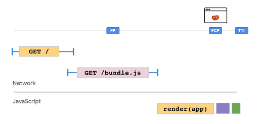

# Brauzerda ko’rsatish (Client-side Rendering)

Client-Side Rendering (CSR) da server tomonidan faqat sahifa uchun asosiy HTML konteyneri ko'rsatiladi. Sahifadagi tarkibni ko'rsatish uchun zarur bo'lgan mantiq, ma’lumotlarni yuklash, shablonlash va so’rovlarni yo’naltirish brauzerda bajariladigan JavaScript kodi tomonidan boshqariladi. CSR bir sahifali ilovalarni yaratish usuli sifatida mashhur bo'ldi. Bu veb-saytlar va o'rnatilgan ilovalar o'rtasidagi farqni yo'qotishga yordam berdi.

Boshqa patternlar tomonidan taqdim etilgan imtiyozlarni yaxshiroq baholash uchun keling, avvalo Client Side Rendering (CSR) ni chuqurroq ko'rib chiqamiz va u qaysi vaziyatlarda yaxshi ishlashi va uning kamchiliklari nimada ekanligini bilib olamiz.

## Asosiy tuzilma

React yordamida sahifadagi joriy vaqtni ko'rsatish va [yangilash](https://reactjs.org/docs/rendering-elements.html#updating-the-rendered-element) uchun ushbu oddiy misolni ko'rib chiqing.

```js
1 function tick() {
2  const element = (
3    <div>
4      <h1>Hello, world!</h1>
5      <h2>It is {new Date().toLocaleTimeString()}.</h2>
6    </div>
7  );
8  ReactDOM.render(element, document.getElementById("root"));
9 }
10
11 setInterval(tick, 1000);
```
HTML faqat bitta root \<div\> tegidan iborat. Boshqa tomondan, kontentni ko'rsatish va yangilanishlar to'liq JavaScriptda ko'rib chiqiladi. Serverga round trip yo’q va ko'rsatilgan HTML joyida yangilanadi. Bu yerda vaqt API-dan olingan va sahifani yangilamasdan yoki server bilan ma’lumotlar almashinuvi davomiyligisiz ko'rsatiladigan valyuta kurslari yoki aksiya baholari kabi boshqa real vaqtda ma'lumotlar bilan almashtirilishi mumkin.

## JavaScript to’plamlari va ish-faoliyati

Tasvirlarni ko'rsatish, bazadagi ma'lumotlarni ko'rsatish va hodisalarni boshqarishni o'z ichiga olgan sahifaning murakkabligi oshgani sayin, sahifani ko'rsatish uchun zarur bo'lgan JavaScript kodining murakkabligi va hajmi ham ortadi. CSR sahifaning FCP va TTI ni oshirgan katta JavaScript to’plamlariga olib keldi.

<div align="center">
  
</div>

Rasm manbaasi: [https://www.youtube.com/watch?v=k-A2VfuUROg\&feature=youtu.be](https://www.youtube.com/watch?v=k-A2VfuUROg&feature=youtu.be)

Yuqoridagi rasmda ko'rsatilganidek, bundle.js hajmi oshgani sayin, FCP va TTI oldinga suriladi. Bu foydalanuvchi FP va FCP o'rtasidagi butun vaqt davomida bo'sh ekranni ko'rishini anglatadi.

## Ijobiy va salbiy tomonlari

React bilan ilova mantig’ining ko'p qismi brauzerda bajariladi va u ma'lumotlarni olish yoki saqlash uchun API call orqali server bilan o'zaro aloqada bo’ladi. Shunday qilib, deyarli barcha UI clientda yaratiladi. Birinchi so’rovda butun veb-ilova yuklanadi. Foydalanuvchi havolalarni bosish orqali harakat qilganda, sahifalarni renderlash uchun serverga yangi so'rov yaratilmaydi. Kod view/datani o'zgartirish uchun clientda ishlaydi.

CSR bizga sahifani yangilamasdan navigatsiyani qo'llab-quvvatlaydigan va ajoyib foydalanuvchi tajribasini ta'minlaydigan yagona sahifali ilovaga ega bo'lish imkonini beradi. Viewni o'zgartirish uchun qayta ishlangan ma'lumotlar cheklanganligi sababli, sahifalar orasida so’rovlarni yo’naltirish odatda tezroq bo'lib, CSR ilovasi yanada sezgir ko'rinadi. CSR, shuningdek, dasturchilarga mijoz va server kodi o'rtasida aniq ajratish imkonini beradi.

U taqdim etadigan ajoyib interaktiv tajribaga qaramay, ushbu CSR uchun bir nechta kamchilik mavjud.

1. SEO masalalari: Ko'pgina veb-brauzerlar server tomonidan taqdim etilgan veb-saytlarni to'g'ridan-to'g'ri talqin qilishlari mumkin. Client Side Renderingda ishlar biroz murakkablashadi, chunki katta yuklamalar va tarmoq so'rovlaridagi waterfall (masalan, API javoblari uchun) mazmunli kontentni brauzer uni indekslashi uchun yetarlicha tez ko'rsatilmasligiga olib kelishi mumkin. Brauzerlar JavaScriptni tushunadi, ammo cheklovlar mavjud. Shunday qilib, client-rendered veb-saytni SEOga moslashtirish uchun ba'zi vaqtinchalik yechimlar talab qilinadi.  
2. Faoliyat: brauzerda ko’rsatish bilan, o'zaro aloqalar paytida javob vaqti sezilarli darajada yaxshilanadi, chunki serverda ma’lumot almashinuvi davomiyligi yo'q. Biroq, brauzerlar kontentni mijoz tomonida birinchi marta render qilishi uchun ular avval JavaScript yuklanishini kutishlari va qayta ishlashni boshlashlari kerak. Shunday qilib, foydalanuvchilar dastlabki sahifani yuklashdan oldin biroz kechikishni boshdan kechiradilar. Bu foydalanuvchi tajribasiga ta'sir qilishi mumkin, chunki JS to’plami o'lchamlari kattalashadi yoki mijoz yetarli ishlov berish kuchiga ega bo’lmaydi.   
3. Kodni boshqarish: Kodning ba'zi elementlari mijoz va server (API) bo'ylab turli tillarda takrorlanishi mumkin. Boshqa hollarda, biznes logikasini ajratish imkonsiz. Bunga misollar valyuta va data field’lar uchun tekshiruvlar va formatlash mantig’ini o'z ichiga oladi.  
4. Ma’lumotlarni yuklash:  client-side rendering bilan ma'lumotlarni olish odatda hodisalarga asoslangan. Sahifani dastlab hech qanday ma'lumotsiz yuklash mumkin edi. Keyinchalik API call yordamida page-load yoki button-clicks kabi hodisalar sodir bo'lganda ma'lumotlar olinishi mumkin. Ma'lumotlar hajmiga qarab, bu ilovaning yuklanishi/o’zaro ta’sir vaqtiga qo'shilishi mumkin. 

Ushbu fikrlarning ahamiyati ilovalar uchun har xil. Dasturchilar ko'pincha o’zaro ta’sir vaqtini buzmasdan sahifalarga tezroq xizmat ko'rsatishi mumkin bo'lgan SEO uchun qulay yechimlarni topishga qiziqishadi. Turli xil ishlash mezonlariga tayinlangan ustuvorliklar dastur talablariga qarab farq qiladi. Ba'zan butunlay boshqa modelga o'tish o'rniga, ba'zi o'zgarishlar bilan client- side renderingdan foydalanish yetarli bo'lishi mumkin.

## CSR faoliyatini yaxshilash

CSR uchun ishlash JavaScript to'plamining o'lchamiga teskari proporsional bo'lganligi sababli, biz qila oladigan eng yaxshi narsa bu JavaScript kodimizni optimal ishlash uchun tuzishdir. Quyida yordam berishi mumkin bo'lgan ko'rsatmalar ro'yxati keltirilgan.

* JavaScriptni moliyalashtirish: Dastlabki sahifa yuklash uchun JavaScriptning yetarli darajada cheklangan byudjetiga ega ekanligingizga ishonch hosil qiling. \< 100-170KB kichiklashtirilgan va gziplangan dastlabki paket yaxshi boshlanish nuqtasidir. Kod talab bo'yicha yuklanishi mumkin, chunki xususiyatlar kerak bo'ladi.   
* Oldindan yuklash: Ushbu usul sahifaning yuklanish bosqichlarida sahifa tomonidan talab qilinadigan muhim resurslarni oldindan yuklash uchun ishlatilishi mumkin. Muhim manbalar HTMLning \<head\> bo'limiga quyidagi direktivani kiritish orqali oldindan yuklanadigan JavaScriptni o'z ichiga oladi.

```js
<link rel="preload" as="script" href="critical.js" />
```

Bu brauzerni sahifani ko'rsatish mexanizmi boshlanishidan oldin critical.js faylini yuklashni boshlashi haqida xabar beradi. Shunday qilib, skript avvalroq mavjud bo'ladi va page rendering mexanizmini bloklamaydi va shu bilan ishlashni yaxshilaydi.

* Kechiktirib yuklash: kechiktirib yuklash orqali ikkinchi darajali resurslarni aniqlashingiz va ularni faqat kerak bo'lganda yuklashingiz mumkin. Dastlab yuklangan resurslar hajmi kamayganligi sababli sahifani dastlabki yuklash vaqtlarini ushbu yondashuv yordamida yaxshilash mumkin. Masalan, chat vidjeti komponenti odatda sahifa yuklanganda darhol kerak bo'lmaydi va kechroq yuklanishi mumkin.  
* Kodni qismlarga ajratish: JavaScript kodlaridagi katta to’plam oldini olish uchun siz to'plamlaringizni ajratishni boshlashingiz mumkin. Kodni qismlarga ajratish [Webpack](https://webpack.js.org/guides/code-splitting/) kabi paketlar tomonidan qo'llab-quvvatlanadi, bu yerda u ish vaqtida dinamik ravishda yuklanishi mumkin bo'lgan bir nechta to'plamlarni yaratish uchun ishlatilishi mumkin. Kodni ajratish sizga JavaScript resurslarini kechiktirib yuklashga ham imkon beradi.  
* Xizmat ko’rsatuvchi ishchilar orqali ilovaning asosiy qismini keshlash: Bu usul foydalanuvchi interfeysini quvvatlovchi minimal HTML, CSS va JavaScript bo'lgan dastur qobig'ini keshlashni o'z ichiga oladi. Xizmat xodimlari ilova qismini oflayn rejimda keshlash uchun ishlatilishi mumkin. Bu bir sahifali ilova tajribasini taqdim etishda foydali bo'ladi, bunda qolgan kontent kerak bo'lganda kechiktirib yuklanadi.

Ushbu usullar yordamida CSR yaxshi FCP va TTI bilan tezroq bitta sahifali dastur tajribasini taqdim etishga yordam beradi. Keyinchalik, Server-Side Rendering bilan spektrning boshqa uchida nima borligini ko'ramiz.