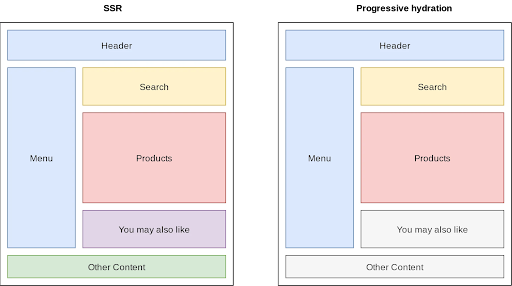

# Takomillashib boruvchi gidratsiya

Server tomonidan taqdim etilgan ilova joriy navigatsiya uchun HTML yaratish uchun serverdan foydalanadi. Server statik foydalanuvchi interfeysini to’g’ri ko’rsatish uchun kerakli CSS va JSON maʼlumotlarini o’z ichiga olgan HTML tarkibini yaratishni tugatgandan soʻng, u maʼlumotlarni mijozga yuboradi. Server biz uchun belgilashni yaratganligi sababli, mijoz buni tezda tahlil qilishi va uni ekranda ko'rsatishi mumkin, bu esa sahifaning ilk ko’rinishini tezkor ishlab chiqaradi\!

Garchi server rendering sahifaning ilk ko’rinishini tezroq ta'minlasa-da, u har doim ham interaktivga tezroq vaqtni ta'minlamaydi. Veb-saytimiz bilan o'zaro aloqada bo'lish uchun kerakli JavaScript hali yuklanmagan. Tugmalar interaktiv ko'rinishi mumkin, lekin ular interaktiv emas (hali). Ishlov beruvchilar faqat JavaScript to’plami yuklangan va qayta ishlanganidan keyin biriktiriladi. Bu jarayon gidratsiya deb ataladi: React joriy DOM nodelarini tekshiradi va mos keladigan JavaScript bilan nodelarni gidratsiyalaydi.

[https://res.cloudinary.com/ddxwdqwkr/video/upload/f\_auto/v1609056521/patterns.dev/prog-rehy-1.mp4](https://res.cloudinary.com/ddxwdqwkr/video/upload/f_auto/v1609056521/patterns.dev/prog-rehy-1.mp4)

Foydalanuvchi ekranda interaktiv bo'lmagan UIni ko'rgan vaqt uncanny valley deb ataladi: foydalanuvchilar veb-sayt bilan o'zaro aloqada bo'lishlari mumkin deb o'ylashlari mumkin bo'lsa-da, komponentlarga hali hech qanday boshqaruvchi biriktirilmagan. Bu foydalanuvchi uchun yaxshi bo'lmasligi mumkin, chunki UI muzlatib qo'yilgandek ko'rinadi\!

Serverdan olingan DOM komponentlari to’liq gidratsiyalanguncha biroz vaqt ketadi. Komponentlarni gidratsiyalashdan oldin JavaScript faylini yuklash, qayta ishlash va bajarish kerak. Avvalgidek bir vaqtning o'zida butun dasturni gidratsiyalash o'rniga, biz DOM nodelarini bosqichma-bosqich gidratsiyalashimiz mumkin. Bosqichma-bosqich gidratsiya vaqt o'tishi bilan nodelarni individual ravishda gidratsiyalaydi, bu esa faqat minimal zarur JavaScriptni so’rash imkonini beradi.

[https://res.cloudinary.com/ddxwdqwkr/video/upload/f\_auto/v1609056522/patterns.dev/prog-rehy-2.mp4](https://res.cloudinary.com/ddxwdqwkr/video/upload/f_auto/v1609056522/patterns.dev/prog-rehy-2.mp4)

Ilovani bosqichma-bosqich gidratsiyalash orqali biz sahifaning unchalik muhim bo'lmagan qismlarini gidratsiyalashni kechiktirishimiz mumkin. Shunday qilib, sahifani interaktiv qilish uchun so'rashimiz kerak bo'lgan JavaScript miqdorini kamaytiramiz va faqat foydalanuvchi kerak bo'lganda nodelarni gidratsiyashimiz mumkin. Progressiv gidratsiya, shuningdek, server tomonidan yaratilgan DOM tree vayron bo'ladigan va keyin darhol qayta tiklanadigan eng keng tarqalgan SSR qayta tiklash jarayonidagi xatolardan qochishga yordam beradi.

[https://res.cloudinary.com/ddxwdqwkr/video/upload/f\_auto/v1609056521/patterns.dev/prog-rehy-5.mp4](https://res.cloudinary.com/ddxwdqwkr/video/upload/f_auto/v1609056521/patterns.dev/prog-rehy-5.mp4)

Progressiv gidratsiya bizga faqat komponentlarni ma'lum bir holatga qarab gidratsiya qilish imkonini beradi, masalan, komponent viewportda ko'rinadigan bo'lsa. Quyidagi misolda bizda list viewportda bo'lganidan keyin progressiv gidratsiyalanadigan foydalanuvchilar ro'yxati mavjud. Binafsha rang chirog'i komponentning gidratsiyalanligini ko'rsatadi\!

```js
 import React from "react";
 import { hydrate } from "react-dom";
 import App from "./components/App";
 hydrate(<App />, document.getElementById("root"));
```

Bu tez sodir bo'lishiga qaramay, siz boshlang'ich UI gidratsiyalangan holatda UI bilan bir xil ekanligini ko'rishingiz mumkin\! Dastlabki HTML bir xil ma'lumotlar va uslublarni o'z ichiga olganligi sababli, biz komponentlarni hech qanday sekin va betartib UIsiz interaktiv qilishimiz mumkin. Progressiv gidratsiya ma'lum komponentlarni shartli ravishda interaktiv qilish imkonini beradi, shu bilan birga bu sizning ilovangiz foydalanuvchilariga mutlaqo e'tibor bermasligi mumkin.

## Progressiv gidratsiyadan foydalanish

React bilan SSRni amalga oshirish bo'limida biz serverda ko'rsatilgan ilova uchun mijoz tomonidan hidratsiyani muhokama qildik. Gidratsiya foydalanuvchi qurilmasi Reactga serverda ko'rsatilgan ReactDOM komponentlarini tanib olish va voqealarni ushbu komponentlarga biriktirish imkonini beradi. Shunday qilib, u mijozda mavjud bo'lgandan so'ng, SSR ilovasi CSR ilovasi kabi ishlashi uchun uzluksizlik va yaxlitlikni ta'minlaydi.

Sahifadagi barcha komponentlar gidratsiya orqali interaktiv bo'lishi uchun ushbu komponentlar uchun React kodi mijozga yuklab olinadigan to’plamga kiritilishi kerak. Ko'p jihatdan JavaScript tomonidan boshqariladigan yuqori interaktiv SPAlar bir vaqtning o'zida butun to’plamga muhtoj bo'ladi. Biroq, ekranda bir nechta interaktiv elementlarga ega bo'lgan asosan statik veb-saytlar barcha komponentlar darhol faol bo'lishiga muhtoj bo'lmasligi mumkin. Bunday veb-saytlar uchun ekrandagi har bir komponent uchun katta React to’plamini yuborish [ortiqcha yuk](https://addyosmani.com/blog/rehydration/) bo'ladi.

Progressive Hydration sahifa yuklanganda dasturning faqat ayrim qismlarini gidratsiyalash imkonini berish orqali bu muammoni hal qiladi. Qolgan qismlar talabga qarab asta-sekin gidratsiyalanadi.

<div align="center">
  
</div>

Progressiv gidratsiya bilan “You may also like” va “Other content” komponentlarini keyinroq gidratsiyalash mumkin.

Bir vaqtning o'zida butun dasturni ishga tushirish o'rniga, hidratsiya bosqichi DOM treening ildizidan boshlanadi, ammo server tomonidan taqdim etilgan ilovaning alohida qismlari ma'lum vaqt ichida faollashadi. Gidratatsiya jarayoni turli filiallar uchun to'xtatilishi mumkin va keyinroq ular viewportga kirganlarida yoki boshqa aktivlashtiruvchiga asoslangan holda davom ettirilishi mumkin. Shuni esda tutingki, har bir gidratsiyani amalga oshirish uchun zarur bo'lgan resurslarni yuklash kodlarni ajratish usullaridan foydalangan holda kechiktiriladi va shu bilan sahifalarni interaktiv qilish uchun zarur bo'lgan JavaScript miqdorini kamaytiradi.

Progressiv gidratsiya g'oyasi ilovangizni qismlarga bo'lib faollashtirish orqali ajoyib ishlashni ta'minlashdir. Har qanday progressiv gidratsiya yechimi umumiy foydalanuvchi tajribasiga qanday ta'sir qilishini ham hisobga olishi kerak. Sizda birin-ketin paydo bo'ladigan ekran bo'laklari bo'lishi mumkin emas, lekin allaqachon yuklangan bo'laklardagi har qanday faoliyat yoki foydalanuvchi kiritishini bloklashingiz mumkin. Shunday qilib, yaxlit progressiv gidratsiyani amalga oshirish uchun talablar quyidagilardir.

1. Barcha komponentlar uchun SSR dan foydalanishga ruxsat beradi.  
2. Kodni alohida komponentlarga yoki bo’laklarga ajratishni qo'llab-quvvatlaydi.  
3. Dasturchi tomonidan belgilangan ketma-ketlikda ushbu bo’laklarning mijoz tomonidan gidratsiyalanishini qo'llab-quvvatlaydi.  
4. Allaqachon gidratsiyalangan qismlarga user inputni bloklamaydi.  
5. Kechiktirilgan gidratsiyaga ega bo’laklar uchun qandaydir yuklanish belgisian foydalanishga imkon beradi.

[React concurrent mode](https://reactjs.org/docs/concurrent-mode-patterns.html) hamma uchun mavjud bo'lgandan keyin barcha ushbu talablarga javob beradi. Bu Reactga bir vaqtning o'zida turli vazifalar ustida ishlash va berilgan ustuvorlik asosida ular o'rtasida almashish imkonini beradi. O'tish paytida, qisman ko'rsatilgan treeni bajarish shart emas, shuning uchun React xuddi shu vazifaga qaytgandan so'ng, rendering vazifasi davom etishi mumkin. 

Progressiv gidratsiyani amalga oshirish uchun parallel rejimdan foydalanish mumkin. Bunday holda, sahifadagi har bir bo’lakni gidratsiya qilish React concurrent rejimi uchun vazifaga aylanadi. Agar foydalanuvchi harakati kabi ustuvor vazifani bajarish kerak bo’lsa, React gidratsiya vazifasini to’xtatib turadi va user inputni qabul qilishga o’tadi. [lazy(), Suspense()](https://reactjs.org/docs/code-splitting.html#reactlazy) kabi funksiyalar deklarativ yuklanish holatlaridan foydalanish imkonini beradi. Chunklar kechiktirib yuklanayotganda yuklanish belgisini ko'rsatish uchun ulardan foydalanish mumkin. SuspenseList() komponentlarni zarur bo’lganda yuklash uchun ustuvorlikni aniqlash maqsadida ishlatiladi. [Dan Abramov](https://twitter.com/dan_abramov/status/1200111677833973760) tomonidan baham ko'rilgan [ushbu demo](https://codesandbox.io/s/floral-worker-xwbwv) amalda bir vaqtda rejimni ko'rsatadi va progressiv gidratsiyani amalga oshiradi.

React concurrent mode boshqa React xususiyati bilan birlashtirilishi mumkin. 

* [Server Components](https://github.com/reactjs/rfcs/blob/bf51f8755ddb38d92e23ad415fc4e3c02b95b331/text/0000-server-components.md). Bu sizga komponentlarni serverdan qayta yuklash va ularni butun yuklash tugashini kutish o‘rniga ular oqimi sifatida mijozga ko‘rsatish imkonini beradi. Shunday qilib, mijozning protsessori tarmoqni yuklash tugashini kutayotganimizda ham ishga tushadi.

React concurrent rejimiga asoslangan progressiv gidratsiyani amalga oshirish hali ham tayyorlanayotgan bo'lsa-da, qisman hidratsiyani amalga oshirish uchun ko'plab boshqa da'vogarlar mavjud. Progressiv gidratsiya [Google I/O ‘19](https://www.youtube.com/watch?v=k-A2VfuUROg&t=960s) da namoyish etildi. Progressiv gidratsiya [demo](https://github.com/GoogleChromeLabs/progressive-rendering-frameworks-samples/tree/master/react-progressive-hydration) sahifaning tanlangan qismlarini gidratsiyalash uchun Hydrator komponentidan foydalanishni ko'rsatdi. Bundan mijoz tomondagi frameworklar uchun bir nechta ilovalar paydo bo'ldi. Amalga oshirish Vue, Angular va Next.js uchun ham mavjud.

Keling, Preact va Next.js yordamida shunday usullardan birini tez ko'rib chiqaylik. 

[Bu](https://github.com/LukasBombach/next-super-performance) qisman hidratsiyadan foydalanish uchun POC:

1. pool-attendant-preact: Preact x bilan qisman hidratsiyani amalga oshiradigan kutubxona.  
2. next-super-performance: client-side ish faoliyatini yaxshilash uchun ushbu kutubxonadan foydalanadigan Next.js qo’shimcha moduli.

Pool-attendant-preact kutubxonasi gidratsiya uchun ko'proq interaktiv komponentlaringizni belgilash imkonini beruvchi withHydration deb nomlangan APIni o'z ichiga oladi. Ular birinchi navbatda gidratsiyalanadi. Buning yordamida sahifangiz tarkibini quyidagicha belgilashingiz mumkin.

```js
import Teaser from "./teaser";
import { withHydration } from "next-super-performance";


const HydratedTeaser = withHydration(Teaser);


export default function Body() {
  return (
    <main>
      <Teaser column={1} />
      <HydratedTeaser column={2} />
      <HydratedTeaser column={3} />


      <Teaser column={1} />
      <Teaser column={2} />
      <Teaser column={3} />


      <Teaser column={1} />
      <Teaser column={2} />
      <Teaser column={3} />
    </main>
  );
}
```

2 va 3-ustunlardagi HydratedTeaser komponenti avval gidratsiyalanadi. Endi siz kutubxonaga kiritilgan hydrate() API yordamida mijozning qolgan komponentlarini gidratsiyalashingiz mumkin.

```js
import { hydrate } from "next-super-performance";
import Teaser from "./components/teaser";


hydrate([Teaser]);
```

HydrationData komponenti clientga seriyali proplarni yozish uchun ishlatiladi. Bu kerakli proplarning gidratsiyalanadigan komponentlar uchun mavjudligini ta'minlaydi.

```js
import Header from "../../components/header";
import Main from "../../components/main";
import { HydrationData } from "next-super-performance";


export default function Home() {
  return (
    <section>
      <Header />
      <Main />
      <HydrationData />
    </section>
  );
}
```

## Ustun taraflari va kamchiliklari

Progressiv gidratsiya mijoz tomonidan gidratsiya bilan server tomonida renderlashni ta'minlaydi va shu bilan birga gidratsiya narxini kamaytiradi. Quyida bundan foydalanish mumkin bo'lgan ba'zi afzalliklar mavjud.

1. Kodni qismlarga bo’lishni qo’lllab-quvvatlaydi: Kodni qismlarga ajratish progressiv gidratsiyaning ajralmas qismidir, chunki kechiktirib yuklangan alohida komponentlar uchun kod bo’laklari yaratilishi kerak.  
2. Sahifaning kam ishlatiladigan qismlarini talab bo’yicha yuklash imkonini beradi: Sahifaning asosan statik, viewportdan tashqarida yoki tez-tez talab qilinmaydigan komponentlari bo’lishi mumkin. Bunday komponentlar kechiktirib yuklash uchun ideal nomzodlardir. Sahifa yuklanganda ushbu komponentlar uchun gidratsiya kodi yuborilishi shart emas. Buning o'rniga, ular triggerda gidratsiyalangan bo'lishi mumkin.  
3. To’plam o’lchamini kamaytiradi: Kodni qismlarga ajratish to’plam hajmining qisqarishiga olib keladi. Yuklanganda bajarish uchun kamroq kod FCP va TTI o'rtasidagi vaqtni qisqartirishga yordam beradi.

Salbiy tomoni shundaki, progressiv gidratsiya ekrandagi har bir element foydalanuvchi uchun mavjud bo'lgan va yuklanganda interaktiv bo'lishi kerak bo'lgan dinamik ilovalar uchun mos kelmasligi mumkin. Buning sababi shundaki, agar dasturchilar foydalanuvchi birinchi bo'lib qayerga bosishini bilmasa, ular birinchi navbatda qaysi komponentlarni gidratsiyalash kerakligini aniqlay olmasligi mumkin.