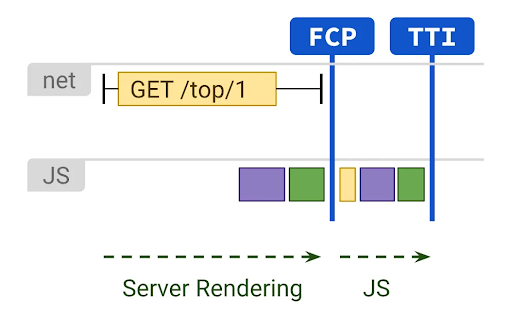

# Server tomonidan renderlash

Server-side rendering (SSR) web kontent ko'rsatishning eng eski usullaridan biridir. SSR foydalanuvchi so'roviga javoban ko'rsatiladigan sahifa tarkibi uchun to'liq HTMLni yaratadi. Kontent ma’lumotlar bazasi yoki tashqi API ma'lumotlarini o'z ichiga olishi mumkin.

[https://res.cloudinary.com/ddxwdqwkr/video/upload/f\_auto/v1617495417/patterns.dev/serverside-rendering-1.mp4](https://res.cloudinary.com/ddxwdqwkr/video/upload/f_auto/v1617495417/patterns.dev/serverside-rendering-1.mp4)

Connect va fetch operatsiyalari serverda amalga oshiriladi. Kontentni formatlash uchun zarur bo'lgan HTML ham serverda yaratilgan. Shunday qilib, SSR bilan biz ma'lumotlarni olish va shablonlash uchun qo'shimcha safarlardan qochishimiz mumkin. Shunday qilib, mijozda renderlash kod talab qilmaydi va bunga mos keladigan JavaScript mijozga yuborilishi shart emas.

SSR bilan har bir so'rov mustaqil ravishda ko'rib chiqiladi va server tomonidan yangi so'rov sifatida qayta ishlanadi. Ketma-ket ikkita so'rovning chiqishi unchalik farq qilmasa ham, server uni qayta ishlaydi va noldan hosil qiladi. Server bir nechta foydalanuvchilar uchun umumiy bo'lganligi sababli, ishlov berish qobiliyati ma'lum bir vaqtda barcha faol foydalanuvchilar tomonidan taqsimlanadi. 

## Klassik ravishda SSR ni joriy etish

Keling, klassik SSR va JavaScriptdan foydalanib joriy vaqtni ko'rsatish uchun sahifani qanday yaratishingizni ko'rib chiqaylik.

```js
1 <!DOCTYPE html>
2 <html>
3   <head>
4       <title>Time</title>
5   </head>
6   <body>
7       <div>
8       <h1>Hello, world!</h1>
9       <b>It is <div id=currentTime></div></b>
10       </div>
11   </body>
12 </html>
```

Bu bir xil outputni ta'minlaydigan CSR kodidan qanday farq qilishiga e'tibor bering. Shuni ham yodda tutingki, HTML server tomonidan render qilinganda, bu yerda ko'rsatilgan vaqt mijozning JavaScript funksiyasi tick() bilan to'ldirilgan mahalliy vaqtdir. Agar siz serverga tegishli bo'lgan boshqa ma'lumotlarni, masalan, server vaqtini ko'rsatishni istasangiz, uni ko'rsatilishidan oldin HTMLga joylashtirishingiz kerak bo'ladi. Bu shuni anglatadiki, u serverga to’liq safarsiz avtomatik ravishda yangilanmaydi.

## Ustun taraflari va kamchiliklari

Serverda renderlash kodini bajarish va JavaScriptni qisqartirish quyidagi afzalliklarni beradi.

### Kamroq JavaScript tezroq FCP va TTIga sabab bo’ladi

Sahifada bir nechta UI elementlari va ilova mantig’i mavjud bo'lgan hollarda, SSR CSR bilan solishtirganda ancha kamroq JavaScriptga ega. Shunday qilib, skriptni yuklash va qayta ishlash uchun talab qilinadigan vaqt kamroq bo'ladi. FP, FCP va TTI qisqaroq va FCP \= TTI hisoblanadi. SSR bilan foydalanuvchilar ekranning barcha elementlari paydo bo'lishini va uning interaktiv bo'lishini kutishmaydi.

<div align="center">
  
</div>

Surat manbaasi: [https://developers.google.com/web/updates/2019/02/rendering-on-the-web](https://developers.google.com/web/updates/2019/02/rendering-on-the-web)

### Client-side JavaScriptni qo’shimcha byudjet bilan ta’minlaydi

Dasturlash guruhlari kerakli ishlashga erishish uchun sahifadagi JS miqdorini cheklaydigan JS byudjeti bilan ishlashlari kerak. SSR bilan siz sahifani ko'rsatish uchun zarur bo'lgan JSni to'g'ridan-to'g'ri yo'q qilayotganingiz uchun u ilova tomonidan talab qilinishi mumkin bo'lgan har qanday uchinchi tomon JS uchun qo'shimcha joy yaratadi.

### SEO faollashtirilgan

Qidiruv mexanizmi brauzerlari SSR ilovasining mazmunini osongina ko'rib chiqishlari mumkin, bu esa sahifada yuqori darajadagi qidiruv tizimini optimallashtirishni ta'minlaydi.

SSR yuqoridagi afzalliklar tufayli statik tarkib uchun juda yaxshi ishlaydi. Biroq, uning bir nechta kamchiliklari bor, chunki u barcha ssenariylar uchun mukammal emas.

### Sekin TTFB

Barcha ishlov berish serverda amalga oshirilganligi sababli, quyidagi ssenariylardan biri yoki bir nechtasi bo'lsa, serverdan javob kechiktirilishi mumkin.

* Bir vaqtning o'zida bir nechta foydalanuvchilar serverda ortiqcha yuklanishga olib keladi.  
* Sekin tarmoq.  
* Server kodi optimallashtirilmagan.

### Ba’zi o’zaro ta’sirlar uchun to’liq sahifani qayta yuklash talab qilinadi

Mijozda barcha kodlar mavjud emasligi sababli, to'liq sahifani qayta yuklashga olib keladigan barcha asosiy operatsiyalar uchun serverga tez-tez to’liq safarlar talab qilinadi. Bu o’zaro ta’sirlar orasidagi vaqtni oshirishi mumkin, chunki foydalanuvchilar operatsiyalar orasida uzoqroq kutishlari kerak. Shunday qilib, SSR bilan yagona sahifa dasturi mumkin emas.

Ushbu kamchiliklarni bartaraf etish uchun zamonaviy frameworklar va kutubxonalar bir xil dastur uchun ham serverda, ham mijozda ko'rsatish imkonini beradi. Bular haqida keyingi bo‘limlarda batafsil to‘xtalib o‘tamiz. Birinchidan, Next.js bilan SSR ning oddiyroq shaklini ko'rib chiqaylik.

## Next.js bilan SSR

Next.js framework ham SSR ni qo'llab-quvvatlaydi. Bu har bir so'rov bo'yicha serverda sahifani oldindan ko'rsatadi. Buni sahifadan getServerSideProps() deb nomlangan asinxronizatsiya funksiyasini quyidagi tarzda eksport qilish orqali amalga oshirish mumkin.

```js
export async function getServerSideProps(context) {
  return {
    props: {}, // will be passed to the page component as props
  };
```

Kontekst obyekti HTTP so'rovi va javob obyektlari, routing parametrlari, querystring, locale va boshqalar uchun kalitlarni o'z ichiga oladi.

Quyidagi dastur React yordamida formatlangan sahifada ma'lumotlarni ko'rsatish uchun getServerSideProps() dan foydalanishni ko'rsatadi. To'liq implementationni [bu yerda](https://medium.com/swlh/fetching-and-hydrating-a-next-js-app-using-getserversideprops-and-getstaticprops-65bfe42afed8) topishingiz mumkin.

```js
1 // data fetched from an external data source using `getServerSideProps`
2
3 const Users = ({ users, error }) => {
4 return (
5   <section>
6     <header>
7       <h1>List of users</h1>
8     </header>
9     {error && <div>There was an error.</div>}
10     {!error && users && (
11       <table>
12         <thead>
13           <tr>
14             <th>Username</th>
15             <th>Email</th>
16             <th>Name</th>
17           </tr>
18         </thead>
19         <tbody>
20           {users.map((user, key) => (
21             <tr key={key}>
22               <td>{user.username}</td>
23               <td>{user.email}</td>
24               <td>{user.name}</td>
25             </tr>
26           ))}
27         </tbody>
28       </table>
29     )}
30   </section>
31 );
32 };
33
34 export async function getServerSideProps() {
35 // Fetch data from external API
36 const res = await fetch("https://jsonplaceholder.typicode.com/users")
37 const data = await res.json();
38
39 // Pass data to the page via props
40 return { props: { data } }
41 }
42
43 export default Users;
```

## Server uchun React

React izomorf tarzda render qilinishi, ya'ni u brauzerda ham, server kabi boshqa platformalarda ham ishlashi mumkin. Shunday qilib, UI elementlari React yordamida serverda ko'rsatiladi.

React universal kod bilan ham ishlatilishi mumkin, bu bir xil kodni bir nechta muhitda ishlashga imkon beradi. Bu serverda Node.js yoki node serveri sifatida tanilgan narsadan foydalanish orqali amalga oshiriladi. Shunday qilib, universal JavaScriptdan serverdagi ma'lumotlarni olish va keyin uni izomorf React yordamida ko'rsatish uchun foydalanish mumkin.

Keling, buni amalga oshirishga imkon beradigan react funksiyalarini ko'rib chiqaylik.

```js
ReactDOMServer.renderToString(element);
```

Bu funksiya React elementiga mos HTML stringni qaytaradi. HTML keyinchalik sahifani tezroq yuklash uchun mijozga taqdim etilishi mumkin. 

 [renderToString()](https://reactjs.org/docs/react-dom-server.html#rendertostring) funksiyasidan [ReactDOM.hydrate()](https://reactjs.org/docs/react-dom.html#hydrate) bilan foydalanish mumkin. Bu renderlangan HTML mijozda bo'lgani kabi saqlanishini va faqat yuklangandan keyin biriktirilgan hodisa boshqaruvchilari bilan ta'minlaydi.

Buni amalga oshirish uchun biz mijoz va serverda har bir sahifaga mos keladigan .js faylidan foydalanamiz. Serverdagi .js fayli HTML tarkibini beradi va clientdagi .js fayli uni gidratsiyalaydi.

Faraz qiling, sizda universal app.js faylida render qilinishi kerak bo’lgan HTMLni o’z ichiga olgan App nomli React elementi bor. Server va mijoz tomonidagi React ilova elementini taniy oladi.

Serverdagi ipage.js fayli quyidagi kodga ega bo'lishi mumkin:

```js
app.get("/", (req, res) => {
  const app = ReactDOMServer.renderToString(<App />);
});
```

Doimiy App endi ko'rsatiladigan HTMLni yaratish uchun ishlatilishi mumkin. Client tomonidagi ipage.js App elementi gidratsiyalanganligini taʼminlash uchun quyidagilarga ega bo’ladi.

```js
ReactDOM.hydrate(<App />, document.getElementById("root"));
```

React bilan SSRning to'liq namunasini [bu yerdan](https://www.digitalocean.com/community/tutorials/react-server-side-rendering) topish mumkin.