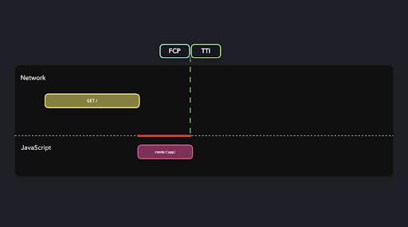

# Statik renderlash

SSR bo'yicha muhokamamizga asoslanib, serverda so’rovni qayta ishlashning yuqori vaqti TTFBga salbiy ta'sir ko'rsatishini bilamiz. Xuddi shunday, CSR bilan, katta JavaScript to’plami skriptni yuklab olish va qayta ishlash uchun ketgan vaqt tufayli ilovaning FCP, LCP va TTI uchun zararli bo'lishi mumkin.

Statik renderlash yoki statik generation (SSG) bu muammolarni sayt qurilganda yaratilgan mijozga oldindan ko'rsatilgan HTML tarkibini yetkazib berish orqali hal qilishga urinadi.

[https://res.cloudinary.com/ddxwdqwkr/video/upload/f\_auto/v1617429548/patterns.dev/static-generation-1.mp4](https://res.cloudinary.com/ddxwdqwkr/video/upload/f_auto/v1617429548/patterns.dev/static-generation-1.mp4)

Statik HTML fayli foydalanuvchi kirishi mumkin bo'lgan har bir routega mos keladigan vaqtdan oldin yaratiladi. Ushbu statik HTML-fayllar server yoki CDN-da mavjud bo'lishi va mijoz so'raganidek olinishi mumkin.

[https://res.cloudinary.com/ddxwdqwkr/video/upload/f\_auto/v1617496085/patterns.dev/static-generation-2.mp4](https://res.cloudinary.com/ddxwdqwkr/video/upload/f_auto/v1617496085/patterns.dev/static-generation-2.mp4)

Statik fayllar ham keshlanadi, bu esa ko'proq chidamlilikni ta'minlaydi. HTML response oldindan yaratilganligi sababli, serverda ishlov berish vaqti ahamiyatsiz bo'lib, bu tezroq TTFB va yaxshi ishlashga olib keladi. Ideal ssenariy mijoz tomonidagi JS minimal bo'lishi kerak va mijoz response olgandan so'ng statik sahifalar interaktiv bo'lishi kerak. Natijada, SSG tezroq FCP/TTI ga erishishga yordam beradi.

<div align="center">
  
</div>

## Asosiy struktura

Nomidan ko'rinib turibdiki, statik renderlash statik tarkib uchun ideal bo'lib, u yerda sahifani tizimga kirgan foydalanuvchi (masalan, shaxsiy tavsiyalar) asosida moslash shart emas. Shunday qilib, "Biz haqimizda", "Biz bilan bog'laning", veb-saytlar uchun blog sahifalari yoki elektron tijorat ilovalari uchun mahsulot sahifalari kabi statik sahifalar statik rendering uchun ideal nomzodlardir. Next.js, Gatsby va VuePress kabi frameworklar statik generationni qo'llab-quvvatlaydi. Hech qanday ma'lumotsiz statik kontentni ko'rsatishning oddiy [Next.js misolidan](http://Next.js) boshlaylik.

Next.js:

```js
// pages/about.js


export default function About() {
  return (
    <div>
      <h1>About Us</h1>
      {/* ... */}
    </div>
  );
}
```

Sayt qurilganda (next build yordamida), bu sahifa /about routeda foydalanish mumkin bo'lgan about.html HTML fayliga oldindan render qilinadi.

## SSG bilan Data

"Biz haqimizda" yoki "Biz bilan bog'laning" sahifalaridagi shunga o'xshash statik kontent data-storedan ma'lumot olinmagan holda ko'rsatilishi mumkin. Biroq, shaxsiy blog sahifalari yoki mahsulot sahifalari kabi kontent uchun data-storedagi ma'lumotlar ma'lum bir shablon bilan birlashtirilishi va keyin yaratish vaqtida HTMLga render qilinishi kerak.

Yaratilgan HTML sahifalar soni mos ravishda blog postlari soniga yoki mahsulotlar soniga bog'liq bo'ladi. Ushbu sahifalarga kirish uchun sizda ma'lumotlar elementlarining toifalangan va formatlangan ro'yxatini o'z ichiga olgan HTML sahifalari bo'lgan ro'yxat sahifalari ham bo'lishi mumkin. Ushbu ssenariylarni Next.js statik renderlash yordamida hal qilish mumkin. Mavjud elementlar asosida biz listing sahifalarini yoki alohida element sahifalarini yaratamiz. Keling, buni qanday qilib bajarishni ko’rib chiqaylik. 

### Ro’yxat sahifasi \- Barcha narsa

Ro’yxat sahifasini yaratish \- sahifada ko'rsatiladigan tarkib tashqi ma'lumotlarga bog'liq bo'lgan ssenariydir. Ushbu ma'lumotlar sahifani yaratish uchun yaratish vaqtida ma'lumotlar bazasidan olinadi. Next.js da bunga sahifa komponentidagi getStaticProps() funksiyasini eksport qilish orqali erishish mumkin. Funksiya ma'lumotlarni olish uchun qurish serverida qurish vaqtida chaqiriladi. Keyin ma'lumotlar sahifa komponentini pre-render qilish uchun sahifaning proplariga uzatilishi mumkin. Keling, [ushbu postning](https://vercel.com/blog/nextjs-server-side-rendering-vs-static-generation#all-products-page-static-generation-with-data) bir qismi sifatida baham ko'rilgan mahsulot ro'yxati sahifasini yaratish kodini ko'rib chiqaylik.

```js
// This function runs at build time on the build server
export async function getStaticProps() {
  return {
    props: {
      products: await getProductsFromDatabase(),
    },
  };
}


// The page component receives products prop from getStaticProps at build time
export default function Products({ products }) {
  return (
    <>
      <h1>Products</h1>
      <ul>
        {products.map((product) => (
          <li key={product.id}>{product.name}</li>
        ))}
      </ul>
    </>
  );
}
```

Funksiya mijoz tomonidagi JS to'plamiga kiritilmaydi va shuning uchun ma'lumotlarni to'g'ridan-to'g'ri bazadan olish uchun ham foydalanish mumkin.

### Har bir narsa uchun shaxsiy ma'lumotlar sahifasi

Yuqoridagi misolda biz ro'yxat sahifasida sanab o'tilgan mahsulotlarning har biri uchun alohida batafsil sahifaga ega bo'lishimiz mumkin. Ushbu sahifalarga ro'yxat sahifasidagi tegishli narsalarni bosish yoki to'g'ridan-to'g'ri boshqa yo’l orqali kirish mumkin.

Faraz qilaylik, bizda mahsulot identifikatorlari 101, 102, 103 va shunga o'xshash mahsulotlar bor. Bizga ularning maʼlumotlari /products/101, /products/102, /products/103 va hokazo routelarida mavjud bo’lishi kerak. Bunga Next.jsʼda build vaqtida erishish uchun [dinamik routelar](https://nextjs.org/docs/routing/dynamic-routes) bilan birgalikda getStaticPaths() funksiyasidan foydalanishimiz mumkin.

Buning uchun products/\[id\].js umumiy sahifa komponentini yaratishimiz va undagi getStaticPaths() funksiyasini eksport qilishimiz kerak. Funksiya barcha mumkin bo'lgan mahsulot identifikatorlarini qaytaradi, ulardan mahsulotning alohida sahifalarini yaratish vaqtida oldindan render qilish uchun foydalanish mumkin. [Bu yerda](https://vercel.com/blog/nextjs-server-side-rendering-vs-static-generation#individual-product-page-static-generation-with-data) mavjud keyingi Next.js skeleti buning uchun kodni qanday tuzishni ko'rsatadi.

```js
// pages/products/[id].js


// In getStaticPaths(), you need to return the list of
// ids of product pages (/products/[id]) that you'd
// like to pre-render at build time. To do so,
// you can fetch all products from a database.
export async function getStaticPaths() {
  const products = await getProductsFromDatabase();


  const paths = products.map((product) => ({
    params: { id: product.id },
  }));


  // fallback: false means pages that don't have the correct id will 404.
  return { paths, fallback: false };
}


// params will contain the id for each generated page.
export async function getStaticProps({ params }) {
  return {
    props: {
      product: await getProductFromDatabase(params.id),
    },
  };
}


export default function Product({ product }) {
  // Render product
}
```

Mahsulot sahifasidagi ma'lumotlar ma'lum mahsulot identifikatori uchun getStaticProps funksiyasidan foydalangan holda qurilish vaqtida to'ldirilishi mumkin. Bu yerda zaxiradan foydalanishga e'tibor bering: noto’g’ri ko’rsatkich. Bu shuni anglatadiki, agar ma'lum bir yo’nalish yoki mahsulot identifikatoriga mos keladigan sahifa mavjud bo'lmasa, 404 xato sahifa ko'rsatiladi.

Shunday qilib, biz SSG-dan turli xil turdagi sahifalarni oldindan render qilish uchun foydalanishimiz mumkin.

## SSG \- Asosiy fikrlar

Muhokama qilinganidek, SSG veb-saytlar uchun ajoyib faoliyatga olib keladi, chunki u mijoz va serverda talab qilinadigan shlov berishni qisqartiradi. Saytlar SEOga ham mos keladi, chunki kontent allaqachon mavjud va veb-brauzerlar tomonidan hech qanday qo'shimcha harakatlarsiz render qilinishi mumkin. Performance va SEO SSG-ni katta renderlash modeliga aylantirsa-da, SSG-ning muayyan ilovalar uchun yaroqliligini baholashda quyidagi omillarni hisobga olish kerak.

1. Ko'p sonli HTML fayllari: Foydalanuvchi kirishi mumkin bo'lgan har bir mumkin bo'lgan yo’nalish uchun individual HTML fayllari yaratilishi kerak. Misol uchun, uni blog uchun ishlatganda, data storeda mavjud bo'lgan har bir blog posti uchun HTML fayli yaratiladi. Keyinchalik, har qanday xabarga o'zgartirishlar statik HTML fayllarida aks etishi uchun yangilanishni qayta tiklashni talab qiladi. Ko'p sonli HTML fayllarni saqlash qiyin bo'lishi mumkin.  
2. Hostingga bog’liqlik: SSG sayti juda tez bo'lishi va tezda javob berishi uchun HTML fayllarini saqlash va ularga xizmat ko'rsatish uchun ishlatiladigan hosting platformasi ham yaxshi bo'lishi kerak. Agar yaxshi sozlangan SSG veb-sayti edge-cachingdan foydalanish uchun bir nechta CDN-larda joylashtirilgan bo'lsa, yuqori ishlash mumkin.  
3. Dinamik kontent: SSG sayti har safar tarkib o'zgarganda qurilishi va qayta joylashtirilishi kerak. Agar sayt har qanday tarkib o'zgarishidan keyin tuzilmagan va o'rnatilmagan bo'lsa, ko'rsatilgan kontent eskirgan bo'lishi mumkin Bu SSG ni yuqori dinamik tarkib uchun yaroqsiz qiladi.