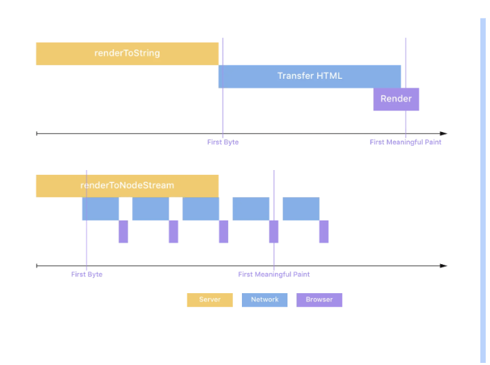

# Streaming Server-Side Rendering {#streaming-server-side-rendering}

Ilovamiz mazmunini ko'rsatuvchi streaming server orqali biz hali ham server dasturimizni render qilayotganda Time to Interactiveni qisqartirishimiz mumkin. Joriy navigatsiya uchun kerakli belgilarni o'z ichiga olgan bitta katta HTML faylini yaratish o'rniga, biz uni kichikroq bo'laklarga bo'lamiz\! Node stream bizga response obyektiga ma'lumotlarni uzatish imkonini beradi, ya'ni biz doimiy ravishda mijozga ma'lumotlarni yuborishimiz mumkin. Client ma'lumotlar qismlarini olgan zahoti, u kontentni render qilishni boshlashi mumkin.

[https://res.cloudinary.com/ddxwdqwkr/video/upload/f\_auto/v1609056525/patterns.dev/ssr-1.mp4](https://res.cloudinary.com/ddxwdqwkr/video/upload/f_auto/v1609056525/patterns.dev/ssr-1.mp4)

Reactning built-in renderToNodeStream ilovasi bizga ilovamizni kichikroq bo’laklarga yuborish imkonini beradi. Mijoz hali ham ma'lumot olayotganda user interfaceni bo'yashni boshlashi mumkinligi sababli, biz birinchi yuklashda juda samarali tajriba yaratishimiz mumkin. Qabul qilingan DOM nodelarida gidratsiya usulini chaqirish tegishli hodisa boshqaruvchilarini biriktiradi, bu esa UIni interaktiv qiladi\!

[https://res.cloudinary.com/ddxwdqwkr/video/upload/f\_auto/v1609056525/patterns.dev/ssr-2.mp4](https://res.cloudinary.com/ddxwdqwkr/video/upload/f_auto/v1609056525/patterns.dev/ssr-2.mp4)

Aytaylik, bizda App komponentida foydalanuvchiga minglab cat faktlarini ko'rsatadigan ilova bor\!

```js
1 import React from "react";
2 import path from "path";
3 import express from "express";
4 import { renderToNodeStream } from "react-dom/server";
5
6 import App from "./src/App";
7
8 const app = express();
9
10 // app.get("/favicon.ico", (req, res) => res.end());
11 app.use("/client.js", (req, res) => res.redirect("/build/client.js"));
12
13 const DELAY = 500;
14 app.use((req, res, next) => {
15  setTimeout(() => {
16    next();
17  }, DELAY);
18 });
19
20 const BEFORE = `
21 <!DOCTYPE html>
22  <html>
23    <head>
24      <title>Cat Facts</title>
25      <link rel="stylesheet" href="/style.css">
26      <script type="module" defer src="/build/client.js"></script>
27    </head>
28    <body>
29      <h1>Stream Rendered Cat Facts!</h1>
30      <div id="approot">
31 `.replace(/
32 s*/g, "");
33
34 app.get("/", async (request, response) => {
35  try {
36    const stream = renderToNodeStream(<App />);
37    const start = Date.now();
38
39    stream.on("data", function handleData() {
40      console.log("Render Start: ", Date.now() - start);
41      stream.off("data", handleData);
42      response.useChunkedEncodingByDefault = true;
43      response.writeHead(200, {
44        "content-type": "text/html",
45        "content-transfer-encoding": "chunked",
46        "x-content-type-options": "nosniff"
47      });
48      response.write(BEFORE);
49      response.flushHeaders();
50    });
51    await new Promise((resolve, reject) => {
52      stream.on("error", err => {
53        stream.unpipe(response);
54        reject(err);
55      });
56      stream.on("end", () => {
57        console.log("Render End: ", Date.now() - start);
58        response.write("</div></body></html>");
59        response.end();
60        resolve();
61      });
62      stream.pipe(
63        response,
64        { end: false }
65      );
66    });
67  } catch (err) {
68    response.writeHead(500, {
69      "content-type": "text/pain"
70    });
71    response.end(String((err && err.stack) || err));
72    return;
73  }
74 });
75
76 app.use(express.static(path.resolve(__dirname, "src")));
77 app.use("/build", express.static(path.resolve(__dirname, "build")));
79
79 const listener = app.listen(process.env.PORT || 2048, () => {
80  console.log("Your app is listening on port " + listener.address().port);
81 });
```

App komponenti built-in renderToNodeStream usuli yordamida streamni oladi. Dastlabki HTML App komponentidan maʼlumotlar bo’laklari bilan birga response obyektiga yuboriladi. 

```js
1 <!DOCTYPE html>
2 <html>
3  <head>
4    <title>Cat Facts</title>
5    <link rel="stylesheet" href="/style.css" />
6    <script type="module" defer src="/build/client.js"></script>
7  </head>
8  <body>
9    <h1>Stream Rendered Cat Facts!</h1>
10    <div id="approot"></div>
11  </body>
12 </html>
```

Bu maʼlumotlar hujjat sarlavhasi va stylesheet kabi mazmunni to’g’ri renderlash uchun ilovamiz foydalanishi kerak bo’lgan foydali maʼlumotlarni o’z ichiga oladi. Agar biz renderToString usuli yordamida App komponentini server orqali render qilmoqchi bo‘lsak, ilova ushbu meta ma’lumotni yuklash va qayta ishlashni boshlashdan oldin barcha ma’lumotlarni qabul qilishini kutishimiz kerak edi. Buni tezlashtirish uchun renderToNodeStream ilovaga ushbu ma'lumotni yuklash va qayta ishlashni boshlash imkonini beradi, chunki u hali ham App komponentidan ma'lumotlarning bir qismini olmoqda\!

Progressiv gidratsiyalash va Server Renderingni qanday amalga oshirish haqida ko'proq misollarni ko'rish uchun ushbu [GitHub repoga](https://github.com/GoogleChromeLabs/progressive-rendering-frameworks-samples) tashrif buyuring.

[Stylesheetni yetkazib berishni optimallashtirish uchun uslubli komponentlar oqimli renderlashdan qanday foydalanishini ko‘ring](https://medium.com/styled-components/v3-1-0-such-perf-wow-many-streams-c45c434dbd03). 

## Tushunchalar

Progressiv gidratsiya singari, streaming SSR ish faoliyatini yaxshilash uchun ishlatilishi mumkin bo'lgan yana bir rendering mexanizmidir. Nomidan ko'rinib turibdiki, streaming HTML bo'laklari yaratilganda node serveridan mijozga uzatilishini nazarda tutadi. Client HTMLning "baytlarini" hatto katta sahifalar uchun ham ertaroq qabul qila boshlaganligi sababli, TTFB kamayadi va nisbatan doimiy bo'ladi. Barcha asosiy brauzerlar avvalroq stream qilingan kontentni yoki qisman javobni tahlil qilish va render qilishni boshlaydi. Renderlash progressiv bo'lgani uchun bu tezkor FP va FCPga olib keladi.

Streaming tarmoqning orqa bosimiga yaxshi javob beradi. Agar tarmoq tiqilib qolsa va boshqa baytlarni uzatish imkoni bo'lmasa, renderer signal oladi va tarmoq tozalanmaguncha streamingni to'xtatadi. Shunday qilib, server kamroq xotiradan foydalanadi va Input/Output sharoitlariga ko'proq javob beradi. Bu Node.js serveringizga bir vaqtning o'zida bir nechta so'rovlarni amalga oshirish imkonini beradi va og'irroq so’rovlar uzoq vaqt davomida yengilroq so’rovlarni bloklashdan saqlaydi. Natijada, sayt hatto qiyin sharoitlarda ham javob beradi.

## Streaming uchun React

React 2016-yilda chiqarilgan React 16-da streaming uchun supportni joriy qildi. Quyidagi API-lar streamingni support qilish uchun ReactDOMServerga kiritilgan.

1. [ReactDOMServer.renderToNodeStream(element)](https://reactjs.org/docs/react-dom-server.html#rendertonodestream): Bu funksiyadan chiqadigan HTML [ReactDOMServer.renderToString(element)](https://reactjs.org/docs/react-dom-server.html#rendertostring) bilan bir xil, lekin string o’rniga Node.js [readablestream](https://nodejs.org/api/stream.html#stream_readable_streams) formatida berilgan. Funksiya faqat HTMLni stream sifatida render qilish uchun serverda ishlaydi. Ushbu streamni qabul qiluvchi mijoz keyinchalik sahifani gidratsiyalash va interaktiv qilish uchun [ReactDOM.hydrate()](https://reactjs.org/docs/react-dom.html#hydrate) ga chaqirishi mumkin.  
2.  [ReactDOMServer.renderToStaticNodeStream(element)](https://reactjs.org/docs/react-dom-server.html#rendertostaticnodestream): Bu [ReactDOMServer.renderToStaticMarkup(element)](https://reactjs.org/docs/react-dom-server.html#rendertostaticmarkup) ga mos keladi. HTML output bir xil, lekin stream formatida. U serverda statik, interaktiv bo'lmagan sahifalarni render qilish va keyin ularni mijozga uzatish uchun ishlatilishi mumkin.

Ikkala funksiya tomonidan o'qiladigan stream output siz undan o'qishni boshlaganingizdan so'ng baytlarni chiqarishi mumkin. Bunga javob obyekti kabi o'qiladigan streamni yoziladigan streamga ulash orqali erishish mumkin. Javob obyekti yangi qismlarni render qilinishini kutayotganda mijozga ma'lumotlar qismlarini asta-sekin yuboradi.

Bularning barchasini jamlagan holda, keling, [bu yerda](https://mxstbr.com/thoughts/streaming-ssr/) e'lon qilingan kod skeletini ko'rib chiqaylik.

```js
1 import { renderToNodeStream } from 'react-dom/server';
2 import Frontend from '../client';
3
4 app.use('*', (request, response) => {
5  // Send the start of your HTML to the browser
6  response.write('<html><head><title>Page</title></head><body><div id="root">');
7
8  // Render your frontend to a stream and pipe it to the response
9  const stream = renderToNodeStream(<Frontend />);
10  stream.pipe(response, { end: 'false' });
11  // Tell the stream not to automatically end the response when the renderer finishes.
12
13  // When React finishes rendering send the rest of your HTML to the browser
14  stream.on('end', () => {
15    response.end('</div></body></html>');
16  });
17 });
```

Oddiy SSR Vs Streaming uchun TTFB va First Meaningful Content o'rtasidagi taqqoslash quyidagi rasmda mavjud.

<div align="center">
  
</div>

Rasm manbaasi: [https://mxstbr.com/thoughts/streaming-ssr/](https://mxstbr.com/thoughts/streaming-ssr/)

## Streaming SSR \- Ijobiy va salbiy tomonlari

Streaming React yordamida SSR tezligini oshirishga qaratilgan va quyidagi afzalliklarni beradi. 

1. Faoliyat yaxshilanishi: serverda renderlash boshlanganidan so'ng birinchi bayt mijozga yetib borishi sababli, TTFB SSRga qaraganda yaxshiroq. Shuningdek, sahifa o'lchamidan qat'iy nazar, yanada izchil. Mijoz HTMLni qabul qilishi bilanoq uni tahlil qilishni boshlashi mumkinligi sababli, FP va FCP ham pastroq bo'ladi.  
2. Orqa bosim bilan ishlov berish: Streaming tarmoqning orqa bosimi yoki to’xtab qolishiga yaxshi javob beradi va hatto qiyin sharoitlarda ham sezgir veb-saytlarga olib kelishi mumkin.  
3. SEO-ni qo'llab-quvvatlaydi: streaming javobdagi qidiruv tizimi kelishuvini o'qishi mumkin, bu esa veb-saytda SEO-ga ruxsat beradi.

Shuni ta'kidlash kerakki, streamingni amalga oshirish renderToString dan renderToNodeStream() bilan oddiygina almashtirish emas. SSR bilan ishlaydigan kod oqimdagi kabi ishlamasligi mumkin bo'lgan holatlar mavjud. Quyida migratsiya oson bo'lmasligi mumkin bo'lgan ba'zi misollar keltirilgan.

1. Frameworklar SSR chunkdan oldin dokumentga qo'shilishi kerak bo'lgan belgilarni yaratish uchun server-render-pass dan foydalaniladi. Misollar, oldingi \<style\> tegidagi sahifaga qaysi CSSni qo'shishni dinamik ravishda aniqlaydigan frameworklar yoki renderlash paytida \<head\> hujjatiga elementlar qo'shadigan frameworklar. Buning uchun vaqtinchalik yechim [bu yerda](http://here) muhokama qilindi.  
2. Kod bu yerda renderToStaticMarkup sahifa shablonini yaratish uchun ishlatiladi va renderToString chaqiruvlari dinamik tarkibni yaratish uchun o'rnatilgan. Komponentga mos keladigan string bu holatlarda kutilganligi sababli, uni stream bilan almashtirib bo'lmaydi. [Bu yerda](https://hackernoon.com/whats-new-with-server-side-rendering-in-react-16-9b0d78585d67) keltirilgan bunday kodning namunasi quyidagicha.

```js
res.write("<!DOCTYPE html>");

res.write(renderToStaticMarkup(
 <html>
   <head>
     <title>My Page</title>
   </head>
   <body>
     <div id="content">
       { renderToString(<MyPage/>) }
     </div>
   </body>
 </html>));
```

Streaming va progressiv gidratsiya ikkalasi ham sof SSR va CSR tajribasi o'rtasidagi bo'shliqni bartaraf etishga yordam beradi. Keling, biz o'rgangan barcha patternlarni solishtiramiz va ularning turli vaziyatlarga mosligini tushunishga harakat qilamiz.