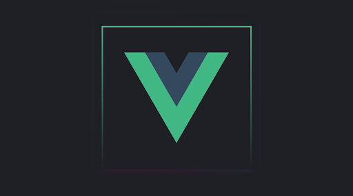

# Tanishuv

  

[Vue](https://vuejs.org/) \- bu user interfeysni yaratish uchun ishlatiladigan mashhur progressiv JavaScript framework hisoblanadi. Boshqa yaxlit frameworklardan farqli ravishda, Vue bosqichma-bosqich joriy etish uchun mo'ljallangan. Bu shuni anglatadiki, uni jQuery bilan boshlash juda oson, lekin u zamonaviy asboblar va qo’llab-quvvatlovchi kutubxonalar bilan birgalikda foydalanilganda murakkab ilovalarni quvvatlantirish imkoniyatiga ega.

Vue patternlarini tushunish va ulardan foydalanish tartibli, samarali va barqaror kod yozishda katta yordam beradi. Ushbu saytda biz mashhur Vue ning o'ziga xos namuna va xatti-harakatlarini ko'rib chiqamiz, ular quyidagi tushunchalarni qamrab oladi:

* [Composables](https://www.patterns.dev/vue/composables)  
* [Script Setup](https://www.patterns.dev/vue/script-setup)  
* [State Management](https://www.patterns.dev/vue/state-management)  
* [Provide/Inject](https://www.patterns.dev/vue/provide-inject)  
* [Dynamic Components](https://www.patterns.dev/vue/dynamic-components)  
* va boshqalar…

Siz Vue bilan tanish emasmisiz yoki ba'zi foydali patternlarni yaxshiroq tushunishni xohlaysizmi, sizga yordam berolamiz, degan umiddamiz\! Shu bilan birga, keling, Vue patternlarining Vue-tiful dunyosiga sho'ng'iylik.