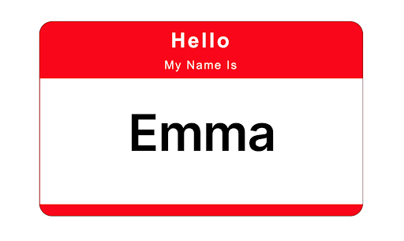
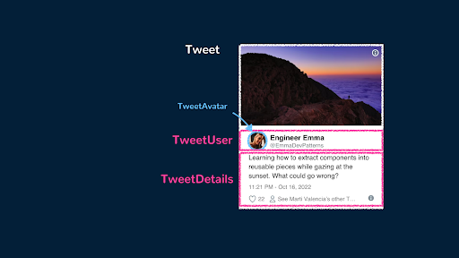
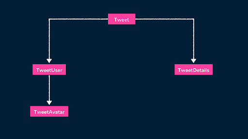

# Komponentlar

Vue komponentlari Vue ilovalarining qurilish bloklari bo'lib, ulardagi belgilar (HTML), mantiq (JS) va uslublarni (CSS) birlashtirishga imkon beradi.

Vue ilovasida ishlaganda, UIda ko'rsatilgan deyarli har bir element ko'pincha Vue komponentining bir qismi ekanligini tushunish muhimdir. Buning sababi shundaki, Vue ilovasi ko'pincha ierarxik tuzilmani tashkil etuvchi komponentlar ichiga joylashtirilgan komponentlardan iborat.

Qayta foydalanish va texnik xizmat ko'rsatish qobiliyati yaxshi tuzilgan komponentlar bilan ilova yaratish eng asosiy sabablardan biridir.

Komponentlarni yaxshiroq tushunish uchun biz davom etamiz va uni yaratamiz. Qurilish jarayonini o'z ichiga olmaydigan (masalan, Webpack) ilovada Vue komponentini yaratishning eng oddiy usuli bu Vue-ga xos variantlarni o'z ichiga olgan oddiy JavaScript obyektini yaratishdir. 

```js
export default {
  props: ["name"],
  template: `<h1>Hello, my name is {{ name }}</h1>`,
};
```

Komponentda bitta prop nameni qabul qiluvchi props property aniqlangan. Props \- bu asosiy komponentdan ma'lumotlarni komponentga o'tkazish usuli.

Template xususiyati komponent uchun HTML shablonini belgilaydi. Bunday holda, u \<h1\> heading tegini o'z ichiga oladi, unda "Hello, my name is" matni va undan keyin Vue ning double curly qavslar sintaksisi {{ }} yordamida berilgan name prop qiymati ko'rsatiladi.

<div align="center">
  
</div>


Komponentlarni oddiy JavaScript obyektlari sifatida belgilashdan tashqari, Vue-da komponentlarni yaratishning eng keng tarqalgan usuli \- bu yagona faylli komponentlardir (SFC). Bitta faylli komponentlar quyida ko'rsatilganidek, HTML, CSS va JS komponentlarini maxsus  .vue  faylida aniqlash imkonini beruvchi komponentlardir:

```js
<template>
  <h1>Hello, my name is {{ name }}</h1>
</template>


<script setup>
  const { name } = defineProps(["name"]);
</script>
```

*Eslatma: Vue-da bitta faylli komponentlar [Vite](https://vitejs.dev/) kabi yaratish vositalari tufayli ishlatilishi mumkin bo'ladi. Ushbu vositalar .vue komponentlarini brauzerlarda tushuniladigan oddiy JavaScript modullariga kompilyatsiya qilishga yordam beradi.*

## Komponentlar \= qurilish bloklari

Komponentlarni qanday qilib kichikroq qismlarga bo'lish mumkinligini ko'rsatish uchun biz oddiy mashqni sinab ko’ramiz. Quyidagi xayoliy Tweet komponentini ko'rib chiqing:

<div align="center">
  
</div>


Yuqoridagi komponent quyidagi tarzda qo’llanilishi mumkin:


```js
<template>
  <div class="Tweet">
    <image class="Tweet-image" :src="image.imageUrl" :alt="image.description" />
    <div class="User">
      <image class="Avatar" :src="author.avatarUrl" :alt="author.name" />
      <div class="User-name">{{ author.name }}</div>
    </div>
    <div class="Details">
      <div class="Tweet-text">{{ text }}</div>
      <div class="Tweet-date">{{ formatDate(date) }}</div>
      <!-- ... -->
    </div>
  </div>
</template>


<script setup>
  // ...
</script>
```

Yuqoridagi komponentni ko'rib chiqish va uni qanday guruhlanganligi sababli manipulyatsiya qilish qiyin deb hisoblash mumkin va uning alohida qismlarini qayta ishlatish ham qiyin kechadi. Vaziyatni yanada moslashtirish uchun biz ushbu komponentdan bir nechta komponentlarni ajratib olamiz.

<div align="center">
  
</div>


Asosiy Tweet komponenti TweetUser va TweetDetails komponentlarining otasi bo'lishi mumkin. TweetUser foydalanuvchi ma'lumotlarini ko'rsatadi va foydalanuvchi avatarini ko'rsatadigan TweetAvatar komponentining otasii bo'ladi. TweetDetails shunchaki tweetda tweet matni va taqdim etilgan sana kabi qo'shimcha ma'lumotlarni ko'rsatadi. Component tree quyidagi ko'rinishga ega bo'ladi:

<div align="center">
  
</div>


Biz birinchi navbatda avatar tasviri elementini o'z ichiga olishi uchun child TweetAvatar komponentini yaratishimiz mumkin.

```js
<template>
  <image class="Avatar" :src="author.avatarUrl" :alt="author.name" />
</template>


<script setup>
  // ...
</script>
```

Keyin biz TweetAvatar komponentini va tegishli foydalanuvchi ma'lumotlarini ko'rsatadigan TweetUser komponentini yaratamiz.

```js
<template>
  <div class="User">
    <TweetAvatar />
    <div class="User-name">{{ author.name }}</div>
  </div>
</template>


<script setup>
  import { TweetAvatar } from "./TweetAvatar.vue";
</script>
```

Biz tweetdagi qolgan ma'lumotlarni ko'rsatish uchun TweetDetails komponentini yaratishimiz mumkin.

```js
<template>
  <div class="Details">
    <div class="Tweet-text">{{ text }}</div>
    <div class="Tweet-date">{{ formatDate(date) }}</div>
    <!-- ... -->
  </div>
</template>


<script setup>
  // ...
</script>
```

Va nihoyat, biz Tweet parent komponentining shablonini soddalashtirish uchun ushbu yangi yaratilgan yordamchi komponentlardan foydalansak bo’ladi.


```js
<template>
  <div class="Tweet">
    <image class="Tweet-image" :src="image.imageUrl" :alt="image.description" />
    <TweetUser :author="author" />
    <TweetDetails :text="text" :date="date" />
  </div>
</template>


<script setup>
  // ...
</script>
```

Komponentlarni ajratib olish zerikarli ish kabi ko'rinadi, lekin qayta foydalanish mumkin bo'lgan komponentlarga ega bo'lish kattaroq ilovalar uchun kodlashda ishlarni osonlashtiradi. Komponentlarni soddalashtirishda e'tiborga olish kerak bo'lgan yaxshi mezon \- agar sizdagi UI qismi bir necha marta ishlatilsa (Button, Panel, Avatar) yoki o'z-o'zidan yetarlicha murakkab bo'lsa (App, FeedStory, Comment), u alohida komponentga ajratiladigan yaxshi nomzoddir.

## Reaktiv holat

Reaktiv holat dinamik va moslashuvchan foydalanuvchi interfeysini ta'minlaydigan Vue komponentlarida asosiy tushunchadir. Bu komponentlarga o'z ma'lumotlaridagi o'zgarishlarni avtomatik ravishda yangilash va aks ettirish imkonini beradi.

Vueda biz reaktiv ma'lumotlar xususiyatlarini ref() funksiyasi (standalone primitive qiymatlar uchun) va reaktiv() funksiyasi (obyektlar uchun) bilan belgilashimiz mumkin. Counter komponentining oddiy misolini ko'rib chiqaylik:


Yuqoridagi misolda biz reaktiv xususiyat sonini aniqlaymiz va uni 0 qiymati bilan ishga tushiramiz. Keyin shablon hisobning joriy qiymatini ko'rsatish uchun juft figurali qavslardan {{ }} foydalanadi.

Shablon shuningdek, ikkita "Incremen" va "Decrement" tugmasini o'z ichiga oladi, ular @click direktivasi yordamida mos keladigan increment() va decrement() usullariga bog'langan. Ushbu usullar ichida biz reaktiv count xususiyatining qiymatiga kiramiz va o'zgartiramiz. Vue o'zgarishlarni aniqlaydi va yangi qiymatni reflect qilish uchun komponentning renderini avtomatik ravishda yangilaydi.

[https://res.cloudinary.com/ddxwdqwkr/image/upload/c\_scale,w\_900,f\_auto/v1687560198/patterns.dev/Images/vue/vue\_components/components-reactivity.gif](https://res.cloudinary.com/ddxwdqwkr/image/upload/c_scale,w_900,f_auto/v1687560198/patterns.dev/Images/vue/vue_components/components-reactivity.gif)

Vue komponentlaridagi reaktiv holat maʼlumotlar o’zgarishlarini boshqarish va kuzatishning uzluksiz usulini taʼminlaydi, bu esa interaktiv va dinamik foydalanuvchi interfeyslarini yaratishni osonlashtiradi.

```js
1 <template>
2  <div class="demo tab">
3    <h2>Counter: {{ count }}</h2>
4    <button @click="increment">Increment</button>
5    <button @click="decrement">Decrement</button>
6  </div>
7 </template>
8
9 <script setup>
10 import { ref } from "vue";
11
12 const count = ref(0);
13
14 const increment = () => {
15  count.value++;
16 };
17
18 const decrement = () => {
19  count.value--;
20 };
21 </script>
```


## Xulosa

Ushbu maqola komponentlar tushunchasiga oddiy tanishuv qismi bo'lishga qaratilgan. Boshqa maqolalar va qo'llanmalarda biz Vue va Vue komponentlari bilan ishlashda umumiy va muhim namunalarni tushunishga chuqurroq kirib boramiz. Bunga quyidagilar kiradi, lekin ular bilan cheklanmaydi:

* [Using the \<script setup\> syntax](https://www.patterns.dev/vue/script-setup)  
* [Creating composables to reuse stateful logic](https://www.patterns.dev/vue/composables)  
* [Passing data down multiple components with provide/inject](https://www.patterns.dev/vue/vue/provide-inject)  
* [Understanding application-wide state management](https://www.patterns.dev/vue/state-management)  
* [Using dynamic components to dynamically switch between components](https://www.patterns.dev/vue/dynamic-components)  
* [Rendering component templates with JSX](https://www.patterns.dev/vue/render-functions)  
* va boshqalar.

## Foydali resurslar

* [Components Basics | Vue Documentation](https://vuejs.org/guide/essentials/component-basics.html#components-basics)  
* [Reactivity Fundamentals | Vue Documentation](https://vuejs.org/guide/essentials/reactivity-fundamentals.html)

