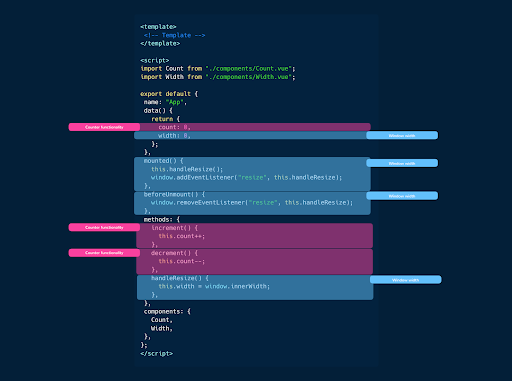
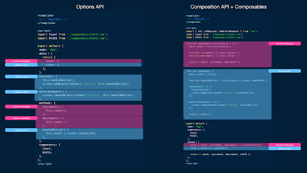

# Kompozitsiyalar

## Sozlamalar APIsi 

Vue-da Sozlamalar API-sini joriy etishdan oldin dasturchilar reaktiv ma'lumotlar, lifecycle usullari, hisoblangan xususiyatlar va boshqalarni o'z ichiga olgan komponentlar mantig’ini tartibga solish uchun Sozlamalar API-siga tayangan. Sozlamalar APIsi quyidagi misolda ko'rsatilganidek, ushbu jihatlarni ma'lum variantlar ichida aniqlashga imkon berdi:


```js
<!-- Template -->


<script>
  export default {
    name: "MyComponent",
    props: {
      // props
    },
    data() {
      // data
    },
    computed: {
      // computed properties
    },
    watch: {
      // properties to watch
    },
    methods: {
      // methods
    },
    created() {
      // lifecyle methods like created
    },
    // ...
  };
</script>


<!-- Styles -->
```

Ushbu yondashuv o'z maqsadiga erishgan va hali ham Vue v3 da qo'llanilsa-da, komponentlar kattalashib, murakkablashib borishi sababli uni boshqarish va saqlash qiyin bo'lishi mumkin. Muayyan variantlarda komponentlar mantig'ini aniqlash, ayniqsa, keng ko'lamli komponentlar bilan ishlashda kodni o'qish va tushunishni qiyinlashtiradi. Komponentlar orasidagi umumiy mantiqni ajratib olish va qayta ishlatish ham ushbu sozlashda qiyin bo’ladi.

Keling, ikkita alohida kichik komponentni \- Count va Widthni ko'rsatadigan App komponentining oddiy misolini ko'rib chiqaylik.

```js
<template>
  <div class="App">
    <Count :count="count" :increment="increment" :decrement="decrement" />
    <div id="divider" />
    <Width :width="width" />
  </div>
</template>


<script>
  import Count from "./components/Count.vue";
  import Width from "./components/Width.vue";


  export default {
    name: "App",
    data() {
      return {
        count: 0,
        width: 0,
      };
    },
    mounted() {
      this.handleResize();
      window.addEventListener("resize", this.handleResize);
    },
    beforeUnmount() {
      window.removeEventListener("resize", this.handleResize);
    },
    methods: {
      increment() {
        this.count++;
      },
      decrement() {
        this.count--;
      },
      handleResize() {
        this.width = window.innerWidth;
      },
    },
    components: {
      Count,
      Width,
    },
  };
</script>
```

Yuqoridagi kod App nomli Vue yagona faylli komponentni (SFC) ifodalaydi. 

\<template\> bo'limi komponentda markupni belgilaydi. Bunday holda, u ikkita kichik komponentni o'rab oladigan "App" sinfiga ega \<div\> elementini o'z ichiga oladi: \<Count\> va \<Width\>. Ushbu kichik komponentlar Vue atributini bog'lash sintaksisi (:count, :increment, :decrement va :width) yordamida ma'lum xususiyatlardan o'tadi.

\<script\> bo'limi komponent uchun JavaScript kodini o'z ichiga oladi. Bu Count va Width komponentlarini tegishli fayllardan import qilish bilan boshlanadi. Export default statement komponent ta'rifini eksport qilish uchun ishlatiladi. Komponent ta'rifida bizda quyidagilar mavjud:

* Komponentning dastlabki ma'lumotlar xususiyatlarini o'z ichiga olgan obyektni qaytaradigan data usuli, ularda count va width 0 ga ishga tushirilgan.  
* mounted() lifecycle hook komponent DOMga o'rnatilgandan so'ng kodni bajarish uchun ishlatiladi. Bunday holda, u handleResize() usulini chaqiradi va o'lchamini o'zgartirish hodisasi uchun event listenerni qo'shadi.  
* beforeUnmount() lifecycle hook komponentni o'chirish va yo'q qilishdan oldin kodni bajarish uchun ishlatiladi. Bu yerda u o'lchamini o'zgartirish hodisasi uchun event listenerni olib tashlaydi.  
* Methods obyekti komponent usullarini o'z ichiga oladi. U increment(), decrement() va handleResize() usullarini belgilaydi, ular ma'lum hodisalar yoki harakatlar asosida count va width ma'lumotlar xususiyatlarini boshqaradi.

```js
1 <template>
2  <div class="App">
3    <Count :count="count" :increment="increment" :decrement="decrement" />
4    <div id="divider" />
5    <Width :width="width" />
6  </div>
7 </template>
8
9 <script>
10 import Count from "./components/Count.vue";
11 import Width from "./components/Width.vue";
12
13 export default {
14  name: "App",
15  data() {
16    return {
17      count: 0,
18      width: 0,
19    };
20  },
21  mounted() {
22    this.handleResize();
23    window.addEventListener("resize", this.handleResize);
24  },
25  beforeUnmount() {
26    window.removeEventListener("resize", this.handleResize);
27  },
28  methods: {
29    increment() {
30      this.count++;
31    },
32    decrement() {
33      this.count--;
34    },
35    handleResize() {
36      this.width = window.innerWidth;
37    },
38  },
39  components: {
40    Count,
41    Width,
42  },
43 };
44 </script>
```

Ilova ishga tushganda, joriy hisob va windowning ichki kengligi real vaqtda ko'rsatiladi. Foydalanuvchi \<Count\> komponentidagi tugmachalar yordamida sonni oshirish va kamaytirish orqali komponent bilan o‘zaro aloqada bo‘lishi mumkin.

[https://res.cloudinary.com/ddxwdqwkr/image/upload/c\_scale,w\_900,f\_auto/v1687115446/patterns.dev/Images/vue/vue\_composables/composables\_count.gif](https://res.cloudinary.com/ddxwdqwkr/image/upload/c_scale,w_900,f_auto/v1687115446/patterns.dev/Images/vue/vue_composables/composables_count.gif)

Xuddi shunday, window o'lchamlari o'zgartirilganda width avtomatik ravishda yangilanadi.

[https://res.cloudinary.com/ddxwdqwkr/image/upload/c\_scale,w\_900,f\_auto/v1687115446/patterns.dev/Images/vue/vue\_composables/composables\_width.gif](https://res.cloudinary.com/ddxwdqwkr/image/upload/c_scale,w_900,f_auto/v1687115446/patterns.dev/Images/vue/vue_composables/composables_width.gif)

App.vue single file componentining tuzilishini quyidagicha ko'rish mumkin:

<div align="center">
  
</div>

Ushbu komponent kichik hajmga ega bo'lsa ham, undagi mantiq allaqachon bir-biriga bog'langan. Ba'zi qismlar hisoblagichning funksionalligiga asoslangan, boshqalari esa width mantig’iga tegishli. Komponent takomillashgani sari, komponent ichida tegishli mantiqni tashkil qilish va joylashtirish yanada qiyinlashadi.

Ushbu muammolarni hal qilish uchun Vue jamoasi Vue v3 da kompozitsiya API-sini taqdim etdi.

## Kompozitsiya API-si

Composition API-ni Vue-ning asosiy imkoniyatlarini ifodalovchi mustaqil funksiyalarni ta'minlovchi API sifatida ko'rish mumkin. Bu funksiyalar, birinchi navbatda, kompozitsion API dan foydalanish uchun kirish nuqtasi bo’lib xizmat qiluvchi yagona setup() opsiyasida qo’llaniladi.


```js
<!-- Template -->


<script>
  export default {
    name: "MyComponent",
    setup() {
      // the setup function
    },
  };
</script>


<!-- Styles -->
```


Setup() funksiyasi komponent yaratilishidan oldin va komponentning rekvizitlari mavjud bo'lganda bajariladi.

Kompozitsiya API-si yordamida biz Vue-ning komponentimizdagi asosiy imkoniyatlariga kirishga yordam berish uchun mustaqil funksiyalarni import qilishimiz mumkin. Keling, Kompozitsion API sintaksisiga tayangan holda yuqorida ko'rgan counter va width misolini qayta yozamiz.

```js
<template>
  <div class="App">
    <Count :count="count" :increment="increment" :decrement="decrement" />
    <div id="divider" />
    <Width :width="width" />
  </div>
</template>


<script>
  import { ref, onMounted, onBeforeUnmount } from "vue";
  import Count from "./components/Count.vue";
  import Width from "./components/Width.vue";


  export default {
    name: "App",
    setup() {
      const count = ref(0);
      const width = ref(0);


      const increment = () => {
        count.value++;
      };


      const decrement = () => {
        count.value--;
      };


      const handleResize = () => {
        width.value = window.innerWidth;
      };


      onMounted(() => {
        handleResize();
        window.addEventListener("resize", handleResize);
      });


      onBeforeUnmount(() => {
        window.removeEventListener("resize", handleResize);
      });


      return {
        count,
        width,
        increment,
        decrement,
      };
    },
    components: {
      Count,
      Width,
    },
  };
</script>
```

Komponentimizda \<template\> bir xil bo'lib qoladi, lekin \<script\> bo'limida biz endi setup() funksiyasi bilan Composition API-dan foydalanamiz.

setup() funksiyasi ichida biz quyidagilarni bajaramiz:

* Ref () funksiyasidan foydalanib, count va widthdagi reaktiv o'zgaruvchilarni aniqlang \- bu bitta primitiv qiymatni (masalan, string, number va boshqalar) qabul qiladigan va reactive/mutable obyektni qaytaradigan funksiya.  
* Shuningdek, biz increment(), decrement() va handleResize() maxsus funksiyalarini aniqlaymiz. Bu funksiyalar avvalgi Options API misolimizda belgilagan usullarga o‘xshaydi.  
* Biz xususiy handleResize() funksiyasini chaqirish va komponent o‘rnatilganda o‘lchamini o‘zgartirish hodisasi uchun event listenerni qo‘shishda onMounted() lifecycle funksiyasidan foydalanamiz. Xuddi shunday, komponent o'chirilishidan oldin o'lchamini o'zgartirish hodisasi uchun event listenerni olib tashlash uchun onBeforeUnmount() lifecyle funksiyasidan foydalanamiz.  
* Setup() funksiyasida aniqlangan reactive o'zgaruvchilar va funksiyalar qaytariladi, bu esa ularni component templateda foydalanish imkonini beradi.

```js
1 <template>
2  <div class="App">
3    <Count :count="count" :increment="increment" :decrement="decrement" />
4    <div id="divider" />
5    <Width :width="width" />
6  </div>
7 </template>
8
9 <script>
10 import { ref, onMounted, onBeforeUnmount } from "vue";
11 import Count from "./components/Count.vue";
12 import Width from "./components/Width.vue";
13
14 export default {
15  name: "App",
16  setup() {
17    const count = ref(0);
18    const width = ref(0);
19
20    const increment = () => {
21      count.value++;
22    };
23
24    const decrement = () => {
25      count.value--;
26    };
27
28    const handleResize = () => {
29      width.value = window.innerWidth;
30    };
31
32    onMounted(() => {
33      handleResize();
34      window.addEventListener("resize", handleResize);
35    });
36
37    onBeforeUnmount(() => {
38      window.removeEventListener("resize", handleResize);
39    });
40
41    return {
42      count,
43      width,
44      increment,
45      decrement,
46    };
47  },
48  components: {
49    Count,
50    Width,
51  },
52 };
53 </script>
```

## Kompozitsiyalar

Oldingi kod misolida, setup() funksiyasi rivojlanish uchun qanday afzalliklarni taqdim etishi haqida hali ham hayron bo'lishingiz mumkin, chunki u bizdan faqat bitta funksiya doirasida komponent variantlarini e'lon qilishni talab qiladi.

API kompozitsiyasini qabul qilishning ajoyib afzalliklaridan biri komponentlar o'rtasida umumiy mantiqni ajratib olish va qayta ishlatish qobiliyatidir. Bunga biz Vue-ning global miqyosda mavjud bo'lgan kompozitsion funksiyalaridan foydalanadigan o'zimizning funksiyalarimizni e'lon qilishimiz va bir xil natijaga erishish uchun funksiyalarimizni bir nechta komponentlarda osongina ishlatishimiz mumkinligi sabab bo'ladi.

Keling, bu komponentlar bo'ylab qayta ishlatilishi mumkin bo'lgan funksiyalarni yaratish orqali umumiy mantiqni o'z ichiga olgan kompozitsion counter va width misolimizni ko'rib chiqaylik. 

Birinchidan, counter funksiyasini qamrab oluvchi va count ning joriy qiymatini, increment() va decrement() usulini qaytaruvchi useCounter deb nomlangan kompozitsion funksiyani yarataylik.

An'anaga ko'ra, tuziladigan funksiya nomlari "use" kalit so'zi bilan boshlanadi.

```js
import { ref } from "vue";


export function useCounter(initialCount = 0) {
  const count = ref(initialCount);


  function increment() {
    count.value++;
  }


  function decrement() {
    count.value--;
  }


  return {
    count,
    increment,
    decrement,
  };
}
```

Xuddi shunday, biz ilovamizning width funksiyalarini qamrab oluvchi useWidth() deb nomlangan kompozitsiyani yaratishimiz mumkin.

```js
import { ref, onMounted, onBeforeUnmount } from "vue";


export function useWidth() {
  const width = ref(0);


  function handleResize() {
    width.value = window.innerWidth;
  }


  onMounted(() => {
    handleResize();
    window.addEventListener("resize", handleResize);
  });


  onBeforeUnmount(() => {
    window.removeEventListener("resize", handleResize);
  });


  return {
    width,
  };
}
```

App komponentimizda endi bir xil natijaga erishish uchun tuziladigan funksiyalardan foydalanishimiz mumkin:

```js
<template>
  <div class="App">
    <Count :count="count" :increment="increment" :decrement="decrement" />
    <div id="divider" />
    <Width :width="width" />
  </div>
</template>


<script>
  import Count from "./components/Count.vue";
  import Width from "./components/Width.vue";
  import { useCounter } from "./composables/useCounter";
  import { useWidth } from "./composables/useWidth";


  export default {
    name: "App",
    components: {
      Count,
      Width,
    },
    setup() {
      const { count, increment, decrement } = useCounter(0);
      const { width } = useWidth();


      return {
        count,
        increment,
        decrement,
        width,
      };
    },
  };
</script>
```

Ushbu o'zgarishlar bilan bizning ilovamiz avvalgidek, lekin yanada qulayroq sozlamada ishlaydi.

```js
1 <template>
2  <div class="App">
3    <Count :count="count" :increment="increment" :decrement="decrement" />
4    <div id="divider" />
5    <Width :width="width" />
6  </div>
7 </template>
8
9 <script>
10 import Count from "./components/Count.vue";
11 import Width from "./components/Width.vue";
12 import { useCounter } from "./composables/useCounter";
13 import { useWidth } from "./composables/useWidth";
14
15 export default {
16  name: "App",
17  components: {
18    Count,
19    Width,
20  },
21  setup() {
22    const { count, increment, decrement } = useCounter(0);
23    const { width } = useWidth();
24
25    return {
26      count,
27      increment,
28      decrement,
29      width,
30    };
31  },
32 };
33 </script>
```

Kompozitsiya APIsi sozlamalarida tuziladigan funksiyalardan foydalanib, biz ilovamiz kontekstini mantiqni ajratib turadigan kichikroq, qayta foydalanish mumkin bo‘lgan qismlarga ajratishga muvaffaq bo‘ldik.

Keling, Sozlamalar APIsi namuna komponentining boshlang‘ich qismi bilan solishtirganda biz kiritgan o‘zgarishlarni tasavvur qilaylik.

<div align="center">
  
</div>

Vue-da kompozitsion funksiyalardan foydalanish bizning komponentimiz mantig’ini bir nechta kichik qismlarga ajratishni osonlashtirdi. Xuddi shu statistik mantiqni qayta ishlatish endi oson bo'ladi, chunki biz endi Sozlamalar API-sining muayyan variantlari doirasida kodimizni tartibga solish bilan cheklanib qolmaymiz.

Birlashtirish mumkin bo'lgan funksiyalar bilan biz komponentlar bo'ylab umumiy mantiqni ajratib olish va qayta ishlatish uchun moslashuvchanlikka egamiz. Muammolarning bu bo'linishi bizga kodimizni modulliroq va qo'llab-quvvatlanishi mumkin bo'lgan har bir tuziladigan funksiyaning o'ziga xos funksiyalariga e'tibor qaratishga imkon beradi.

Mantiqni kichikroq, qayta foydalanish mumkin bo'lgan qismlarga bo'lish orqali biz kodni takrorlamasdan kerakli funksiyalarni birlashtirib, ushbu tuziladigan funksiyalardan foydalangan holda komponentlarimizni yaratishimiz mumkin. Ushbu yondashuv kodning qayta ishlatilishiga yordam beradi va kodning takrorlanishi va nomuvofiqlik xavfini kamaytiradi.

Bundan tashqari, Kompozitsiya API-sidan foydalanish komponent mantig’ining yaxshi o'qilishi va tushunarliligini ta'minlaydi. Har bir tuziladigan funksiya komponent harakatining o'ziga xos jihatini qamrab oladi, bu esa fikr yuritish va sinab ko'rishni osonlashtiradi. Bu, shuningdek, jamoa a'zolari o'rtasida oson hamkorlik qilish imkonini beradi, chunki kod yanada tartibli bo'ladi.

Nihoyat, Composition API bilan Vue ilovalarini yaratish yaxshiroq turdagi xulosalar chiqarish imkonini beradi. Composition API bizga o'zgaruvchilar va standart JavaScript funksiyalari bilan komponent mantig’ini boshqarishda yordam berganligi sababli, TypeScript kabi statik turdagi tizim bilan keng ko'lamli Vue ilovalarini yaratish ancha osonlashadi\!

## Foydali manbaalar

* [Composables | Vue Documentation](https://vuejs.org/guide/reusability/composables.html)  
* [Collection of Vue Composition Utilities | VueUse](https://vueuse.org/)