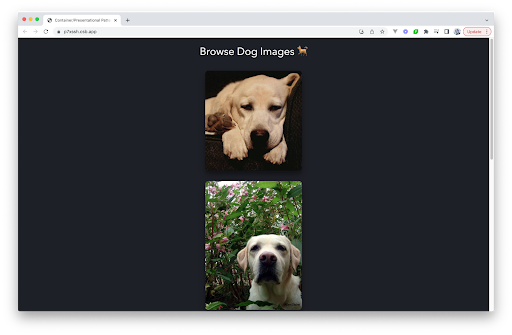

# Konteyner/Taqdimot namunasi

2015-yilda Dan Abramov “[Taqdimot va konteyner komponentlari](https://medium.com/@dan_abramov/smart-and-dumb-components-7ca2f9a7c7d0)” nomli maqola yozdi, bu ko‘plab dasturchilarning React komponentlar arxitekturasi haqidagi fikrlarini o‘zgartirdi. U komponentlarni ikki toifaga ajratadigan modelni kiritdi:

1. Taqdimot komponentlari (yoki soqov komponentlar): Bu narsalar qanday ko'rinishi bilan bog'liq. Ular ma'lumotlar qanday yuklangani yoki mutatsiyaga uchraganligini aniqlamaydi, balki ma'lumotlar va callbacklarni faqat proplar orqali oladi.  
2. Konteyner komponentlari (yoki aqlli komponentlar): Bu narsalar qanday ishlashi bilan bog'liq. Ular taqdimot yoki boshqa konteyner komponentlariga ma'lumotlar va xatti-harakatlarni ta'minlaydi.

Ushbu pattern asosan React bilan bog'langan bo'lsa-da, uning asosiy prinsipi qabul qilingan va boshqa kutubxonalar va frameworklar bo'ylab turli shakllarda moslashtirilgan.

Dan JavaScript ilovalarini tuzishning aniqroq va kengaytiriladigan usulini taklif qildi. Har xil turdagi komponentlarning mas'uliyatini aniq belgilash orqali dasturchilar UI komponentlarini (taqdimot) va mantiqni (konteynerlar) yaxshiroq qayta ishlatishni ta'minlashi mumkin edi. G'oya shundan iborat ediki, agar biror narsaning ko'rinishini o'zgartiradigan bo'lsak (button dizayni kabi), biz buni ilova mantig’iga tegmasdan qilishimiz mumkin. Aksincha, agar biz ma'lumotlarning qanday oqishini yoki qayta ishlanishini o'zgartirishimiz kerak bo'lsa, taqdimot komponentlari o’zgarmasdan qoladi va UI izchil bo'lishini ta'minlaydi.

Biroq, Reactda [hooklar](https://react.dev/learn/reusing-logic-with-custom-hooks) va Vue 3-da [Composition API](https://vuejs.org/guide/extras/composition-api-faq.html)\-ning paydo bo'lishi bilan taqdimot va konteyner komponentlari o'rtasidagi aniq chegara xiralasha boshladi. Hooks va Composition API dasturchilarga classga asoslangan konteyner komponenti yoki Options API bilan chegaralanib qolmasdan holat va mantiqni inkapsulyatsiya qilish va qayta ishlatish imkonini bera boshladi. Natijada, konteyner/taqdimot namunasi avvalgidek qat'iy amal qilmaydi. Shu bilan birga, biz ushbu maqolada modelni muhokama qilish uchun biroz vaqt sarflaymiz, chunki u ma'lum vaqtlarda foydali bo'lishi mumkin.

Aytaylik, biz 6 ta it tasvirini oladigan va bu tasvirlarni ekranda ko'rsatadigan dastur yaratmoqchimiz.

<div align="center">
  
</div>

Konteyner/taqdimot namunasiga amal qilish uchun biz ushbu jarayonni ikki qismga bo'lish orqali e’tiborga molik jihatlarni ajratishni talab qilamiz:

1. Taqdimot komponentlari: ma'lumotlarning foydalanuvchiga qanday ko'rsatilishi haqida qayg'uradigan komponentlar. Ushbu misolda, bu it tasvirlari ro'yxatini ko'rsatiladi.  
2. Konteyner komponentlari: foydalanuvchiga nima haqidagi ma'lumotlar ko'rsatilishi haqida qayg'uradigan komponentlar. Bu misolda it tasvirlari olinadi.

[https://res.cloudinary.com/ddxwdqwkr/video/upload/f\_auto/v1609056518/patterns.dev/jspat-40\_af2vga.mp4](https://res.cloudinary.com/ddxwdqwkr/video/upload/f_auto/v1609056518/patterns.dev/jspat-40_af2vga.mp4)

Bu tasvirlarni olish ilova mantig’i bilan bog'liq, tasvirlarni ko'rsatish esa faqat view bilan bog'liq.

## Taqdimot komponenti

Taqdimot komponenti o'z ma'lumotlarini proplar orqali oladi. Uning asosiy vazifasi \- olingan ma'lumotlarni biz xohlagan tarzda, shu jumladan uslublarni ushbu ma'lumotlarni o'zgartirmasdan ko'rsatishdir.

Keling, it tasvirlarini ko'rsatadigan misolni ko'rib chiqaylik. It tasvirlarini ko'rsatayotganda, biz shunchaki APIdan olingan har bir it tasvirini xaritalash va ushbu tasvirlarni ko'rsatishni xohlaymiz. Buning uchun biz proplar orqali ma'lumotlarni qabul qiladigan va olingan ma'lumotlarni ko'rsatadigan DogImages komponentini yaratishimiz mumkin.


```js
<!-- DogImages.vue -->


<template>
  
</template>


<script setup>
  import { defineProps } from "vue";
  const { dogs } = defineProps(["dogs"]);
</script>
```

DogImages komponentini taqdimot komponenti deb hisoblash mumkin. Taqdimot komponentlari odatda stateless hisoblanadi: ular UI maqsadlari uchun state kerak bo'lmasa, o'zlarining tarkibiy holatini o'z ichiga olmaydi. Ular olgan ma'lumotlar taqdimot komponentlarining o'zlari tomonidan o'zgartirilmaydi.

Taqdimot komponentlari o'z ma'lumotlarini konteyner komponentlaridan oladi.

## Konteyner komponentlari

Konteyner komponentlarining asosiy vazifasi ma'lumotlarni ular o'z ichiga olgan taqdimot komponentlariga uzatishdir. Konteyner komponentlarining o'zlari odatda ma'lumotlariga e'tibor beradigan taqdimot komponentlaridan tashqari boshqa komponentlarni ko'rsatmaydi. Ular o'zlari hech narsa ko'rsatmagani uchun ular odatda uslubni ham o'z ichiga olmaydi.

Bizning misolimizda biz it tasvirlarini DogsImages taqdimot komponentiga o'tkazmoqchimiz. Buni amalga oshirishdan oldin biz tashqi API dan tasvirlarni olishimiz kerak. Biz ushbu ma'lumotlarni oladigan konteyner komponentini yaratishimiz kerak va bu ma'lumotlarni ekranda ko'rsatish uchun DogImages taqdimot komponentiga uzatadi. Biz ushbu konteyner komponentini DogImagesContainer deb ataymiz.

```js
<!-- DogImagesContainer.vue -->


<template>
  <DogImages :dogs="dogs" />
</template>


<script setup>
  import { ref, onMounted } from "vue";
  import DogImages from "./DogImages.vue";


  const dogs = ref([]);


  onMounted(async () => {
    const response = await fetch(
      "https://dog.ceo/api/breed/labrador/images/random/6"
    );
    const { message } = await response.json();
    dogs.value = message;
  });
</script>
```

Ushbu ikki komponentni birgalikda birlashtirish, ishlov berish mantiqni ko'rinishdan ajratish imkonini beradi.

[https://res.cloudinary.com/ddxwdqwkr/video/upload/f\_auto/v1609056519/patterns.dev/jspat-45\_budnfb.mp4](https://res.cloudinary.com/ddxwdqwkr/video/upload/f_auto/v1609056519/patterns.dev/jspat-45_budnfb.mp4)

Xulosa qilib aytganda, bu konteyner va taqdimot namunasidir. [Pinia](https://pinia.vuejs.org/) kabi holatni boshqarish yechimlari bilan integratsiyalashganda, konteyner komponentlari store bilan to’g’ridan-to’g’ri o’zaro aloqada bo’lish, kerak bo’lganda holatni olish yoki mutatsiya qilish uchun ishlatilishi mumkin. Bu taqdimot komponentlariga sof va kengroq ilova mantig’idan bexabar bo'lib qolishga imkon beradi, faqat ular olingan proplar asosida foydalanuvchi interfeysini ko'rsatishga e'tibor qaratadi.

```js
1 <template>
2  <DogImages :dogs="dogs" />
3 </template>
4
5 <script setup>
6 import { ref, onMounted } from "vue";
7 /* eslint-disable-next-line no-unused-vars */
8 import DogImages from "./DogImages.vue";
9
10 const dogs = ref([]);
11
12 onMounted(async () => {
13  const response = await fetch(
14    "https://dog.ceo/api/breed/labrador/images/random/6"
15  );
16  const { message } = await response.json();
17  dogs.value = message;
18 });
19 </script>
```

## Kompozitsiyalar

[*Composables*](https://www.patterns.dev/vue/composables) qo'llanmasini o'qib chiqing va kompozitsiyalarni chuqurroq tushunishga harakat qiling.

Ko'pgina hollarda, konteyner/taqdimot modeli kompozitsiyalar bilan almashtirilishi mumkin. Kompozitsiyalarning joriy etilishi dasturchilarga ushbu holatni ta'minlash uchun konteyner komponentiga muhtoj bo'lmasdan holatni qo'shishni osonlashtirdi.

DogImagesContainer komponentida ma'lumotlarni olish mantig'iga ega bo'lish o'rniga, biz tasvirlarni oladigan va itlar massivini qaytaradigan kompozitsiyani yaratishimiz mumkin.

```js
import { ref, onMounted } from "vue";


export default function useDogImages() {
  const dogs = ref([]);


  onMounted(async () => {
    const response = await fetch(
      "https://dog.ceo/api/breed/labrador/images/random/6"
    );
    const { message } = await response.json();
    dogs.value = message;
  });


  return { dogs };
}
```

Ushbu hookdan foydalanib, ma'lumotlarni olish va uni taqdimot DogImages komponentiga yuborish uchun DogImagesContainer konteyner komponentiga endi kerak emas. Buning o'rniga, biz ushbu hookka to'g'ridan-to'g'ri DogImages taqdimot komponentimizda foydalanishimiz mumkin\!

```js
<template>
  
</template>


<script setup>
  import useDogImages from "../composables/useDogImages";


  /* eslint-disable-next-line no-unused-vars */
  const { dogs } = useDogImages();
</script>
```

useDogImages() hookdan foydalanib, ilova mantig’ini viewdan ajratdik. Biz shunchaki useDogImages hookdan qaytarilgan ma'lumotlarni DogImages komponentida o'zgartirmasdan foydalanamiz.

[https://res.cloudinary.com/ddxwdqwkr/video/upload/f\_auto/v1609056518/patterns.dev/jspat-46\_evhhpd.mp4](https://res.cloudinary.com/ddxwdqwkr/video/upload/f_auto/v1609056518/patterns.dev/jspat-46_evhhpd.mp4)

Biz qilgan barcha o'zgarishlar bilan bizning ilovamiz quyidagidek ko'rinishi mumkin.

```js
1 import { ref, onMounted } from 'vue';
2
3 export default function useDogImages() {
4  const dogs = ref([]);
5
6  onMounted(async () => {
7    const response = await fetch("https://dog.ceo/api/breed/labrador/images/random/6");
8    const { message } = await response.json();
9    dogs.value = message;
10  });
11
12  return { dogs };
13 }
```

Konteyner/taqdimot namunasi kabi kompozitsiyalar mantiqni ajratish va komponentda ko'rishni osonlashtiradi. Bu bizga taqdimot komponentini konteyner komponentiga o'rash uchun zarur bo'lgan qo'shimcha qatlamni tejaydi.

## Foydali resurslar

* [Vue Composables | Patterns.dev](https://www.patterns.dev/vue/composables)

