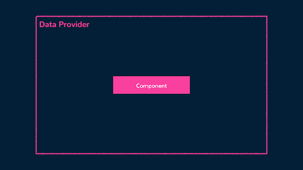

# Data Provider Pattern 

Avvalgi [maqolada](https://www.patterns.dev/vue/renderless-components) biz rendersiz komponentlar komponent mantig’ini uning taqdimotidan ajratishga qanday yordam berishini bilib oldik. Bu turli xil UI ilovalariga qo'llaniladigan va qayta ishlatish mumkin bo'lgan mantiqni yaratayotganda foydali bo'ladi.

Rendersiz komponentlar, shuningdek, bizga ma'lumot ta’minotchisi namunasi (data provider pattern) deb nomlanuvchi boshqa foydali modeldan foydalanishga imkon beradi.

## Ma’lumot ta’minotchisi modeli

Ma'lumot ta’minotchisi modeli \- bu Vuedagi rendersiz komponent modelini to'ldiradigan dizayn namunasi bo'lib, u ma'lumotlar qanday render qilinishi yoki ko'rsatilishi haqida tashvishlanmasdan komponentlarga ma'lumotlar va holat boshqaruvi imkoniyatlarini berishga e'tibor qaratadi. 

Ma'lumot ta’minotchisi modelida ma'lumot yetkazuvchi komponenti ma'lumotlarni olish, boshqarish va o'zining asosiy komponentlariga ko'rsatish uchun butun mantiqni qamrab oladi. Keyin bola komponentlar ushbu ma'lumotlarni iste'mol qilishi va o'zlarining renderi yoki xatti-harakatlarida foydalanishi mumkin.

<div align="center">
  
</div>

Ushbu model concernlarni ajratishga yordam beradi, chunki ma'lumot ta’minotchisi komponenti ma'lumotlar bilan bog'liq vazifalarni bajaradi, bolalar komponentlari esa taqdimot va o’zaro aloqaga e'tibor qaratishi mumkin. 

Keling, ma’lumot ta’minotchisi modeliga namuna ko'rsatamiz. Qiziqarli hazilni o'rnatishni va undan keyin uning zarbasini ko'rsatadigan oddiy dasturni ko'rib chiqing. Turli xil hazillarni tasodifiy ko‘rsatishga yordam berish uchun biz bepul umumiy API so‘nggi nuqtasidan foydalanamiz, [https://official-joke-api.appspot.com/random\_joke](https://official-joke-api.appspot.com/random_joke) bu tasodifiy hazilni JSON formatida qaytaradi.

```js
# https://official-joke-api.appspot.com/random_joke

{
  "type": "general",
  "setup": "How good are you at Power Point?",
  "punchline": "I Excel at it.",
  "id": 129
}
```

Biz avvalo DataProvider deb nomlangan maʼlumotlar ta’minotchisi komponentini yaratamiz, u jokeni API dan olish uchun javobgarlikni zimmasiga oladi. Komponentning `\<script\>` bo'limida biz Vue kutubxonasidan ref() va reactive() funksiyalarini import qilamiz, so'nggi nuqta URL qiymatini constantga belgilaymiz va API so'rovimizning yuklanish holati ma'lumotlarini olish uchun data va loading reaktiv xususiyatlarni o'rnatamiz. 

```js
<script setup>
  import { ref, reactive } from "vue";


  const API_ENDPOINT_URL = "https://official-joke-api.appspot.com/random_joke";


  const data = reactive({
    setup: null,
    punchline: null,
  });
  const loading = ref(false);
</script>
```

Keyin biz belgilangan API so'nggi nuqtasidan jokeni olish uchun mas'ul fetchJoke() deb nomlangan asinxron funksiyani yaratamiz. Funksiya quyidagilarga xizmat qiladi:

* Loading reaktiv qiymatini true deb belgilashdan boshlaydi, bu joke olinayotganini bildiradi.  
* API so'nggi nuqtasiga GET so'rovini yuborish uchun mahalliy brauzer [fetch()](https://developer.mozilla.org/en-US/docs/Web/API/fetch) funksiyasidan foydalanadi.   
* Javobni response.json() usuli yordamida API dan JSON formatiga aylantiradi.  
* Olingan so'rov ma'lumotlaridan setup va punchline qiymatlarini ajratib olib, ularni ma'lumotlar obyektidagi tegishli xususiyatlarga belgilaydi.  
* Nihoyat, yuklash qiymati false ga qaytariladi, bu joke olinganligini ko'rsatadi.

Ushbu o'zgarishlar bilan fetchJoke() funksiyamiz quyidagicha ko'rinadi:

```js
<script setup>
  import { ref, reactive } from "vue";


  const API_ENDPOINT_URL = "https://official-joke-api.appspot.com/random_joke";


  const data = reactive({
    setup: null,
    punchline: null,
  });
  const loading = ref(false);


  const fetchJoke = async () => {
    loading.value = true;


    const response = await fetch(API_ENDPOINT_URL);
    const responseData = await response.json();


    data.setup = responseData.setup;
    data.punchline = responseData.punchline;
    loading.value = false;
  };


  fetchJoke();
</script>
```

\<script\> bo'limi oxirida fetchJoke() funksiyasini ishga tushirganimizga e'tibor berdingizmi? Bu DataProvider komponenti ko'rsatilganda joke darhol olinishini ta'minlaydi.

Bizga qoladigan oxirgi narsa DataProvider komponenti isteʼmolchisida data va loading xususiyatlarini mavjud qilishdir. Buning uchun biz ushbu xususiyatlarni \<template\> bo'limiga joylashtirilgan \<slot\> elementiga o'tkazishimiz mumkin.

```js
<template>
  <slot :checkbox="checkbox" :toggleCheckbox="toggleCheckbox"></slot>
</template>


<script setup>
  import { ref, reactive } from "vue";


  const API_ENDPOINT_URL = "https://official-joke-api.appspot.com/random_joke";


  const data = reactive({
    setup: null,
    punchline: null,
  });
  const loading = ref(false);


  const fetchJoke = async () => {
    loading.value = true;


    const response = await fetch(API_ENDPOINT_URL);
    const responseData = await response.json();


    data.setup = responseData.setup;
    data.punchline = responseData.punchline;
    loading.value = false;
  };


  fetchJoke();
</script>
```

Rendersiz ma'lumotlar ta’minotchisi komponenti tugallangandan so'ng, biz endi uni ilovamizda ishlatishimiz mumkin. Asosiy ilova komponentida biz DataProvider komponentini import qilamiz va uni templatega joylashtiramiz.

```js
<template>
  <DataProvider v-slot="{ data, loading }">
    <!-- ... -->
  </DataProvider>
</template>


<script setup>
  import DataProvider from "./components/DataProvider.vue";
</script>
```

\<DataProvider\> komponentini oddiygina renderlash orqali biz jokeni olish uchun oxirgi nuqtaga so'rov yuboramiz va v-slot direktivasi yordamida so'rovning data va loading qiymatlariga kirishimiz mumkin. 

\<DataProvider\> komponent deklaratsiyasida, agar so'rov yuklanish holatida bo'lsa, yuklash xabarini ko'rsatadigan foydalanuvchi interfeysini yaratishimiz yoki ma'lumotlar mavjud bo'lganda joke sozlamalari va punchlineni ko'rsatishimiz mumkin.

```js
<template>
  <DataProvider v-slot="{ data, loading }">
    <div class="joke-section">
      <p v-if="loading">Joke is loading...</p>
      <p v-if="!loading">{{ data.setup }}</p>
      <p v-if="!loading">{{ data.punchline }}</p>
    </div>
  </DataProvider>
</template>


<script setup>
  import DataProvider from "./components/DataProvider.vue";
</script>
```

O'zgartirishlarimizni saqlashda bizga qisqacha yuklash xabari va undan keyin tasodifiy joke ko'rsatiladi.

[https://res.cloudinary.com/ddxwdqwkr/image/upload/c\_scale,w\_900,f\_auto/v1688485819/patterns.dev/Images/vue/data-provider/data-provider-example.gif](https://res.cloudinary.com/ddxwdqwkr/image/upload/c_scale,w_900,f_auto/v1688485819/patterns.dev/Images/vue/data-provider/data-provider-example.gif)

Agar biz jokedagi setup va punchlinening yana bir nusxasini, ehtimol boshqa template bilan ham render qilishimiz kerak bo'lsa, biz shunchaki \<DataProvider\> komponentidan qayta foydalanishimiz va biz ko'rsatmoqchi bo'lgan yangi yordamchi elementlarni yaratishimiz mumkin.

```js
<template>
  <DataProvider v-slot="{ data, loading }">
    <div class="joke-section">
      <p v-if="loading">Joke is loading...</p>
      <p v-if="!loading">{{ data.setup }}</p>
      <p v-if="!loading">{{ data.punchline }}</p>
    </div>
  </DataProvider>


  <DataProvider v-slot="{ data, loading }">
    <p v-if="loading">Hold on one sec...</p>
    <div v-else class="joke-section">
      <details>
        <summary>{{ data.setup }}</summary>
        <p>{{ data.punchline }}</p>
      </details>
    </div>
  </DataProvider>
</template>


<script setup>
  import DataProvider from "./components/DataProvider.vue";
</script>
```

Yangi yaratilgan UIda biz joke punchlineni HTML \<details\> va \<summary\> elementlari yordamida ochish elementiga joylashtiramiz.

[https://res.cloudinary.com/ddxwdqwkr/image/upload/c\_scale,w\_900,f\_auto/v1688486269/patterns.dev/Images/vue/data-provider/data-provider-example-2.gif](https://res.cloudinary.com/ddxwdqwkr/image/upload/c_scale,w_900,f_auto/v1688486269/patterns.dev/Images/vue/data-provider/data-provider-example-2.gif)

Data provider pattern bilan biz turli elementlar/komponentlarga ajratilgan va qayta foydalanish mumkin bo'lgan ma'lumotlarni boshqarish va taqdim etish imkoniyatiga egamiz. API olish mantig’ini rendersiz komponentga aylantirib, biz API ma'lumotlarining so'rovini turli kontekstlarda kodni takrorlamasdan qayta ishlatishimiz mumkin.

```js
1 <template>
2  <slot :data="data" :loading="loading"></slot>
3 </template>
4
5 <script setup>
6 import { ref, reactive } from "vue";
7
8 const API_ENDPOINT_URL = "https://official-joke-api.appspot.com/random_joke";
9
10 const data = reactive({
11  setup: null,
12  punchline: null,
13 });
14 const loading = ref(false);
15
16 const fetchJoke = async () => {
17  loading.value = true;
18
19  const response = await fetch(API_ENDPOINT_URL);
20  const responseData = await response.json();
21
22  data.setup = responseData.setup;
23  data.punchline = responseData.punchline;
24  loading.value = false;
25 };
26
27 fetchJoke();
28 </script>
```

## Buning o’rniga kompozitsiyadan foydalana olamizmi?

Ha\! Data provider patterndan foydalanish o'rniga, biz faqat qayta foydalaniladigan va funksiyaga oladigan mantiqni chiqarish uchun kompozitsiyalardan foydalanishimiz mumkin.

```js
import { ref, reactive } from "vue";


const API_ENDPOINT_URL = "https://official-joke-api.appspot.com/random_joke";


export function useGetJoke() {
  const data = reactive({
    setup: null,
    punchline: null,
  });
  const loading = ref(false);


  const fetchJoke = async () => {
    loading.value = true;


    const response = await fetch(API_ENDPOINT_URL);
    const responseData = await response.json();


    data.setup = responseData.setup;
    data.punchline = responseData.punchline;
    loading.value = false;
  };


  fetchJoke();


  return { data, loading };
}
```

Komponent holatlarimizda biz ma'lum bir so'rovning data va loading holatini olish uchun kompozitsion funksiyani import qilishimiz va undan foydalanishimiz mumkin.

```js
<template>
  <div class="joke-section">
    <p v-if="loading">Joke is loading...</p>
    <p v-if="!loading">{{ data.setup }}</p>
    <p v-if="!loading">{{ data.punchline }}</p>
  </div>
</template>


<script setup>
  import { useGetJoke } from "./composables/useGetJoke";


  const { data, loading } = useGetJoke();
</script>
```

Ilovamiz endi ma'lumot ta’minotchisi kabi ishlaydi.

```js
1 <template>
2  <div class="joke-section">
3    <p v-if="loading">Joke is loading...</p>
4    <p v-if="!loading">{{ data.setup }}</p>
5    <p v-if="!loading">{{ data.punchline }}</p>
6  </div>
7 </template>
8
9 <script setup>
10 import { useGetJoke } from "./composables/useGetJoke";
11
12 const { data, loading } = useGetJoke();
13 </script>
```

Ma’lumot ta’minotchisi komponentdagi mantiqni uning taqdimotidan ajratishga yordam beradi, bu orqali ota-komponentga ochiq ma'lumotlar va rendersiz komponentning xatti-harakati asosida tegishli UI ga yordam beradi. Biroq, Vue 3-da qayta ishlatilishi mumkin bo'lgan kompozitsion funksiyalarni yaratish qobiliyatiga ega bo'lgan holda, ma’lumot ta’minotchisi modelidan foydalanish mumkin bo'lgan ko'p hollarda combosable’lar ham ishlatilishi mumkin.

Ma’lumot ta’minotchisi namunasini qo’llash yoki uning o’rniga combosable funksiyalardan foydalanish o’rtasidagi ma’lumotlar ko’rib chiqilayotganda, iloji boricha birlashtiruvchi funksiyalardan foydalanishni tavsiya etamiz, chunki u har safar maʼlumotlarni olish kerak bo’lganda komponent namunasini render qilish zaruriyatidan qochadi (bu ish [unumdorligini oshirishga](https://vuejs.org/guide/reusability/composables.html#vs-renderless-components) yordam beradi).

Bundan tashqari, agar siz [Pinia](https://pinia.vuejs.org/) kabi holatni boshqaruv vositasidan komponentlarga maʼlumotlar taqdim etilishini boshqarish uchun foydalanayotgan bo’lsangiz, API so’rovlarini storedagi [actions()](https://pinia.vuejs.org/core-concepts/actions.html#actions) qismida amalga oshirishingiz mumkin. Ushbu holatni boshqaruv namunasi allaqachon mavjud bo'lganligi sababli, ma’lumot ta’minotchisi komponenti modelidan foydalanish zarurati kamroq ahamiyatga ega bo'ladi.

## Foydali resurslar

* [Renderless Components | Vue Documentation](https://vuejs.org/guide/components/slots.html#scoped-slots)
