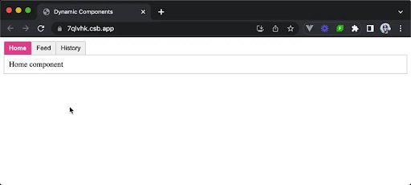
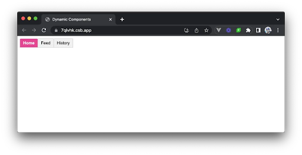
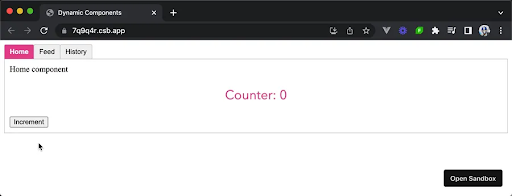

# Dinamik komponentlar

Dinamik komponentlar zaxiralangan \<component\> elementiga is atributini bog'lash orqali komponentlar o'rtasida dinamik o'zgartirish (ya'ni almashish) qobiliyatini tashkil qiladi.

Dinamik komponentlar qanday ishlashini yaxshiroq tushunish uchun biz bir misolni ko'rib chiqamiz. Faraz qilaylik, bizda "Home", "Feed" va "History" nomli alohida komponentlar mavjud bo'lib, ularda matn qanday komponent ekanligini ko'rsatadi.

```js
<!-- Home -->
<template><div class="tab">Home component</div></template>


<!-- Feed -->
<template><div class="tab">Feed component</div></template>


<!-- History -->
<template><div class="tab">History component</div></template>
```

Bizning maqsadimiz bosilishi mumkin bo'lgan yorliqlar ro'yxatini ko'rsatadigan interfeysni yaratishdir. Qaysi tab bosilganiga qarab, biz ma'lum komponentni dinamik renderlashni xohlaymiz.

<div align="center">
  
</div>


Tablar orasiga bosganda, biz komponentlarni routingdan foydalanmasdan dinamik o'chirilishini va o'rnatilishini xohlaymiz. Shunga o'xshash narsaga [v-if va v-else](https://vuejs.org/guide/essentials/conditional.html) kabi direktivalar yordamida bola templateni ko'rsatish orqali erishish mumkin bo'lsa-da, bu Vue dinamik komponentlarini ishlatish uchun ajoyib imkoniyat.

Ilovamizning asosiy ilova komponentida shablonda mavjud bo'lishi uchun birinchi navbatda uchta alohida komponentni import qilishimiz mumkin. Shuningdek, biz "Home" ning boshlang'ich qiymati berilgan currentTab reaktiv xususiyatini yaratamiz. 

```js
<script setup>
  import { ref } from "vue";
  import Home from "./components/Home.vue";
  import Feed from "./components/Feed.vue";
  import History from "./components/History.vue";


  const currentTab = ref("Home");
  const tabs = {
    Home,
    Feed,
    History,
  };
</script>
```

E'tibor bering, bizning tab obyektimiz faqat komponent nomlariga emas, balki haqiqiy komponent ta'riflariga havola qiladi.

Ilova komponenti shablonida uchta alohida tab tugmalarini ko'rsatishni ko'rib chiqamiz \- biz ko'rsatmoqchi bo'lgan har bir komponent uchun bittadan tab kerak bo’ladi. Bunga erishish uchun biz [v-for directive](https://vuejs.org/api/built-in-directives.html#v-for) foydalanamiz. Biz tablar ro'yxatini aylanib chiqamiz va \<button /\> elementlari ro'yxatini tuzamiz. Har bir ko'rsatilgan \<button /\> uchun biz yorliq qiymatini elementning kalit atributiga bog'laymiz, agar yorliq tanlangan/faol bo'lsa, dinamik ravishda .active sinfini ko'rsatamiz va tab tanlanganda currentTab komponentining qiymatini yangilash uchun bosish ishlovchisiga ega bo'lamiz. 

```js
<template>
  <div class="demo">
    <button
      v-for="(_, tab) in tabs"
      :key="tab"
      :class="['tab-button', { active: currentTab === tab }]"
      @click="currentTab = tab"
    >
      {{ tab }}
    </button>
  </div>
</template>


<script setup>
  import { ref } from "vue";
  import Home from "./components/Home.vue";
  import Feed from "./components/Feed.vue";
  import History from "./components/History.vue";


  const currentTab = ref("Home");
  const tabs = {
    Home,
    Feed,
    History,
  };
</script>
```

Ushbu o'zgarishlar bilan bizda hozirda uchta tab tugmasi ko'rsatiladi.

<div align="center">
  
</div>

Muayyan yordamchi komponentni dinamik ko'rsatish uchun biz is atributini zahiralangan \<component\> elementiga bog'laymiz. is atributiga biriktirilgan qiymat biz dinamik render qilmoqchi bo'lgan bola komponentiga mos kelishi kerak. Bizning holatda, ma'lum bir vaqtda qaysi kichik komponent tanlanganligini belgilash uchun currentTab ma'lumotlar xususiyatidan foydalanamiz.

```js
<template>
  <div class="demo">
    <button
      v-for="(_, tab) in tabs"
      :key="tab"
      :class="['tab-button', { active: currentTab === tab }]"
      @click="currentTab = tab"
    >
      {{ tab }}
    </button>
    <component :is="tabs[currentTab]" class="tab"></component>
  </div>
</template>


<script setup>
  import { ref } from "vue";
  import Home from "./components/Home.vue";
  import Feed from "./components/Feed.vue";
  import History from "./components/History.vue";


  // eslint-disable-next-line no-unused-vars
  const currentTab = ref("Home");


  // eslint-disable-next-line no-unused-vars
  const tabs = {
    Home,
    Feed,
    History,
  };
</script>
```

Shablonimizga joylashtirilgan dinamik \<component /\> elementi bilan biz qaysi tab tanlanganiga qarab, endilikda yordamchi komponentlar dinamik ravishda ajratilgan va o'rnatilganini ko'ramiz.

```js
1 <template>
2  <div class="demo">
3    <button
4      v-for="(_, tab) in tabs"
5      :key="tab"
6      :class="['tab-button', { active: currentTab === tab }]"
7      @click="currentTab = tab"
8    >
9      {{ tab }}
10    </button>
11    <component :is="tabs[currentTab]" class="tab"></component>
12  </div>
13 </template>
14
15 <script setup>
16 import { ref } from "vue";
17 import Home from "./components/Home.vue";
18 import Feed from "./components/Feed.vue";
19 import History from "./components/History.vue";
20
21 const currentTab = ref("Home");
22 const tabs = {
23  Home,
24  Feed,
25  History,
26 };
27 </script>
```

## Preserving state

Dinamik komponentlardan foydalanishda esda tutilishi kerak bo'lgan muhim masala stateni saqlash bo'lishi mumkin. Default sifatida komponent o'chirilganda uning holati yo'qoladi. Biroq, Vue \<KeepAlive\> komponenti yordamida dinamik komponentlar holatini saqlab qolish usulini taqdim etadi. 

Dinamik komponentlarning holatini saqlab qolish uchun biz \<component\> elementini \<KeepAlive\> komponenti bilan o'rashimiz mumkin.

```js
<template>
  <div class="demo">
    <!--  -->
    <KeepAlive>
      <component :is="tabs[currentTab]" class="tab"></component>
    </KeepAlive>
  </div>
</template>


<script setup>
  // ...
</script>
```

\<KeepAlive\> komponenti \<component\> elementini o'rab turganda, ular o'chirilganda dinamik komponentlarning holati saqlanib qoladi. Bu shuni anglatadiki, har qanday ma'lumot yoki komponent holati o’zgarmaydi va komponent qayta o'rnatilganda avvalgi holatini saqlab qoladi.

Buning misolini ko'rish uchun biz har bir child komponentimizni o'sadigan oddiy counterni o'z ichiga olishi uchun yangilashimiz mumkin.

```js
<!-- Repeat this counter example for Home, Feed, and History -->
<template>
  <div class="tab">
    Home component
    <p>Counter: {{ counter }}</p>
    <button @click="incrementCounter">Increment</button>
  </div>
</template>


<script setup>
  import { ref } from "vue";


  const counter = ref(0);


  // eslint-disable-next-line no-unused-vars
  const incrementCounter = () => {
    counter.value++;
  };
</script>
```

Ushbu o'zgarishlar bilan biz komponentlar o'rtasida dinamik ravishda almashganimizda ham, har bir tegishli yordamchi komponent counter state saqlanib qolganligini ko'ramiz. 

<div align="center">
  
</div>

\<KeepAlive\> komponentidan foydalanib, biz dinamik komponentlarning holatini saqlab qolish va tablar o'rtasida almashishda foydalanuvchi tajribasini yaxshilash orqali ularning harakatini ham yaxshilashimiz mumkin. 
```js
1 <template>
2  <div class="demo">
3    <button
4      v-for="(_, tab) in tabs"
5      :key="tab"
6      :class="['tab-button', { active: currentTab === tab }]"
7      @click="currentTab = tab"
8    >
9      {{ tab }}
10    </button>
11    <KeepAlive>
12      <component :is="tabs[currentTab]" class="tab"></component>
13    </KeepAlive>
14  </div>
15 </template>
16
17 <script setup>
18 import { ref } from "vue";
19 import Home from "./components/Home.vue";
20 import Feed from "./components/Feed.vue";
21 import History from "./components/History.vue";
22
23 const currentTab = ref("Home");
24 const tabs = {
25  Home,
26  Feed,
27  History,
28 };
29 </script>
```

## Foydali resurslar

* [Dynamic Components | Vue Documentation](https://vuejs.org/guide/essentials/component-basics.html#dynamic-components)  
* [KeepAlive | Vue Documentation](https://vuejs.org/guide/built-ins/keep-alive.html)

