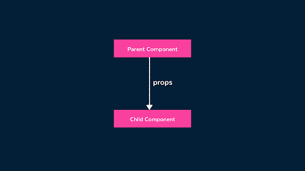
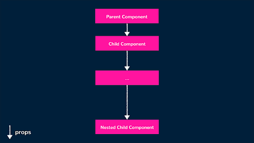
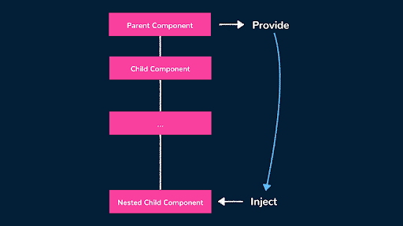

# Provide/Inject

Ota va bola komponentlari o'rtasidagi ma'lumotlarni boshqarishda Vue bizga ma'lumotlarni otadan bolaga o'tkazish uchun propdan foydalanish imkoniyatini beradi. Proplar faqat bitta yo'nalishda harakatlanishi mumkin, asosiy komponentlardan pastki qismlarga (va undan pastroq). Asosiy elementlarda holat o'zgarishi sodir bo'lganda, Vue ushbu qiymatlarga bog'liq komponentlarni qayta render qiladi.

<div align="center">
  
</div>

Aksariyat hollarda proplardan foydalanish yaxshi samara beradi. Biroq, component treeda ko'p sonli komponentlarga ega bo'lgan katta ilovalarda ishlaganda, proplarni saqlash qiyin bo'lishi mumkin, chunki component treedagi har bir komponentda proplar e'lon qilinishi kerak.

<div align="center">
  
</div>

Ko'p sonli komponentlar o'rtasida ma'lumotlarni qanday boshqarish mumkinligini ko'rib chiqayotganda, odatda dastur darajasidagi holatni barqaror va boshqariladigan tarzda boshqarishga imkon beruvchi yechim ustida ishlash yaxshi bo'ladi (masalan, qayta foydalaniladigan do'kon yaratish, Pinia-dan foydalanish va h.k.). Bu haqida biz [State Management](https://www.patterns.dev/vue/state-management) bo'yicha qo'llanmada batafsilroq gaplashamiz.

Shu bilan birga, Vue, shuningdek, provide/inject pattern deb nomlanuvchi Vue ilovasida murakkab prop drilling zaruratining oldini olishga yordam beradigan ma'lum modelni taqdim etadi.

## Provide/Inject

Vuedagi provide() funksiyasi bizga ma'lumotlarni prop-drill qilish (ya'ni, har bir darajada qo'lda pastga tushirish) kerak bo'lmasdan component tree orqali uzatish imkonini beradi. Boshqa tomondan, inject() opsiyasi bola komponentlarida ularning ota-onasi yoki har qanday ancestor komponentidan taqdim etilgan ma'lumotlar yoki usullarga kirish uchun ishlatiladi.

<div align="center">
  
</div>

Buni qanday qilish mumkinligini ko'rsatish uchun biz oddiy misolni ko'rib chiqamiz. Faraz qilaylik, bizda App deb nomlangan parent component mavjud bo'lib, u o'zining child komponenti ChildComponent bilan ma'lumot qismini almashishni xohlaydi. Ushbu ma'lumotni tayanch sifatida o'tkazish o'rniga, biz ma'lumotni uning barcha yordamchi komponentlari uchun mavjud qilish maqsadida asosiy komponentda provide() dan foydalanishimiz mumkin.

```js
<template>
  <div id="app">
    <ChildComponent />
  </div>
</template>


<script setup>
  import { provide } from "vue";
  import ChildComponent from "./components/ChildComponent";


  provide("data", "Data from parent!");
</script>
```

Keyin biz inject() funksiyasi yordamida ChildComponentdagi ushbu taqdim etilgan ma'lumotlarga kirishimiz mumkin. 

```js
<template>
  <div>
    <p>{{ data }}</p>
  </div>
</template>


<script setup>
  import { inject } from "vue";


  const data = inject("data");
</script>
```

Inject("data") ni child componentda (ChildComponent) belgilash orqali biz to'g'ridan-to'g'ri asosiy komponentdan taqdim etilgan ma'lumotlar qiymatiga kiramiz. Keyin uning qiymatini ko'rsatish uchun ma'lumotlarni shablonga bog'laymiz.

```js
1 <template>
2  <div id="app">
3    <ChildComponent />
4  </div>
5 </template>
6
7 <script setup>
8 import { provide } from "vue";
9 import ChildComponent from "./components/ChildComponent";
10
11 provide("data", "Data from parent!");
12 </script>
```

Provide/inject bilan komponentlar hierarchy treeda ko'plab yordamchi komponentlarga ega bo'lsa ham, yuqorida ko'rganimiz kabi xatti-harakatlarni sezamiz. Misol tariqasida, bizda \<ChildComponent /\>, \<ChildComponent2 /\>, \<ChildComponent3 /\>, \<ChildComponent4 /\> va \<ChildComponent5 /\> komponentlari bor edi, bunda har bir kichik komponent boshqasining otasi hisoblanadi.

```js
<!-- ChildComponent5 -->
<template>
  <div>
    <p>{{ data }}</p>
  </div>
</template>


<script setup>
  import { inject } from "vue";
  const data = inject("data");
</script>
<!--  ------------- -->


<!-- ChildComponent4 -->
<template>
  <ChildComponent5 />
</template>


<script setup>
  import ChildComponent5 from "./ChildComponent5";
</script>
<!--  ------------- -->


<!-- ChildComponent3 -->
<template>
  <ChildComponent4 />
</template>


<script setup>
  import ChildComponent4 from "./ChildComponent4";
</script>
<!--  ------------- -->


<!-- ChildComponent2 -->
<template>
  <ChildComponent3 />
</template>


<script setup>
  import ChildComponent3 from "./ChildComponent3";
</script>
<!--  ------------- -->


<!-- ChildComponent -->
<template>
  <ChildComponent2 />
</template>


<script setup>
  import ChildComponent2 from "./ChildComponent2";
</script>
<!--  ------------- -->


<!-- App -->
<template>
  <div id="app">
    <ChildComponent />
  </div>
</template>


<script setup>
  import { provide } from "vue";
  import ChildComponent from "./components/ChildComponent";


  provide("data", "Data from parent!");
</script>
<!--  ------------- -->

```

Asosiy \<App /\> komponentidan olingan ma'lumotlar \<ChildComponent5 /\> komponentida provide/inject qilish tufayli treedagi har bir komponent orqali ma'lumotlarni prop-drilling qilish zaruratisiz render qilinadi\!

```js
1 <template>
2  <div id="app">
3    <ChildComponent />
4  </div>
5 </template>
6
7 <script setup>
8 import { provide } from "vue";
9 import ChildComponent from "./components/ChildComponent";
10
11 provide("data", "Data from parent!");
12 </script>
```

Parent komponentdan ma'lumotlarini taqdim etishdan tashqari, biz provide() ni ilova darajasiga ko'tarishimiz mumkin (ya'ni, biz Vue ilovamizni ishga tushirgan joyda).

```js
import { createApp } from "vue";
import App from "./App.vue";
import "./styles.css";


const app = createApp(App);


// app-level provide
app.provide("data", "Data from parent!");


app.mount("#app");
```

Ilova darajasi barcha komponentlar uchun ma'lumotlarni taqdim etishni ta'minlaganligi sababli, ular ko'pincha [plaginlarni](https://vuejs.org/guide/reusability/plugins.html) yaratishda foydali bo'ladi \- bu butun Vue ilovasiga funksionallikni qo'shadigan mustaqil kod hisoblanadi.

## Props va provide/inject

Qachon biz proplar va props/injection pattern o'rtasida tanlov qilamiz? Ikkala yondashuvning ham afzalliklari va kamchiliklari bor.

### Proplar bilan:

* Biz ma'lumotlarni bosqichma-bosqich bir darajadan ikkinchisiga o'tkazishning aniq namunasiga amal qilamiz (afzal tomoni).  
* Biroq, agar bizning komponentlar hierarchy tree ko'p sonli komponentlarni o'z ichiga olsa, prop ma'lumotlarini bir vaqtning o'zida bir darajaga o'tkazish jarayoni noqulay bo'lishi mumkin (kamchilik).

### Provide/inject bilan

* Bola komponentlar yuqorida bir necha darajalarda joylashgan asosiy komponentlardan maʼlumotlarga bevosita kirishi mumkin, bu esa har bir darajadagi maʼlumotlarni uzatish zaruriyatini yo’q qiladi (afzallik).  
* Biroq, xatolar yuzaga kelganda, provide/inject bilan nosozliklarni tuzatish yanada qiyin bo'lishi mumkin. Bu qiyinchilik ko'p turli xil provayderlarga ega bo'lgan keng miqyosli ilovalarda yanada aniqroq bo'ladi (kamchilik).

Provide/injection pattern mavzu ma'lumotlari, mahalliy til/til sozlamalari va foydalanuvchi autentifikatsiyasi tafsilotlari kabi dastur bo'yicha mijoz ma'lumotlari uchun eng mos keladi. Ushbu turdagi ma'lumotlar provide/inject bilan yaxshiroq boshqariladi, chunki ilova ichidagi har qanday komponent istalgan vaqtda ularga kirishni talab qilishi mumkin.

Boshqa tomondan, ma'lumotlar faqat ma'lum bir komponentlar to'plamida izolyatsiya qilinishi kerak bo'lganda, proplar ideal tanlov hisoblanadi.

## Foydali resurslar

* [Provide / Inject | Vue Documentation](https://vuejs.org/guide/components/provide-inject.html)
