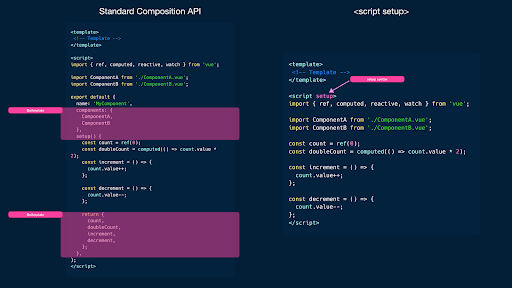

# \<script setup\>

\<script setup\> sintaksisi va u nima ekanligini o'rganishdan oldin, keling, ikkita tushunchani \- bitta faylli komponentlar va Composition API haqida o’rgangan ma’lumotlarni takrorlab olaylik.

Vueda SFClar bizga bitta .vue fayli ichida HTML/CSS va JS komponentlarini aniqlash qobiliyatini berib, couple mantig’iga yordam beradi. Bitta faylli komponent uch qismdan iborat:

```js
<template>
  <!-- HTML template goes here -->
</template>


<script>
  // JavaScript logic goes here
</script>


<style>
  /* CSS styles go here */
</style>
```

\<template\> oddiy HTMLda komponentning belgilarini o'z ichiga oladi, \<script\> ushbu komponent ichidagi barcha JS mantig’idan iborat komponent obyekt konstruktorini eksport qiladi va \<style\> barcha komponent uslublarini o'z ichiga oladi.

Composition API Vuening asosiy imkoniyatlarini ifodalovchi mustaqil funksiyalarni taqdim etadi. Bu funksiyalar, birinchi navbatda, kompozitsion API dan foydalanish uchun kirish nuqtasi bo’lib xizmat qiluvchi yagona  set() opsiyasida qo’llaniladi.

```js
<!-- Template -->


<script>
  export default {
    name: "MyComponent",
    setup() {
      // the setup function
    },
  };
</script>


<!-- Styles -->
```

Composition API anʼanaviy Options API sintaksisidan ko’ra afzalliklarini chuqurroq o’rganish uchun [*Composables*](https://www.patterns.dev/vue/composables) qo’llanmasini o’qib chiqing.

## \<script setup\>

\<script setup\> kompilyatsiya vaqtidagi sintaktik shakar deb ataluvchi sintaktik konstruksiyalar kodni o'qish va yozishni osonlashtiradi, kompozitsion API bilan Vue parametrlarini aniqlashda yanada ixcham va samarali sintaksis yaratish imkonini beradi. Vue hujjatlariga ko'ra, [SFC va Composition API-dan foydalansa](https://vuejs.org/api/sfc-script-setup.html), bu tavsiya etilgan sintaksisdir.

\<script setup\> blokidan foydalanib, biz komponent mantig’ini bitta blokka yig'ishimiz mumkin, bu esa aniq setup() funksiyasiga ehtiyojni yo'q qiladi. \<script setup\> sintaksisidan foydalanish uchun biz shunchaki \<script /\> blokiga sozlash atributini kiritishimiz kerak.

```js
<script setup>
  // ...
</script>
```

Keling, \<script setup\> taqdim etadigan sintaksisdagi asosiy farqlarni ko'rib chiqaylik.

### Return statement yo’q

\<script setup\> sintaksisi bilan blok oxirida qaytish bayonotini belgilashimiz shart emas. Yuqori darajada e'lon qilingan binding-lar (funksiyalar, o'zgaruvchilar, importlar va boshqalar) shablonda mavjud va ulardan foydalanish mumkin.

#### Oldin

```js
<template>
  <div>
    <p>Count: {{ count }}</p>
    <p>Username: {{ state.username }}</p>
    <button @click="increment">Increment Count</button>
  </div>
</template>


<script>
  import { ref, reactive, onMounted } from "vue";


  setup() {
    const count = ref(0);
    const state = reactive({username: "John"});


    const increment = () => {
      count.value++;
    };


    onMounted(() => {
      console.log("Component mounted");
    });


    return {
      count,
      state,
      increment
    };
  },
</script>
```

#### Keyin

```js
<template>
  <div>
    <p>Count: {{ count }}</p>
    <p>Username: {{ state.username }}</p>
    <button @click="increment">Increment Count</button>
  </div>
</template>

<script setup>
  import { ref, reactive, onMounted } from "vue";

  const count = ref(0);
  const state = reactive({ username: "John" });

  const increment = () => {
    count.value++;
  };

  onMounted(() => {
    console.log("Component mounted");
  });
</script>
```

### Mahalliy ro’yxatdan o’tgan komponentlar yo’q

Komponentlarni import qilish avtomatik ravishda \<script setup\> blokida komponentlar opsiyasida komponentni aniq e'lon qilish zaruratisiz tan olinadi va hal qilinadi.

#### Oldin

```js
<template>
  <ButtonComponent />
</template>

<script>
  import ButtonComponent from "./components/ButtonComponent.vue";

  export default {
    setup() {
      // the setup function
    },
    components: {
      ButtonComponent,
    },
  };
</script>
```

#### Keyin

```js
<template>
  <ButtonComponent />
</template>

<script setup>
  import { ButtonComponent } from "./components/Button";
</script>
```

### `defineProps()`

Proplarga to'g'ridan-to'g'ri \<script setup\> blokida defineProps() funksiyasidan foydalanib kirish mumkin.

#### Oldin

```js
<template>
  <button>{{ buttonText }}</button>
</template>

<script>
  export default {
    props: {
      buttonText: String,
    },
  };
</script>
```

#### Keyin

```js
<template>
  <button>{{ buttonText }}</button>
</template>

<script setup>
  const { buttonText } = defineProps({
    buttonText: String,
  });
</script>
```

defineProps() shuningdek, bizga proplar shaklini sof TypeScript bilan e'lon qilish imkonini beradi.

```js
<template>
  <button>{{ buttonText }}</button>
</template>

<script setup lang="ts">
  const { buttonText } = defineProps<{ buttonText: string }>();
</script>
```

Yuqoridagi type-only deklaratsiyasida standart prop qiymatlarini berishda biz bunga erishish uchun withDefaults() kompilyator makrosidan foydalanishimiz mumkin.

```js
<template>
  <button>{{ buttonText }}</button>
</template>

<script setup lang="ts">
  const { buttonText } = withDefaults(defineProps<{ buttonText: string }>(), {
    buttonText: "Initial button text",
  });
</script>
```

defineProps faqat \<script setup\> da mavjud va import qilinmasdan foydalanish mumkin.

### `defineEmits()`

Proplarga o'xshab, custom eventlar komponentdagi defineEmits() funksiyasidan foydalangan holda to'g'ridan-to'g'ri \<script setup\> blokida chiqarilishi mumkin.

#### Oldin

<template>
  <button @click="closeButton">Button Text</button>
</template>

```js
<script>
  export default {
    emits: ["close"],
    setup(props, { emit }) {
      const closeButton = () => emit("close");

      return {
        closeButton,
      };
    },
  };
</script>
```

#### Keyin

```js
<template>
  <button @click="closeButton">Button Text</button>
</template>

<script setup>
  const emit = defineEmits(["close"]);
  const closeButton = () => emit("close");
</script>
```

DefineProps singari, defineEmits ham faqat \<script setup\> da mavjud bo'lgan maxsus kalit so'z bo'lib, import qilinmasdan ham foydalanish mumkin. Shuningdek, u TypeScript sozlamasida ishlashda to'g'ridan-to'g'ri turlarni o'tkazish imkonini beradi.

```js
<template>
  <button @click="closeButton">Button Text</button>
</template>

<script setup lang="ts">
  const emit = defineEmits<{ (e: "close"): void }>(["close"]);
  const closeButton = () => emit("close");
</script>
```

## `\<script setup\>` vs. `setup()`

Ko'p sonli qaytarilgan opsiyalarga va ko'plab mahalliy ro'yxatdan o'tgan kichik komponentlarga ega bo'lgan kattaroq komponentlar uchun \<script setup\> sintaksisi ko'plab standart kodlarni olib tashlashga yordam beradi, bu esa yanada tartibli va keng yo'naltirilgan komponent ta'riflariga olib keladi, bu esa kodlar bazasini yanada o'qish oson bo’lishi va texnik xizmat ko'rsatishiga yordam beradi. 

<div align="center">
  
</div>

\<script setup\> sintaksisi, shuningdek, ish vaqtining yaxshi ishlashini, IDE tipdagi xulosalar samaradorligini va TypeScript yordamida proplar shaklini va chiqarilgan hodisalarni e'lon qilish qobiliyatini ham ta'minlaydi.

\<script setup\> sintaksisi bilan ishlayotganda yodda tutilishi kerak bo'lgan o'zgarishlarning to'liq ro'yxati uchun quyida ulashilgan rasmiy Vue hujjatlariga e’tibor qarating.

## Foydali resurslar

* [\<script setup\> | Vue Documentation](https://vuejs.org/api/sfc-script-setup.html)

