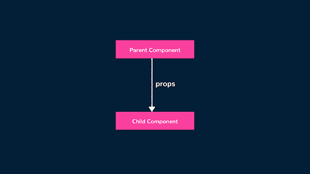
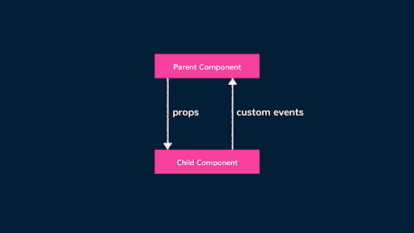
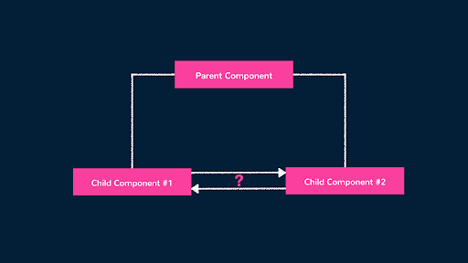
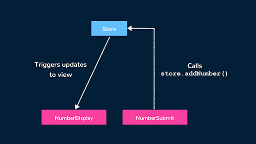
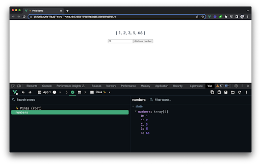

# State Management

Vue komponentlari Vue ilovalarining qurilish bloklari bo'lib, ulardagi belgilar (HTML), mantiq (JS) va uslublarni (CSS) birlashtirishga imkon beradi.

Mana, ma'lumotlar xususiyatidan bir qator raqamlarni ko'rsatadigan Single-file komponentiga namuna:

```js
<template>
  <div>
    <h2>The numbers are {{ numbers }}!</h2>
  </div>
</template>


<script setup>
  import { ref } from "vue";


  const numbers = ref([1, 2, 3]);
</script>
```

ref() funksiyasi komponentni reaktiv bo'lishga tayyorlaydi. Agar shablonda ishlatiladigan reaktiv xususiyat qiymati o'zgarsa, komponent ko'rinishi o'zgarishlarni ko'rsatish uchun qayta render qilinadi.

Yuqoridagi misolda numbers komponentda ishlatiladigan reaktiv ma'lumotlar qiymatidir. Agar raqamlar boshqa komponentdan kirish kerak bo'lgan ma'lumotlar qiymati bo'lsa-chi? Misol uchun, bizga raqamlarni ko'rsatish uchun javobgar bo'lgan komponent (yuqoridagi kabi) va numbers qiymatini boshqarish uchun boshqa komponent ham kerak bo’lishi mumkin.

Agar biz bir nechta komponentlar o'rtasida raqamlarni almashishni istasak, raqamlar nafaqat komponentlar darajasidagi ma'lumotlarga, balki dastur darajasidagi ma'lumotlarga ham aylanadi. Bu bizni state management \- dastur darajasidagi ma'lumotlarni boshqarish mavzusiga olib keladi.

Ilovadagi holatni qanday boshqarishimiz mumkinligini ko'rib chiqishdan oldin, biz proplar ota va bola komponentlari o'rtasida ma'lumotlarni qanday almashishi mumkinligini ko'rib chiqamiz.

## Props

Faraz qilaylik, bizda gipotetik dastur bor, u dastlab ota va bola komponentni o'z ichiga oladi. Vue bizga otadan bolaga ma'lumotlarni uzatish uchun proplardan foydalanish imkoniyatini beradi. 

<div align="center">
  
</div>

Proplardan foydalanish juda oddiy. Biz qilishimiz kerak bo'lgan narsa \- qiymatni prop atributiga bog'lash, bu yerda bola komponenti ko'rsatiladi. Mana, quyida [v-bind](https://vuejs.org/api/built-in-directives.html#v-bind) direktivasi yordamida qiymatlar qatorini pastga tushirish uchun proplardan foydalanishga misol keltirilgan:

ParentComponent

```js
<template>
  <div>
    <ChildComponent :numbers="numbers" />
  </div>
</template>


<script setup>
  import { ref } from "vue";
  import ChildComponent from "./ChildComponent";


  const numbers = ref([1, 2, 3]);
</script>
```

ChildComponent:

```js
<template>
  <div>
    <h2>{{ numbers }}</h2>
  </div>
</template>


<script setup>
  const { buttonText } = defineProps(["numbers"]);
</script>
```

ParentComponent raqamlar massivini xuddi shu nomdagi proplar sifatida ChildComponentga uzatadi. ChildComponent shunchaki numbers qiymatini shablonga bog'laydi.

```js
1 <template>
2  <div>
3    <ChildComponent :numbers="numbers" />
4  </div>
5 </template>
6
7 <script setup>
8  import { ref } from "vue";
9  import ChildComponent from "./ChildComponent";
10
11  const numbers = ref([1, 2, 3]);
12 </script>
```

## Komponent hodisalari

Agar bizga teskari yo'nalishda ma'lumot uzatish yo'lini topish kerak bo'lsa-chi? Bunga misol sifatida foydalanuvchiga yuqoridagi misolda keltirilgan massivga bola komponentdan yangi raqam kiritish imkonini berishi mumkin.

Biz proplardan foydalana olmaymiz, chunki proplar faqat bir yo’nalishli formatda maʼlumotlarni uzatish uchun ishlatilishi mumkin (ota-onadan bolaga, nabirasiga…). Bola komponentining otaga biror narsa haqida xabar berishini osonlashtirish uchun biz maxsus hodisalardan foydalanamiz.

<div align="center">
  
</div>

Vuedagi maxsus hodisalar mahalliy [CustomEvents](https://developer.mozilla.org/en-US/docs/Web/Events/Creating_and_triggering_events#adding_custom_data_%E2%80%93_customevent) sifatida yuboriladi va komponentlar o'rtasidagi aloqa uchun ishlatiladi.

ChildComponent ParentComponentning raqamlar maʼlumotlari xususiyatiga oʻzgartirishni osonlashtirishi uchun maxsus hodisalardan foydalanishiga misol:

ChildComponent

```js
<template>
  <div>
    <h2>{{ numbers }}</h2>
    <input v-model="number" type="number" />
    <button @click="$emit('number-added', Number(number))">
      Add new number
    </button>
  </div>
</template>


<script setup>
  const { numbers } = defineProps(["numbers"]);
</script>
```

ParentComponent

```js
<template>
  <div>
    <ChildComponent :numbers="numbers" @number-added="(n) => numbers.push(n)" />
  </div>
</template>


<script setup>
  import { ref } from "vue";
  import ChildComponent from "./ChildComponent";


  const numbers = ref([1, 2, 3]);
</script>
```

ChildComponentda raqam qiymatini oladigan kirish va olingan raqam qiymati bilan raqam qo'shilgan maxsus hodisani chiqaradigan button mavjud.

ParentComponentda @number-added bilan belgilangan maxsus hodisa tinglovchisi, bola komponenti ko'rsatilayotgan joyda ko'rsatilgan. Ushbu hodisa bolada chiqarilganda, u hodisadan raqam qiymatini ParentComponentning raqamlar qatoriga suradi.

```js
1 <template>
2  <div>
3    <ChildComponent :numbers="numbers" @number-added="(n) => numbers.push(n)" />
4  </div>
5 </template>
6
7 <script setup>
8 import { ref } from "vue";
9
10 // eslint-disable-next-line no-unused-vars
11 import ChildComponent from "./ChildComponent";
12
13 // eslint-disable-next-line no-unused-vars
14 const numbers = ref([1, 2, 3]);
15 </script>
```

## Simple State Management

Biz ma'lumotlarni pastga yo'naltirish uchun proplardan va xabarlarni yuqoriga yuborish uchun maxsus hodisalardan foydalanamiz. Qanday qilib biz ma'lumotlarni uzatishimiz yoki ikkita tanish komponentlar o'rtasidagi aloqani osonlashtirishimiz mumkin?

<div align="center">
  
</div>

Biz yuqoridagi kabi maxsus hodisalardan foydalana olmaymiz, chunki bu hodisalar ma'lum komponent interfeysida chiqariladi va natijada maxsus hodisa tinglovchisi komponent ko'rsatilayotgan joyda e'lon qilinishi kerak. Ikkita ajratilgan komponentda bir komponent boshqasida ko'rsatilmaydi.

Ilova darajasidagi holatni boshqarishning oddiy usuli \- komponentlar o'rtasida ma'lumotlar data store almashishni o'z ichiga olgan do’kon modelini yaratish. Do'kon ilovamiz holatini, shuningdek, holatni o'zgartirish uchun mas'ul bo'lgan usullarni boshqaradi.

Misol uchun, bizda quyidagi kabi simple store bo'lishi mumkin:

```js
import { reactive } from "vue";


export const store = reactive({
  numbers: [1, 2, 3],
  addNumber(newNumber) {
    this.numbers.push(newNumber);
  },
});
```

Do'konda payloadni qabul qiluvchi va do'kon raqamlari qiymatini to'g'ridan-to'g'ri yangilaydigan raqamlar qatori va addNumber usuli mavjud.

Holat obyektini aniqlash uchun reactive() funksiyasidan foydalanishga e'tibor bering. Vue 3.x yordamida biz JavaScript obyektidan reaktiv holatni e’lon qilish uchun reactive() funksiyasini import qilishimiz va foydalanishimiz mumkin. Ushbu reaktiv holat addNumber() usuli bilan o'zgartirilsa, ushbu reaktiv holatni ishlatadigan har qanday komponent avtomatik ravishda yangilanadi\!

Bizda do'kondagi raqamlar qatorini ko'rsatish uchun mas'ul bo'lgan bitta komponent bo'lishi mumkin, biz uni NumberDisplay deb nomlaymiz:

NumberDisplay:

```js
<template>
  <div>
    <h2>{{ store.numbers }}</h2>
  </div>
</template>


<script setup>
  import { store } from "../store.js";
</script>
```

Endi bizda NumberSubmit deb nomlangan boshqa komponent bo'lishi mumkin, bu foydalanuvchiga ma'lumotlar massivimizga yangi raqam qo'shish imkonini beradi:

NumberSubmit:

```js
<template>
  <div>
    <input v-model="numberInput" type="number" />
    <button @click="store.addNumber(numberInput)">Add new number</button>
  </div>
</template>


<script setup>
  import { ref } from "vue";
  import { store } from "../store.js";


  const numberInput = ref(0);
</script>
```

NumberSubmit komponentida store.addNumber() mutatsiyasini chaqiruvchi addNumber() usuli mavjud va kutilgan payloadni uzatadi.

Store usuli foydali yukni oladi va to'g'ridan-to'g'ri store.numbers massivini o'zgartiradi. Vue reaktivligi tufayli, har doim do'kon holatidagi raqamlar qatori o'zgartirilsa, ushbu qiymatga bog'liq bo'lgan tegishli DOM (\<template\> NumberDisplay) avtomatik ravishda yangilanadi. 

```js
1 import { reactive } from "vue";
2
3  export const store = reactive({
4    numbers: [1, 2, 3],
5    addNumber(newNumber) {
6      this.numbers.push(newNumber);
7    },
8  });
```

Bu yerda komponentlar bir-biri bilan o'zaro ta'sir qiladi deganda, biz "interact" atamasini bemalol ishlatamiz. Komponentlar bir-biriga hech narsa qilmaydi, balki do'kon orqali bir-biriga o'zgartirish kiritishga chaqiradi.

<div align="center">
  
</div>

Agar biz do'kon bilan to'g'ridan-to'g'ri o'zaro ta'sir qiladigan barcha qismlarni batafsil ko'rib chiqsak, biz pattern o'rnatishimiz mumkin:

* NumberSubmitdagi usul to'g'ridan-to'g'ri store usulida harakat qilish uchun javobgardir, shuning uchun biz uni store action sifatida belgilashimiz mumkin.  
* Store usuli ham store stateni bevosita mutatsiya qilish mas'uliyatga ega. Shunday qilib, biz buni store mutatsiyasi deb ataymiz.  
* NumberDisplay do'konda yoki NumberSubmitda qanday usullar mavjudligiga ahamiyat bermaydi va faqat do'kondan ma'lumot olish bilan shug'ullanadi. Shunday qilib, biz NumberDisplayni store getter of sorts deb nomlaymiz. 

Harakat mutatsiyaga olib keladi. Mutatsiya mutatsiya holatini keltirib chiqaradi, bu esa keyinchalik viewga/komponentlarga ta'sir qiladi. View/komponentlar store ma'lumotlarini getterlar bilan oladi. Biz dastur darajasidagi holatni boshqarishning yanada tartibli usuliga e’tibor qaratamiz.

## Pinia

[Pinia](https://pinia.vuejs.org/) Vue.js uchun state management modeli va kutubxonasi bo’lib, u dastur darajasidagi holatni boshqarishning yanada tartibli tuzilgan va kengaytiriladigan usulini taʼminlaydi.

Pinia Vuex kabi boshqa state management yechimlariga muqobildir va endi Vue uchun state managementning rasmiy kutubxonasi hisoblanadi. Bu holat, harakatlar va getterlarni qamrab oluvchi do'konlarni yaratish va boshqarishning oddiy va samarali usulini taqdim etadi.

Piniada biz defineStore() funksiyasidan foydalanib storeni belgilashimiz mumkin. Pinia bizga Options API yoki Composition API ni taqlid qiluvchi sintaksis bilan do'konni aniqlash imkonini beradi. Bu yerda biz raqamlar do'konini yaratish uchun useNumbersStore() funksiyasini aniqlashda Composition API sintaksisidan foydalanmoqdamiz.

```js
import { ref } from "vue";
import { defineStore } from "pinia";


export const useNumbersStore = defineStore("numbers", () => {
  const numbers = ref([1, 2, 3]);


  function addNumber(newNumber) {
    this.numbers.push(newNumber);
  }


  return { numbers, addNumber };
});
```

Yuqoridagi misolda biz raqamlar deb nomlangan do'konni raqamlar xususiyatini o'z ichiga olgan boshlang'ich holatini aniqlaymiz. Biz, shuningdek, raqamlar holatini o'zgartiradigan addNumber() actionni belgilaymiz.

Keyin biz Pinia misolini yaratishimiz va uni Vue ilovamizga o'rnatishimiz mumkin.

```js
import { createApp } from "vue";
import { createPinia } from "pinia";
import App from "./App.vue";
import "./styles.css";


const app = createApp(App);
const pinia = createPinia();


app.use(pinia);
app.mount("#app");
```

Ayni paytda biz yangi yaratilgan do'konimizdan komponentlarimizda foydalanishimiz mumkin. NumberDisplay komponentida biz useNumbersStore() funksiyasini do’kon faylidan import qilamiz va uni do’kon misoliga kirish uchun chaqiramiz. Keyin komponent shablonidagi do'kon raqamlari qiymatiga murojaat qilishimiz mumkin.

```js
<template>
  <div>
    <h2>{{ store.numbers }}</h2>
  </div>
</template>


<script setup>
  import { useNumbersStore } from "../store";


  const store = useNumbersStore();
</script>
```

NumberSubmit komponentida biz do'kon raqamlari xususiyatini yangilash uchun foydalaniladigan do'kon addNumber() usuliga kirish uchun yuqoridagi kabi amallarni bajarishimiz mumkin.

```js
<template>
  <div>
    <input v-model="numberInput" type="number" />
    <button @click="store.addNumber(numberInput)">Add new number</button>
  </div>
</template>


<script setup>
  import { ref } from "vue";
  import { useNumbersStore } from "../store";


  const store = useNumbersStore();
  const numberInput = ref(0);
</script>
```

Ushbu o'zgarishlar bilan ilovamiz avvalgidek ishlaydi.

```js
1 import { defineStore } from "pinia";
2 import { ref } from "vue";
3 
4  export const useNumbersStore = defineStore("numbers", () => {
5    const numbers = ref([1, 2, 3]);
6 
7    function addNumber(newNumber) {
8      this.numbers.push(newNumber);
9    }
10 
11    return { numbers, addNumber };
12  });
```

Bunday oddiy amalga oshirish uchun Pinia store haqiqatan ham zarur bo'lmasligi mumkin va xuddi reactive() funksiyasi bilan yaratilgan do'kondan foydalanishga o'xshaydi. Shu bilan birga, Pinia yanada murakkab foydalanish holatlari uchun qo'shimcha imkoniyatlarni taklif etadi, masalan, [Pinia xususiyatlarini plaginlar bilan kengaytirish](https://pinia.vuejs.org/core-concepts/plugins.html), ishlab chiquvchi vositalarni qo'llab-quvvatlash va yanada [mosroq TypeScriptni qo'llab-quvvatlash](https://pinia.vuejs.org/core-concepts/state.html#typescript) va [server-side renderingni qo'llab-quvvatlash](https://pinia.vuejs.org/ssr/nuxt.html).

<div align="center">
  
</div>

## To’g’ri yo’l qaysi?

Ilova darajasidagi holatni boshqarishning har bir usuli o'zining afzalliklari va kamchiliklari mavjud.

### Simple Store

* Pro: O'rnatish nisbatan oson.  
* Con: holat va mumkin bo'lgan holat o'zgarishlari aniq belgilanmagan. 

### Pinia

* Pro: Devtools qo'llab-quvvatlash, plaginlar \+ typescript \+ server-side renderingni qo'llab-quvvatlash  
* Con: Qo’shimcha boilerplate.

Oxir-oqibat, bizning arizamizda nima kerakligini va eng yaxshi yondashuv qanday bo'lishi mumkinligini tushunish o’zimizga bog'liq.

## Foydali resurslar

* [Props | Vue Documentation](https://vuejs.org/guide/components/props.html#props)  
* [Component Events | Vue Documentation](https://vuejs.org/guide/components/events.html#component-events)  
* [Simple State Management with Reactivity API | Vue Documentation](https://vuejs.org/guide/scaling-up/state-management.html#simple-state-management-with-reactivity-api)  
* [Core concepts | Pinia](https://pinia.vuejs.org/core-concepts/)
