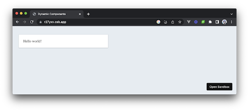

# Render funksiyalari

Vue bizga Vue komponentlarini belgilash uchun (\< template\>\</template\> sintaksisi), ya’ni shablonlardan foydalanishni tavsiya qiladi. Shu bilan birga, komponentlarimizning belgilarini yaratish uchun render funksiyalaridan bevosita foydalanish imkoniyati ham taqdim etilgan.

Vue, qurish vaqtida biz komponentlarimiz uchun yaratgan shablonlarni oladi va ularni funksiyalarni bajarish uchun kompilyatsiya qiladi. Aynan ushbu kompilyatsiya qilingan render funksiyalaridamVue virtual DOM ni tashkil etuvchi nodelarning virtual tasvirini yaratadi.

Agar bu sizga qiziq bo’lsa, Vue hujjatlarining [Renderlash mexanizmi](https://vuejs.org/guide/extras/rendering-mechanism.html) bo'limi virtual DOM tushunchasi va Vuening ichki ko'rsatish mexanizmi haqida batafsil ma'lumot beradi.

Render funksiyalaridan foydalangan holda, biz Vue shablonlarimizni kompilyatsiya qilish uchun bajaradigan kompilyatsiya bosqichini o'tkazib yuboramiz va dasturiy JavaScript yordamida komponent shablonlarimizni qurishimiz mumkin.

## Lekin nega?

Render funksiyalari standart shablon sintaksisi bilan erishib bo‘lmaydigan yuqori darajadagi moslashtirish va moslashuvchanlikni talab qilganda ishga tushadi. Bu, birinchi navbatda, Vuening shablon tizimining soddaligi va oson o'qilishiga urg'u berganligini hisobga olsak, biroz ziddiyatli tuyuladi. Xulosa qilib aytganda, siz render funksiyalaridan foydalanishni quyidagi holatlarda afzal ko'rishingiz mumkin:

* Shablon ichida ifodalash qiyin, murakkab mantiqqa asoslangan komponentlar yoki elementlarni dinamik ravishda ko'rsatish kerak bo'lganda.  
* Ilg'or manipulyatsiyalar uchun Virtual DOMda bevosita qo'lingiz bo'lishini xohlaganingizda.  
* Komponentlaringiz shablonini yaratish uchun JSX dan foydalanmoqchi bo’lganingizda.

Ushbu noyob holatlardan tashqari, Vue shablonlari sintaksisi komponent belgilarini yaratish uchun asosiy usul bo'lib qolishi kerak. Biroq, noyob vaziyatlar uchun render funksiyalari qanday ishlashini tushunish muhim bo'lishi mumkin. Shunday qilib, ushbu maqolada biz render funksiyalarini ko'rib chiqamiz va ulardan asosiy komponentni yaratishda qanday foydalanishni o'rganamiz.

## Render funksiyalari

Faraz qilaylik, bizda \<header\> va \<div\> elementini o'z ichiga olgan quyidagi komponent mavjud edi. \<header\> elementining matn tarkibi shunchaki message propning qiymatini ko'rsatadi.

```js
<template>
  <div class="render-card">
    <header class="card-header card-header-title">{{ message }}</header>
  </div>
</template>


<script setup>
  const { message } = defineProps(["message"]);
</script>
```

Render funksiyasi, ya'ni h() funksiyasi yordamida komponentning belgilarini bosqichma-bosqich qayta yaratamiz.

```js
<script setup>
  import { h } from "vue";


  const { message } = defineProps(["message"]);
</script>
```

h \- giperskriptning qisqartmasi bo'lib, bu atama ko'pincha virtual DOM dasturlarida HTML ishlab chiqaradigan JavaScript sintaksisini ko'rsatish uchun ishlatiladi. Oddiy qilib aytganda, h() funksiyasi Vue kuzatish va keyinchalik sahifada ko'rsatish uchun foydalanadigan DOM tugunlarining "virtual" tasvirini yaratishga imkon beruvchi render funksiyasidir.

h() funktsiyasi o'ziga xos uchta argumentni oladi:

1. HTML teg nomi yoki komponent ta'rifi.  
2. Elementga uzatiladigan proplar/atributlar (hodisa tinglovchilari, sinf atributlari va boshqalar).  
3. Ota nodening bola nodelari.

Biz qurmoqchi bo'lgan asosiy node uchun HTML teg nomi \<div\> elementidir. Biz h() funksiyasining natijasini doimiy yorliqli renderga tayinlaymiz va birinchi argument sifatida “div” qiymati qatoriga o'tamiz: 

```js
<script setup>
  import { h } from "vue";


  const { message } = defineProps(["message"]);


  const render = () => {
    return h("div");
  };
</script>
```

Biz asosiy \<div\> elementiga .render-card CSS sinfini qo'llashdan manfaatdormiz. Buning uchun h() funksiyasining ikkinchi argumentidagi ma’lumotlar obyektini “render-card” satr qiymatiga ega bo‘lgan sinf xususiyatiga ega bo‘lishini e’lon qilamiz:

```js
<script setup>
  import { h } from "vue";


  const { message } = defineProps(["message"]);


  const render = () => {
    return h("div", {
      class: "render-card",
    });
  };
</script>
```

Garchi biz bu misol uchun ko'proq ish qilmasak ham, ikkinchi argument ma'lumotlari obyekti bilan atributlarni aniqlashning ko'plab turli usullari mavjud. Agar qiziqsangiz, yaxshi xulosa uchun [Vue hujjatlarini](https://vuejs.org/guide/extras/render-function.html#creating-vnodes) tekshiring. 

Biz ota \<div\> elementining o'ziga xos bola \<header\> elementiga ega bo'lishini xohlaymiz. h() funksiyasining uchinchi argumentida biz matnni ko'rsatish uchun oddiy qatorni yoki ko'proq virtual nodelarni (ya'ni ko'proq elementlarni) ko'rsatish uchun massivni belgilashimiz mumkin.

Biz boshqa yaratilgan elementni bola sifatida ko'rsatganimiz sababli, biz h() funksiyasini child nodelari massivida e'lon qilamiz va unga "header" qator qiymatini beramiz:

```js
<script setup>
  import { h } from "vue";


  const { message } = defineProps(["message"]);


  const render = () => {
    return h(
      "div",
      {
        class: "render-card",
      },
      [h("header")]
    );
  };
</script>
```

Sarlavhaning asosiy elementi o'ziga xos sinflarga ega bo'lishi kerak, shuning uchun biz sarlavha elementi bo'lishi kerak bo'lgan sinflarni e'lon qilish uchun ichki h() funksiyasidagi atributlar obyektiga o'tamiz:

```js
<script setup>
  import { h } from "vue";


  const { message } = defineProps(["message"]);


  const render = () => {
    return h(
      "div",
      {
        class: "render-card",
      },
      [
        h("header", {
          class: "card-header card-header-title",
        }),
      ]
    );
  };
</script>
```

To'liq sarlavha elementi o'ziga tegishli bo'lmagan elementlarni o'z ichiga olmaydi va buning o'rniga shunchaki message propining qiymatini ko'rsatish kerak. Sarlavha elementi message propini uning asosiy mazmuni sifatida ko'rsatishi uchun biz h() funksiyasining uchinchi argumentida message qiymatini e'lon qilamiz.

```js
<script setup>
  import { h } from "vue";


  const { message } = defineProps(["message"]);


  const render = () => {
    return h(
      "div",
      {
        class: "render-card",
      },
      [
        h(
          "header",
          {
            class: "card-header card-header-title",
          },
          message
        ),
      ]
    );
  };
</script>
```

Shu yetarli\! Biz bajarishimiz kerak bo’lgan oxirgi narsa \- biz yaratgan render virtual node elementini komponentning shablonlar bo'limiga joylashtirish.

```js
<template>
  <render />
</template>


<script setup>
  import { h } from "vue";


  /* eslint-disable-next-line no-undef, no-unused-vars */
  const { message } = defineProps(["message"]);


  /* eslint-disable-next-line no-unused-vars */
  const render = () => {
    return h(
      "div",
      {
        class: "render-card",
      },
      [
        h(
          "header",
          {
            class: "card-header card-header-title",
          },
          message
        ),
      ]
    );
  };
</script>
```

Endi biz yuqoridagi komponentni asosiy App.vue misolida render qilishni davom ettirishimiz va "Salom dunyo\!" message propga o’tkizishimiz mumkin. 

```js
<template>
  <RenderComponent message="Hello world!" />
</template>


<script setup>
  import RenderComponent from "./components/RenderComponent.vue";
</script>
```

Ushbu o'zgarishlarni saqlashda bizga "Salom dunyo\!" UIdagi xabar, bizga child komponentini mos ravishda ko'rsatganimizni bildiradi.

<div align="center">
  
</div>

Agar siz bu yerda chalkashayotganingizni his qilsangiz, tashvishlanishingizga hojat yo'q. Render funksiyalari bizga komponentlarimizning belgilarini qanday moslashtirishni xohlashimizga ko'proq kuch bersa-da, standart shablonlardan foydalanish odatda ko'p hollarda ancha oson bo'ladi. Faqat murakkab dinamik renderlash yoki moslashtirish talab qilinadigan noyob holatlarda render funksiyalarini tanlash mumkin.
```js
1 <template>
2  <render />
3 </template>
4
5 <script setup>
6 import { h } from "vue";
7
8 /* eslint-disable-next-line no-undef, no-unused-vars */
9 const { message } = defineProps(["message"]);
10
11 /* eslint-disable-next-line no-unused-vars */
12 const render = () => {
13  return h(
14    "div",
15    {
16      class: "render-card",
17    },
18    [
19      h(
20        "header",
21        {
22          class: "card-header card-header-title",
23        },
24        message
25      ),
26    ]
27  );
28 };
29 /script>
```

## Render funksiyalari va JSX

Yuqorida biz amalga oshirgan dasturni biroz og'riqli deb hisoblashimiz mumkin bo'lgan asosiy sabab render funksiyasini xom mahalliy JavaScript bilan yozishimiz bilan bog'liq. Render funksiyalarini yozishni ancha osonlashtirish uchun Vue bizga tegishli [Babel plugin](https://github.com/vuejs/babel-plugin-jsx) yordamida JSX yordamida render funksiyalarini yozish imkoniyatini beradi\!

Agar siz React fonida kelgan bo'lsangiz, JSX allaqachon tanish mavzu bo'lishi mumkin. Sodda tilda tushuntirganda, JavaScript XML (yoki ko'proq JSX nomi bilan tanilgan) bu bizga HTMLga o'xshash JavaScriptni yozish imkonini beruvchi kengaytmadir (ya'ni JavaScript-da XMLga o'xshash sintaksisni yozish).

JSX bizning render dasturimizni o'qishni ancha osonlashtiradigan tarzda qayta yaratishga yordam beradi, chunki biz HTMLni render funksiyasida xavfsiz yozishimiz mumkin:

```js
<template>
  <render />
</template>


<script setup lang="jsx">
  const { message } = defineProps(["message"]);


  const render = (
    <div class="render-card">
      <header class="card-header card-header-title">{message}</header>
    </div>
  );
</script>
```

JSX bilan bizning render funksiyamiz unchalik qiyin ko'rinmaydi\! Shuni yodda tutish kerakki, JSX har doim Babel package (masalan, [babel-plugin-jsx](https://github.com/vuejs/babel-plugin-jsx)) yordamida standart JavaScriptga ko'chirilishi kerak bo'lgan ishlab chiqish vositasidir. [create-vue](https://github.com/vuejs/create-vue) va [Vue CLI](https://cli.vuejs.org/) ikkalasida ham oldindan tuzilgan JSX yordami bilan barcha loyihalar uchun imkoniyatlar mavjud.

```js
1 <template>
2  <render />
3 </template>
4
5 <script setup lang="jsx">
6 const { message } = defineProps(["message"]);
7
8 const render = <div class="render-card"><header class="card-header card-header-title">{message}</header></div>
9 </script>
```

## Funksional komponentlar

Funksional komponentlar, render funksiyaning bir turi, oddiy funksiyalar yordamida komponentlarni aniqlash usulini ta'minlaydi. Funksional komponentlar ichki holatga ega bo'lmagan alohida turdagi komponentlardir. Ular sof funksiyalarga o'xshaydi, proplarni input sifatida qabul qiladi va output sifatida virtual nodelarni ishlab chiqaradi.

Funksional komponentni qurish uchun biz variantlar obyekti o'rniga oddiy funksiyadan foydalanamiz. Ushbu funksiya asosan komponentning chiqishini yaratish uchun mas'ul bo'lgan render funksiyasi sifatida xizmat qiladi.

```js
function RenderComponent(props, { slots, emit, attrs }) {
  // ...
}
export default RenderComponent;
```

Biz yuqorida ko'rganimizdek, komponentimiz shablonini yaratish uchun h() funksiyasidan foydalanishimiz mumkin.

```js
import { h } from "vue";


function RenderComponent(props) {
  return h(
    "div",
    {
      class: "render-card",
    },
    [
      h(
        "header",
        {
          class: "card-header card-header-title",
        },
        props.message
      ),
    ]
  );
}


export default RenderComponent;
```

Bundan tashqari, biz JSXdan komponent shablonini o'qish uchun qulayroq qilish maqsadida ham foydalanamiz.

```js
function RenderComponent(props) {
  return (
    <div class="render-card">
      <header class="card-header card-header-title">{props.message}</header>
    </div>
  );
}


export default RenderComponent;
```

Ushbu funksional komponent sozlamalari bilan UI da bizning komponentimiz bir xil "Salom dunyo\!" ni render qiladi.

```js
1 function RenderComponent(props) {
2    return (
3      <div class="render-card">
4        <header class="card-header card-header-title">{props.message}</header>
5      </div>
6    );
7  }
8 
9  export default RenderComponent;
```

## Wrap Up

Render funksiyalari JavaScript yordamida Vue komponentlarini belgilashni dasturiy jihatdan yaratishning kuchli usulini taqdim etadi. Ular bizga Vue sahifani kuzatish va ko'rsatish uchun foydalanadigan DOM nodelarining virtual tasvirlarini yaratishga imkon beradi.

Render funksiyalari moslashuvchanlik va moslashtirishni taklif qilsa-da, ular standart shablonlardan foydalanishga nisbatan murakkabroq bo'lishi mumkin. Agar siz ushbu maqoladagi ma'lumotlarni to'liq tushunmaganingizni his qilsangiz \- bu mutlaq normal holat. Vue iloji boricha standart shablonlardan foydalanishni tavsiya qiladi, chunki render funksiyalarini ilovada tushunish va amalga oshirish qiyinroq. Biroq, ko'rsatish funksiyalari komponentlarning belgilarini sozlashda ko'proq quvvat va moslashuvchanlik talab qilinadigan noyob ssenariylar uchun foydali bo'lishi mumkin.

## Foydali resurslar

* [Render Functions & JSX | Vue Documentation](https://vuejs.org/guide/extras/render-function.html)  
* [Rendering Mechanism | Vue Documentation](https://vuejs.org/guide/extras/rendering-mechanism.html)

