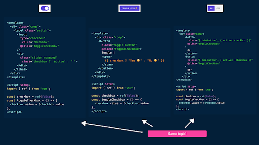

# Rendersiz komponentlar

Renderlanmaydigan komponentlar Vue-da komponentning mantig’ini uning taqdimotidan ajratib turadigan modeldir. Bu model komponentning tashqi ko’rinishini cheklamasdan uning funksiyalarini bir joyga jamlash imkonini beradi. Ya’ni, rendersiz komponent faqatgina mantiq va xatti-harakatga javob beradi, renderlash jarayoni esa ota-komponent zimmasiga yuklatiladi. 

Renderlanmaydigan komponentlar, ayniqsa, turli UI ilovalariga qo'llaniladigan va qayta foydalanish mumkin bo'lgan mantiqni yaratish kerak bo'lganda foydalidir. Mantiqni renderlanmaydigan komponentga abstraksiyalash orqali biz uni turli kontekstlarda kodni takrorlamasdan osongina qayta ishlatishimiz mumkin. Agar siz hali ham shu daqiqada sarosimaga tushsangiz, tashvishlanmang\! Keling, misol bilan ushbu konsepsiyaga e’tiborliroq yondashamiz. 

## Toggle, toggle, toggle

Tasavvur qiling, sizda ilovangizning turli qismlarida ishlatilishi kerak bo'lgan toggle UI elementi mavjud, lekin har bir misol turli xil vizual tasvirga ega. Ba'zi toggle’lar tugmalar sifatida ko'rsatilishi mumkin, boshqalari esa checkbox yoki switch bo'lishi mumkin.

[https://res.cloudinary.com/ddxwdqwkr/image/upload/c\_scale,w\_900,f\_auto/v1688136753/patterns.dev/Images/vue/vue\_renderless\_components/renderless-toggles.gif](https://res.cloudinary.com/ddxwdqwkr/image/upload/c_scale,w_900,f_auto/v1688136753/patterns.dev/Images/vue/vue_renderless_components/renderless-toggles.gif)

Yuqoridagi misol uchun biz faqat uchta o'zgartirish komponentini yaratishimiz mumkin, ammo har bir toggle elementi bir xil mantiq va hatti-xarakatga ega ekanligini kuzatishimiz mumkin. Har bir toggle komponent maʼlumotlari xususiyati bilan kuzatilayotgan nofaol va faol holatga ega (masalan, checked). Toggle tugmasi bosilganda, uning komponent holati nofaoldan faolga o'tadi va aksincha (ya'ni, tekshirildi \= \!checked).

Bu yerda har bir komponentning \<template\> va \<script\> bo'limlari qanday tuzilganligi ko'rsatilgan: 

<div align="center">
  
</div>

Darhol biz umumiy mantiq va xatti-harakatlarni ajratib ko'rsatish orqali qayta foydalanish mumkin bo'lgan model yaratishimiz mumkinligini ko’rsatamiz, shunda biz har bir alohida almashtirish komponentida holatni va toggle usullarini qayta-qayta belgilashimiz shart emas. Bu   [composable](https://www.patterns.dev/vue/composables) lardan foydalanish uchun ajoyib holat, chunki kompozitsiyalar bizga turli xil toggle komponentlari bo'ylab umumiy holat mantig’ini inkapsulyatsiya qilish va almashish imkonini beradi.

useCheckboxToggle:

```js
import { ref } from "vue";


export function useCheckboxToggle() {
  const checkbox = ref(false);


  const toggleCheckbox = () => {
    checkbox.value = !checkbox.value;
  };


  return {
    checkbox,
    toggleCheckbox,
  };
}

```

Toggle komponenti:

```js
<template>
  <div class="comp">
    <label class="switch">
      <input type="checkbox" :value="checkbox" @click="toggleCheckbox" />
      <div class="slider rounded" :class="checkbox ? 'active' : ''"></div>
    </label>
  </div>
</template>


<script setup>
  import { useCheckboxToggle } from "./composables/useCheckboxToggle";


  const { checkbox, toggleCheckbox } = useCheckboxToggle();
</script>
```

Garchi yuqoridagilar bizning foydalanish holatlarimiz uchun juda yaxshi ishlayotgan bo'lsa-da, Vue bizga state logicni qanday qilib qayta ishlatishimiz va uni renderlashdan ajratilgan holda qanday ishlatishimiz uchun yana bir model beradi.

## Rendersiz komponentlar

Rendersiz komponentlarning asosiy g'oyasi hech qanday HTML yoki UI elementlarini o'zi render qilmaydigan, lekin uning ichki holati va usullarini ota-komponentiga ko'rsatadigan komponentni yaratishdir. Keyinchalik, ota-komponent ochiq ma'lumotlar va rendersiz komponentning xatti-harakati asosida tegishli user interfeysini ko'rsatish bilan shug'ullanadi.

Nima render qilinishi kerakligini ota komponentiga ega bo'lish qobiliyati slots deb nomlanuvchi konsepsiya yordamida amalga oshiriladi.

Slotlar ota-komponentga template tarkibini bola komponentiga kiritish imkonini beradi va ularni proplar kabi ko'rib chiqishi mumkin, lekin JavaScript qiymatlarini uzatish o'rniga ular template qismlarini bola komponentlariga o'tkazishga imkon beradi.

Keling, rendersiz toggle komponent yaratishni boshlaylik. Komponentning `\<script\>` bo'limida biz checkbox holati qiymatini almashtirish uchun javobgar bo'lgan state mantig’iga ega bo'lamiz.

```js
<script setup>
  import { ref } from "vue";


  const checkbox = ref(false);


  const toggleCheckbox = () => {
    checkbox.value = !checkbox.value;
  };
</script>
```

Komponentning \<template\> bo'limida biz maxsus \<slot\> elementidan parent tomonidan taqdim etilgan template tarkibi shu yerda bo'lishini belgilash uchun foydalanamiz.

```js
<template>
  <slot></slot>
</template>


<script setup>
  import { ref } from "vue";


  const checkbox = ref(false);


  const toggleCheckbox = () => {
    checkbox.value = !checkbox.value;
  };
</script>
```

Biz childda ko'rsatmoqchi bo'lgan templateni e'lon qilganimizda, parentdda mavjud bo'lgan checkbox va toggleCheckbox() xususiyatlari kerak bo'ladi. Buni amalga oshirish uchun biz komponentga proplarni uzatgandek, ushbu xususiyatlarni \<slot\>\</slot\>  outletiga o'tkazishimiz mumkin.

```js
<template>
  <slot :checkbox="checkbox" :toggleCheckbox="toggleCheckbox"></slot>
</template>


<script setup>
  import { ref } from "vue";


  const checkbox = ref(false);


  const toggleCheckbox = () => {
    checkbox.value = !checkbox.value;
  };
</script>
```

Ota-komponentda biz endi checkbox va toggleCheckbox() atributlariga murojaat qilishimiz mumkin, chunki biz bola komponentni qanday render qilinishini kuzatishni xohlaymiz.

Biz yaratgan komponentning o'ziga xos shabloniga ega emasligiga e'tibor berdingizmi? Aynan shu narsa uni rendersiz komponentga aylantiradi, u faqat mantiq va xatti-harakatga e'tibor qaratadi va renderlashni ota-komponentga topshiradi.

Ota-komponentda endi biz har birining o'ziga xos foydalanuvchi tajribasiga ega bo'lgan uchta toggle elementini render qilishga harakat qilamiz. Biz avval yuqorida yaratgan rendersiz ToggleComponent komponentini import qilamiz.

```js
<script setup>
  import ToggleComponent from "./components/ToggleComponent";
</script>
```

Endi biz \<Toggle Component\>ni renderlashga urinib ko'rishimiz mumkin va biz bola komponentga nima joylashtirsak, shablon slotlari renderlangan kontent bo'ladi.

```js
<template>
  <ToggleComponent>
    <!-- slot content -->
    <!-- (i.e. what gets rendered as the ToggleComponent template) -->
  </ToggleComponent>
</template>


<script setup>
  import ToggleComponent from "./components/ToggleComponent";
</script>
```

Komponent slot tarkibini ko'rsatganimizda, biz bola komponentlari doirasidagi xususiyatlarga kirishimiz kerak (checkbox va toggleCheckbox()). Biz bu atributlarni slot outletga avvalroq uzatganimiz sabab (\<slot :checkbox="checkbox" :toggleCheckbox="toggleCheckbox"\>\</slot\>)  biz ushbu slot proplarini olish uchun v-slot direktivasidan foydalanishimiz mumkin.

```js
<template>
  <ToggleComponent v-slot="{ checkbox, toggleCheckbox }">
    <!-- slot content -->
    <!-- (i.e. what gets rendered as the ToggleComponent template) -->
  </ToggleComponent>
</template>


<script setup>
  import ToggleComponent from "./components/ToggleComponent";
</script>
```

Bizda mavjud bo'lgan tegishli slot outletlari bilan biz endi birinchi toggle elementini ko'rsatishimiz mumkin. Bu almashtirish elementi checkbox xususiyati qiymatiga qarab nofaol holatdan faol holatga o'tuvchi switch toggle bo'ladi.

```js
<template>
  <ToggleComponent v-slot="{ checkbox, toggleCheckbox }">
    <div class="comp">
      <label class="switch">
        <input type="checkbox" :value="checkbox" @click="toggleCheckbox" />
        <div class="slider rounded" :class="checkbox ? 'active' : ''"></div>
      </label>
    </div>
  </ToggleComponent>
</template>


<script setup>
  import ToggleComponent from "./components/ToggleComponent";
</script>
```

O'zgarishlarni saqlaganimizda, ilovamizda switch toggle ko'rsatiladi.

[https://res.cloudinary.com/ddxwdqwkr/image/upload/c\_scale,w\_900,f\_auto/v1688140966/patterns.dev/Images/vue/vue\_renderless\_components/toggle-element-1.gif](https://res.cloudinary.com/ddxwdqwkr/image/upload/c_scale,w_900,f_auto/v1688140966/patterns.dev/Images/vue/vue_renderless_components/toggle-element-1.gif)

Biz oldinga o'tib, boshqa ikkita toggle elementini o'xshash tarzda yaratishimiz mumkin. Ikkinchi toggle elementi tugma bo'lib, bosilganda Toggle | matni o'rtasida almashinadi, masalan, `Toggle | Yes 😀` va `Toggle | No 😔`.

```js
<template>
  <!-- Toggle element 1 -->
  <ToggleComponent v-slot="{ checkbox, toggleCheckbox }">
    <div class="comp">
      <label class="switch">
        <input type="checkbox" :value="checkbox" @click="toggleCheckbox" />
        <div class="slider rounded" :class="checkbox ? 'active' : ''"></div>
      </label>
    </div>
  </ToggleComponent>


  <!-- Toggle element 2 -->
  <ToggleComponent v-slot="{ checkbox, toggleCheckbox }">
    <div class="comp">
      <button class="toggle-button" @click="toggleCheckbox">
        Toggle | <span>{{ checkbox ? "Yes 😀" : "No 😔" }}</span>
      </button>
    </div>
  </ToggleComponent>
</template>


<script setup>
  import ToggleComponent from "./components/ToggleComponent";
</script>
```

Nihoyat, bizning uchinchi toggle elementimiz ikkita yorliqli tugmalar bo'ladi, ularning har biri bosilganda ikkala tugmaning faol holatini almashtiradi.

```js
<template>
  <!-- Toggle element 1 -->
  <ToggleComponent v-slot="{ checkbox, toggleCheckbox }">
    <div class="comp">
      <label class="switch">
        <input type="checkbox" :value="checkbox" @click="toggleCheckbox" />
        <div class="slider rounded" :class="checkbox ? 'active' : ''"></div>
      </label>
    </div>
  </ToggleComponent>


  <!-- Toggle element 2 -->
  <ToggleComponent v-slot="{ checkbox, toggleCheckbox }">
    <div class="comp">
      <button class="toggle-button" @click="toggleCheckbox">
        Toggle | <span>{{ checkbox ? "Yes 😀" : "No 😔" }}</span>
      </button>
    </div>
  </ToggleComponent>


  <!-- Toggle element 3 -->
  <ToggleComponent v-slot="{ checkbox, toggleCheckbox }">
    <div class="comp">
      <button
        :class="['tab-button', { active: checkbox }]"
        @click="toggleCheckbox"
      >
        On
      </button>
      <button
        :class="['tab-button', { active: !checkbox }]"
        @click="toggleCheckbox"
      >
        Off
      </button>
    </div>
  </ToggleComponent>
</template>


<script setup>
  import ToggleComponent from "./components/ToggleComponent";
</script>
```

Ushbu o'zgarishlar saqlangan bo'lsa, bizda turlicha ko'rinadigan, lekin bir xil asosiy mantiqqa ega bo'lgan uchta toggle elementi taqdim etiladi.

```js
1 <template>
2  <slot :checkbox="checkbox" :toggleCheckbox="toggleCheckbox"></slot>
3 </template>
4
5 <script setup>
6 import { ref } from "vue";
7
8 const checkbox = ref(false);
9
10 /* eslint-disable-next-line no-unused-vars */
11 const toggleCheckbox = () => {
12  checkbox.value = !checkbox.value;
13 };
14 </script>
```

## Composable’lar va rendersiz komponentlar

Composable’lar va rendersiz komponentlar Vue-da logicni inkapsulatsiya qilish va qayta ishlatish uchun turli yondashuvlarni taklif qiladigan ikkita patterndir.

[Oldingi maqolamizda](https://www.patterns.dev/vue/composables) ko'rdikki, composable’lar odatda reaktiv ma'lumotlar va usullarni qaytaradigan funksiyalardan iborat bo'lib, ularni import qilish va turli komponentlarda ishlatish mumkin. Boshqa tomondan, rendersiz komponentlar komponent mantig’ini uning taqdimotidan ajratishga qaratilgan bo'lib, asosiy komponent rendersiz komponentning ochiq ma'lumotlari va xatti-harakatlari asosida tegishli UIni ko'rsatishda ko’maklashadi.

[Vue documentation](https://vuejs.org/guide/reusability/composables.html#vs-renderless-components) iloji boricha composable’lardan foydalanishni tavsiya qiladi, chunki rendersiz komponent pattern ba'zan yaratilgan qo'shimcha komponent namunalari soni tufayli ishlashga qo'shimcha yuk olib kelishi mumkin. Biroq, rendersiz komponentlar ba'zan biz renderlash ustidan nozik nazoratga muhtoj yoki mantiqiy va vizual tartibni qayta ishlatishimiz kerak bo'lgan holatlarda foydali bo'lishi mumkin.

## Foydali resurslar

* [Slots | Vue Documentation](https://vuejs.org/guide/components/slots.html#slots)  
* [Renderless Components | Vue Documentation](https://vuejs.org/guide/components/slots.html#scoped-slots)